# SiuSiu Perfect Sync v002

[v002 52채널 연결·전후 사진](avatar_vrm/v002_perfect_sync/v002_PERFECT_SYNC_REVIEW.md) — 빈21개에 실제 변형 추가, 좌우 방향 수정. MouthClose 과입력 실패·실기 조정 잔여. 모델/원시자료는 비공개 보관.

# SiuSiu VRM 추가 검수

[v001 SiuSiu · iPhone / VMagicMirror](avatar_vrm/v001_siusiu/v001_VRM_REVIEW.md) — 실제표정31/52, 셰이더차이와Windows연결안내.

# 비앙카: 원래 모습을 지키며 움직이는 아바타로

**셰이더 실제 후보:** [v003 · 머리카락·피부·눈 4후보](avatar_shader/v003_surface_candidates/v003_SURFACE_REVIEW.md)와 [큰 얼굴·눈 사진](avatar_shader/v003_surface_candidates/v003_CANDIDATE_GALLERY.md)을 추가했다. B부드러움/C윤기/D따뜻함/E차분함, 의상 소재 유지·최종미채택.

**소재별 적용 방향:** 사용자 지시에 따라 SiuSiu와 비앙카의 의상 소재 차이를 고려한 [v002 질감 조사](avatar_shader/v002_material_mapping/v002_MATERIAL_REVIEW.md)를 추가했다. 기존 사진 재검토·분류 한계·구현 순서이며 새 재질 적용은 아직 없다.

**셰이더 사용자 정정:** 목표는 SiuSiu의 질감·재질 표현이다. E를 자동 후속 기준으로 삼는 판단을 보류하고 [정정된 조사 방향](avatar_shader/v001_siusiu_style/v001_FEEDBACK.md)을 우선한다. 이번에는 문서만 정정했다.

2026-09-13 · [v341 전체 텍스처·UV 검수](avatar_modeling/v341_full_texture_detail/v341_TEXTURE_REVIEW.md): 머릿결·입술·밑창·작은 장식을 국소 정리하고, 카라 안쪽 넥타이 띠의 잘못된 셔츠 분류와 색을 수정했습니다. Head 1,855조각은 크기 유지한 채 관련 부위별로 모았습니다. 원래 눈·손·의상 디테일·형상·129본 보존, 실제 전후·숨은 면·미채택 시도 기록. 사용자 최종 채택 전입니다.

2026-09-13 · [v340 소매 단추 정렬·디테일 복원](avatar_modeling/v340_cuff_buttons/v340_BUTTON_REVIEW.md): 실제 단추 8개를 보존하고 전용 UV 타일과 테두리·안쪽 홈·봉제 표현을 맞췄습니다. 천의 잔상과 누락된 작은 UV 조각을 정리했고, 단순한 원형 시험은 제외했습니다. v341에 포함됩니다.

흐린 선을 일괄 강조하는 것만으로는 단추와 실제 형상의 어긋남을 해결할 수 없었습니다. v339의 국소 선명도 조절 뒤, v340에서는 단추 UV와 천의 잔상을 구분했고 v341에서는 넥타이의 재료 분류 오류까지 추적했습니다. 눈처럼 개선이 불확실한 후보는 제외하고 원래 디테일을 보존했습니다. 이후 사용자가 번짐이 많이 남았다고 지적해 [v342 전수 조사](avatar_modeling/v342_texture_artifact_audit/v342_ARTIFACT_LIST.md)에서 수정 후보 14항목과 판정 보류 3항목을 사진으로 분리했습니다. 카라 밑·단추 주변 천·옆 허벅지·신발·앞머리가 우선 대상입니다. 가려진 부위와 원색 아틀라스도 확인했으며, 17개 위치 표시 사진과 전체 검사 사진을 제공합니다. v342는 조사 기록으로 모델과 텍스처는 수정하지 않았습니다.

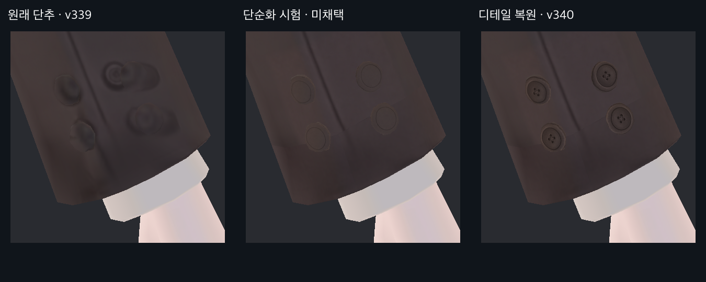

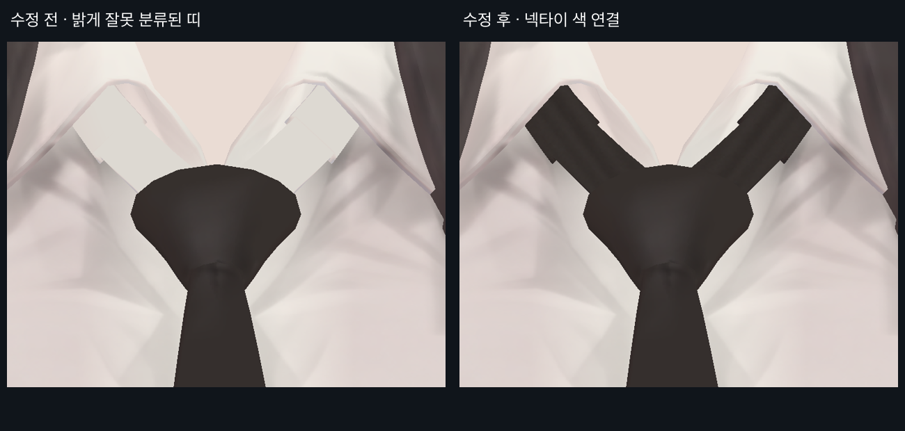

2026-09-13 · [v338 국소 텍스처 1차 검수](avatar_modeling/v338_local_texture/v338_TEXTURE_REVIEW.md): 양쪽 허벅지의 손 모양 흔적과 신발 작은 반점 정리. 원래 주름·장식·UV·129본 유지, 실제 전후 사진과 실패한 시도 기록. 셔츠 시험은 미반영, 코트·소매 등 잔여 작업과 사용자 피드백이 남아 있습니다. 전체 텍스처 완료는 아니며 관절 중단을 유지합니다.

2026-09-13 · [v337 채색용 UV 작업본](avatar_modeling/v337_paintable_uv/v337_UV_WORK_REVIEW.md): 원래 디테일을 유지한 541패널·작은204개, 4K·129본 유지. 부위별 마스크와 UV 안내도를 추가했습니다. 뒤트임 점선은 검수 구도에서 해소했고, 셔츠·신발 일부 늘어짐과 드문 외곽 픽셀 차이는 기록했습니다. 다음 채색 출발점이며 전체 아바타 최종채택은 아닙니다. 관절 중단 유지.

2026-09-12 · [v331 팔꿈치 세 이슈의 위치와 사진](avatar_modeling/v331_elbow_issues/v331_ISSUE_ATLAS.md): 비틀림 교차·정면 각진 끝·강한 모으기 주름을 위치 표시와 확대로 정리했습니다. 실제 재질7사진·진단2그림 직접검수. 눈으로 보이는 문제와 작은 내부 교차, 강한 시험 자세를 구분했습니다. 모델 수정 없이 v330 후보 상태를 유지합니다.

2026-09-12 · [v325 全관절·본 검토](avatar_modeling/v325_full_rig_audit/v325_RIG_REVIEW.md): 현재 v324의 129본·86회전 채널·300정적 자세와 연속121표본을 검토했습니다. 기본 본 연결·웨이트는 통과했으나 어깨·소매, 골반·무릎, 손의 접힘 품질은 미완료입니다. 직접 확인한41장, [129본 점검표](avatar_modeling/v325_full_rig_audit/v325_BONE_TABLE.md), 부피·교차 검사 한계와 실패한 검사 시도를 기록했습니다. 원본 모델은 수정하지 않았습니다.

2026-09-12 · [v324 기존 디테일 복원](avatar_modeling/v324_detail_restore/v324_DETAIL_REVIEW.md): 사용자 지적대로 v323에서 신발 장식·옷 주름·머릿결 명암이 과도하게 줄었습니다. 기존 v322 디테일과 UV 밀도를 복원하고 실제 오염 부위만 정리했습니다. 기하·부피·본·웨이트 보존, 3면 UV 이동, Unity UV용 복제점 1,649→10개. [숨은 표면 12그룹 사진](avatar_modeling/v324_detail_restore/v324_SURFACE_GALLERY.md)과 시도·미채택 이유를 함께 기록했습니다. 전체 모델 최종 채택은 아닙니다. 기존 [v323](avatar_modeling/v323_hidden_texture_uv/v323_TEXTURE_UV_REVIEW.md)은 숨은 표면 정리 과정의 기록으로 보존하며 평탄한 디테일은 후속 기준으로 사용하지 않습니다.

비앙카는 텍스처 검수 이후에도 부위별 셰이더 제작이 남아 있습니다. [v332 SiuSiu 표현 분석](avatar_modeling/v332_shader_research/v332_SHADER_REVIEW.md)은 원본의 마스크·MatCap을 실제 기능 OFF 사진으로 분리했고, 기존 디테일과 얼굴 인상을 유지하는 [부위별 작업 순서](avatar_modeling/v332_shader_research/v332_IMPLEMENTATION_PLAN.md)를 정리했습니다. 제작·적용은 아직 하지 않았으며 관절 후보와 별도 단계입니다.

이후 [셰이더 전용 폴더](avatar_shader/README.md)의 [v001 실제 재질 시험](avatar_shader/v001_siusiu_style/v001_SHADER_REVIEW.md)에서 전용 마스크·MatCap과 네 후보를 만들었습니다. 밝은 테두리를 더한 C/D는 광택이 과해 제외하고, E는 더 약한 하이라이트 후보로 남겼습니다. SiuSiu와 같은 색면을 만들려면 기존 그림의 큰 명암과 헤어 묶음별 하이라이트를 함께 설계해야 한다는 한계도 사진으로 기록했습니다.

2026-09-12 · [v321 주름 출처와 측면 휘어짐](avatar_modeling/v321_arm_curve_audit/README.md): 같은 자세에서 원형 전완 주름과 최근 윗소매의 추가 꺾임을 구분했습니다. 본은 일직선이나 소매 표면은 실제로 달라졌습니다. 모델 수정 없이 사진③을 보존한 비교입니다.

2026-09-12 · [v320 팔을 완전히 편 정면·측면 비교](avatar_modeling/v320_straight_arm/README.md): 사진③의 어깨 방향을 유지하고 팔꿈치를 약9.23°→0°로 편 사진을 직접 확인했습니다. 임시 기존 메시 사본의 자세 비교이며 전체 자동 구동 완료는 아닙니다.

2026-09-12 · [v319 문제·시도·미채택 사유](avatar_modeling/v319_issue_review/v319_ISSUES_AND_ATTEMPTS.md): Mac 작업의 주요 시도와 제외·보류 이유, 직접 확인한 사진6장, 부피·접촉 수치의 한계와 피드백 항목을 정리했습니다. 문서 정리 단계이며 새 모델 수정은 없습니다. 형상 문제 미해결·후보 미채택 상태로 사용자 피드백을 기다립니다.

[v318 이번 작업 확인 문서](v318_WORK_REVIEW.md)에서 전후 사진, 부피·늘어남 검사, 미채택 이유와 남은 작업을 한 번에 확인할 수 있습니다. 전체 아바타 완료본은 아닙니다.

Mac 재개 환경의 별도 검증은 [v257 Mac 재현 검증](avatar_modeling/v257_mac_reproduction/START_HERE.md)에 정리했습니다. 패키지6개와 골반·노멀·손 재생이 이전 결과와 일치했으며, 이것은 관절 품질 해결 완료를 뜻하지 않습니다. 아래 기존 모델 설명의 수록 범위와 구분해 읽어 주세요.

레퍼런스를 바탕으로 만들어진 비앙카의 3D 시제품에서 출발해, **기존 모델의 인상을 유지하면서 PC용 Unity / VRChat 아바타로 다듬는 과정**을 기록한 저장소입니다. 처음에는 얼굴과 머리카락의 채색을 정리했고, 이후 몸의 뼈대와 관절, 정장 코트의 변형, 머리카락·옷 물리, Unity에서의 실제 구동까지 작업을 넓혔습니다.

가장 오래 다룬 문제는 “가만히 있을 때 괜찮은 모델이 움직일 때도 자연스러운가?”였습니다. 한 자세에서 좋아진 수정이 다른 자세를 망가뜨리는 일이 반복됐고, 그때마다 원인을 나눠 검사하고 반영할 부분을 다시 골랐습니다. 이 문서는 그 흐름과 주요 판단을 설명합니다.

**공유 기준: 2026-09-11, v186까지.** Blender와 Unity Editor에서 검토한 단계이며, 어깨·골반·손에는 남은 문제가 있습니다. 실제 VRChat 클라이언트 테스트와 업로드는 아직 하지 않았습니다. 진행 중인 v187 이후 작업은 이 공유본에 포함하지 않았습니다.

[현재 검토 결과](avatar_modeling/v186_review_bundle/START_HERE.md) · [문제별 작업 추적](PROGRESS.md) · [전체 단계 색인](STAGES.md) · [상태·결정 이력](STATUS.md)

처음 읽는다면 아래 본문을 순서대로 보면 됩니다. 특정 문제를 이어서 보고 싶다면 **[작업 추적표](PROGRESS.md)**에서 해당 항목을 찾으세요. 각 항목에 출발 기준, 실패한 접근, 반영한 수정, 검증 근거와 남은 일을 연결했습니다. 여기의 그림은 해당 단계에서 만든 자체 비교 렌더이며, 초기 모습과 최신 모습을 한 번에 비교한 그림은 아닙니다.

## Mac 후속: 교차 없는 소매도 부피를 잃었습니다

[v295 소매 부피와 실제 스키닝 검수](avatar_modeling/v295_pose_target_skinning/README.md)에서는 교차를 피한 소매가 앞30도에서 납작해지는 문제를 분리했습니다. 단면적과 가장 얇은 방향의 폭을 함께 제한해 중앙 두께를 중립의 약83–84%에서 약95%로 회복했고, 원래 음영 경계를 유지한 새 면 노멀을 함께 검수했습니다.20자세를 실제 Unity 스키닝으로 대조했으며 자동 전환과 몸 접촉은 미해결입니다. 이 보충은 검수한 일부 결과이며 v187 이후 전체 모델의 완성을 뜻하지 않습니다.

[v308 부피 계산 수정과 형상 재검수](avatar_modeling/v308_smooth_local_contact/README.md)에서는 기준 혼용, 단면 교차점 수에 의존한 폭, 열린 몸 표면의 거리와 최근접 면 전환을 분리했습니다. 앞30도 두 자세의 구간 외곽 부피는 중립의 약96.5–96.7%로 유지되지만 복합 자세의 덩어리 접힘이 사진에 남아 미채택입니다. 이번 결과는 정적 형상 검수이며 자동 구동이 아닙니다.

[v315 원형 주름과 두께 키 분리](avatar_modeling/v315_volume_key_audit/README.md), [v316 부피와 면 길이 검수](avatar_modeling/v316_volume_shape_balance/README.md)에서는 원래 조형 주름을 구분하고 중앙 부피와 면의 늘어남을 함께 검사했습니다. 복합 자세의 중앙 외곽 부피 약96.8%를 유지했지만 셔츠 접촉과 어깨 각짐은 남아 미채택입니다. [v318 안쪽 셔츠 분리 조건](avatar_modeling/v318_inner_shirt_clearance/README.md)도 선택한 제약에서 성립하지 않아 모델에 적용하지 않았습니다. 자동 구동이나 전체 관절 완료를 뜻하지 않습니다.

## 작업은 이렇게 진행했습니다

기본 흐름은 **문제 확인 → 원인 분리 → 사본에서 수정 → 같은 자세로 비교 → 다른 동작에서 재검사 → 통합 여부 결정**입니다. Blender에서 본과 표면을 검사하고, 반복 측정과 비교 렌더에는 스크립트와 MCP를 사용했습니다. Unity 단계에서는 실제 SDK를 켜서 가져오기 결과와 자동 보정·물리를 확인했습니다.

본은 움직임의 축, 웨이트는 각 정점이 어느 본을 얼마나 따라갈지 정하는 비율입니다. 여기에 자세에 따라 표면을 보완하는 셰이프 키와 면의 연결 방향을 함께 조절했습니다. 새 캐릭터나 대체 메시를 만드는 대신 기존 메시를 수정했고, 원본과 실험 사본을 따로 보존했습니다.

버전 번호는 이 실험의 순서입니다. 번호가 높다고 모든 이전 수정을 누적한 완성본은 아닙니다. 결과가 나빠 제외한 실험도 이후 같은 실패를 반복하지 않도록 남겼습니다.

실제로는 아래와 같은 기록을 한 묶음으로 남겼습니다. 숫자로 변화를 확인하고, 같은 시점의 그림으로 그 변화가 원하는 모양인지 판단하는 방식입니다.

| 작업 단계 | 기록한 내용 | 다음 단계로 넘기는 조건 |
|---|---|---|
| 진단 | 문제가 나타나는 자세·부위, 색을 뺀 표면, 본 축, 웨이트와 면 연결 | 겉으로 같은 증상이라도 색·움직임·형상 원인을 구분 |
| 사본 실험 | 어느 버전에서 출발했는지, 바꾼 정점·본·면·키, 비교 후보 | 원본과 보호할 부위가 유지되는지 확인 |
| 회귀 검사 | 같은 자세의 전후, 다른 관절을 함께 움직인 자세, 저장 후 재생 | 좋아진 사례와 새로 나빠진 사례를 모두 기록 |
| 선별 통합 | 넣은 수정과 제외한 수정, 실제 구동 결과, 미해결 항목 | 후보 보존·사용자 채택·전체 완료를 서로 구분 |

검사 방식도 작업 중 바뀌었습니다. 초기에는 면이 지나치게 찌그러지는지에 집중했지만, 면적이 정상인 채 서로 뚫고 지나가는 사례를 발견한 뒤 실제 삼각형 교차를 추가했습니다. 이후에는 의상 방향별 늘어남, 같은 정점 띠의 두께, Unity의 실제 표면 위치와 보정 지연까지 확인 범위를 넓혔습니다. 그래서 서로 다른 시기의 숫자는 검사 조건을 함께 읽어야 합니다.

## 1. 먼저, 색의 문제와 모양의 문제를 나눴습니다

초기 모델에는 뼈대가 없었고, 얼굴에 머리카락 무늬가 묻거나 머리카락에 피부색이 섞여 있었습니다. 눈 주변에는 그려진 눈선과 실제 입체 표면이 어긋난 부분도 있었습니다. 조명을 뺀 색상 렌더와 회색 표면을 비교해, 채색 오류와 실제 형상 차이를 구분했습니다.

출발 파일은 메시 1개와 재질 1개, 4K 색상 텍스처를 가진 시제품이었습니다. 정점은 파일에 기록된 기준으로 34,529개, 면은 17,555개였고, 리그와 표정 키는 없었습니다. 같은 위치에 여러 정점이 있는 구간도 있었지만 UV·음영 경계에서 나뉜 경우가 있어, 겹친 정점을 일괄 합치는 방식으로 시작하지 않았습니다. 먼저 임시 20본으로 동작 문제를 드러내고 원래 형상을 기준으로 보존했습니다.

눈은 두 방법을 비교했습니다. **기존 눈 모양에 텍스처를 맞추는 A안**과 눈 정점을 기존 그림에 맞춰 옮기는 B안입니다. 정점을 옮겨도 잘못 그려진 색과 중복 눈선은 남았습니다. 사용자가 A 방향을 선택한 뒤, 얼굴·헤어·의상으로 채색 작업을 넓히고 기존 UV에 다시 입혔습니다. 이 텍스처 단계에서는 정점 위치와 면 연결을 유지했습니다.

| 텍스처 보정 전 | 텍스처 보정 후 |
|---|---|
| 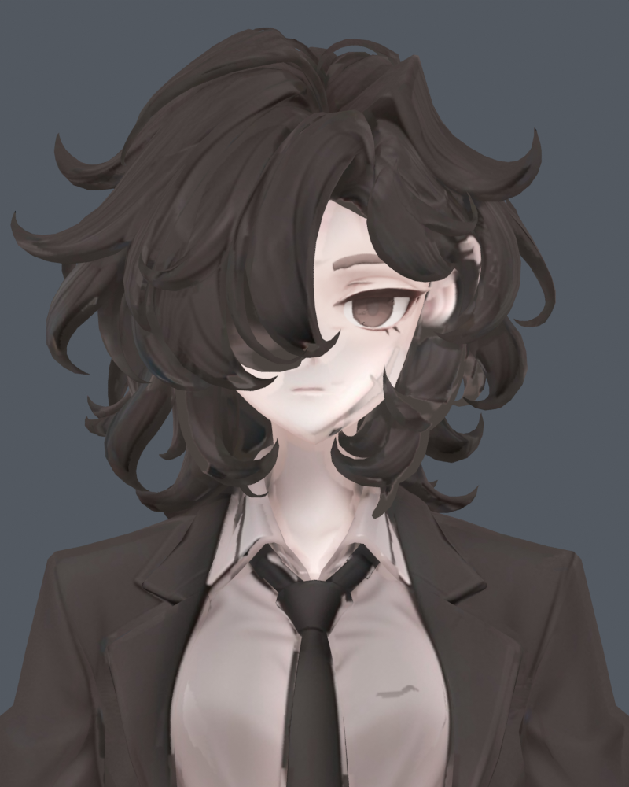 | 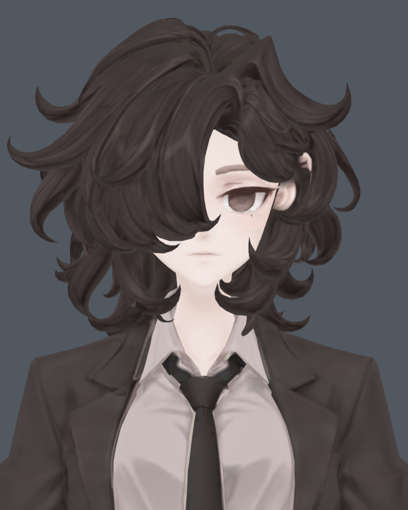 |

큰 얼룩과 색 번짐은 줄었지만, 기존 눈 조각의 돌출이나 머리카락의 두꺼운 실루엣까지 채색으로 해결한 것은 아닙니다. [초기 진단](avatar_modeling/v001_inspection/REVIEW.md), [눈 A/B 비교](avatar_modeling/v004_eyes_ab/REVIEW.md), [전신 텍스처 갤러리](avatar_modeling/v005_texture/GALLERY.md)에 과정과 남은 차이를 담았습니다.

이때의 핵심 결정은 **“눈을 맞춘다”는 요청을 얼굴 전체 재설계로 확대하지 않는 것**이었습니다. B안은 눈 주변을 최대 약 5.98mm 옮겼지만 색 문제를 함께 해결하지 못했습니다. 선택한 A 방향은 새 채색을 원래 UV로 되돌려 입히는 방식이었고, v005에서는 형상·UV·본·웨이트를 바꾸지 않은 상태로 색의 효과만 비교했습니다. A 방향 선택과 현재 얼굴 채색의 최종 완성 승인은 구분해 기록했습니다. [작업 경로 T01](PROGRESS.md#t01)

## 2. 뼈대를 만들고, 무릎에서 수정 기준을 다시 잡았습니다

임시 리그로 팔 올리기·무릎 굽히기·앉기를 시험하자 겨드랑이, 무릎, 목, 옷자락의 문제가 드러났습니다. 목과 턱의 추종 범위를 나누고, 손가락과 관절 보조 본을 추가하고, 코트 자락이 다리와 별도로 움직일 구조를 비교했습니다. 본을 추가하는 것만으로 자연스러운 변형이 생기지는 않아 웨이트와 회전 중심을 함께 검토했습니다. [전신 본 작업](avatar_modeling/v023_rig_review/REVIEW.md), [자락 제어 비교](avatar_modeling/v013_coat_runtime/REVIEW.md).

처음 코트 자락에는 8개 본을 넣어 시험했지만 앉기와 숙임에서 실패했습니다. 이어 부모 제어 본 4개를 추가해 자락 전체가 호를 그리며 움직이고 자식 본이 방향을 보완하는 구조를 비교했습니다. 이 단계의 저장된 포즈는 수동으로 움직임을 검토하는 자료였으며, 나중의 Unity 물리와 같은 자동 구동은 아니었습니다. 목·코트·손을 별도로 시험한 뒤 v023에서는 94본의 전신 검토 사본으로 범위를 넓혔습니다.

그 과정에서 검사 통과의 의미도 다시 잡았습니다. v023의 손 82자세는 면적 검사에서 새 이상이 없었지만, 별도의 교차 검사에서는 30자세에 새 교차가 있었습니다. 저장한 420프레임이 정확히 재생된다는 것 역시 모양의 자연스러움을 보장하지 않았습니다. 사용자가 지적한 무릎·겨드랑이·목의 어색함을 미해결로 다시 올려두고 부위별로 진행했습니다.

### 무릎: 더 많이 고친 안에서, 보존할 모양을 정한 안으로

무릎에서는 중요한 방향 전환이 있었습니다. 컷과 보조 구조를 늘려 면끼리 겹치는 현상을 줄여도, 접히는 틈이 넓어지거나 형태가 부자연스러워졌습니다. 사용자가 더 낫다고 본 v030으로 돌아가 **뒤쪽의 좁은 접힘을 보존하고 앞면 웨이트만 작게 조정**했습니다. 이 v038 SMALL이 사용자 채택 기준이 됐습니다.

이 선택은 “교차를 전부 없앴다”는 뜻이 아닙니다. 기존 안쪽 교차와 주름은 남았고, 원래에 없던 문제가 추가되는지와 보호한 뒤쪽 모양이 같은지를 확인했습니다. 이후에도 수치와 실제 외형을 함께 보는 기준으로 이어졌습니다. [무릎 전후 비교와 채택 이유](avatar_modeling/v038_knee_front/REVIEW.md).

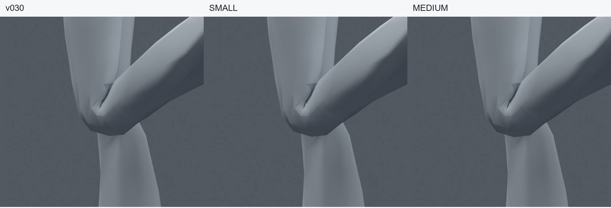

왼쪽부터 v030 기준, 선택한 SMALL, 더 크게 조정한 MEDIUM입니다. **차이가 작은 것 자체가 이 실험의 의도**였습니다. SMALL은 기존 38개 공간 위치에 해당하는 64개 정점의 웨이트만 바꾸고, 메시·94본·UV를 유지했습니다. 120도 자세에서 생긴 최대 위치 차이는 약 2.57mm였고, 뒤쪽 등 보호 영역의 32자세 비교는 위치 차이 0이었습니다. 기본 자세의 정점을 2.57mm 옮긴 작업은 아닙니다.

전신 1,377자세, 무릎 집중 124자세, 스트레스 384자세와 동작 365표본에서 새 악화를 확인했습니다. 기존 안쪽 교차는 남겨 두었기 때문에, 앞선 컷 실험의 “교차 0”보다 숫자가 좋아 보이지 않을 수 있습니다. 사용자 선택은 뒤쪽 접힘의 외형을 우선한 판단으로 보존했습니다. [작업 경로 T02](PROGRESS.md#t02)

### 손: 관절 축, 웨이트, 사각형의 분할을 함께 확인

손은 손가락 본을 넣은 뒤에도 주먹을 쥐면 마디가 납작해지고 손바닥과 손가락이 겹쳤습니다. v046에서는 엄지 본 6개의 회전 축을 정리하고, 양손 검지부터 새끼손가락까지 중간 마디에 절반 회전 보조 본 8개를 넣었습니다. 기존 사각형 9곳의 대각선을 고정하고 손 부위 웨이트를 조절했으며, 정점 위치를 새로 빚거나 정점을 추가하지 않았습니다.

같은 1,100개 손 명령을 비교했을 때 면적 경고 사건은 571→3, 교차 누적 사건은 24,031→11,496으로 줄었습니다. 다만 엄지 축도 바뀌었으므로 같은 각도 명령이 완전히 같은 공간 자세를 뜻하지는 않습니다. 교차가 여전히 많이 남은 이 실험을 손 전체 완료로 표현하지 않고, 이후 손목 범위·손가락 뿌리·노멀 비교를 거쳐 필요한 부분만 선별했습니다.

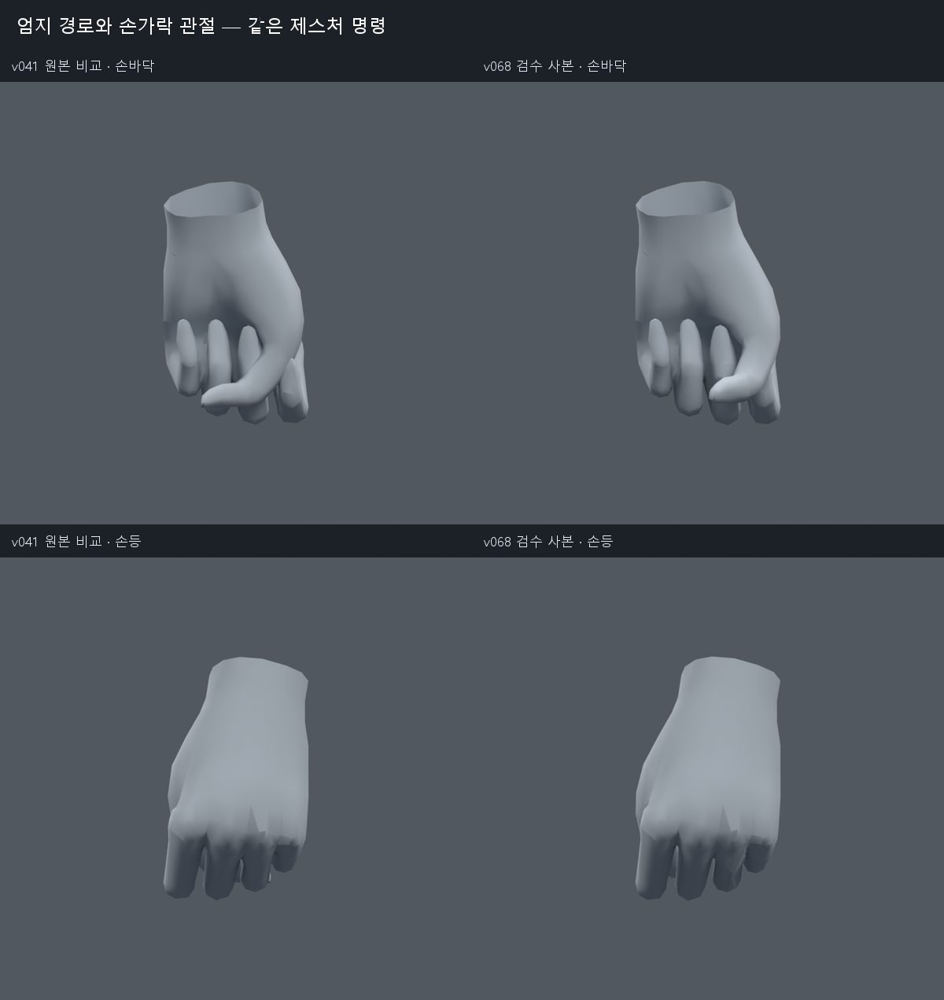

이 그림은 손 작업의 초기 상태와 v068 선별 결과를 손바닥·손등 방향에서 비교합니다. 마디 형태와 엄지 주변을 볼 수 있지만, 모든 손 자세에서 접촉이 해결됐다는 자료는 아닙니다. [v046 손 구조 실험](avatar_modeling/v046_finger_topology/REVIEW.md) · [v068 종합 비교](avatar_modeling/v068_upper_delivery/START_HERE.md) · [작업 경로 T03](PROGRESS.md#t03)

## 3. 정장 어깨는 움직임·면 연결·두께를 따로 다뤘습니다

팔을 올리거나 앞으로 뻗으면 코트 몸판과 소매가 함께 끌려가고, 겨드랑이는 접히며 소매산이 납작해졌습니다. 웨이트 조정, 보조 본, 국소 컷, 표면 완화, 자세 보정 등을 비교했지만 한 방향의 개선이 다른 회전의 찌그러짐이나 교차를 만드는 경우가 많았습니다.

그래서 문제를 더 잘게 나눴습니다.

### 국소 수정이 다른 곳을 망가뜨릴 때, 기준으로 돌아가기

어깨와 뒤 목은 한 번에 매끈하게 만드는 접근이 잘 통하지 않았습니다. v084–v088에서는 대각선 변경, 몇 정점의 웨이트 조정, 면 합치기를 각각 비교했습니다. 수치만 약간 좋아지고 그림 차이가 거의 없거나, 다른 자세가 늘어나거나, UV 경계를 가로질러 합친 면에서 실제 줄무늬가 생겼습니다. 그래서 v089에는 앞선 v083 기준에 목 6개 정점의 최대 0.3%p 웨이트 조정만 더했습니다. 1,045개 새 목 자세에서 피부 면적 경고 2→1, 새 경고 0을 확인했지만 큰 어깨 홈은 그대로 남았습니다.

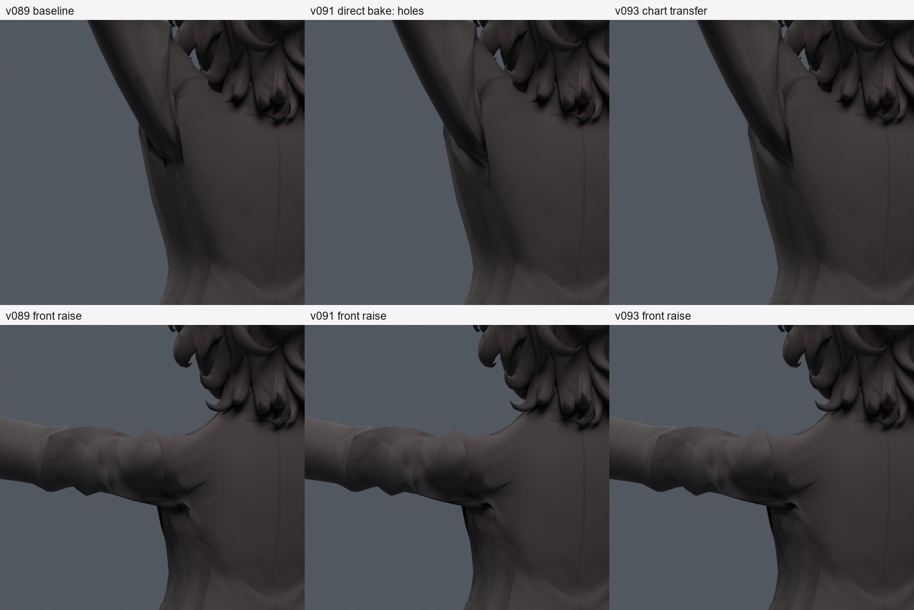

왼쪽은 v089 기준, 가운데는 직접 베이크에서 검은 누락이 생긴 v091, 오른쪽은 색 전달을 보완한 v093입니다. 아래 팔 들기 그림에는 여전히 큰 주름이 보입니다. **색 전달을 고쳤다는 결론과 수정한 형상을 채택할 수 있다는 결론은 달랐습니다.** v093은 전신 검사에서 수정 구역에 새 경고 2건, 저장 동작에서 새 경고 6건이 남아 비교용으로 보존했습니다. [v089 선별 이유](avatar_modeling/v089_review_delivery/START_HERE.md) · [v093 실패와 분리 진단](avatar_modeling/v093_bake_projection/START_HERE.md)

이후에는 자세가 특정 범위에 들어올 때만 기존 표면을 보완하는 셰이프 키를 시험했습니다. v108에서 양쪽 옆 들기 보정을 선별했고, v119는 이를 넓게 분담했습니다. 옆 들기 120 명령에서 방향별 길이가 2배를 넘는 구역의 넓이는 9.965%→8.192%로 줄었지만, 가벼운 늘어남은 주변으로 퍼져 1.2배 초과 구역은 21.719%→26.423%로 늘었습니다. 심한 찌그러짐을 나누는 효과와 주변 부담을 함께 기록한 이유입니다.

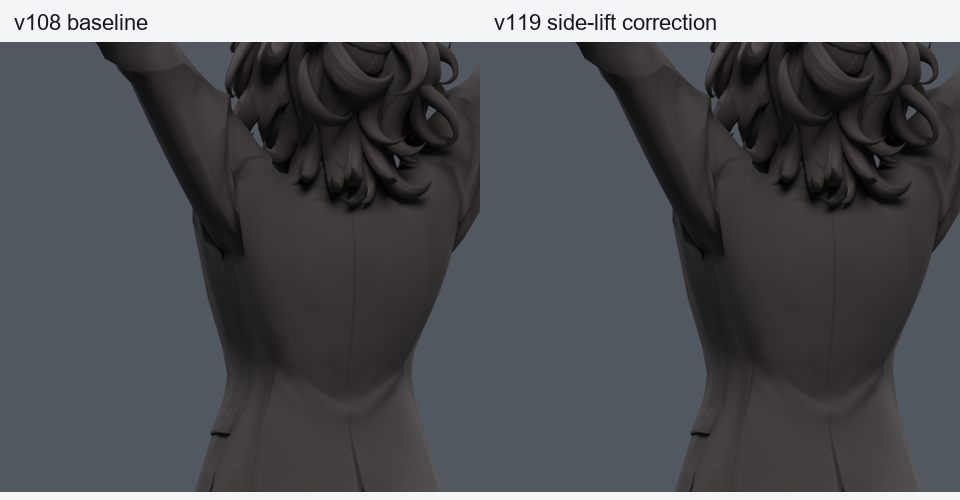

왼쪽 v108, 오른쪽 v119입니다. 겨드랑이 한곳에 몰린 변형을 주변으로 나눈 결과이며, 코트 전체의 늘어남이 사라진 상태는 아닙니다. 큰 몸통 비틀림에서는 보정이 꺼지도록 범위를 제한했으므로, 그 자세를 해결했다고 계산하지 않았습니다. [v119 조건과 검증](avatar_modeling/v119_garment_review/START_HERE.md) · [작업 경로 T04](PROGRESS.md#t04)

### 팔을 움직이는 경로와 소매 표면을 분리

| 관찰한 문제 | 처리한 방법 | 얻은 결과와 한계 |
|---|---|---|
| 팔을 앞으로 돌려도 바깥으로 벌어지고 코트 중앙이 따라감 | 벌어진 기본 팔 자세에 맞게 조작 축과 쇄골 분담을 분리 | 앞뒤 동작 경로와 중앙 끌림 개선. 소매 겹침은 별도 문제로 남음. [v121](avatar_modeling/v121_arm_controls/START_HERE.md) |
| 어깨선이 끊기거나 검게 패인 것처럼 보임 | 색상·음영·실제 면을 분리해 비교 | 날카로운 음영 경계를 정리. 정장 선을 지우는 텍스처안은 제외하고 원래 선을 보존. [v139](avatar_modeling/v139_seam_diagnosis/START_HERE.md), [v146](avatar_modeling/v146_seam_topology/START_HERE.md) |
| 국소 면 수정 뒤 텍스처에 줄무늬·검은 누락 발생 | UV 경계와 색 전달 방식을 따로 검사 | 색 전달 오류는 해결 경로를 확인했지만 형상 회귀가 있어 해당 사본은 미채택. [v093](avatar_modeling/v093_bake_projection/START_HERE.md) |
| 앞으로 뻗을 때 소매산 앞뒤 두께 감소 | 기존 정점의 자세 보정에 두께·어깨선 길이·접촉 조건을 함께 적용 | 앞90 검사에서 기본 대비 두께 66.6% → 89.8%. 깊은 접힘과 일부 새 경고는 남음. [v152](avatar_modeling/v152_volume_review/START_HERE.md) |

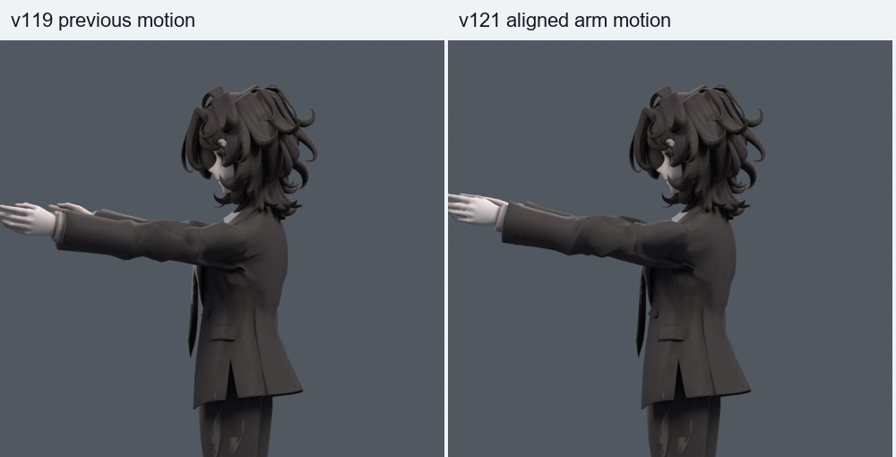

v121 비교는 같은 “앞으로 들기” 명령에서도 회전 경로가 달랐다는 것을 보여 줍니다. 원래 팔이 벌어진 기본 자세에 월드 축 회전을 그대로 적용하면 앞 들기에 옆 벌림이 섞였습니다. 기존 102본의 기본 위치는 유지하고 조작용 본 4개를 추가해 이를 분리했습니다. 중앙 코트의 움직임은 해당 앞90 비교에서 2.400→1.362mm로 줄었지만 접촉 사건은 증가했으므로, 축 정렬을 의상 변형 해결로 확대하지 않았습니다.

v132에서는 쇄골의 앞쪽 이동 성분을 줄이고 일부 기존 코트 정점의 보정을 제한된 자세에 적용했습니다. 정지 그림 뒤에는 **재생 중 팔이 갑자기 뒤로 도는 오류**도 있었습니다. 같은 방향을 나타내는 회전값의 부호가 키 사이에서 뒤집혀 보간 경로가 바뀐 문제였습니다. 연속 키의 부호를 맞춘 뒤 정수·반프레임 793표본을 다시 검사하고, 저장 후 34개 주요 자세의 위치가 같은지도 확인했습니다. 정지 비교만으로 잡을 수 없던 오류였습니다. [v132 경로·보간 수정](avatar_modeling/v132_shoulder_review/START_HERE.md) · [작업 경로 T05](PROGRESS.md#t05)

### 정장 선을 보존하면서 어깨 두께를 복원

어깨선이 검게 파인 것처럼 보이는 문제는 색상, 날카로운 노멀 경계, 실제 접힘이 겹쳐 있었습니다. v139에서 이를 분리하고 음영 경계를 정리했지만, 선을 지우는 텍스처 수정은 정장 인상을 바꿔 제외했습니다. v146은 원래 텍스처의 선을 유지하면서 자세 보정의 선 길이와 기존 면 한 곳의 분할 방향을 조절한 기준입니다.

두께 문제는 보정 키를 꺼도 나타났습니다. v152는 v146의 기존 코트 정점 493개에 양팔 60·90·120도용 키 6개를 더해 앞뒤 두께를 보완했습니다. 기본 정점 위치, 본, 웨이트, UV와 텍스처를 유지한 채 움직일 때만 변형을 적용했습니다. 두께만 늘리면 어깨선이 길어지거나 주변과 겹칠 수 있어 길이·접촉·면 방향도 함께 제한했습니다.

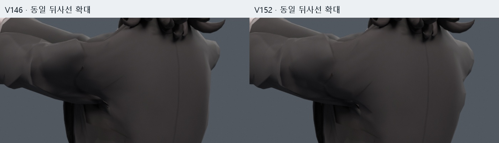

위 비교는 두께 복원의 효과와 남은 주름을 함께 보여 줍니다. 두께 수치는 같은 정점 구역의 회전을 정렬한 뒤 측정한 앞뒤 범위이며, 닫힌 의상의 부피를 뜻하지 않습니다. **큰 어깨·겨드랑이 접힘은 v186에서도 미해결**입니다.

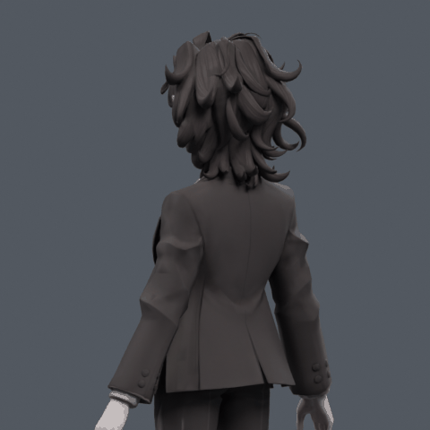

GIF는 저장 동작의 앞 들기 구간에서 31프레임을 골라 만든 미리보기입니다. 전체 동작 검사를 대신하지 않습니다. v152의 439자세 기록에는 해소된 면적 경고 135건과 새 경고 88건이 함께 있었고 접촉도 새로 생긴 사례가 남았습니다. 두께 회복을 확인한 비교 후보라는 판단과 회귀가 남았다는 사실을 함께 보존했습니다. 후속 v154–v155의 보조 구조·웨이트 실험도 모두 통과한 개선안으로 합치지 않았습니다. [작업 경로 T06](PROGRESS.md#t06)

## 4. 참고 모델을 실제로 움직여 보고, 부위별 역할을 나눴습니다

어깨 실험의 회귀가 반복된 뒤에는 Lapwing과 SiuSiu 구매 아바타의 본·웨이트·의상 구조를 조사하고, Unity에서 관절을 실제로 굽히고 돌려 봤습니다. 이름이 같은 보조 본도 구성에 따라 다르게 움직였고, 옷 아래 몸체를 생략하거나 축소한 부분도 있었습니다. 겉으로 보이는 결과만 보고 웨이트나 본의 수를 그대로 따라가지는 않았습니다. [세 모델 구조 비교](avatar_modeling/v156_three_avatar_comparison/START_HERE.md), [실제 관절 동작 비교](avatar_modeling/v157_reference_pose/START_HERE.md).

이후에는 몸판·소매·카라·헤어의 역할을 더 분명하게 나눴습니다.

- **카라:** 팔에 끌려가는 기존 코트 정점의 웨이트 전이를 조절했습니다. 팔 들기에서 늘어남을 줄였지만 모든 접촉을 없애지는 못했습니다. [v159](avatar_modeling/v159_collar_support/START_HERE.md)
- **헤어:** 큰 움직임에서 면이 찌그러지는 후보를 제외하고, 기존 모양과 웨이트 전환을 보존한 완만한 후보를 골랐습니다. Unity PhysBone의 물리 ON/OFF와 정지 복귀를 검사했습니다. [v160](avatar_modeling/v160_hair_dynamics/START_HERE.md)
- **코트 분리:** 기존 코트와 몸을 두 객체로 나눠 부위별 조작을 쉽게 했습니다. 위치가 같아도 음영이 달라지는 문제는 원래 면 모서리의 음영 정보를 복원해 해결했습니다. [v161](avatar_modeling/v161_separate_coat/START_HERE.md)
- **소매 끝:** 손을 전부 따라 꺾으면 소매가 찌그러지고, 전완에 고정하면 손이 소매를 통과했습니다. 손목 축에 맞춘 보조 본과 회전 분담을 조절해 490자세 및 추가144복합 자세로 검토했습니다. [v165](avatar_modeling/v165_cuff_roles/START_HERE.md)

전완 비틀기 분산 등 회귀가 남은 안은 통합하지 않았습니다. 카라·헤어·코트 분리까지의 그림은 [v163 종합 검토](avatar_modeling/v163_review_bundle/START_HERE.md)에서 볼 수 있습니다.

### 카라: 팔에 끌리는 구역을 몸통 쪽으로 완만하게 전환

카라 전체를 몸통에 고정하는 대신, 기존 코트 208개 정점에서 상완·쇄골 추종 일부를 가슴 쪽으로 옮기고 경계의 비율을 부드럽게 이었습니다. 앞90 자세에서 카라 가장자리 늘어남의 상위 95% 값은 1.128→1.065배, 최대값은 1.930→1.597배로 줄었습니다. 고정 38자세와 복합 320자세에서 새 면적 경고는 0이었지만, 접촉은 생긴 곳과 사라진 곳이 함께 있어 전부 해결로 판정하지 않았습니다.

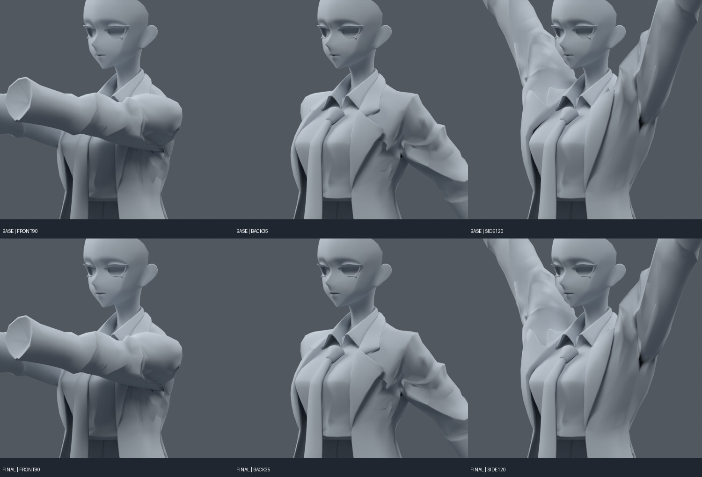

위 행은 기준, 아래 행은 전이 보정 후보입니다. 진단을 위해 헤어와 색의 영향을 줄인 렌더이며 새 캐릭터 형상을 만든 결과가 아닙니다. 어깨·소매의 큰 주름은 남겨 둔 채 카라가 팔에 끌리는 정도를 비교합니다. [작업 경로 T07](PROGRESS.md#t07)

### 헤어: 큰 흔들림보다 형태와 복귀를 먼저 검증

기존 헤어 6개 체인과 웨이트 본 12개를 유지하면서 바람용 부모 6개와 끝점 6개를 추가했습니다. 웨이트 전환을 다듬고 한 정점이 따르는 본을 최대 4개로 맞췄습니다. 더 유연한 FLEX는 움직임이 약 14mm까지 커졌지만 작은 면에서 43건의 면적 경고가 생겨 제외했고, 변형이 완만한 SMOOTH를 후속으로 골랐습니다.

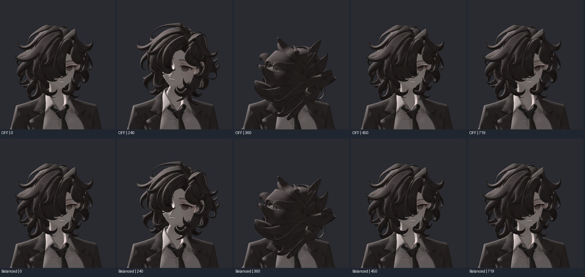

위는 물리 OFF, 아래는 SMOOTH 후보의 같은 시점입니다. 머리·루트 이동과 바람 입력을 맞춰 물리 ON/OFF/충돌체 OFF 각각 720프레임을 검사했습니다. 최종 후보는 OFF 대비 최대 약 3.33mm 움직였고 정지 후 거의 원위치로 돌아왔습니다. 가만히 있을 때 목 충돌체가 헤어를 약 2.94mm 밀어내는 현상도 반지름을 조절해 제거했습니다. 바람은 작성한 10초 루프 기준이며 임의의 월드 바람에 대한 검증은 아닙니다. [작업 경로 T08](PROGRESS.md#t08)

### 코트 분리: 좌표가 같아도 렌더는 달라질 수 있음

몸과 코트를 각각 다루기 위해 기존 정점과 면을 BodyHair·Coat 두 객체로 나눴습니다. 새로운 대체 표면을 만든 작업은 아니지만, 처음에는 정점 위치가 같아도 빛을 받는 모습이 달라졌습니다. 분리 과정에서 모서리의 날카로움과 사용자 지정 노멀 정보가 달라진 것이 원인이었습니다. 원래 면 모서리 대응을 따라 해당 정보를 복원했습니다.

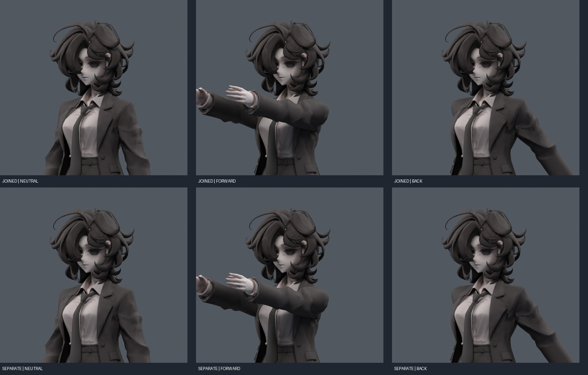

위아래가 거의 같은 것이 이 검사의 목표입니다. 최종 78자세의 좌표 차이는 최대 약 0.00006mm, 6쌍 렌더의 최대 색 차이는 8비트 기준 1이었습니다. 객체를 분리해도 기존 외형을 유지했다는 근거로 사용했습니다. [작업 경로 T09](PROGRESS.md#t09)

### 소매 끝: 손과 전완 사이의 회전 분담

손목을 꺾을 때 소매가 손을 전부 따라가면 찌그러지고, 반대로 전완에만 붙이면 손이 소매 안쪽을 뚫었습니다. v165는 손목 기본 축에 맞춘 보조 본 2개를 전완 아래에 두고 손의 로컬 회전을 65% 따라가도록 나눴습니다. 소매 끝과 단추의 웨이트를 함께 맞춘 뒤 실제 490자세에서 면적 경고 사건 167→15, 새 경고 0을 확인했습니다. 추가 144개 코트 복합 자세에서도 새 경고 0이었지만 기존 피부 접촉은 남았습니다.

| 같은 손목 굽힘의 기준 | 소매 회전 분담 후 |
|---|---|
| 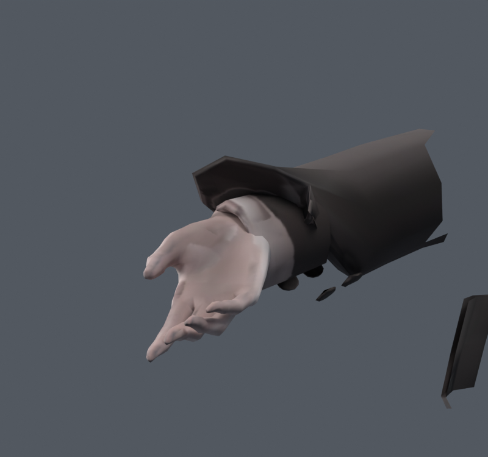 | 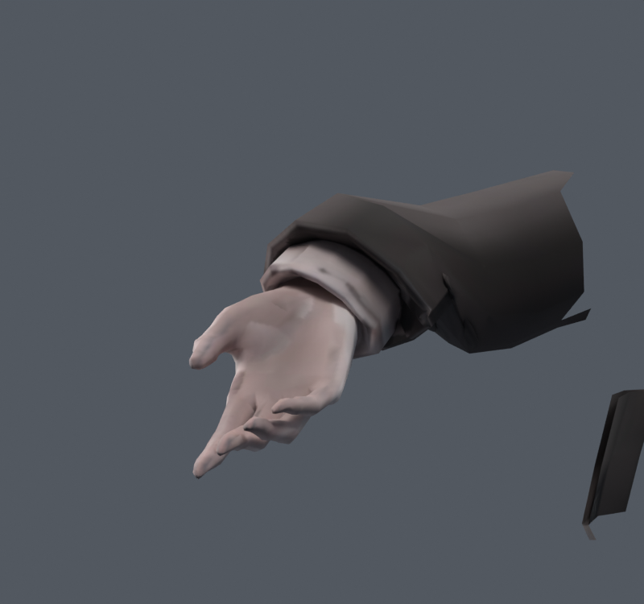 |

손과 소매만 남긴 진단 그림입니다. 손목 위쪽의 급한 꺾임이 줄어든 부분을 볼 수 있지만, 깊은 접힘 자체가 없어진 것은 아닙니다. [작업 경로 T10](PROGRESS.md#t10)

## 5. Unity에서는 실제 구동을 다시 확인했습니다

Blender에서 잘 움직여도 그 본 제약과 자세 보정이 Unity로 그대로 옮겨지는 것은 아니었습니다. Humanoid 연결, 작은 웨이트의 가져오기, 자동 보정, 물리, 재질을 각각 확인하면서 다음 문제를 수정했습니다.

| 실행 중 발견한 문제 | 적용한 처리 |
|---|---|
| 가져올 때 작은 웨이트가 빠져 변형이 달라짐 | 원래 본별 웨이트를 복원하고 실제 표면 위치를 비교 |
| 바람 애니메이션과 자세 보정을 함께 켜면 값이 누적됨 | Animator의 값 유지 설정인 Write Defaults 조합을 대조해 수정 |
| 아바타를 이동하거나 크기를 바꾸면 보정이 사라짐 | 관절 측정용 Contact 센서를 공간별로 분리하고 이동·회전·스케일 재검사 |
| 대기 자세에서 팔이 등 뒤로 모임 | Humanoid 기준을 원래 팔 내린 자세에서 올바른 T-pose로 교정 |
| 정의 목록에는 손가락이 있지만 실제로 연결되지 않음 | Unity가 요구하는 이름 형식에 맞추고 실제 연결된 51개 본 확인 |
| 움직임보다 보정이 늦게 따라옴 | 중간 계산 단계를 줄여 연속 시험의 지연을 3프레임에서 2프레임으로 감소 |

자세 보정은 SDK의 Contacts와 Animator로 구동했습니다. 검사 코드가 표면 보정값을 직접 넣은 결과와 자동 구동 결과를 구분했고, 물리도 켜고 끈 상태를 비교했습니다. [초기 Unity 이식](avatar_modeling/v167_unity_integration/START_HERE.md), [실행 오류와 후속 수정](avatar_modeling/v170_runtime_validation/START_HERE.md), [Humanoid·손가락·연속 동작 검증](avatar_modeling/v175_humanoid_reference/START_HERE.md).

### 보정 수식과 실제 SDK 실행을 따로 확인

초기 자세 보정은 팔 방향을 감지해 24개 키의 값을 계산하는 구조였습니다. 입력을 보간하는 방식에 따라 기준과 오차가 커졌고, 방향 원에 맞는 보간 방식으로 수정했습니다. 이후 물리·바람을 함께 켰을 때는 값이 누적되는 문제가 드러나 Animator의 Write Defaults 설정을 맞췄습니다. 입력과 키 값만 맞으면 끝나는 것이 아니라, 다른 애니메이션 층과 같이 켰을 때의 실행 순서도 검사해야 했습니다.

아바타 위치를 옮기거나 크기를 바꾸면 보정이 꺼지는 문제는 Contact 센서들의 공간 배치와 관련이 있었습니다. 측정 공간을 6개 구역으로 분리한 뒤 32자세×3스케일×2회전, 총 192조건에서 루트 이동까지 비교했습니다. 해당 시험의 정규화 오차는 최대 약 0.00000882였습니다. 이것은 **정해 둔 보정값을 런타임이 재현하는지** 검사한 값이며, 그 보정값이 모든 자세에서 좋은 모양을 만든다는 뜻은 아닙니다.

### Humanoid 대기 자세와 손가락을 실제 연결 기준으로 교정

| 수정 전 Humanoid 대기 자세 | 기준 자세·매핑 수정 후 |
|---|---|
| 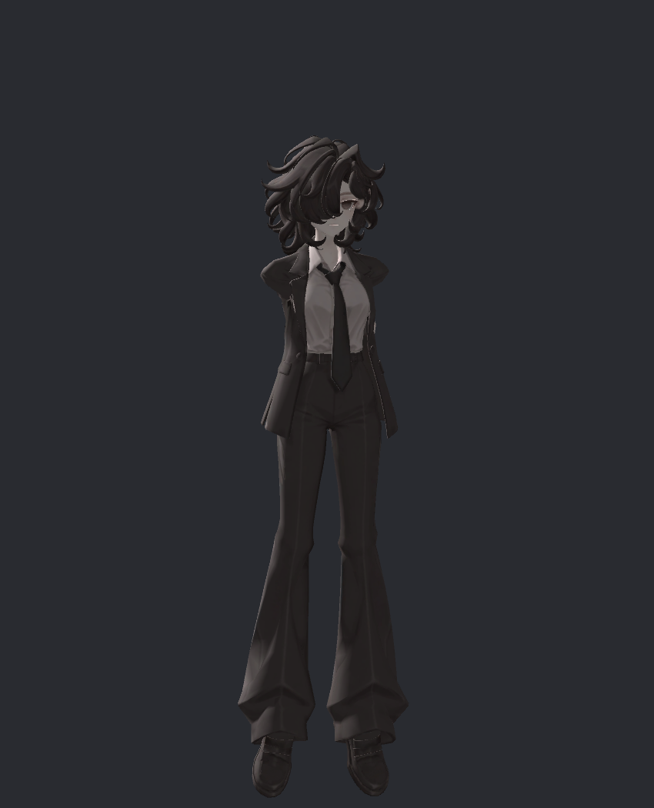 | 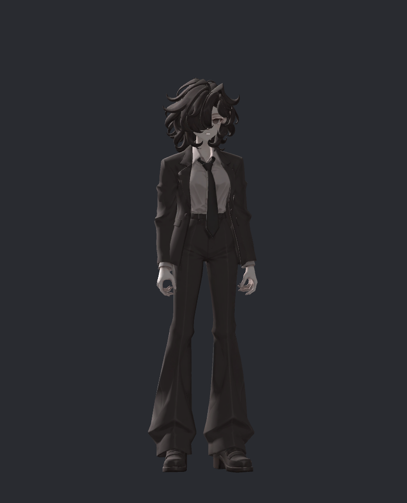 |

Blender의 기본 모양과 Unity Humanoid의 기준 자세를 구분하지 않으면, 대기 동작부터 팔이 예상과 다른 곳으로 갈 수 있었습니다. 원래 메시와 본의 기본 좌표를 바꾸는 대신 Avatar의 기준 T-pose를 바로잡았습니다. 손가락도 정의 목록에 이름이 있다는 것만 확인하지 않고 Unity가 요구하는 정확한 이름 형식으로 고친 뒤, 실제 API에서 51개 본이 연결되는 것을 확인했습니다.

자동 보정은 계산 층을 줄여 시험상 지연을 3프레임에서 2프레임으로 줄였습니다. 1,200프레임의 연속 입력을 물리 ON/OFF로 검사하면서 그 2프레임 차이를 맞춰 비교했을 때 키 값 오차는 약 0.00000742였습니다. 지연이 없어진 것은 아니며, 이 숫자로 실제 VRChat 클라이언트의 프레임 속도나 모든 자세의 품질을 설명하지 않습니다. [작업 경로 T11](PROGRESS.md#t11) · [Humanoid·연속 동작 T12](PROGRESS.md#t12)

성능은 등급과 실제 측정 비용을 함께 봤습니다. 비앙카는 보정용 Contacts 때문에 PC **Very Poor** 등급이지만, 같은 환경에서 참고 모델들과 비교한 뒤 기존 보정과 물리를 유지하기로 했습니다. 이 측정은 Unity Editor의 CPU 작업 비용이며 실제 VRChat 화면의 프레임 속도는 아닙니다. [성능 비교와 판단 근거](avatar_modeling/v170_runtime_validation/PERFORMANCE_COMPARISON.md).

비교 당시 비앙카는 삼각형 31,363개, 렌더러·재질 각 2개, 웨이트 본 129개, Contacts 94개였습니다. 같은 Editor에서 유효 600표본을 측정한 PhysBone 작업 시간의 합은 비앙카 약 0.696ms, SiuSiu 약 0.445ms, Lapwing 약 1.210ms였습니다. 병렬 작업의 합이므로 화면 한 프레임이 그만큼 느려진다는 해석은 하지 않았습니다. 등급을 낮추기 위해 기능을 바로 제거하기보다 비용을 확인하고 품질에 필요한 기능을 유지한 결정입니다. [성능 판단 T13](PROGRESS.md#t13)

## 6. 현재는 작은 개선을 선별해 통합한 검토본입니다

공유본의 최신 기준인 **v186**은 앞선 통합본에 손6곳·셔츠2곳·바지2곳의 기존 면 대각선 수정만 더했습니다. 정점 위치·본·웨이트·보정키·UV·텍스처를 유지하면서 작은 면이 접히는 방식을 조정한 결과입니다. 골반·어깨 웨이트 변경안은 더 넓은 자세 검사에서 악화돼 제외했습니다.

최종 후보를 실제 Unity/SDK에서 533자세로 재생하고, 별도 검수 프로젝트에 패키지를 다시 가져와 참조와 구동 상태를 확인했습니다. 국소 수정의 새 경고가 없었다는 결과를 전체 아바타의 무결함으로 확대하지 않았습니다. [반영한 10곳의 전후 비교](avatar_modeling/v184_body_diagonals/START_HERE.md), [v186 결과와 남은 문제](avatar_modeling/v186_review_bundle/START_HERE.md).

골반 웨이트안은 개발 중 쓰던 233자세에서는 새 면적 경고 0이었지만, 별도 433자세로 넓히자 새 경고 43건이 생겼습니다. 어깨 웨이트안도 새 경고 189건과 해소 187건이 함께 나와 제외했습니다. 이 때문에 v184는 웨이트 조정보다 범위를 좁혀 기존 사각형이 어느 대각선으로 나뉘는지만 바꿨습니다.

| 기존 손의 복합 자세 | 기존 면 대각선 수정 후 |
|---|---|
| 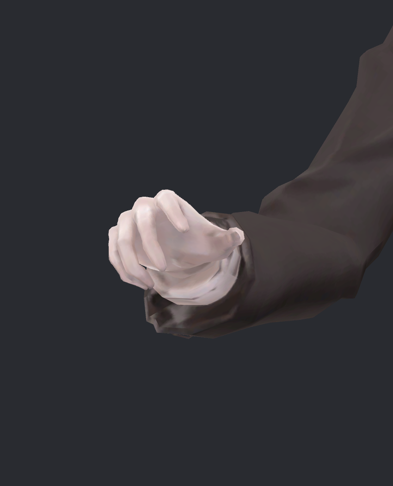 |  |

정점 위치가 같은 국소 수정이어서 변화가 작습니다. 손 전체 형태를 새로 만든 전후가 아니며, 일부 면이 꺾이는 방식의 차이를 보여 줍니다. 233·433·533자세의 검사 기록에서 이 수정으로 생긴 새 면적·교차 경고는 0이었고, 실제 Unity 533자세에서도 기준과 정점 위치가 같았습니다. 다만 이 자세 집합에는 반복 및 후보 선별에 사용한 표본이 포함되어 **1,199개의 독립적인 새 시험**으로 합산하지 않았습니다.

v186 패키지는 자체 자산 13개를 묶어 다시 가져오는 과정까지 확인했습니다. 재검수 프로젝트에는 이전 v180 환경이 준비되어 있었으므로 완전히 빈 Unity 프로젝트에서의 설치 검증으로 표현하지 않았습니다. 본 51개 매핑, 메시 2개와 보정 키 구성, 참조와 구동을 확인한 전달 검토본이며, 실제 VRChat 클라이언트 검증은 남아 있습니다. [선별 통합 경로 T14](PROGRESS.md#t14)

| 구분 | v186까지의 상태 |
|---|---|
| 반영한 개선 | 텍스처 정리, 무릎 기준, 카라·소매 회전, 헤어·코트·넥타이 물리, Unity 자동 보정과 Humanoid 수정, 국소 면 연결 |
| 계속 다듬어야 할 외형 | 큰 어깨·겨드랑이 접힘, 깊은 골반 굽힘의 바지 압축, 손가락 사이 일부 면과 복합 손 자세 |
| 아직 하지 않은 확인 | 실제 VRChat 클라이언트 테스트·업로드 |

## 후속 원인 검사: 정지 상태의 겹면도 따로 확인했습니다

노멀과 자세 보정만 바꾸어서는 왜 접힘이 반복되는지 설명할 수 없어 원래 코트의 면부터 검사했습니다. [v273](avatar_modeling/v273_neutral_layer_repair/START_HERE.md)에서 원본 정지40건·실제 중립34건의 자기 교차를 기존125정점의 최대1.944mm 이동으로 분리했습니다. 기존 면·UV·본·웨이트와 원본 파일은 보존했습니다.

이 사본을 [v275에서1,239개 동작](avatar_modeling/v275_rest_repair_validation/START_HERE.md)으로 다시 검사하자 새 접힘과 교차가 생겼습니다. 에이전트가 직접 렌더를 확인했고, 정지 자세만 통과한 결과를 해결본으로 채택하지 않았습니다. 이는 음영을 다듬는 것 외에 원래 겹면과 회전 변형을 함께 수정해야 한다는 후속 근거입니다. 두 보고서만 선별 보충했으며 v187 이후 모든 실험이나 진행 중인 최적화를 완료 기록으로 공개한 것은 아닙니다.

## 자세한 기록은 필요할 때 찾아보세요

처음부터 모든 버전을 읽을 필요는 없습니다. **현재 결과는 [v186 종합 문서](avatar_modeling/v186_review_bundle/START_HERE.md)**에서, 관심 있는 문제의 실험 과정은 [문제별 작업 추적](PROGRESS.md)에서 시작하면 됩니다. 추적표의 T01–T14는 버전을 가로질러 같은 문제를 이어 읽기 위한 번호입니다. 버전별 보고서·연구·계획·추가 비교는 [전체 단계 색인](STAGES.md)에 시간순으로 모았습니다.

검사 숫자를 읽을 때는 세 가지를 구분해 주세요. “새 경고0”은 기존 문제까지 모두 없어졌다는 뜻이 아닙니다. 같은 면이 여러 프레임에서 경고된 사건 수는 결함 개수와 다릅니다. 정적 자세·반복 동작·무작위 검사도 모두 독립 표본으로 더할 수는 없습니다. 보고서에는 이런 조건과 실패 결과를 함께 남겼습니다.

이 저장소는 문서와 선별한 비교 그림을 공유합니다. 모델·원본 텍스처·구매 자산·실행 코드·원시 검증 데이터는 포함하지 않습니다. 과거 보고서의 “최신”은 작성 당시 기준이므로 [상태·결정 이력](STATUS.md)을 함께 확인해 주세요. [공유 범위](SHARING.md) · [파일 목록](INVENTORY.md)
