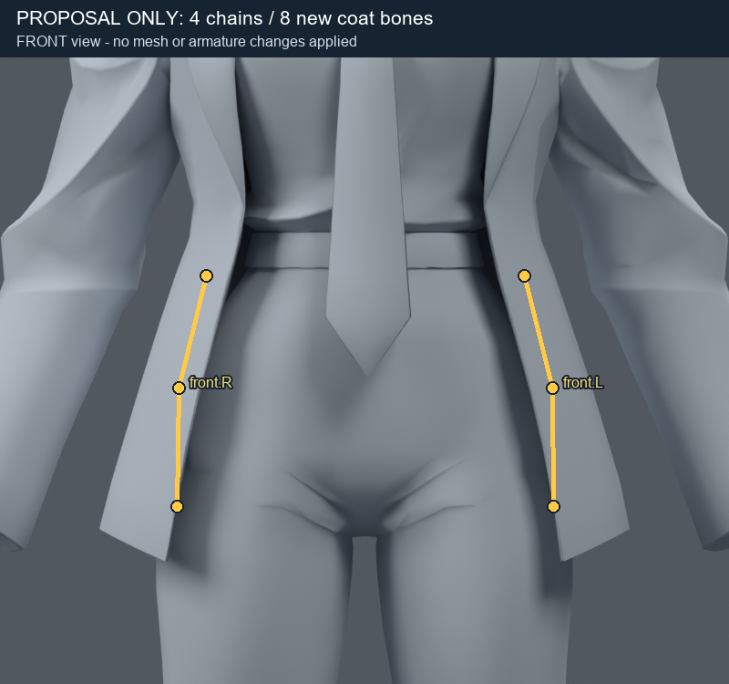
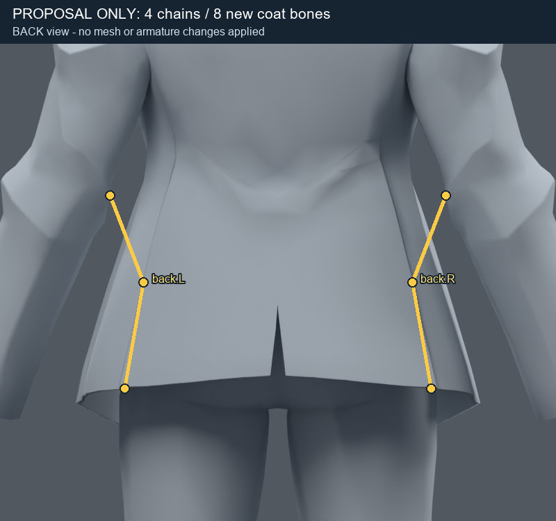

> **기록 시점 안내:** 아래는 해당 단계 당시의 보고서입니다. 후속 결정은 [최신 상태](../../STATUS.md)를 기준으로 읽어주세요. 모델·원본 텍스처·검증 원시 데이터는 이 문서 공유본에 포함하지 않습니다.

# 다음 변경 범위 — 재킷 자락 8본 시험

**후속 상태:** 사용자가 “그래 한번 계속 진행해봐.”로 아래 범위의 사본 시험을 승인했다. v011에서 실제 8본/웨이트 시험을 완료했으며 두 후보는 품질 실패로 미채택이다. [실행 결과](../coat_rig_v011/REVIEW.md)를 먼저 확인한다. 물리는 적용하지 않았다. 아래는 승인 당시 제안 기록이다.

## 왜 이 단계가 필요한가

현재 재킷 자락은 골반·허벅지 등 몸 본의 웨이트로만 움직인다. 앉을 때 옷 뿌리는 허리에 남아야 하지만 끝은 허벅지와 독립적으로 움직일 여지가 필요하다. 기존 몸 웨이트를 더 강하게 주는 방식만 반복하지 않고, 자락 자체의 회전 구간을 시험하려 한다. 실제 관통 근거는 [현재 시험 결과](REVIEW.md)의 앉기/한쪽 다리 렌더다.

## 구체적인 추가 범위

| 항목 | 제안 |
|---|---|
| 기준 파일 | v009 `bianca_neck_collar_wide_WEIGHTS_TRIAL.blend` |
| 저장 위치 | 별도 `coat_rig_trial` 폴더의 새 .blend |
| 추가 본 | 재킷 앞 왼쪽/오른쪽, 뒤 왼쪽/오른쪽: 각 2개, 합계 8개 |
| 부모 | 각 체인의 뿌리는 기존 hips 기준으로 배치하는 안부터 시험 |
| 영향 부위 | 재킷 몸통의 허리 아래 자락. 소매·얼굴·손·바지는 제외 |
| 처음 할 검증 | 물리 OFF 상태에서 수동 자락 포즈로 앉기 공간과 중립 복귀 검사 |
| 이후 검토 | 정적 변형 통과 후 PC PhysBone의 작은 움직임·충돌 시험. 이번 승인과 동시 자동 적용하지 않음 |

아래 노란 선은 **현재 모델 위에 그린 계획 표시**다. 실제 본이 들어간 결과나 변형 성공 미리보기가 아니다. 각 세 점을 연결한 두 구간이 두 본을 의미한다. 표면 참조점은 coat_bone_proposal.json (공유본 미포함: `coat_bone_proposal.json`)에 기록했고, 실제 본 중심은 사본에서 표면 안쪽으로 맞춰야 한다.

| 앞쪽 2체인 / 4본 | 뒤쪽 2체인 / 4본 |
|---|---|
|  |  |

## 유지할 것

현재 얼굴·체형·재킷 길이/폭·중립 실루엣·정점 위치·면 연결·UV·텍스처는 그대로 유지한다. 메시 분리·재생성·리메시는 하지 않는다. 이미 있는 20개 본의 위치를 이 자락 시험 때문에 함께 바꾸지 않는다. 어깨/무릎의 미채택 후보도 합치지 않는다.

## 성공 기준과 중단 기준

성공은 자락의 윗부분이 허리에 안정적으로 붙으면서 끝이 필요한 공간으로 움직이고, 중립 복귀에서 원래 재킷 형태를 유지하는 것이다. 앞/뒤와 좌우 패널 경계가 갈라져 보이거나 큰 주름이 생기지 않아야 한다. 앉기 한 자세만으로 채택하지 않고 걷기·한쪽 다리 들기·비틀기에서도 검사한다.

8본만으로 부족하다면 즉시 본이나 면을 계속 추가하지 않는다. 부족한 부위를 표시하고 추가 변경 규모를 다시 설명한다. 재킷의 폭·길이를 바꿔 관통을 가리는 작업은 하지 않는다. Blender에서 가능한 동작과 실제 VRChat 구동 확인을 별도 단계로 남긴다.

## 의견을 받는 이유

사용자는 “수정이 크면 내 의견 물어봐”라고 명시했다. **자락 전체에 영향을 주는 8본 추가와 웨이트 분배는 앞선 작은 웨이트/컷 시험보다 리그 구조와 동작의 범위가 커지므로**, 이 구체적인 사본 시험 범위를 먼저 제시한다. 기존 계획을 다시 승인받으려는 것이 아니라 실제로 필요한 구조 확장의 범위를 확인하는 것이다.

제안 작성 당시에는 본을 추가하지 않았다. 이후 사용자 승인과 실제 시험 결과는 문서 맨 위의 후속 상태를 따른다.
