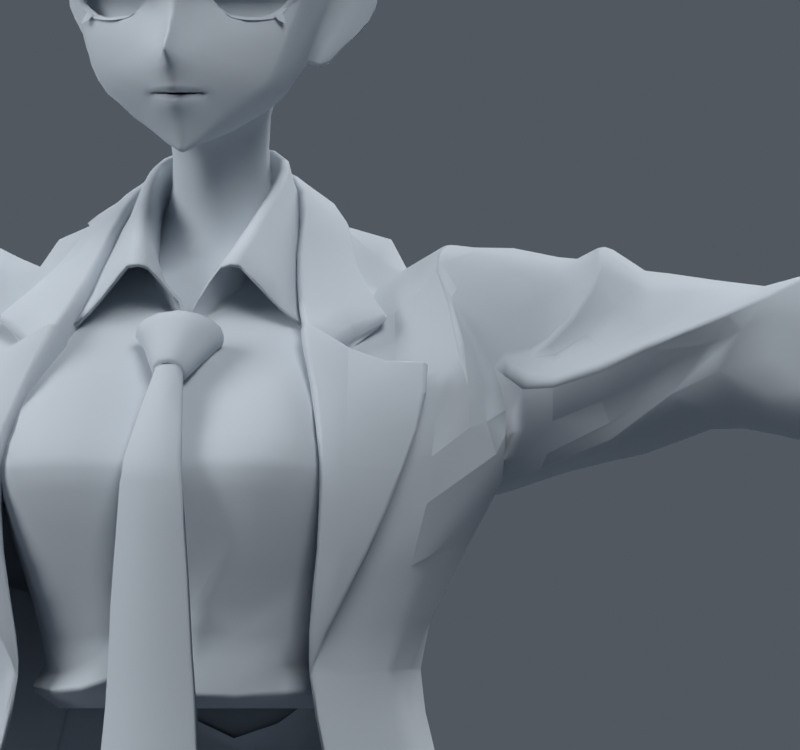
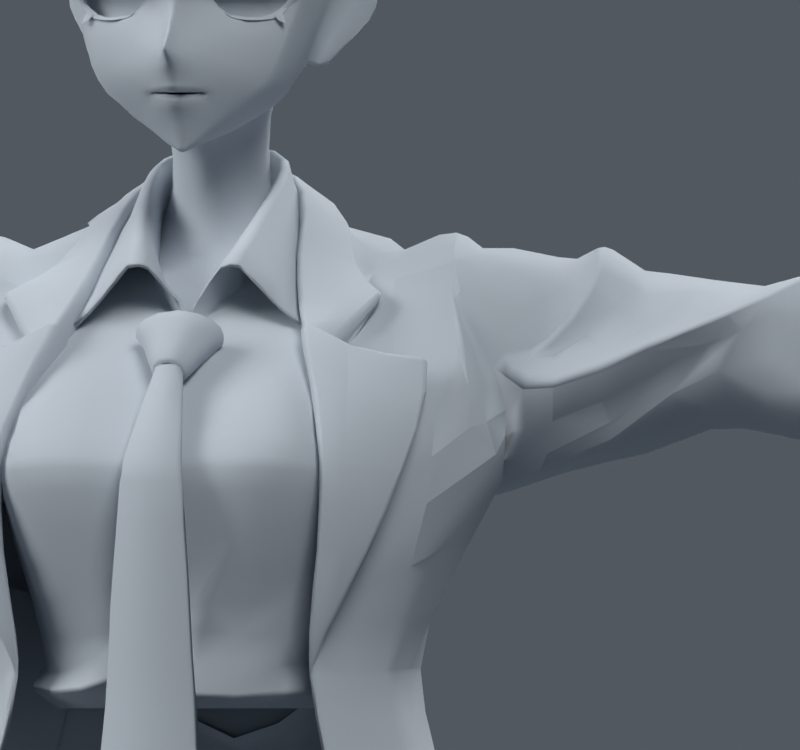
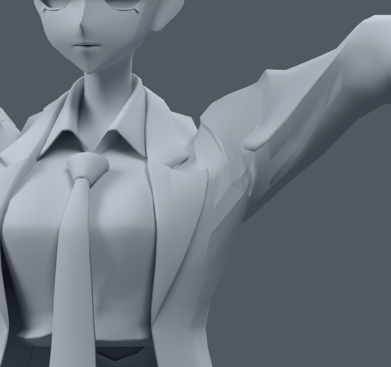
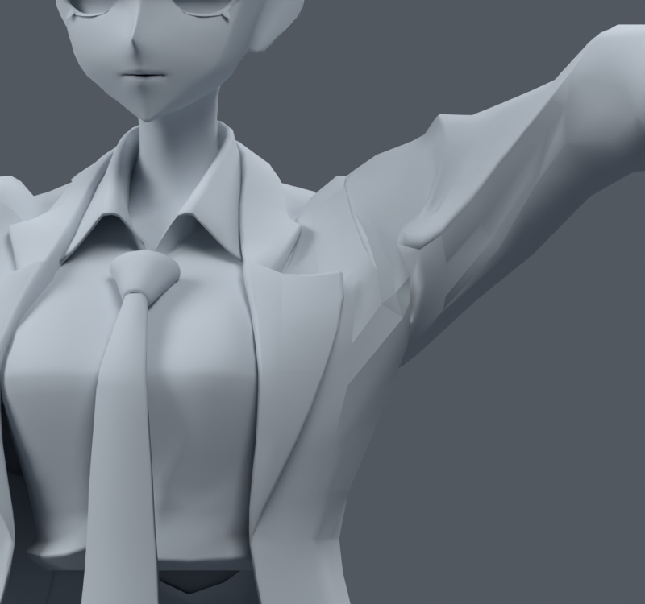
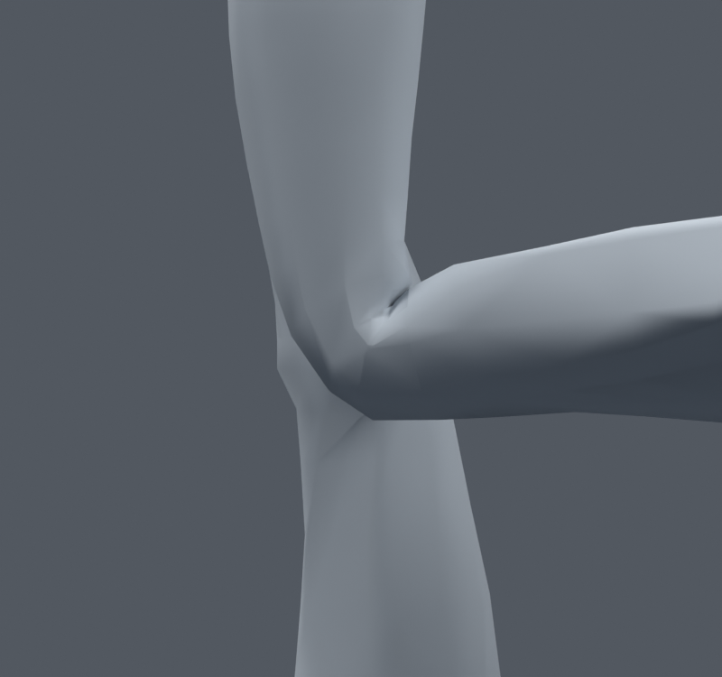
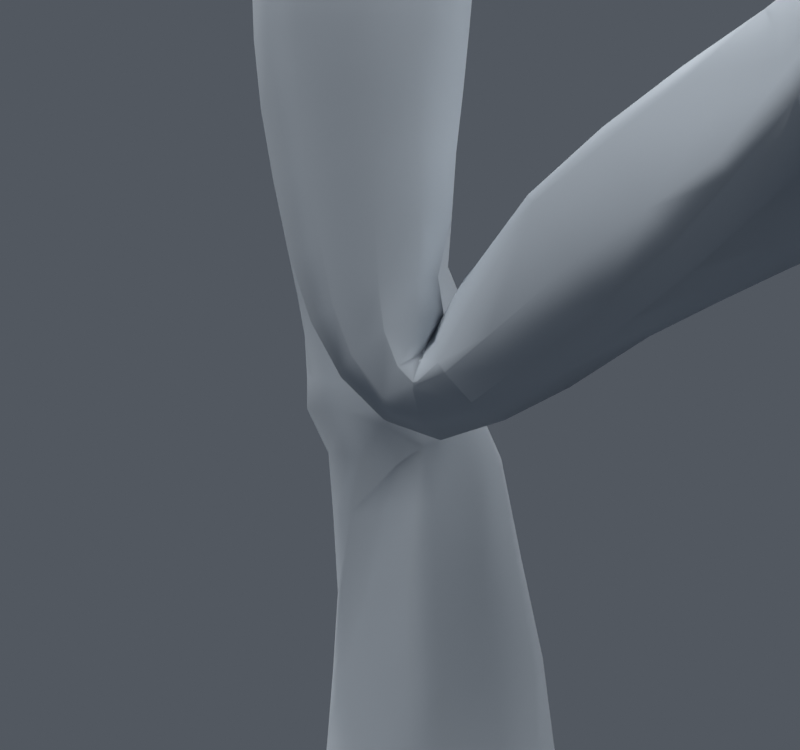
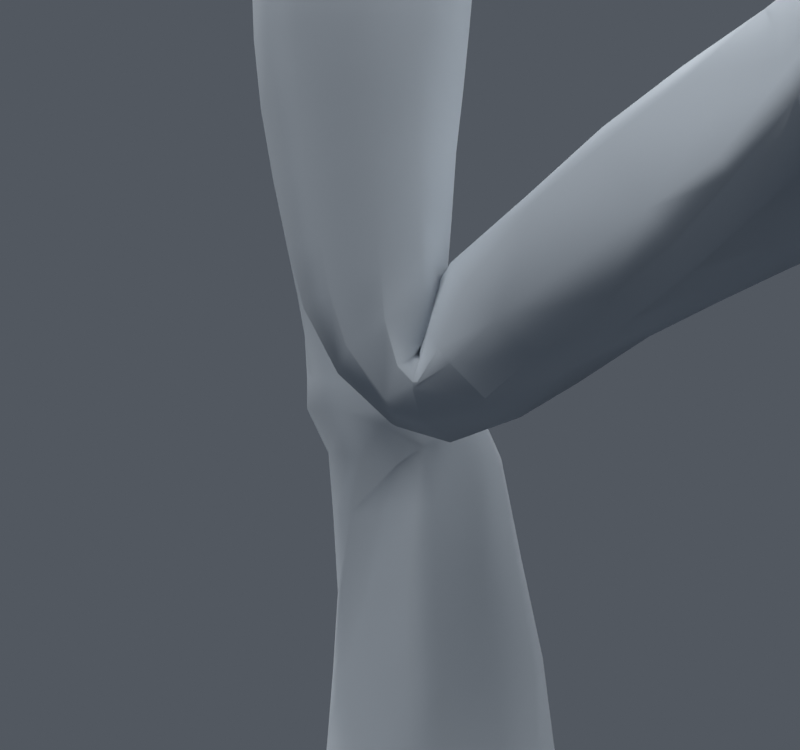
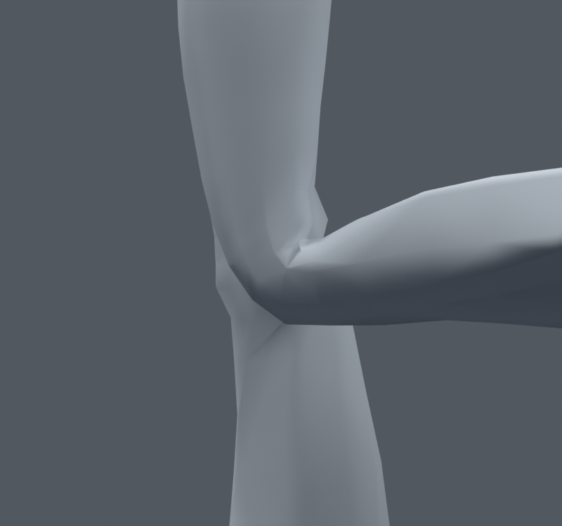
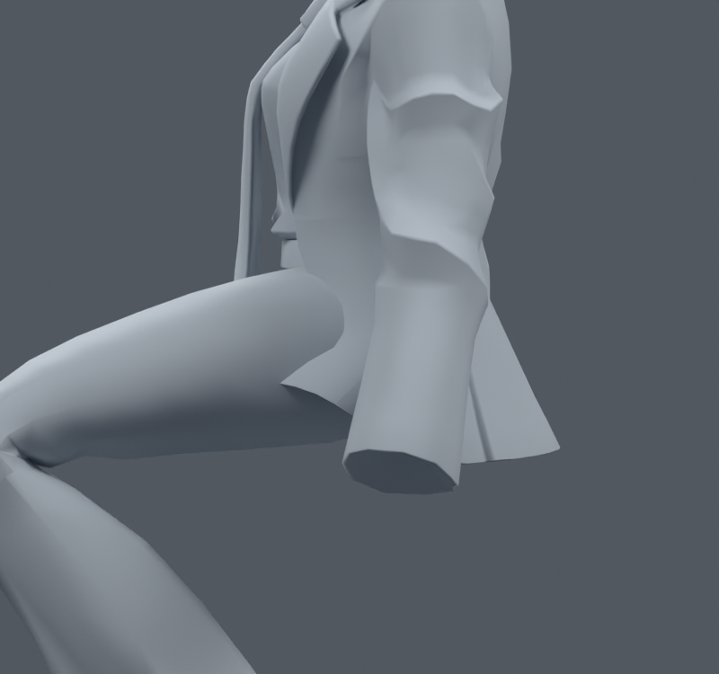
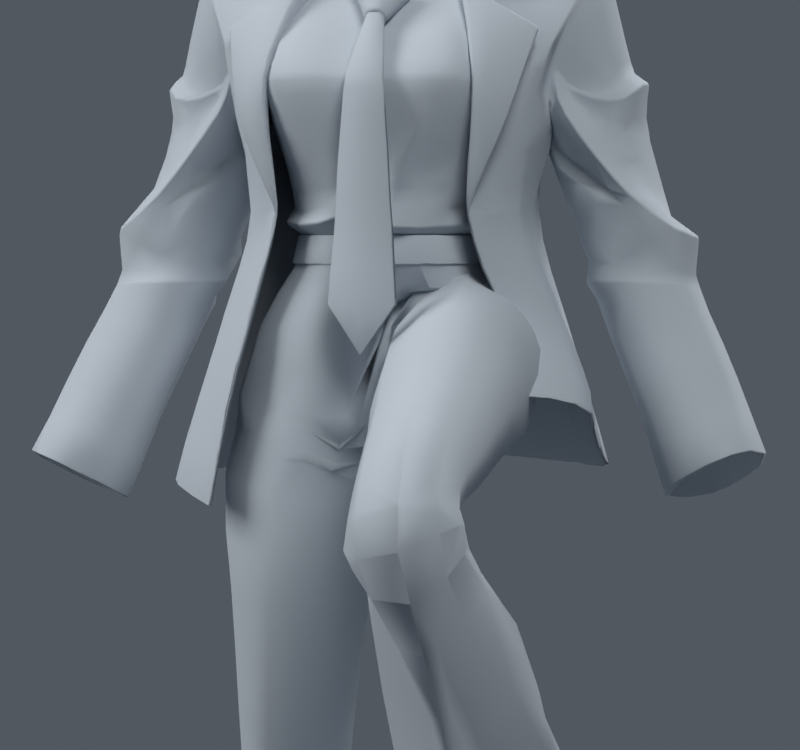

> **기록 시점 안내:** 아래는 해당 단계 당시의 보고서입니다. 후속 결정은 [최신 상태](../../STATUS.md)를 기준으로 읽어주세요. 모델·원본 텍스처·검증 원시 데이터는 이 문서 공유본에 포함하지 않습니다.

# v010 어깨·무릎 시험과 자락 리그 제안

**2026-09-09 · 비교 시험 · v010 후보는 주 작업본에 채택하지 않음**

현재 우선 작업 후보는 여전히 v009 목·칼라 웨이트본 (공유본 미포함: `bianca_neck_collar_wide_WEIGHTS_TRIAL.blend`)이다. 이번 어깨/무릎 시험은 각각 그 파일에서 갈라졌으며 서로 합치지 않았다. 원본 캐릭터를 새로 생성하거나 리메시하지 않았다.

## 결과와 채택 여부

| 대상 | 실제 수행 | 결과 / 결정 |
|---|---|---|
| 목·턱·칼라 | v009 웨이트 보정과 33자세 데이터 검사, 대표 자세 렌더 | 우선 후보로 보존. 전체 관절 완료 아님 |
| 어깨·겨드랑이 | 기존 쇄골 본에 국소 영향 분배, 381 raw 정점 웨이트 변경 | 높은 팔 들기에서 압축 증가. **미채택** |
| 무릎 웨이트 | 앞쪽과 뒤쪽 전환 폭을 다르게 조절, 366 raw 정점 | 낮은 각도 개선과 달리 앉기 압축 증가. **미채택** |
| 무릎 지지 컷 | 각 무릎의 기존 .365m 컷 위/아래 .350/.380m에 2줄씩 | 기존 정점 고정. 시각 개선이 작아 **미채택** |
| 재킷 자락 | 현재 앉기/한쪽 다리 들기 렌더와 8본 배치 설명도 | 실제 본 추가 없음. [다음 변경 범위](NEXT_SCOPE.md)로 제안 |

## 1. 어깨·겨드랑이

쇄골 고정과 쇄골 협력 포즈를 구분했다. 옆으로 팔을 드는 시험은 고정 65도, 협력은 쇄골 15도+상완 50도처럼 총 방향 회전을 맞춰 비교했다. 높은 팔 들기는 쇄골 25도+상완 70도다. 앞으로 뻗기, 뒤로 보내기와 후면 관찰도 포함했다. 이 값은 비교용 포즈이며 최종 VRChat IK의 분담 규칙이 아니다.

어깨 윗부분의 기존 chest/upper_arm 영향 일부를 이미 존재하는 clavicle 본에 나눠 주는 후보를 만들었다. 기본 형상과 본 위치는 유지했다. 일부 어깨선은 달라졌지만 겨드랑이의 각진 당김은 해결되지 않았고, 높은 팔 들기의 검사 영역에서 면적 20% 미만 압축 면이 **0→15개**로 증가했다. 고정 쇄골 포즈에서도 **0→3개**로 늘었다. 그래서 더 강한 동일 처방을 반복하지 않고 제외했다.

이 결과는 “쇄골을 쓰면 안 된다”는 결론이 아니다. 현재 추정 본 위치·웨이트·면 흐름에서 위쪽 영향만 나눠서는 해결되지 않는다는 뜻이다. 다음에는 실제 어깨 회전 중심과 겨드랑이의 기존 면 연결을 더 구체적으로 분리해야 한다. 본 위치를 바꾸거나 넓은 면 재구성으로 넘어간다면 먼저 범위를 제시한다.

| 기존 웨이트·쇄골 협력 | 쇄골 영향 추가 후보 |
|---|---|
|  |  |
|  |  |

## 2. 무릎 웨이트

기존 컷을 유지한 상태에서 바지 앞쪽과 뒤쪽에 다른 전환 폭을 적용했다. 기존 v006에서 추가됐던 68정점도 위치와 기존 기록을 확인해 포함했다. 정점·면·UV·본은 바꾸지 않았다.

60도 굽힘의 심한 압축 면은 **3→0개**로 줄었지만, 90도는 **0→3개**, 120도는 **4→5개**, 앉기는 **3→16개**로 늘었다. 정면/측면 윤곽도 무릎이 자연스럽게 완성됐다고 보기 어려웠다. 특정 각도 개선을 이유로 누적하지 않고 미채택으로 남겼다.

| 기존 웨이트 | 앞뒤 전환 분리 후보 |
|---|---|
|  |  |
|  |  |

## 3. 별도 파일의 작은 지지 컷

웨이트 후보의 악화를 가져오지 않도록 **v009 목 수정본에서 다시 분기**했다. 기존 무릎 컷의 위아래, 세계 좌표 z=.350/.380m에서 작은 단면 컷을 두 줄씩 추가했다. 교차하는 비평면 면은 기존 렌더 삼각분할을 유지하며 잘랐다. 원래 정점은 전부 그대로 두고 새 정점의 위치·UV·웨이트·노멀을 원래 표면에서 보간했다.

- 추가 137 raw 정점 / 141면 / 200삼각형.
- 시험 파일 총 34,734정점 / 17,766면 / 31,563삼각형.
- 기존 정점 위치와 웨이트 정확히 동일. 원래 표면 기준 면적 상대 오차 약 2.25e-6.
- 원래 UV 및 새 UV 보간 최대 오차 약 1.33e-7 UV 단위.
- 저장 후 재로드, 양쪽 무릎 15도 간격 15~120도·앉기·머리 회전·중립을 포함한 **19개 독립 자세** 확인. 기존 정점의 포즈 위치 유지, 좌표 유효, 새 퇴화 삼각형 없음.

위 수치는 소량 컷이 원래 표면을 보존했다는 증거다. **관절이 자연스럽게 해결됐다는 증거는 아니다.** 실제 90/120도 앞·옆 렌더에서 윤곽 개선이 작고 원래 각짐이 남아 있어, 현재 주 작업본에는 포함하지 않았다. 컷 수만 계속 늘리지 않는다.

| 기존 v009의 무릎 | 위아래 지지 컷 후보 |
|---|---|
|  |  |
|  |  |

컷 생성 검증 (공유본 미포함: `knee_support_cut_build.json`) · 재로드/19자세 검증 (공유본 미포함: `reload_verification.json`)

## 4. 자락에서 남은 문제와 다음 범위

현재 앉기와 한쪽 다리 들기에서 재킷 자락이 허벅지를 뚫거나 피부처럼 끌리는 현상이 남는다. 허벅지 웨이트를 더 주는 단일 처방은 자락 전체의 역할을 표현하기 어렵다. 현재 본 20개에는 자락용 본이 없어서, 옷의 뿌리는 허리에 남기고 끝은 다리와 별도로 움직이는 시험이 필요하다.

| 앉기 측면 | 한쪽 다리 들기 |
|---|---|
|  |  |

다음 제안은 **앞/뒤·좌/우 4개 체인, 각 2개 본으로 총 8개**다. 설명용 점은 현재 옷 표면에서 뽑았으며 아직 Armature에 추가하지 않았다. [NEXT_SCOPE.md](NEXT_SCOPE.md)에 보존 범위·실행 순서·중단 기준을 적었다. 메시를 새로 만들거나 재킷을 잘라 새 패널로 교체하는 제안이 아니다.

## 파일 구분과 검증의 한계

`bianca_shoulder_clavicle_soft_WEIGHTS_TRIAL.blend`, `bianca_knee_anterior_support_WEIGHTS_TRIAL.blend`, `bianca_knee_TWO_SUPPORT_CUTS_TRIAL.blend`는 모두 비교용·미채택이다. 기준 v009와 원본 v006을 덮어쓰지 않았다. `*_changes.json`, `*_poses.json`, `reload_verification.json`이 저장 및 실제 수행 범위를 기록한다.

수치 비교는 웨이트 시험에서는 같은 면끼리, 컷 시험에서는 원래 부모 면의 삼각형 면적을 합산해 비교했다. 서로 면 수가 다른 모델의 압축 면 개수를 그대로 비교하지 않았다. 의상 관통은 대표 렌더에서 확인했으며 이 단계에서 전 자세의 충돌 없는 상태를 주장하지 않는다. Unity/VRChat 실행·손가락/표정/물리는 아직 미구현·미검증이다.
