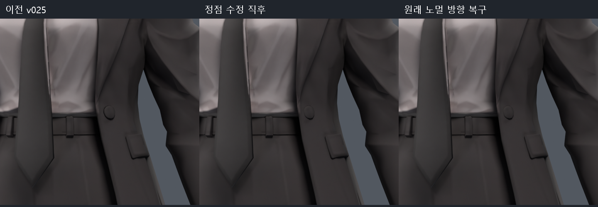
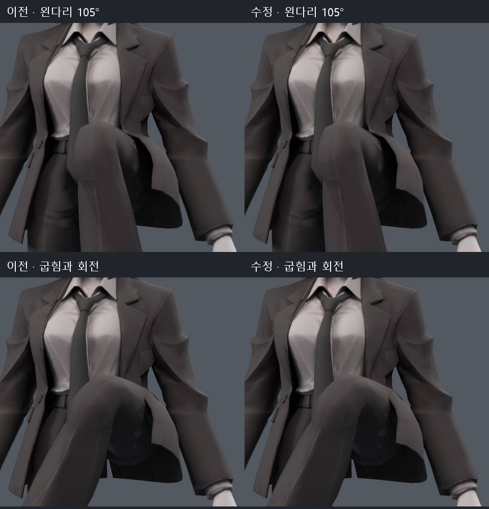

> **기록 시점 안내:** 아래는 해당 단계 당시의 보고서입니다. 후속 결정은 [최신 상태](../../STATUS.md)를 기준으로 읽어주세요. 모델·원본 텍스처·검증 원시 데이터는 이 문서 공유본에 포함하지 않습니다.

# 코트 앞 허리의 국소 관통 시험 v026

2026-09-09. v025 어깨/회전 사본 위에서 이전부터 남은 왼다리105도 코트 관통을 조사했다. **해당12쌍을 없앤 후보는 만들었지만, 가슴 회전의 소매 접촉 회귀가 있어 최종 채택하지 않았다.**

## 위치와 시도

접촉은 왼쪽 앞 허리 장식 주변의 코트 삼각형10개와 바지 삼각형2개에 모여 있었다. 좁은 영역의 웨이트만 재분배하는10개 후보와 주변2링까지 완만하게 연결하는7개 후보를 비교했다. 접촉을 없애는 강도에서는 다른 자세의 면 압축이 증가해 모두 미채택했다.

다음으로 기존 정점의 위치를 최대2mm 이내로 조정하는12개 후보를 비교했다. 형상 조정만으로는12쌍을 완전히 없애지 못했다. 작은 위치 조정과 웨이트를 함께 적용한16개 후보 중, +X방향 최대2mm 이동과 spine→coat_front_01.L 최대0.04 전환 후보가 국소 검사 조건을 통과했다. 표면 근처2링은 이동량/웨이트를 완만하게 줄였다. 전체/부분 메시 생성, 리메시, 새 면/정점 추가는 하지 않았다.

## 파일과 변경량

- 마지막 검수 사본: `bianca_COAT_CLEARANCE_NORMALS_TRIAL.blend`
- 노멀을 복구하기 전 비교 사본: `bianca_COAT_COMBINED_CLEARANCE_TRIAL.blend`
- 이전 어깨 사본: v025 `margin/bianca_SHOULDER_ROTATION_REVIEW.blend`를 그대로 보존

기존 정점105개를 최대2.000001mm 이내로 이동했고98개 정점의 웨이트를 최대0.0400001 바꿨다. 좌표 이동은 왼쪽 앞 허리의 작은 영역에 한정했다. 메시34,597정점 /17,625면 /31,363삼각형,94본의 위치/계층, UV·텍스처·재질·modifier·변환을 유지했다. 최대4웨이트와 정규화를 확인했다.

위치 변경 뒤 단추의 음영이 평평해지는 현상을 렌더에서 발견했다. 원래 corner normal 방향을 다시 설정한 별도 사본에서 단추 음영을 복구했다. 저장되는 노멀 표현의 수치 차이로 최대 벡터 오차 약0.000510이 있으며, 원래 노멀과 비트 동일하지는 않다. 면의 smooth 플래그는 변경하지 않았다. 마지막 사본은 앞 사본과 좌표/면/웨이트/본 등이 정확히 같고, 실제9자세의 전체 평가 표면도 차이0임을 확인했다.

왼쪽은 v025, 가운데는 위치 수정 직후, 오른쪽은 원래 노멀 방향 복구 후다. 작은 좌표 수정도 원래 디테일의 음영을 바꿀 수 있어서 저장 후 실제 렌더를 확인했다.

## 전체 재검사 결과

v025의897몸 표본에 좌우 다리96~105도를0.3도 간격으로 나눈62표본을 더해, 이전/수정 사본 각각 **959표본**을 실제 Blender 평가 메시로 검사했다. 새 표본은 계산된 자락 포즈를 사용하며 자동 충돌/물리 검사가 아니다.

| 항목 | 이전 v025 | v026 수정 |
|---|---:|---:|
| 왼다리105도 코트/바지 교차 | 12쌍 | 0쌍 |
| 추가62표본 중 코트/바지 접촉 자세 | 4 | 0 |
| 전체 접촉 자세 | 98 /959 | 90 /959 |
| 심한 면적 이상 자세 / 누적 | 13 /23 | 13 /23 |
| 면적 이상이 증가한 자세 | — | 0 |
| 가슴 Z축 -45도 코트/소매 교차 | 16쌍 | 21쌍 |

**가슴 회전 한 자세의 접촉5쌍 증가가 남는다.** 국소 표본에서는 안 보였던 회귀를 전체 검사에서 발견한 것이다. 특정 다리 자세에서0이 됐다는 이유로 전신 완료나 무관통 모델이라고 기록하지 않는다. 959검사는 위치/웨이트 수정본에서 실행했으며, 노멀 복구본은 동일 geometry/weight fingerprint와9자세 표면 차이0으로 해당 변형 결과를 연결했다.

105도 굽힘과 고관절 굽힘+축 회전에서 같은 시점으로 비교했다. 큰 허벅지 회전의 코트 접촉, 무릎 각짐, 소매와 몸통의 접촉은 여전히 후속 대상이다. 렌더에서는 좁은 접촉선이 잘 보이지 않을 수 있어 교차 검사 결과도 함께 기록했다.

## 상태와 다음 판단

이 파일은 기존 정점의 작은 수정만으로 특정 회귀를 제거할 수 있음을 확인한 **미채택 비교 후보**다. v025 원형 유지 사본에 자동으로 합치지 않는다. 다음 보정은 이 작은 영역을 계속 크게 밀어내는 방향으로 확대하지 않고, 소매/몸통/자락의 상대 움직임과 부모 추종을 분리해 다뤄야 한다. 본 구조 변경은 승인 범위이지만 원래 형태의 넓은 변경과 새 메시 생성은 허용되지 않았다.

제작자 사례와 공식 PhysBone/Constraint 조건은 [v025 추가 조사](../rotation_review_v025/RESEARCH_NOTES.md)에 정리했다. 현재 Unity·VRChat을 실행하거나 PhysBone·콜라이더를 적용하지 않았다. 문서의 수치는 물리 엔진의 충돌 처리 결과가 아니다.

원시 근거: `contact_locations.json`, `local_weight_trials.json`, `expanded_weight_trials.json`, `local_geometry_trials.json`, `combined_trials.json`, `preservation.json`, `verification.json`, `normals_preservation.json`, `normal_equivalence.json`. 파일 해시는 `DELIVERY.json`에 있다.
