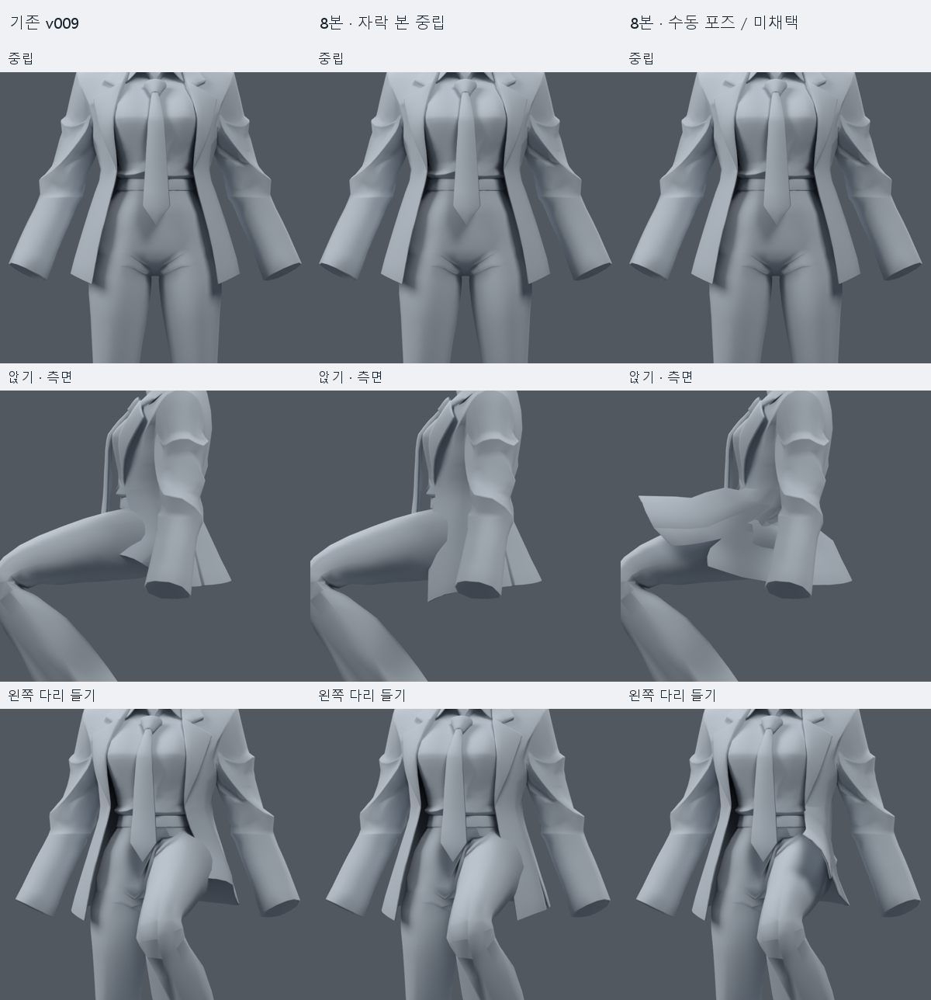
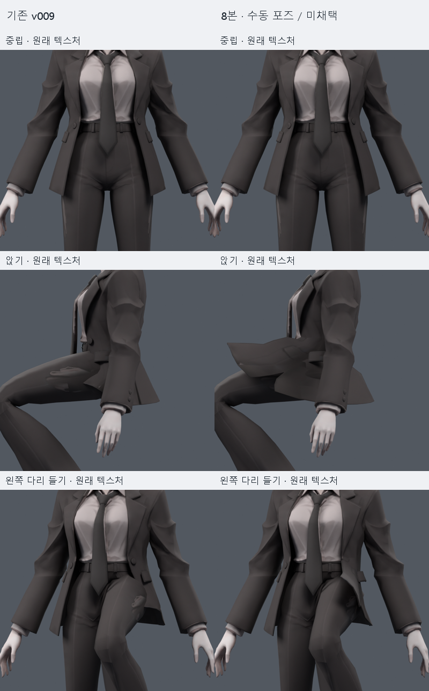
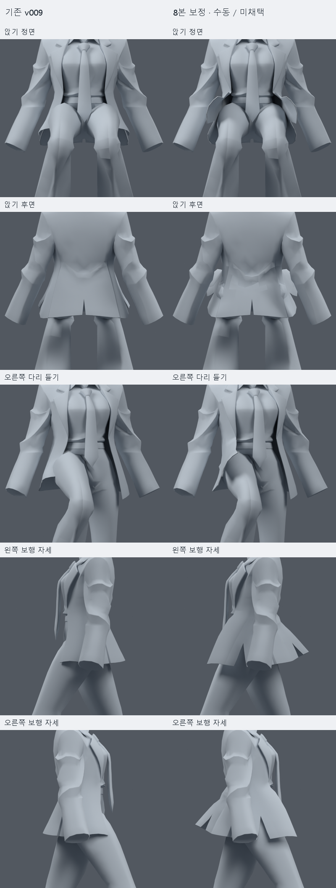
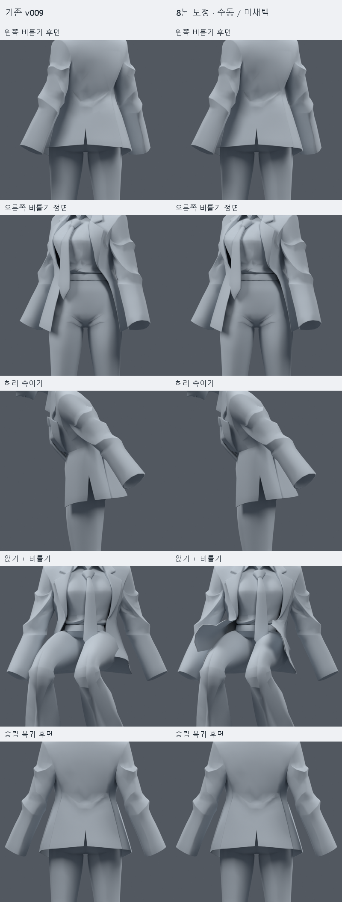

> **기록 시점 안내:** 아래는 해당 단계 당시의 보고서입니다. 후속 결정은 [최신 상태](../../STATUS.md)를 기준으로 읽어주세요. 모델·원본 텍스처·검증 원시 데이터는 이 문서 공유본에 포함하지 않습니다.

# 재킷 자락 8본 사본 시험 v011 — 구현·검증 완료, 두 후보 미채택

사용자의 “그래 한번 계속 진행해봐.”를 v010에서 제시한 **앞/뒤·좌/우 4체인 × 2본, 합계 8본의 별도 사본 시험 승인**으로 반영했다. 기본 메시를 유지하고 물리 없이 수동 포즈부터 검사했다. 이 승인을 재생성이나 추가 구조 확장의 허가로 확대하지 않았다.

**결론:** 자락의 독립 제어는 구현했지만, 시험한 두 배치/웨이트 조합은 자연스러운 앉기·숙임 기준을 통과하지 못했다. 최종 아바타나 다음 기준 파일로 채택하지 않는다. 주 후보는 여전히 목 v009 (공유본 미포함: `bianca_neck_collar_wide_WEIGHTS_TRIAL.blend`)이다. 8본이라는 개수 자체가 불가능하다는 결론은 아니다. 이번 배치·웨이트·수동 회전의 실패이며, 모든 가능한 8본 설계를 탐색했다는 뜻도 아니다.

## 파일을 여는 순서

1. [전후 비교](COAT_STATIC_COMPARISON.png)와 아래 실제 텍스처 비교를 확인한다.
2. 수동 포즈 검수 파일 (공유본 미포함: `bianca_COAT_8BONE_MANUAL_POSE_REVIEW.blend`)을 열면 타임라인에 `V011` 표시가 있다. 1=중립, 13=앉기, 25/37=좌우 다리 들기, 49/61=좌우 보행 자세, 73/85=좌우 비틀기, 97=숙임, 109=앉기+비틀기, 121=중립 복귀다. **이 파일의 자세는 직접 지정한 샘플이며 자동 리깅 동작이나 PhysBone이 아니다.** 지정 프레임을 다시 열어 원래 수동 포즈 좌표와 비교했다. 중간 보간 구간은 예시이며 검증된 모션으로 제공하지 않는다.
3. 초기 리그 사본 (공유본 미포함: `bianca_COAT_8BONE_STATIC_TRIAL.blend`), 허리 중심 보정 사본 (공유본 미포함: `bianca_COAT_8BONE_FITTED_STATIC_TRIAL.blend`)은 원래 진단 타임라인을 유지한 중립 저장본이다. 새 본은 있지만 자동으로 다리를 피하지 않는다. 검수 파일만 별도 수동 Action을 사용한다.

## 무엇을 바꿨는가

기준은 v009 목/칼라 넓은 웨이트 후보이고 SHA-256은 `c8fbe48d7afba66fa963b0cb5b3d46709be1422d5611584a47b525340550d8cb`다. 레퍼런스 `avator_references/ref_char.png`를 실제로 열어 재킷 길이·폭·전체 모양을 확인했다. 어깨/무릎의 미채택 v010 후보나 B 눈 정점 수정은 가져오지 않았다.

- 기존 **34,597 raw 정점 / 17,625면 / 31,363삼각형**을 유지했다. 정점 이동·면 추가·메시 분리·UV 변경·텍스처 수정은 없다.
- 기존 20개 몸 본의 이름·부모·머리/꼬리 위치·행렬·deform 설정이 정확히 같다. 새 본 8개로 총 28개다.
- 새 본은 `coat_front_01/02.L/R`, `coat_back_01/02.L/R`. 각 01은 hips 자식이고 02는 해당 01의 연결된 자식이다. 기존 몸 본에 Constraint나 Driver를 넣지 않았다.
- component 1 재킷의 z < .705 영역을 같은 표면의 정확히 겹치는 위치로 묶어 **검사용 연결 그래프**를 만들었다. 실제 정점을 합친 것은 아니다. 385/391 raw 정점의 좌우 소매 영역은 제외하고 1,243 raw 정점의 몸통 아래 영역을 선택했다. 높이별 웨이트 전환을 적용하여 초기 1,147개, 보정 1,032개 raw 정점만 실제 변경됐다.
- 원래 웨이트와 자락 본 웨이트를 허리에서 부드럽게 전환하고, 앞/뒤·좌/우 패널 및 상/하 본을 혼합했다. 변경 정점에만 최대 4개 deform 영향으로 정규화했다. 비본 진단 그룹은 보존했다. 정확한 규칙·본 좌표는 초기 명세 (공유본 미포함: `build_manifest_initial.json`), 보정 명세 (공유본 미포함: `build_manifest_fitted.json`), 정점별 전후 웨이트는 보정 변경 기록 (공유본 미포함: `weight_changes.json`)에 있다.

### 초기안과 보정안의 차이

초기안은 v010 표면 참조점에서 XY 방향으로 몸 안쪽 3mm에 본을 배치했다. 앞쪽 뿌리는 z≈.642, 뒤쪽은 z≈.650이었다. 허리 전환 z=.642–.695, 앞뒤 혼합 y=-.020–.025로 시작했다. 앉기에서 앞 본 -65°, 끝 본 +10°, 뒤 본 +18°로 직접 제어했으나 자락이 허벅지 아래로 통과하고 측면이 늘어났다.

보정안은 **새 01 본의 뿌리만 z=.678**로 높였다. 기존 몸 본은 그대로다. 허리 전환을 z=.635–.680으로 내려 상체와의 전환 범위를 줄이고, 앞뒤 혼합을 y=-.040–.070으로 넓혀 측면의 급격한 전환을 줄였다. 최종 앉기 수동 값은 앞 01=-65°, 앞 02=-25°, 뒤=0°다. 한쪽 다리는 해당 앞 01=-55°, 02=-25°다. 모든 각도는 포즈 명세 (공유본 미포함: `static_pose_specs.json`)에 기록되어 재현 가능하다.

보정 중 앞 01=-80°/02=+5°도 화면에서 확인했지만 앞자락이 지나치게 높게 떠서 최종 비교 포즈로 사용하지 않았다. 이는 저장 리그를 추가 변경한 별도 후보가 아니라 수동 회전값 조정이다. 위 표·검증 JSON·최종 렌더는 최종 명세와 일치한다.

## 실제로 관찰한 결과

앞 뿌리를 높이면 앞자락을 허벅지 위로 꺼낼 수 있지만, 한쪽 다리 들기의 측면과 앉기의 옆/뒤에는 관통과 각진 판 형태가 남는다. 뒷면에서는 앞뒤 혼합 부근에 거친 접힘이 보인다. 허리 숙임에서는 hips 기준 하부와 상체를 따르는 상부 사이에 압축이 생긴다. 초기보다 개선된 회전 범위와 새로 생긴 부작용을 함께 판단해야 한다.

아래 교차쌍은 동일하게 선택한 **자락 1,180삼각형과 상부 바지 639삼각형**의 BVH 표면 교차 쌍 수다. 깊이나 관통 면적이 아니고, 작은 교차가 잘게 나뉘어 여러 쌍으로 잡힐 수 있다. 자체 겹침·팔/셔츠/넥타이와의 접촉을 완전히 검사하는 수도 아니다. v010의 다른 영역/측정과 직접 같은 값으로 비교하지 않는다. 압축은 중립 면적의 20% 미만, 과신장은 3배 초과인 자락 삼각형 수다. 숫자가 낮다는 이유만으로 채택하지 않는다.

| 자세 | 기존 v009 교차쌍 | 초기 수동 | 보정 본 중립 | 보정 수동 | 보정 수동 압축 / 과신장 면 |
|---|---:|---:|---:|---:|---:|
| 앉기 | 101 | 132 | 106 | 267 | 0 / 11 |
| 왼쪽 다리 들기 | 43 | 34 | 48 | 97 | 0 / 3 |
| 오른쪽 다리 들기 | 42 | 36 | 50 | 108 | 0 / 3 |
| 왼쪽 보행 자세 | 0 | 0 | 27 | 0 | 0 / 0 |
| 오른쪽 보행 자세 | 0 | 0 | 25 | 0 | 0 / 0 |
| 왼쪽 비틀기 | 0 | 0 | 0 | 0 | 0 / 0 |
| 오른쪽 비틀기 | 0 | 0 | 0 | 0 | 0 / 0 |
| 허리 숙임 | 0 | 0 | 0 | 0 | 15 / 0 |
| 앉기+비틀기 | 101 | 136 | 106 | 266 | 0 / 11 |
| 중립 복귀 | 0 | 0 | 0 | 0 | 0 / 0 |

보정 수동 앉기의 최대 면적 배율은 **3.337배**, 숙임의 최소 면적 배율은 **0.133배**다. 초기 수동 한쪽 다리 들기는 교차쌍이 일부 줄지만, 앉기와 숙임의 악화를 상쇄하지 못했다. 보행 두 정적 자세는 수동 제어 시 교차쌍 0이나, 자락 본을 중립으로 두면 교차가 다시 생긴다. 독립 본을 추가하는 것만으로 자동 회피가 구현되지 않는다는 실제 비교다.

## 파일 및 변형 검증

각 후보마다 기존 / 자락 본 중립 / 수동 제어 **11개 명시적 자세씩 33회** 평가했다. 두 후보의 기준 검사는 일부 중복되므로 서로 다른 66개 자세라는 뜻은 아니다. 초기 검사 (공유본 미포함: `verification.json`), 보정 검사 (공유본 미포함: `verification.json`)에 개별 결과를 남겼다.

- 재로드 후 정점·에지·면·UV·코너 노멀·패킹 이미지·재질 이름/할당·modifier 설정·오브젝트 행렬이 기준과 정확히 일치한다. 기존 20본과 기존 그룹 순서·비본 그룹 웨이트도 보존했다.
- 최대 4본 영향, 보정본 웨이트 합 최대 오차 `5.96e-08`. 같은 자락 표면의 UV 분할 정점끼리 웨이트 차이와 검사 자세의 위치 벌어짐은 0이다.
- 모든 검사에서 NaN/Inf와 새 영면적 근접 삼각형은 없다. **이것은 심한 압축·접힘·관통이 없다는 뜻이 아니다.** 위 품질 실패는 별도로 남긴다.
- 자락 허용 영역 밖의 평가 좌표는 같은 자세의 기준과 정확히 같다. 중립/중립 복귀의 좌표 오차는 최대 약 `1.2e-07`m인 부동소수 계산 수준이다. 저장된 기본 정점 자체는 정확히 같다.
- 원래 텍스처를 유지한 중립 렌더의 최대 채널 차이는 1/255, 10/255 초과 픽셀은 0개다. 이 결과와 원형/재질 불변 해시를 함께 기록했다. 픽셀 비교 (공유본 미포함: `rest_color_pixel_comparison.json`).
- 검수용 숨김/클레이는 렌더 중 메모리에서만 적용했다. 파일에는 원래 `REVIEW_hide_hair` MASK와 재질 상태를 보존했다. 진단 렌더에서 소매 끝이나 가려진 부위의 빈 공간을 새 메시 구멍으로 오인하지 않는다. 추가된 v006 무릎 정점 68개도 바지 성분으로 분류해 표시 누락을 방지했다.
- 수동 검수 파일의 11개 표시 프레임을 다시 열어 직접 지정한 포즈 좌표와 비교했다. 타임라인 (공유본 미포함: `manual_review_timeline.json`), 재로드 결과 (공유본 미포함: `manual_review_reload_verification.json`). 중간 모션·속도·충돌은 미검증이다.

## 다음 작업 판단

이번 두 사본은 **검수/연구용으로만 보존**한다. 목 v009 기준을 교체하거나 v010 미채택 어깨/무릎 후보를 합치지 않는다. 현 상태에 PhysBone을 달아 실패를 가리는 방식으로 넘어가지 않는다. PC Unity/VRChat 물리·FBX·실행은 이번 단계에서 수행하지 않았다.

다음 원인 분리는 측면 패널의 이동 방향과 허리 경계의 고정을 따로 확인하는 것이다. 앞자락을 오직 앞으로 드는 축 대신 다리 바깥으로 벌어지는 방향을 검토하고, 허리 전환에서 원래 상체 웨이트와 hips 하부의 차이가 어느 면에 집중되는지 표시해야 한다. **새 8본 안의 배치·축·웨이트 소폭 보정**은 이번 시험의 연장 후보지만 성공을 약속하지 않는다. 추가 옆자락 체인, 넓은 패널 분리, 허리/옷자락 면 구조 변경이 필요하다고 판단되면 대상·범위·예상 효과를 먼저 제시하고 사용자 의견을 받는다. 이번 결과만으로 추가 본이나 컷을 누적하지 않았다.

실제 채택에는 앉기·좌우 다리 들기·허리 숙임에서 관통과 과신장이 함께 줄고 외형이 자연스러워야 한다. 이후에야 작은 PhysBone 움직임과 콜라이더, PC 런타임을 별도로 검증할 수 있다. 손가락·표정·겨드랑이·무릎 등 나머지 미완료 항목의 상태는 [인계 문서](../../STATUS.md)에서 유지한다.

## 추가 시점

