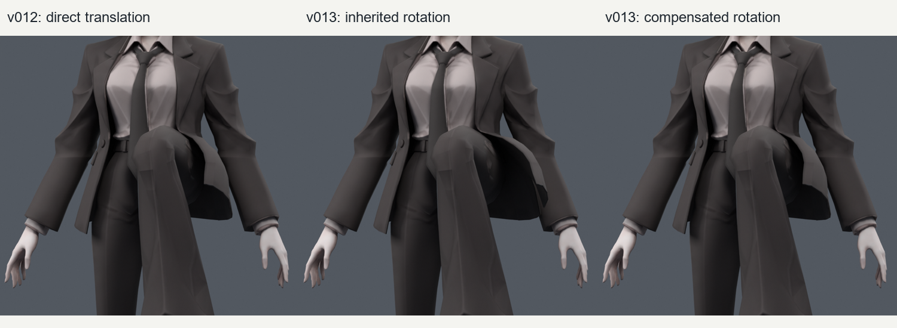
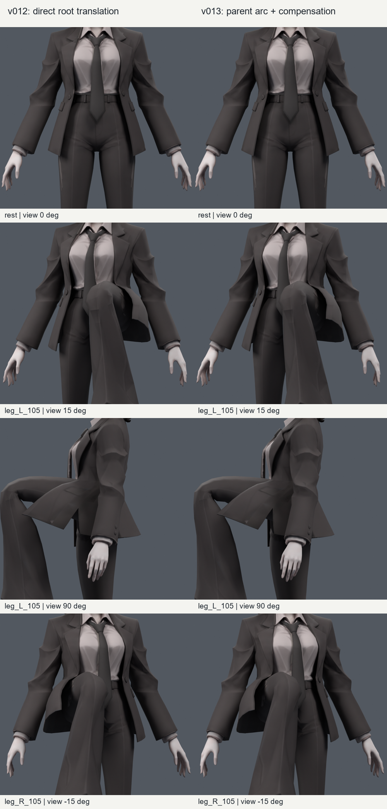
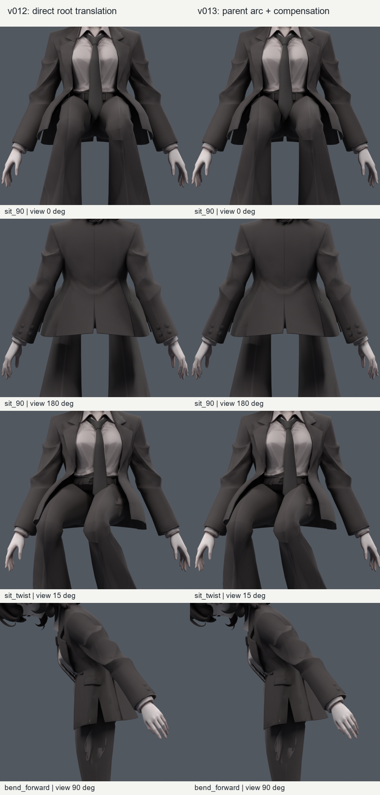

> **기록 시점 안내:** 아래는 해당 단계 당시의 보고서입니다. 후속 결정은 [최신 상태](../../STATUS.md)를 기준으로 읽어주세요. 모델·원본 텍스처·검증 원시 데이터는 이 문서 공유본에 포함하지 않습니다.

# v013 — 부모 4개 추가 사본과 기존 자락 비교

2026-09-09. 사용자가 “새 부모 계층 추가 별도 파일로 한번 검토하면서 진행해봐. 기존꺼랑 비교도 해보고.”라고 승인하여 실행했다.

**부모 4개를 넣은 별도 사본을 만들었고, 자식 방향을 보정하는 방식이 기존 v012 외형을 가장 가깝게 유지했다.** 같은 32개 정적 자세와 254개 동작 표본에서 자락/바지 교차, 심한 압축·과신장이 늘어나지 않았다. 새 부모 구조는 후속 제어 시험의 우선 후보로 보존한다. 기존 v012를 덮어쓰거나 사용자 최종 채택으로 처리하지 않았다. 이번 단계는 부모 계층과 명시적 포즈 비교까지이며 Unity/VRChat 자동 구동 완료가 아니다.

## 실제 바뀐 부분

| 항목 | 기존 v012 | 별도 v013 |
|---|---|---|
| 전체 본 | 28개 | 32개 |
| 원래 몸 본 | 20개 | 위치·부모·행렬·변형 설정 정확히 동일 |
| 자락 변형 본 | 8개 | 같은 8개, 시작점·끝점 정확히 동일 |
| 추가 본 | 없음 | 앞/뒤 × 좌/우의 비변형 anchor 4개 |
| 계층 | hips → coat 01 → coat 02 | hips → anchor → coat 01 → coat 02 |
| 메시 | 34,597 raw 정점 / 17,625면 / 31,363삼각형 | 동일, 정점 이동·컷·리메시 없음 |
| 웨이트 | v012 분배 | 모든 정점 그룹 이름·순서·값 동일, 새 웨이트 없음 |
| UV·노멀·텍스처·재질·modifier·오브젝트 변환 | v012 데이터 | 보존 |

추가 이름은 `coat_anchor_front.L`, `.R`, `coat_anchor_back.L`, `.R`다. 앞 부모의 head는 기존 앞 01 head에서 Y +60mm, 뒤 부모는 뒤 01에서 Y −50mm에 둔다. tail은 각 기존 01 head다. 모델의 현재 약 1m 스케일에서의 수치이며 기본 의상의 폭·길이를 바꾼 값이 아니다. 원본 레퍼런스 `ref_char.png`를 실제로 열어 확인했고, 이번에는 채색이나 캐릭터 외형을 다시 제작하지 않았다.

Blender 편집 모드를 거치며 기존 자락 8본의 축 행렬은 재계산되었다. 최대 원소 차이는 **0.00002867**이며 비트 단위 동일하지 않다. 자락 head/tail과 원래 몸 20본은 정확히 같다. 이 차이는 숨기지 않고 별도로 평가했다. 새 부모를 중립으로 둔 동일 제어 시험에서 표면 최대 차이는 **0.001314mm**, 중립 표면 차이는 **0.000121mm**다. 파일 원시 정점 좌표 자체는 정확히 동일하다. `build_verification.json`과 `rest_comparison_diagnostic.json`에 원본/사본 값을 남겼다.

## 제어 방법을 어떻게 비교했는가

1. **v012 기준:** 깊은 다리 들기에서 앞자락 01의 포즈 위치를 바깥으로 최대 20mm 직접 옮긴다.
2. **부모 중립 대조군:** 새 4개 부모를 중립으로 둔 채 같은 기존 제어를 적용한다. 계층 추가 자체가 변형을 망가뜨렸는지 분리하는 검사다.
3. **부모 호 회전 + 자식 방향 보정:** 60mm 부모 구간을 최대 약 19.47도 회전해 01 뿌리를 바깥으로 20mm 움직인다. 자식 01의 방향은 기존 결과에 맞게 역보정해, 부모 회전이 판 전체를 추가로 비틀지 않게 한다. **01의 location 채널은 모든 검사 표본에서 0**이다.
4. **회전을 그대로 상속하는 대조군:** 기존 자식 회전값을 새 부모 아래에 그대로 유지한다. 부모 회전이 추가로 상속되고, 비틀기에서는 기존 자식 추종과 겹칠 수 있는 단순 이식 대조군이다.

앞 뿌리는 직선 대신 호를 그리므로 20mm 바깥 이동 끝에서 약 **3.43mm의 Y방향 이동**도 생긴다. 이것을 정확히 같은 경로라고 표현하지 않는다. 메시 표면의 기존 대비 최대 차이는 보정 방식에서 **3.370mm**, 보정하지 않은 방식에서는 **50.334mm**였다. 보정 방식이 원래 자락의 벌어짐을 더 잘 보존했다. 단순 상속 방식도 이번 관통·면적 문턱은 통과했으므로 수치상 실패라고 부르지는 않는다.

앉은 비틀기에서 쓰던 spine 회전의 25% 추종도 부모 쪽으로 옮겼다. spine pivot을 중심으로 부모를 돌리기 때문에 **그 자세에서는 anchor의 위치 채널이 변한다**. 따라서 “전체 제어가 위치 이동 없이 순수 회전만으로 해결됐다”는 결론은 아니다. 깊은 다리 들기의 자식 01 직접 이동을 부모 회전으로 바꾼 시험이다. 자식 02의 기존 굽힘 제어도 계속 사용한다.

왼쪽은 기존 직선 이동, 가운데는 새 부모 회전을 그대로 상속한 상태, 오른쪽은 자식 방향 보정이다. 가운데의 자락 끝 방향이 더 돌아간다. 오른쪽은 기존 실루엣에 가깝다. 세 이미지는 같은 몸 자세·카메라·재질·조명으로 렌더했다.

## 수치 검증 결과

각 방법에 **32정적 + 254동작 = 286표본**, 총 4방법 × 286 = **1,144회 평가**를 수행했다. 동작은 v012와 동일한 좌우 0–105도 다리 들기/복귀, 0–90도 앉기/복귀, 앉은 비틀기 ±20도, 숙임/복귀다. 무작위 자유 동작이나 물리 시뮬레이션은 아니다.

| 검사 | 기존 v012 | 새 부모 + 방향 보정 |
|---|---:|---:|
| 254동작 중 자락/바지 교차쌍 최대 | 0 | 0 |
| 254동작 중 자락/소매 교차쌍 최대 | 0 | 0 |
| 254동작 중 원래 면적 20% 미만 삼각형 최대 | 0 | 0 |
| 254동작 중 원래 면적 3배 초과 삼각형 최대 | 0 | 0 |
| 32정적 중 자락/바지 교차쌍 최대 | 0 | 0 |
| 몸통 단독 비틀기 L/R 소매 교차쌍 | 3 / 3 | 3 / 3 |
| 옆기울임 L/R 소매 교차쌍 | 175 / 193 | 175 / 193 |
| 자락 영역 밖 평가 좌표 차이 | 기준 | 0 |
| 새로 면적이 거의 0이 된 삼각형 | 0 | 0 |

네 방법 모두 유한 좌표를 유지했고 위 정적 소매 예외는 같은 이름의 자세에 그대로 남았다. 교차쌍은 관통 깊이·면적이 아니다. 좁은 간격, 자락 자체의 접힘, 팔/몸·기타 부위의 모든 접촉을 이 숫자가 검사하는 것도 아니다. 판처럼 보이는 일부 자락과 각진 무릎 등 기존 품질 문제는 렌더에서도 남아 있다. **부모 추가만으로 더 부드러운 천이나 전체 관절 완성을 얻었다고 판단하지 않는다.**

검증 근거: `comparison_verification.json`(전체 표본), `comparison_summary.json`(요약), `build_verification.json`(원형/웨이트/본), `motion_reload.json`(저장 검수). `quick.json`은 최초 정적 선행 검사다.

## 실제 이미지 비교

왼쪽 v012, 오른쪽 v013 보정 방식. 중립과 깊은 다리 들기의 앞·옆·좌우를 확인했다.

앉기 앞/뒤, 앉은 비틀기, 숙임에서도 큰 외형 차이가 없다. 따라서 이번 이득은 이미 괜찮았던 포즈의 외형을 유지하면서 뿌리 제어를 부모 계층으로 분리한 것이다.

## 파일별 용도

| 파일 | 용도 |
|---|---|
| bianca_COAT_4PARENT_TRIAL.blend (공유본 미포함: `bianca_COAT_4PARENT_TRIAL.blend`) | 새 부모 4개가 있는 중립 작업 사본. 원본 v012는 별도 보존 |
| bianca_COAT_4PARENT_MOTION_REVIEW.blend (공유본 미포함: `bianca_COAT_4PARENT_MOTION_REVIEW.blend`) | 1–254프레임의 보정 방식 동작 검수. `V013` 타임라인 표시 사용 |
| bianca_COAT_4PARENT_TRIAL.fbx (공유본 미포함: `bianca_COAT_4PARENT_TRIAL.fbx`) | 본 계층·정적 위치·웨이트 전달 시험. Unity 완성 패키지가 아님 |
| bianca_COAT_4PARENT_FBX_REIMPORT_REVIEW.blend (공유본 미포함: `bianca_COAT_4PARENT_FBX_REIMPORT_REVIEW.blend`) | FBX를 빈 Blender 장면에 다시 불러온 구조 검수본. 작업 기준으로 승격하지 않음 |

동작 파일은 저장 후 다시 열어 254프레임의 회전·위치·스케일 채널을 원래 계산값과 비교했고 최대 오차는 **0**이다. 중립 메시·UV·이미지·본 등의 fingerprint도 보존했다. 저장된 머리카락 MASK 설정은 원본과 같고, 위 진단 렌더에서만 일시적으로 해제했다. 파일별 SHA-256과 역할은 `DELIVERY.json`을 따른다.

FBX 내보내기는 부모가 누락되지 않도록 전체 본을 포함했고, leaf bone 추가와 애니메이션 내보내기·메시 modifier 적용은 껐다. 재가져오기 결과 **32본과 부모 관계 일치**, 34,597정점, 스킨 웨이트 최대 차이 **0**, 월드 정점 최대 차이 **0.000205mm**, 본 head 최대 차이 **0.000204mm**였다. Blender의 비변형 플래그는 FBX를 거치며 보존되지 않아 anchor도 `use_deform=true`가 되지만, 해당 본의 실제 스킨 웨이트는 계속 0이다. 본 tail의 표시 방향·길이와 복잡한 재질/텍스처 노드의 동등성, 포즈 애니메이션의 엔진 전달은 이번 FBX 검사의 합격 항목이 아니다.

## 남은 단계와 판단

**새 부모 + 자식 방향 보정**을 후속 자동 제어 실험의 기준으로 권장한다. 기존 28본 모델은 원형/비교 기준으로 계속 남긴다. 무보정 상속 방식은 원래 움직임에서 차이가 더 커 우선 후보로 쓰지 않는다.

다음은 PC Unity/VRChat에서 이 부모가 실제 몸 움직임을 어떻게 추종할지 구현하고, 자식 물리와 충돌하지 않는지 검증하는 단계다. Blender 검사 함수가 계산한 `asin`, 완만한 전환, 자식 방향 보정, 앉은 비틀기 분기는 Unity/VRChat에 자동 이식되지 않는다. 자유로운 동작에서 같은 결과를 내는지는 아직 증명하지 않았다. PhysBone·콜라이더·런타임 constraint/추종 설정을 이 파일에 완료했다고 주장하지 않는다.

이번에는 Unity를 실행하지 않았고 라이선스·지원 Editor/SDK 버전을 새로 판정하지 않았다. 이전 환경 메모를 현재 장애로 단정하지 않는다. Unity 단계에서는 환경부터 확인하고, 별도 사본에서 부모 추종/자식 물리의 적용 대상을 분리한 다음 모델 크기에 맞는 충돌체와 실제 Build & Test를 검토한다. 원래 20본 변경, 추가 부모 4개를 넘어서는 구조 확장, 메시 분리·재생성은 이번 승인에 포함하지 않는다.

이번 비교는 로컬 Blender 5.2.1 LTS 실행 결과이며 외부 문서·영상을 새로 열람한 연구 단계는 아니다. 설계 당시 근거는 [v012 추가 조사](../coat_v012/RESEARCH_NOTES.md), 승인된 시작 범위는 [부모 제어 제안](../coat_v012/NEXT_AUTOMOTION_SCOPE.md)을 참고한다.
