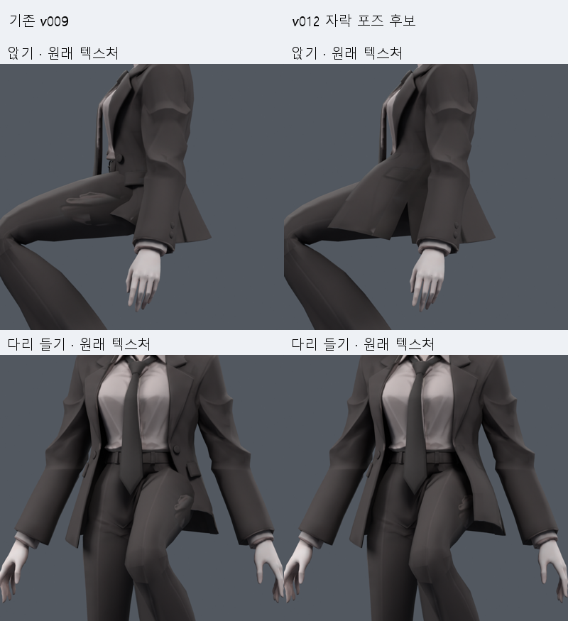
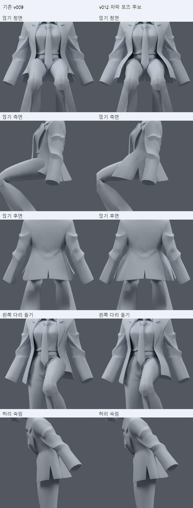
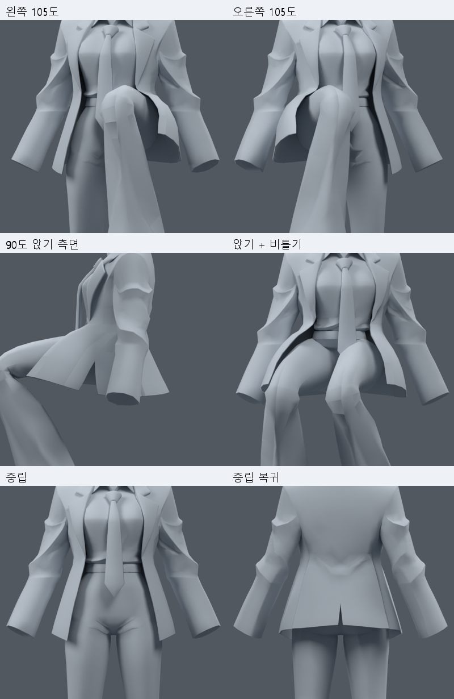

> **기록 시점 안내:** 아래는 해당 단계 당시의 보고서입니다. 후속 결정은 [최신 상태](../../STATUS.md)를 기준으로 읽어주세요. 모델·원본 텍스처·검증 원시 데이터는 이 문서 공유본에 포함하지 않습니다.

# 자락 v012 — 검사한 동작에서 개선된 형상 후보

**결과:** v011에서 실패했던 자락의 앞판 들뜸·옆면 당김을 줄였다. 정적 32자세와 **254개 연속 동작 표본**을 검증했다. 연속 검사에 포함한 좌우 다리 들기(최대 105도), 양쪽 앉기(90도), 앉은 상태 비틀기, 숙임/복귀에서 측정한 자락/바지·자락/소매 표면 교차는 모두 0이었다. 심한 압축·과신장 기준도 모두 0이다. 실제 렌더에서도 개선을 확인했다.

이 파일은 **후속 자락 형상/웨이트의 우선 후보**다. 전체 아바타 완성이나 사용자의 외형 최종 승인이 아니다. 검사 동작은 수동 제어를 계산해 저장한 애니메이션이며 **PC VRChat에서 자동으로 다리를 피하는 구현은 아직 없다.** 기본 사본에는 원래 진단 동작이 있고, 이번 자락 움직임은 아래 전용 검수 파일에서 확인한다.

## 바로 확인할 파일

- 움직이는 검수 파일 (공유본 미포함: `bianca_COAT_V012_MOTION_REVIEW.blend`): 타임라인의 `V012` 표시를 따라 보거나 1–254프레임을 재생한다. 원래 메시/텍스처와 이번 자락 웨이트를 사용한다.
- 중립 리그·웨이트 후보 (공유본 미포함: `bianca_COAT_8BONE_WAIST_COVERAGE_TRIAL.blend`): 실제 형상 후보의 데이터 파일. 자락의 자동 추종은 설정되어 있지 않다.
- [동작 GIF](COAT_MOTION_PREVIEW.gif), [원래 텍스처 전후](COAT_COLOR_BEFORE_AFTER.png), [확대 비교](COAT_BEFORE_AFTER.png).
- [추가 조사와 적용 판단](RESEARCH_NOTES.md): 공식 문서/제작자 영상 링크, 실제 확인 수준, Blender와 PC VRChat의 차이.

## 실제 변경 범위

원래 v009의 **34,597 raw 정점 / 17,625면 / 31,363삼각형**을 유지했다. 정점 이동·컷·새 메시·리메시·메시 분리·텍스처/UV 수정은 없다. v010의 미채택 어깨/무릎이나 B 눈 정점 수정은 합치지 않았다.

v011에서 승인받아 추가한 8개 자락 본을 계속 사용한다. 총 28본이고 기존 몸 20개 본의 이름·부모·위치·행렬·deform 설정은 그대로다. **새 앞쪽 01 본 두 개의 뿌리만 z=.678→.705**로 옮겨 허리 가까운 앞자락에 회전 여유를 주었다. 뒤쪽과 02 본의 배치는 유지한다. 여기의 높이는 약 1m인 현재 모델 좌표 기준이다.

최종 웨이트 변경은 재킷 몸통 아래의 **1,193 raw 정점**이다. 소매/손/바지/얼굴은 변경하지 않았다. 같은 표면의 UV 분할 정점에는 같은 값을 적용했다. 최대 4개 deform 본으로 정규화했다. 변경 정점별 전후 값은 웨이트 변경 기록 (공유본 미포함: `high_weight_changes.json`), 원형 보존과 자세별 수치는 최종 검사 (공유본 미포함: `high_verification.json`)에 있다.

### 웨이트를 바꾼 이유와 방법

1. **둘레 방향:** 앞/뒤·좌/우를 동시에 곱하고 강한 네 값을 남기던 v011 방식을, 타원 각도상 인접한 두 체인을 혼합하는 방식으로 바꿨다. 뒤 중앙에 회전 차이가 몰리지 않게 했다.
2. **높이 방향:** 끝 본 혼합은 z=.550–.605에서 끝낸다. 그 위 허리 전환에는 두 뿌리 본과 기존 몸 영향만 있어 최대 4개를 유지한다. 강한 본을 잘라내는 처리가 필요하지 않다.
3. **상체 고정:** 기존 spine 웨이트를 그대로 두고 나머지 hips/다리 영향 몫만 자락 본으로 분배한다. 자락 본이 중립일 때 상체의 원래 굽힘 반응을 유지한다.
4. **앞과 옆 구분:** 앞 허리는 z=.655–.705, 옆/뒤는 z=.620–.690에서 전환한다. y=-.045–-.025의 부드러운 혼합으로 연결한다. 깊게 든 다리는 앞 허리에 닿았고, 소매 접촉은 옆 허리 z≈.692에 남았기 때문에 같은 높이 마스크를 둘레 전체에 쓰지 않았다.

정점의 중립 위치를 바꾸어 여유를 만든 것이 아니라, **포즈에서 각 부위가 받는 영향**을 바꾼 것이다. 스키닝 설정·패킹 이미지·재질/할당·코너 노멀·modifier·오브젝트 행렬은 원본과 일치한다.

### 검사 동작을 만든 방법

기본 조합은 앞 체인의 바깥 방향 15도와 앞 방향 30도 회전이다. 자식 본에는 반대 방향의 작은 곡률을 주고 뒤 체인은 과하게 벌리지 않는다. 다리 각도에 따라 강도를 연속적으로 조절한다. 90도 이상에서는 앞 뿌리의 포즈 위치가 바깥으로 증가하며 105도에서 최대 20mm다. 앉아서 비틀 때에는 새 자락 뿌리가 몸통 yaw의 25%를 따라가도록 포즈 위치/회전을 계산한다. 평상시 몸통 비틀기만으로 자락을 따로 움직이지 않는다.

**20mm는 깊은 자세의 본 포즈 이동이다. 기본 정점을 20mm 옮겼다는 뜻이 아니다.** 이 제어는 Blender 검사 함수에서 계산하여 키프레임으로 저장했다. 일반 추적 입력으로 구동되는 VRChat 기능이 아니고, Blender Driver를 FBX로 내보내면 그대로 작동한다고 가정하지 않는다. 실제 자동 추종에서는 특히 이 뿌리 이동을 어떻게 지원할지 별도 실증해야 한다.

## 검증 결과

| 자세 | v009 자락/바지 교차쌍 | v012 | v012 자락/소매 교차쌍 | 압축/과신장 삼각형 |
|---|---:|---:|---:|---:|
| 기본 앉기 | 101 | 0 | 0 | 0 / 0 |
| 왼쪽 다리 들기 | 43 | 0 | 0 | 0 / 0 |
| 오른쪽 다리 들기 | 42 | 0 | 0 | 0 / 0 |
| 왼쪽 90도 | 48 | 0 | 0 | 0 / 0 |
| 왼쪽 105도 | 70 | 0 | 0 | 0 / 0 |
| 오른쪽 105도 | 74 | 0 | 0 | 0 / 0 |
| 양쪽 90도 앉기 | 99 | 0 | 0 | 0 / 0 |
| 앉기 + 비틀기 | 101 | 0 | 0 | 0 / 0 |
| 앞으로 숙임 | 0 | 0 | 0 | 0 / 0 |
| 보행 자세 | 0 | 0 | 0 | 0 / 0 |

정적 검사는 기존/본 중립/제어 포즈를 각각 32개 비교했다. 연속 검사 (공유본 미포함: `high_motion_diagnostics.json`)는 3도 단위의 좌우 다리 올림/내림, 양쪽 앉기, 앉은 상태 좌우 비틀기, 허리 숙임/복귀를 포함한다. **254표본에서 자락/바지·자락/소매 교차, 중립 면적 20% 미만 압축, 3배 초과 과신장은 모두 0**이다. 저장한 검수 파일을 다시 열어 254프레임의 본 회전·위치 채널을 원래 계산값과 비교했고 최대 오차는 0이다. 재로드 기록 (공유본 미포함: `high_motion_reload.json`).

표면 교차쌍은 관통 깊이나 전체 충돌체 검사가 아니다. 이 검사로 모든 가능한 포즈, 자락 자체의 모든 접힘, 다른 사람이 잡는 동작, 실시간 물리 충돌을 보장하지 않는다. 동작별 올림/내림 구간을 이어 붙인 검수 타임라인이므로 구간 사이에는 시작 자세가 바뀌는 장면 전환이 있다. 구간 사이의 모든 중간 자세나 서브프레임을 검증한 제작용 모션은 아니다. 측정 부위 밖의 좌표는 같은 몸 자세의 v009와 동일하며, 중립 복귀도 원형을 유지한다. 원본 파일 SHA도 그대로다.

## 남아 있는 문제와 다음 진행

정적 검사에서 **몸만 비틀 때 소매 접촉 3쌍씩, 몸을 옆으로 기울일 때 175/193쌍**이 남았다. 이 값은 같은 자세의 v009와 동일하다. 기존 몸통/팔 리그의 접촉이며 이번 자락 수정으로 새로 생긴 오류는 아니다. 문제를 숨기거나 전체 관절이 정상이라고 정리하지 않는다. [옆기울임 실제 렌더](high_route_sidebend_L_180.png)를 남겼다.

현재 후보는 기본 앉기와 깊은 다리 들기의 자락을 후속 기준으로 검토할 수 있는 상태다. 다음 작업은 **PC에서 실제 몸 추종/충돌로 이 움직임을 구동하는 것**, 그리고 기존 팔·몸통 겹침과 무릎/겨드랑이의 남은 변형을 별도로 고치는 것이다. 이번 연속 애니메이션 성공을 VRChat 실행 성공으로 바꾸어 적지 않는다. 다음 자동 구동용 부모 제어 4개의 배치·범위는 [구체적인 후속 제안](NEXT_AUTOMOTION_SCOPE.md)에 기록했고 아직 추가하지 않았다. 현재 메시지를 그 구조 확장의 실행 완료나 무제한 재생성 허가로 해석하지 않는다.

## 비교용 후보 상태

일반 둘레 분배(`RING_WEIGHTS`), 낮은 허리 전환(`RING_LOW_WAIST`), 상체 보존(`BALANCED`)은 중간 비교용으로 보존한다. 최종 방향은 앞/옆 허리 전환을 분리한 `WAIST_COVERAGE`다. 탐색 JSON은 각 중간 단계의 결과라 최종 리그/포즈 함수와 그대로 같은 결과를 뜻하지 않는다. 최종 판단은 **`high_verification.json`, `high_motion_diagnostics.json`, `high_motion_reload.json`, 최종 렌더**를 따른다.

