> **기록 시점 안내:** 아래는 해당 단계 당시의 보고서입니다. 후속 결정은 [최신 상태](../../STATUS.md)를 기준으로 읽어주세요. 모델·원본 텍스처·검증 원시 데이터는 이 문서 공유본에 포함하지 않습니다.

# 텍스처·관절 보정을 합친 검수본

새 텍스처 v005, 겨드랑이·어깨와 골반·옷자락의 국소 웨이트, 각 무릎 한 줄 컷을 합쳤습니다. 기존 정점 위치와 본 위치를 유지했습니다.

통합 Blender 검수본 (공유본 미포함: `bianca_texture_weights_knee_finish_v006.blend`) · [상세 결과·남은 문제](REVIEW.md) · [공유용 Markdown 문서](../texture_v005/GALLERY.md) · 컷 없는 비교본 (공유본 미포함: `bianca_texture_and_weights_v006.blend`) · 최종 파일 검증 (공유본 미포함: `knee_cut_final_verification.json`)

## 팔 올리기

| 보정 전 | 보정 후 |
|---|---|
| 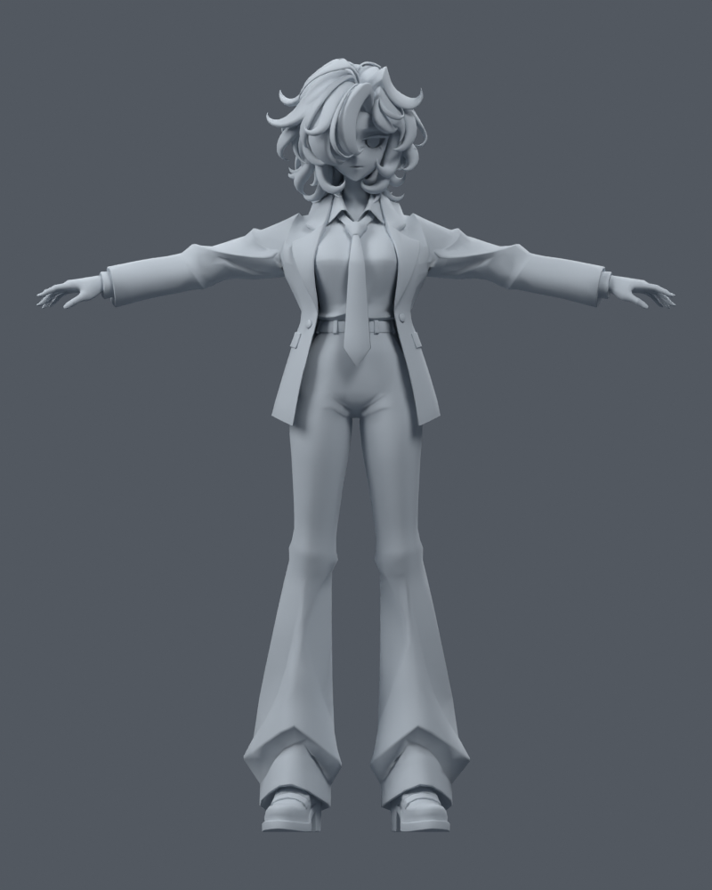 | 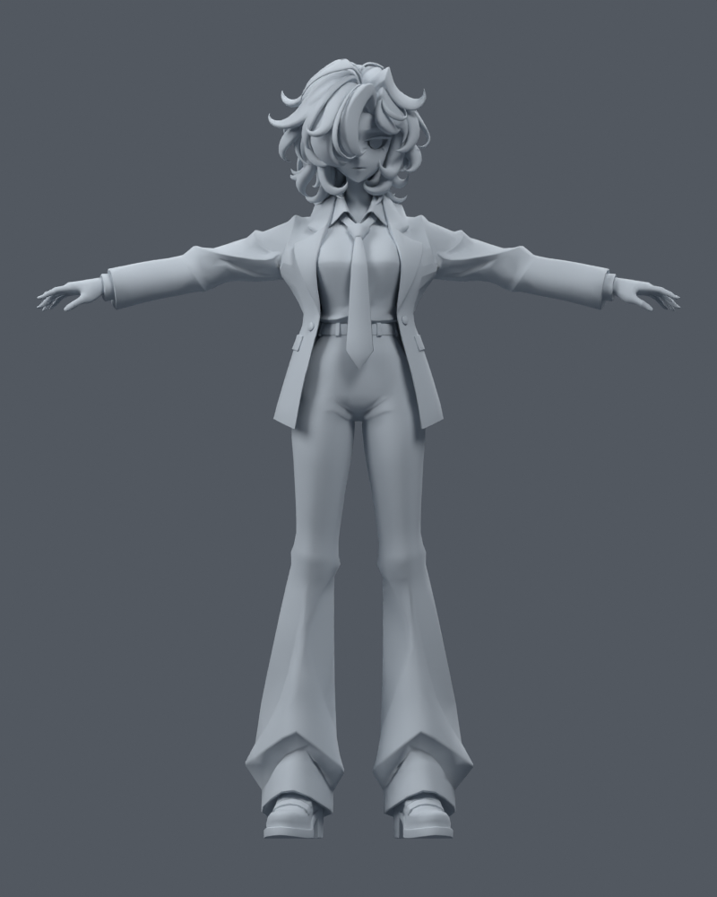 |

## 겨드랑이 확대

| 보정 전 | 보정 후 |
|---|---|
| 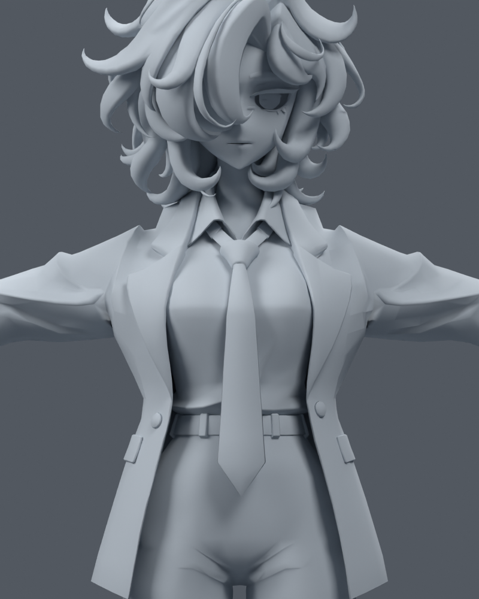 |  |

## 팔꿈치 90도

| 보정 전 | 보정 후 |
|---|---|
|  | 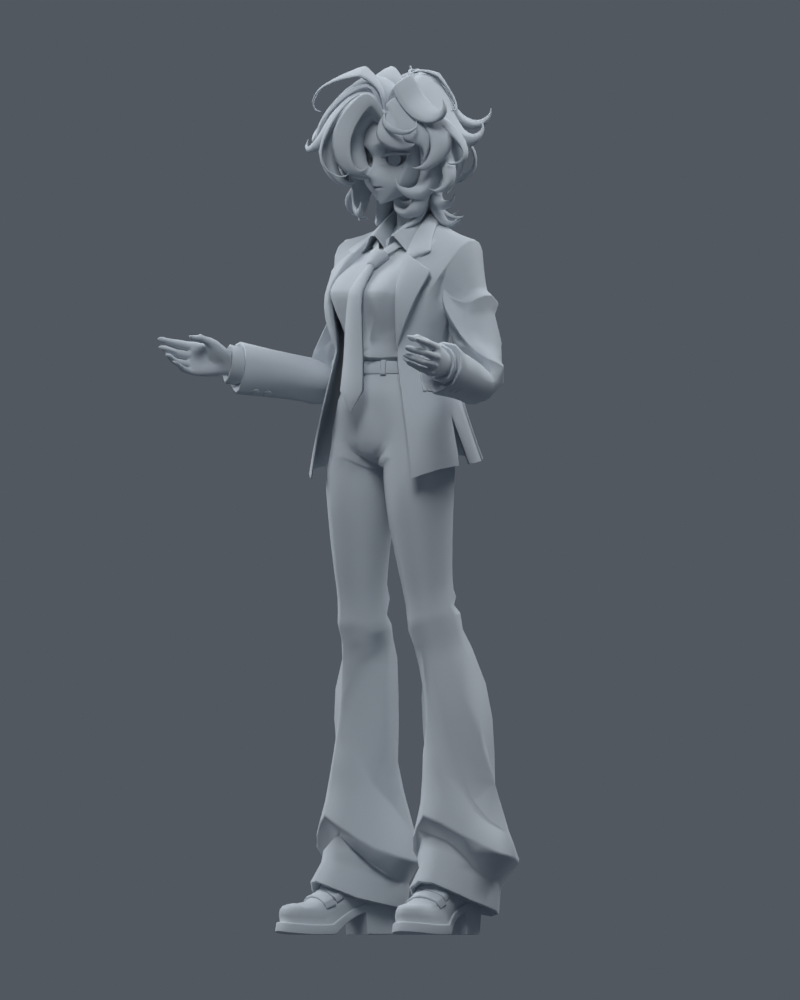 |

## 무릎 90도 측면

| 보정 전 | 보정 후 |
|---|---|
|  | 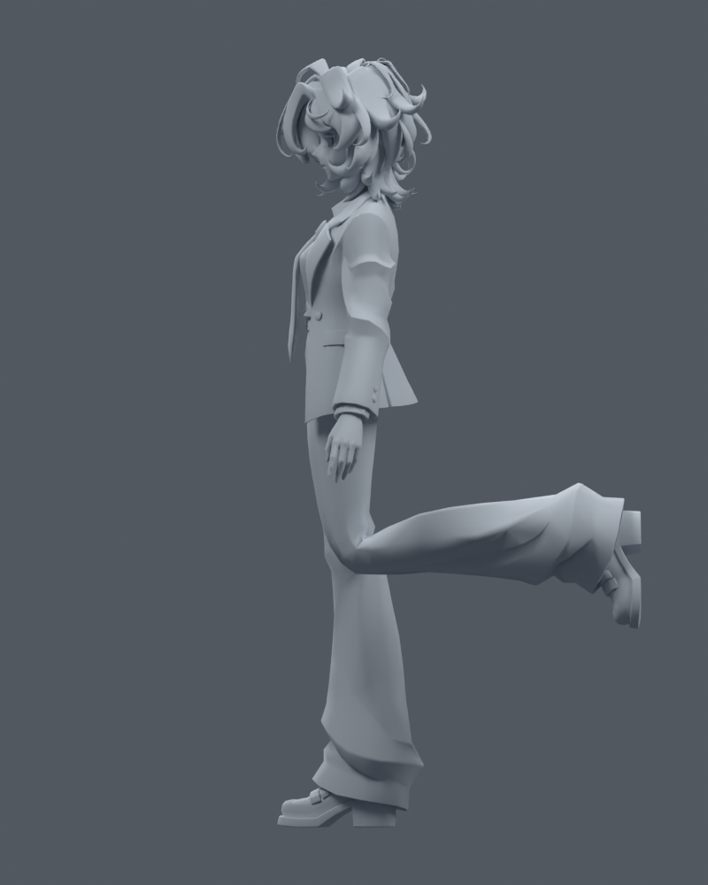 |

## 무릎 확대

| 보정 전 | 보정 후 |
|---|---|
| 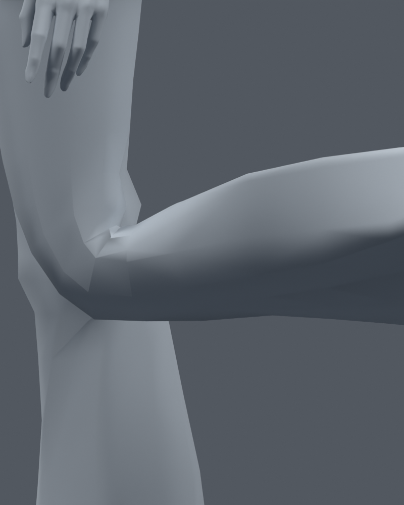 |  |

## 앉기 45도

| 보정 전 | 보정 후 |
|---|---|
|  | 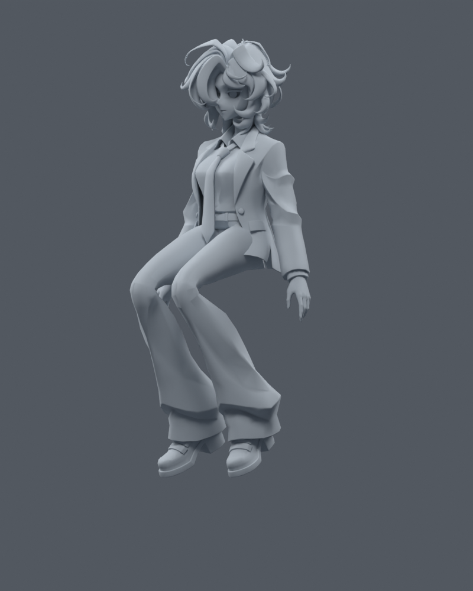 |

## 앉기 측면

| 보정 전 | 보정 후 |
|---|---|
|  | 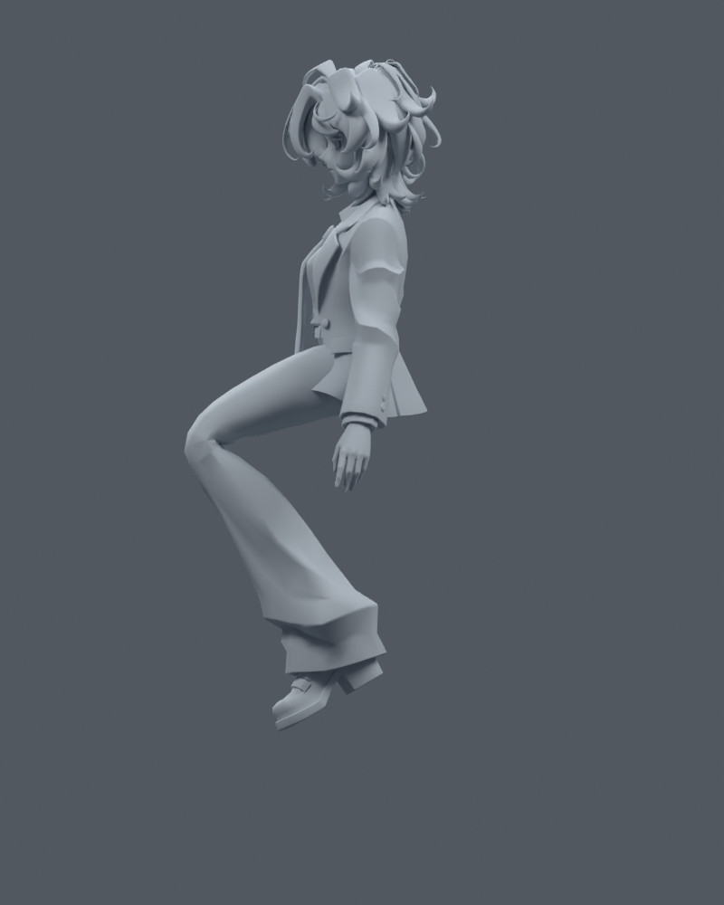 |

## 한쪽 다리 들기

| 보정 전 | 보정 후 |
|---|---|
| 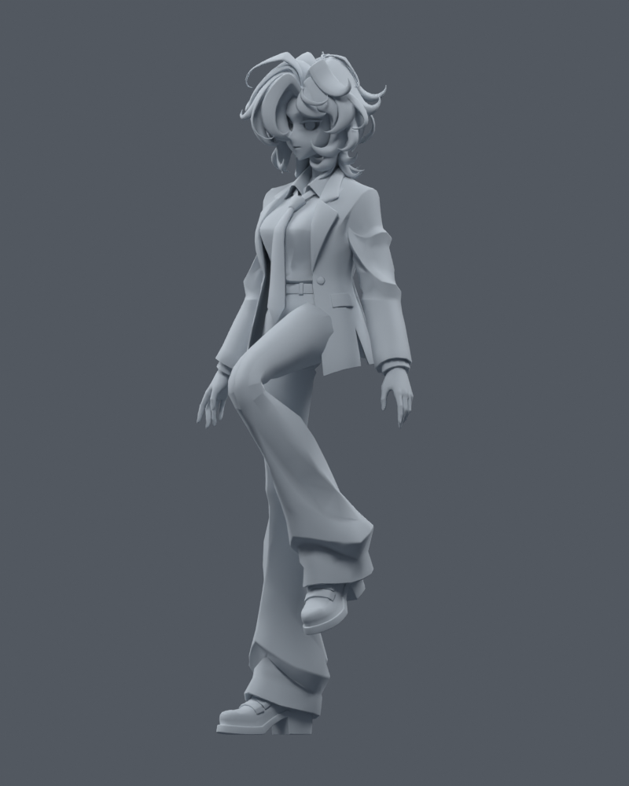 | 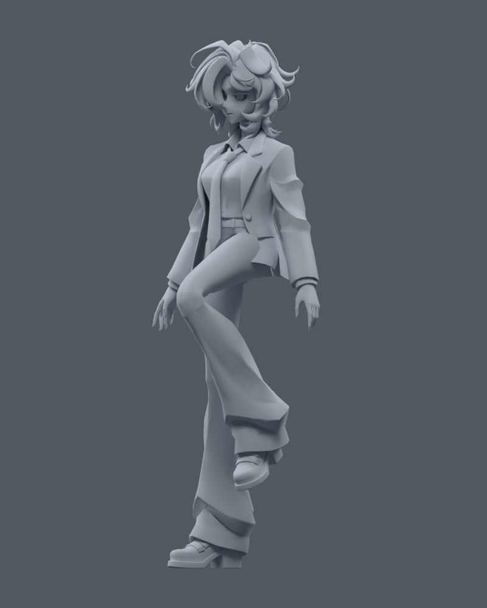 |

## 머리 회전 — 실제 채색

| 보정 전 | 보정 후 |
|---|---|
| 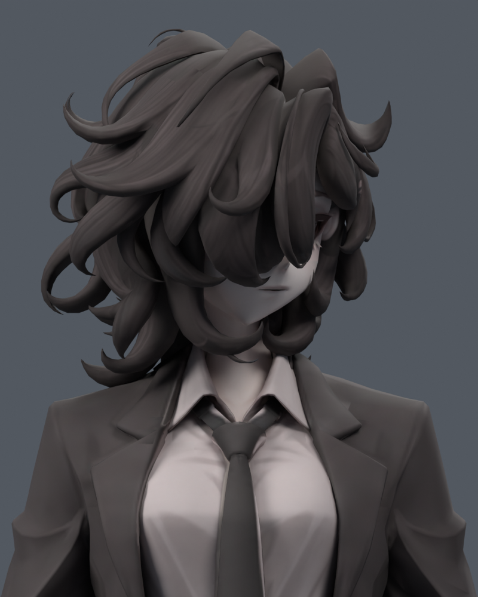 |  |
