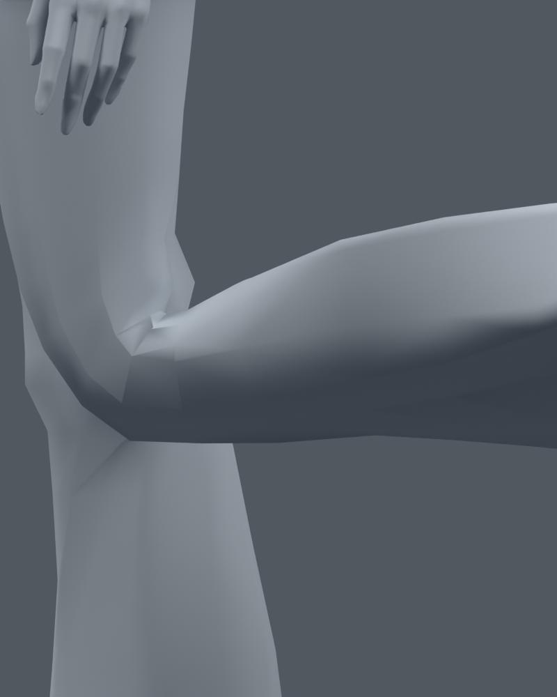
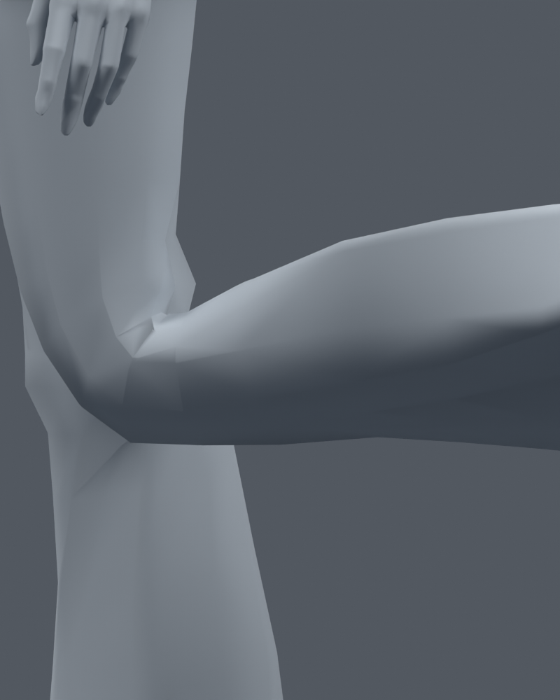
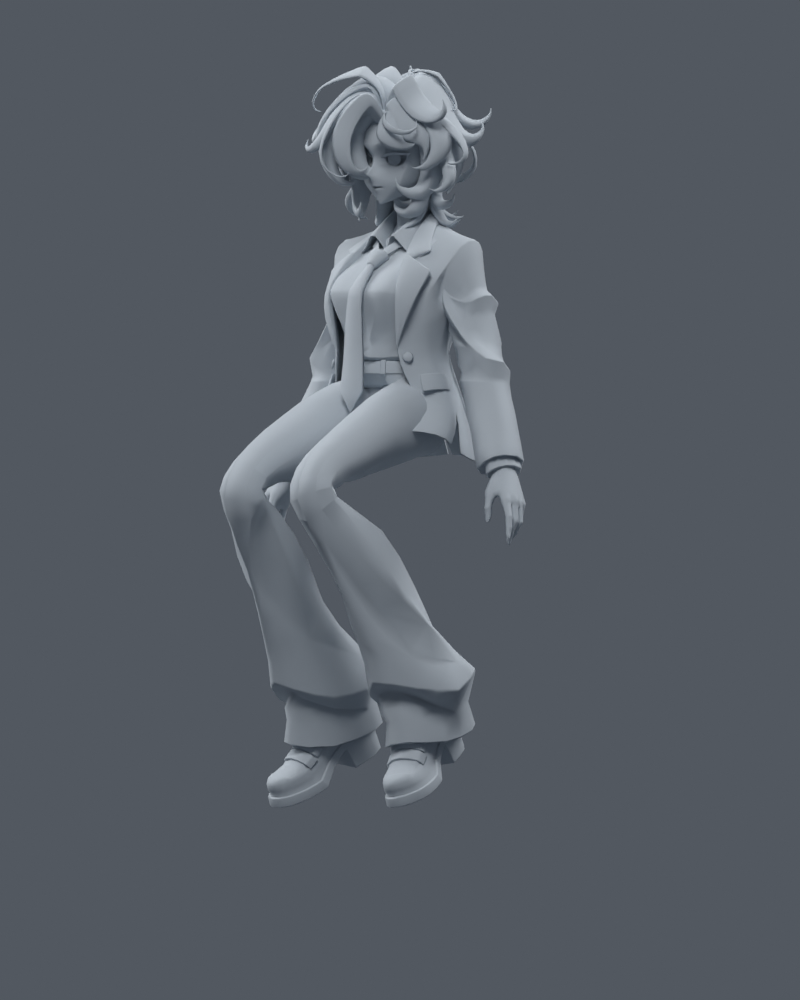

> **기록 시점 안내:** 아래는 해당 단계 당시의 보고서입니다. 후속 결정은 [최신 상태](../../STATUS.md)를 기준으로 읽어주세요. 모델·원본 텍스처·검증 원시 데이터는 이 문서 공유본에 포함하지 않습니다.

# 새 텍스처 + 국소 몸 웨이트·무릎 컷 검수본 v006

2026-09-09. 사용자가 승인한 1 텍스처 재작업 → 2 적용 검수 → 3 몸 관절 보정·검증의 결과다. **주 검수 파일은 bianca_texture_weights_knee_finish_v006.blend (공유본 미포함: `bianca_texture_weights_knee_finish_v006.blend`)** 이다. 새 텍스처 v005, 선택한 국소 웨이트와 각 무릎 한 줄 컷을 포함한다. 컷 없는 웨이트 비교본 (공유본 미포함: `bianca_texture_and_weights_v006.blend`)과 최초 컷 시험본도 보존했다. 파일별 식별 및 SHA는 DELIVERY.json (공유본 미포함: `DELIVERY.json`)에 기록했다.

[실제 모델 전후 갤러리](GALLERY.md) · [공유용 Markdown 문서](GALLERY.md) · [텍스처 전후 비교](../texture_v005/GALLERY.md) · 웨이트 단계 검증 (공유본 미포함: `final_verification.json`) · 컷 포함 최종 파일 검증 (공유본 미포함: `knee_cut_final_verification.json`)

## 적용한 보정

- 겨드랑이의 좁은 늘어남 구간과 어깨 위 압축 구간을 구분해 기존 가슴/상완 본의 웨이트를 국소 조절했다. 넓은 평활화 후보는 비교에서 제외했다.
- 골반의 바지 웨이트 전환을 조절해 앉기와 한쪽 다리 들기에서 급한 압축·늘어남을 줄였다.
- 소매와 옷 몸통을 연결 관계로 구분하고, 낮은 앞 옷자락에만 허벅지를 일부 따라가는 웨이트를 부여했다. 최종 강도 0.5, 위쪽 감쇠 종료 높이 0.68m(현재 약 1m 모델 기준).
- **743개 고유 위치 / 분할 포함 1,541정점의 웨이트**를 변경했다. 최대 4본, 합 정규화, 같은 위치의 정점 웨이트 일치 유지.
- 컷 없는 웨이트 단계는 **원래 정점 좌표·면 연결·UV·노멀·본 위치가 그대로**다. 컷 포함 주 검수본은 아래 국소 분할만 추가했다. v005 패킹 텍스처 이미지 바이트는 동일하며 B의 눈 정점 변경은 포함하지 않았다.

## 웨이트 단계 전후 수치 — 컷 전 동일 면 기준

면적 압축은 기본 자세 면적의 20% 미만, 심한 늘어남은 3배 초과를 뜻한다. 관통 수치는 지정한 옷자락/바지 표면 삼각형 쌍의 교차 개수이며 실제 관통 부위 개수나 깊이를 뜻하지 않는다.

| 시험 자세 | 심한 압축 면: 전 → 후 | 3배 초과 면: 전 → 후 | 옷자락/바지 교차 쌍: 전 → 후 |
|---|---:|---:|---:|
| 팔 올리기 | **4 → 0** | **2 → 0** | 0 → 0 |
| 팔꿈치 90도 | 0 → 0 | 0 → 0 | 0 → 0 |
| 무릎 90도 | 0 → 0 | 0 → 0 | 0 → 0 |
| 앉기(허벅지 70도/무릎 100도) | **6 → 2** | 0 → 0 | **97 → 85** |
| 한쪽 다리 들기 | **3 → 2** | **4 → 0** | **48 → 43** |
| 깊게 앉기(허벅지 90도/무릎 120도) | **4 → 2** | 0 → 0 | **101 → 99** |
| 무릎 120도 | 0 → 0 | 0 → 0 | 0 → 0 |
| 팔 더 높이 + 팔꿈치 120도 | **5 → 1** | **4 → 2** | 0 → 0 |

팔 올리기 최대 면적 배율은 약 3.015→2.965, 한쪽 다리 들기는 4.684→2.507이다. 개선된 일부 지표만으로 모든 자세가 완성됐다고 판단하지 않는다. 깊게 앉기에서 30% 미만 면은 15→17, 최대 면적 배율은 1.659→1.710으로 소폭 늘었으며 JSON에 함께 기록했다. 심한 압축·3배 초과 기준의 악화는 없지만 모든 개별 지표가 좋아진 것은 아니다.

## 추가 검증 때문에 제외한 후보

처음에는 기본 여섯 자세만 비교해 무릎의 넓은 웨이트 전환과 더 강한 옷자락 추종을 골랐다. 이 후보는 기본 앉기와 한쪽 다리에서 교차를 0까지 줄였지만, **추가 깊은 굽힘 검사에서 압축을 악화**시켰다. 따라서 채택하지 않았다.

`initial_six_pose_candidate_verification.json`은 이 초기 후보의 기록이다. 현재 `candidate_comparison.json`과 `final_verification.json`이 최종 웨이트 기준이다. 추가 네 자세를 후보 선택에 포함해 다시 비교했고, 최종에는 더 작은 옷자락 추종을 적용했다. 무릎의 웨이트 교체 후보도 깊은 굽힘에서 불리해 최종에는 원래 무릎 웨이트를 유지했다.

## 국소 무릎 컷 — 검증 후 주 파일에 포함

bianca_LOCAL_KNEE_CUT_TRIAL.blend (공유본 미포함: `bianca_LOCAL_KNEE_CUT_TRIAL.blend`)에 각 무릎 단면 컷을 한 줄씩 시험했다. 기존 형상 위에 소량 컷을 추가할 수 있다는 승인 범위이며 모델 재생성/리메시는 아니다.

- 현재 세계 좌표 Z=0.365m의 무릎 단면. 비평면 사각형의 원래 표면을 보존하기 위해 **단면과 교차하는 면만 원래 렌더 대각선으로 나눈 후 컷**을 넣었다.
- 분할 포함 정점 **68개**, 면 **70개**, 삼각형 환산 **98개** 추가. 결과 34,597정점 / 17,625면 / 31,363삼각형. 기존 정점 이동 0.
- 기존 정점 좌표·웨이트와 이미지·본 위치 보존, 새 UV 보간 최대 오차 약 6.14e-8. 원래 삼각형 표면 대비 해당 면 면적 합 오차 약 7.45e-6 이하.
- 컷 포함 주 파일의 기존 121프레임과 추가 4자세를 검사했다. 기존 정점의 포즈 좌표는 컷 없는 웨이트본과 정확히 동일했고 새 면의 퇴화는 없다.
- 컷이 지나간 원래 면 기준으로, 90도 무릎의 최소 면적 비율 0.402→0.418, 120도는 0.259→0.273, 120도의 최대 배율 1.659→1.480으로 **소폭 개선**됐다. 큰 각진 윤곽을 충분히 해결한 결과는 아니다.
- **주 검수본에 포함:** 기본 코너 노멀 최대 차이 약 0.000611, 포즈의 큰 노멀 차이는 바지(component 3)에 한정됐다. 전체 음영이 달라 보인다는 초기 인상을 실제 PNG로 다시 확인했다. 컷 전후 앉기 렌더의 전체 평균 차이는 0.0124/255, 머리 영역 최대 차이는 2/255이며 그 영역에 10/255를 넘는 픽셀은 없었다. 전역 음영 문제의 근거가 확인되지 않아, 보존·굽힘·시각 검증을 통과한 작은 컷을 별도 주 검수본에 포함했다. 컷 없는 비교본도 보존한다.

| 무릎 확대 — 웨이트 검수본 | 무릎 확대 — 컷 시험 |
|---|---|
|  |  |

| 앉기 — 웨이트 검수본 | 앉기 — 컷 시험 |
|---|---|
|  |  |

기록: `knee_cut_build_verification.json`, `knee_cut_final_verification.json`, `knee_cut_normal_comparison.json`, `render_region_comparison.json`. 픽셀 기록 중 팔 올리기의 고정 머리 크롭은 위 가슴도 포함하므로 순수 머리 영역 검사로 해석하지 않는다.

## 최종 저장본 검증

1. 컷 없는 웨이트본: v005와 정점·에지·면·UV·코너 노멀·본 구조/위치·오브젝트 변환·패킹 이미지 보존 확인. 변경 웨이트는 `weight_changes.json`과 정확히 일치한다.
2. 컷 포함 주 검수본: 34,597정점 / 17,625면 / 31,363삼각형. 원래 정점의 기본/포즈 좌표·웨이트, 이미지·본 위치 유지. 추가 정점은 원래 표면상에 있으며 새 UV 보간 최대 오차 약 6.14e-8이다.
3. 두 단계 모두 최대 4본, 웨이트 합 오차 1e-6 미만, 같은 위치 웨이트 일치. 기존 **1~121프레임 전체 + 독립적인 추가 4자세**에서 유효 좌표·정점 수·새 퇴화 면 없음 확인.
4. 웨이트 단계의 심한 압축/3배 초과 면 개수 악화 프레임은 0이며 추가 네 자세도 이 두 기준의 악화 없음. 국소 컷의 면적 비교는 분할 전 원래 면 영역 기준으로 별도 기록했다. 컷 뒤의 면 개수를 컷 전 개수와 직접 비교하지 않는다.
5. 주 파일의 `final_*.png` 9종을 별도 Blender 실행에서 렌더했다. `before_*`(v005), `after_*`(컷 없는 웨이트본), `cut_*`(최초 컷 시험) 비교도 보존했다. 갤러리의 보정 후 이미지는 주 파일 `final_*`다.

이 검증은 현재 몸 진단 리그와 Blender 결과에 대한 것이다. 모든 포즈의 미관이나 게임 엔진 동작까지 검증한 것은 아니다. 원본·텍스처 전용본·웨이트본·국소 컷 포함본을 모두 보존했다.

## 남는 작업과 다음 판단

**무릎의 각진 외곽과 일부 옷자락 관통은 남는다.** 원래 옷의 겹침 구조를 유지한 국소 웨이트만으로 완전히 해결하지 못했다. 옷자락을 크게 움직이거나 본/물리 구조를 추가하는 방향은 별도 범위를 정해야 한다. 이번 컷 시험을 근거로 자동 리메시나 형상 재설계를 진행하지 않는다.

사용자가 자고 일어난 뒤 주 검수본의 얼굴 인상·의상 색과 팔/앉기 동작을 확인할 수 있도록 제공한다. 이후에는 필요한 국소 관절 마무리 범위와 손가락/표정/립싱크, 헤어·넥타이 물리, 게임 엔진 적용이 남는다. 현재 20본 리그는 여전히 몸 검수용이며 최종 아바타 기능 완성을 뜻하지 않는다.
