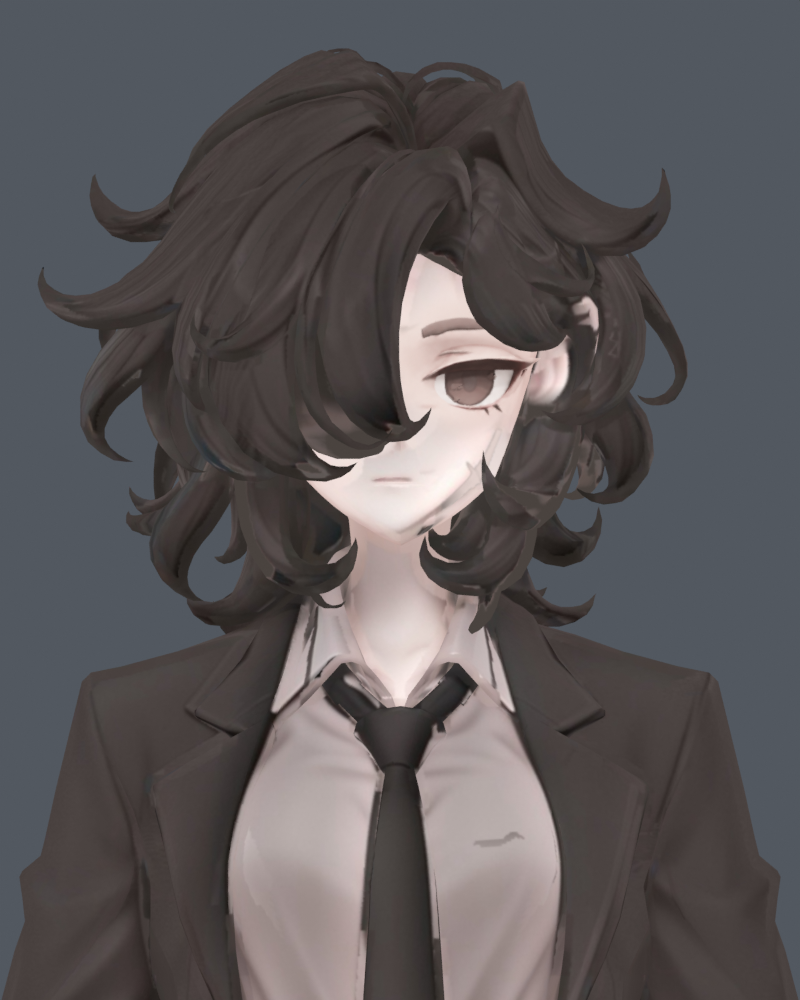
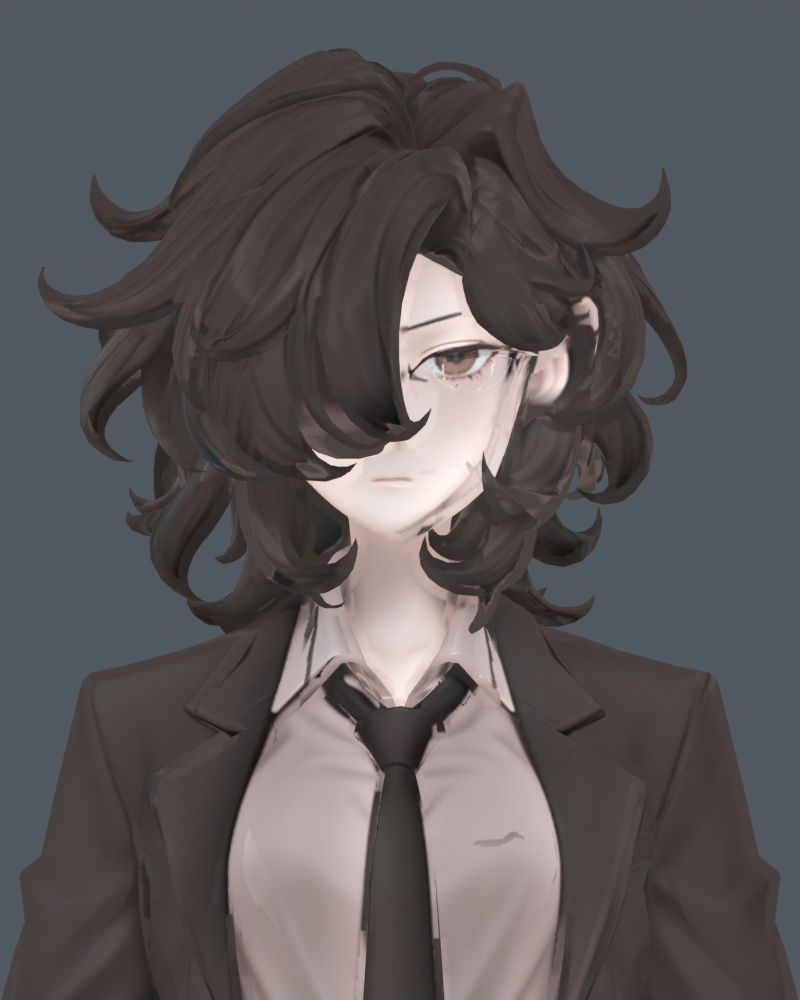
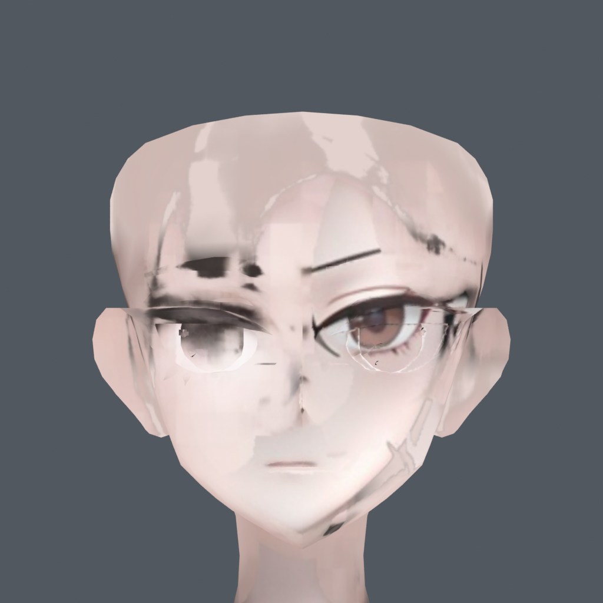
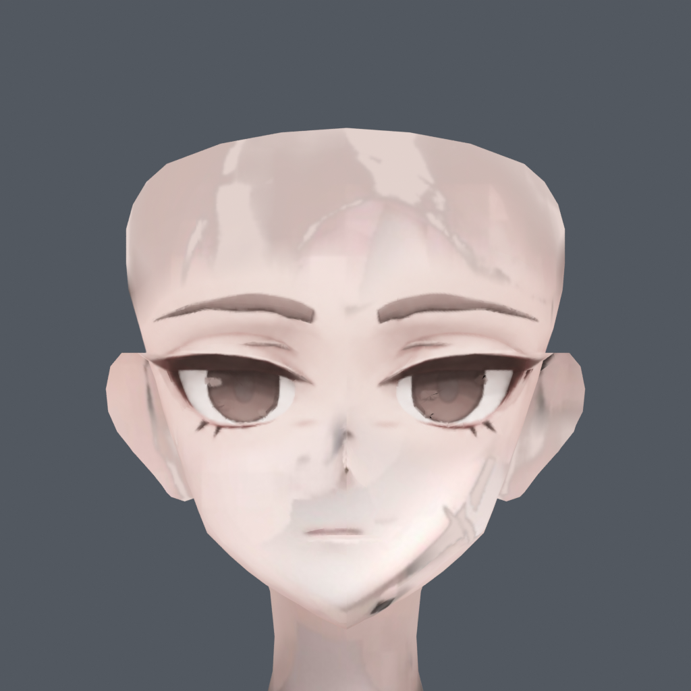
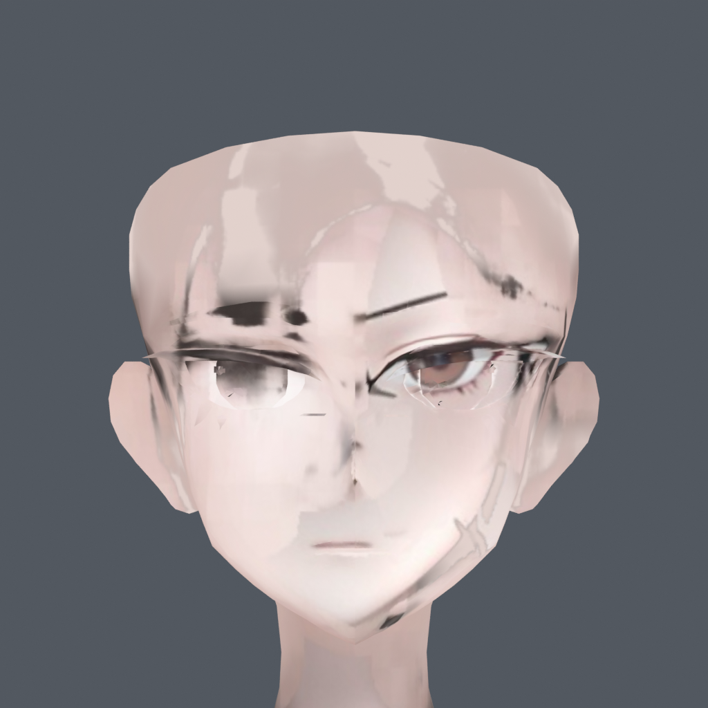
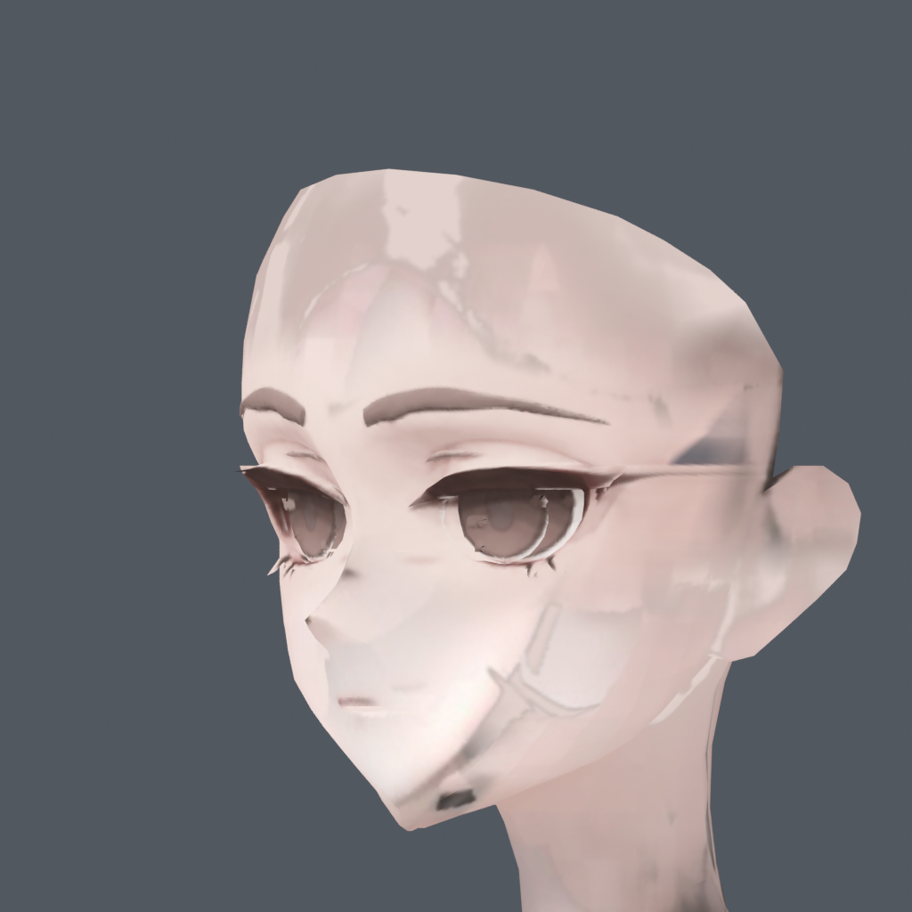
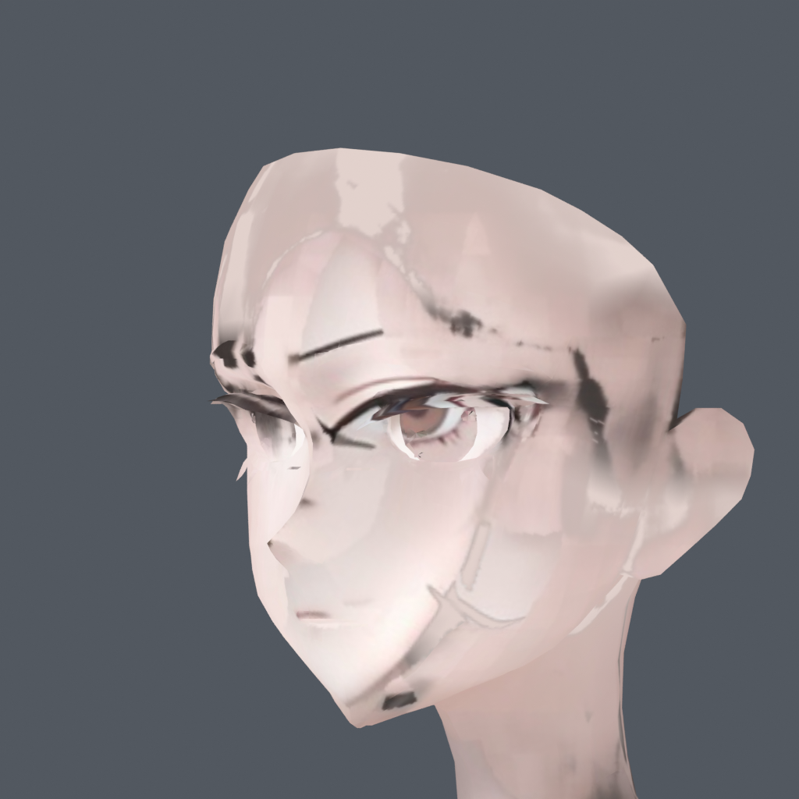
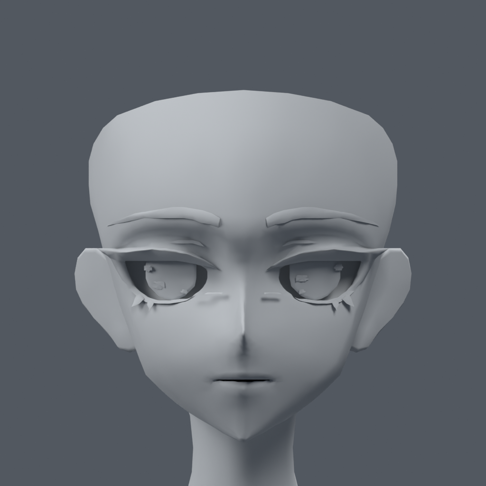
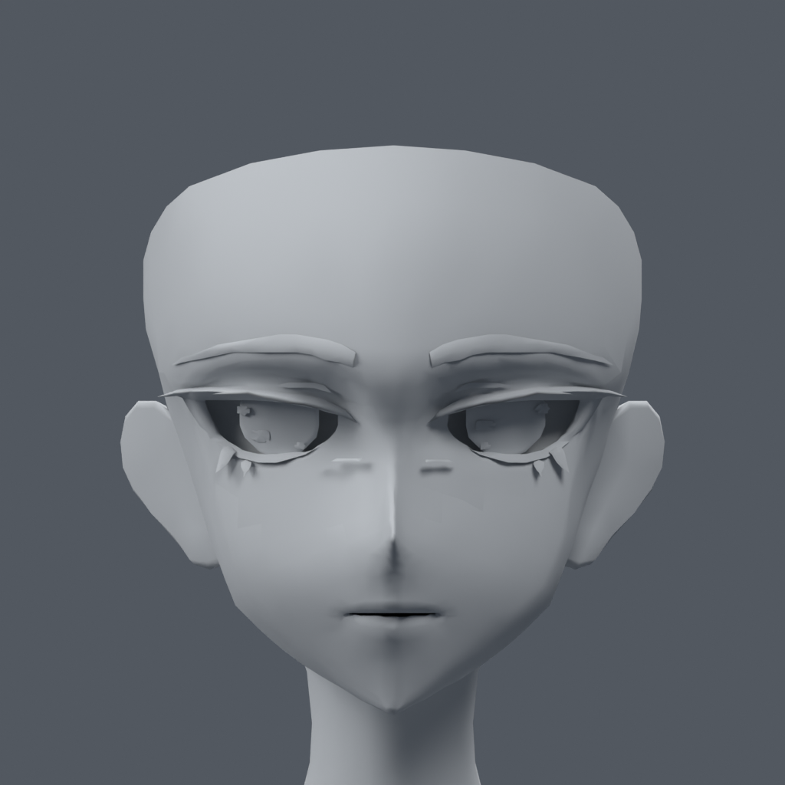

> **기록 시점 안내:** 아래는 해당 단계 당시의 보고서입니다. 후속 결정은 [최신 상태](../../STATUS.md)를 기준으로 읽어주세요. 모델·원본 텍스처·검증 원시 데이터는 이 문서 공유본에 포함하지 않습니다.

# 눈 정렬 A/B — 실제 모델 비교

**현재 판단: A를 권장합니다.** 모델을 그대로 두고 눈 주변 텍스처를 새로 맞춘 A가 중복 눈선과 색 어긋남을 더 잘 줄였습니다. B는 기존 이미지를 유지하며 눈 정점을 조절했지만 텍스처 자체의 오류가 남습니다. 두 안 모두 사용자 최종 채택 전입니다.

A Blender 파일 (공유본 미포함: `bianca_A_TEXTURE_TO_MODEL.blend`) · B 별도 정점 파일 (공유본 미포함: `bianca_B_MODEL_TO_TEXTURE.blend`) · [상세 결과·검증 문서](REVIEW.md) · [생성 프롬프트](IMAGE_PROMPT.md)

## 머리카락을 표시한 얼굴

| 기존 v002 | A: 새 텍스처 | B: 눈 정점 수정 |
|---|---|---|
|  |  |  |

## 눈 정면 — 검수용 머리카락 숨김

| 기존 v002 | A: 새 텍스처 | B: 눈 정점 수정 |
|---|---|---|
|  |  |  |

## 45도

| A | B |
|---|---|
|  |  |

A에도 측면의 얇은 흰 경계와 기존 돌출 조각은 남습니다. A의 눈매는 실제 모델 형상을 따르므로 기존 그림보다 낮게 열린 인상입니다.

## 형상 비교

| 기존 v002 | A: 원래 형상 그대로 | B: 국소 정점 조절 |
|---|---|---|
|  |  |  |

A의 원래 좌표·면 연결·UV는 정확히 보존됐습니다. B는 분할 정점 1,676개를 조절했고 최대 이동은 현재 모델 기준 약 5.983mm입니다. B의 원래 UV·텍스처·면 연결은 유지했습니다. A/B 모두 저장·재로드와 기존 121프레임 좌표 검증을 마쳤습니다.
