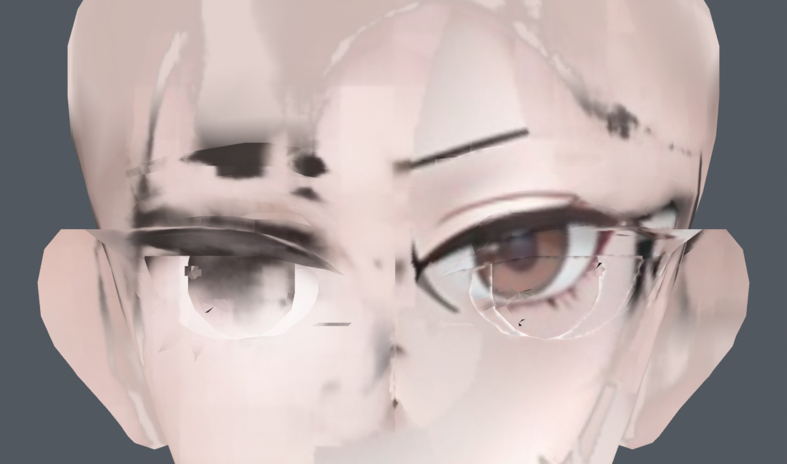
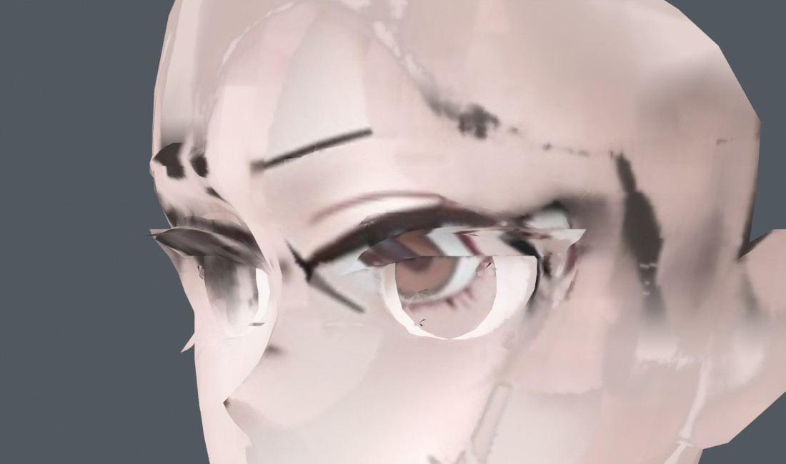
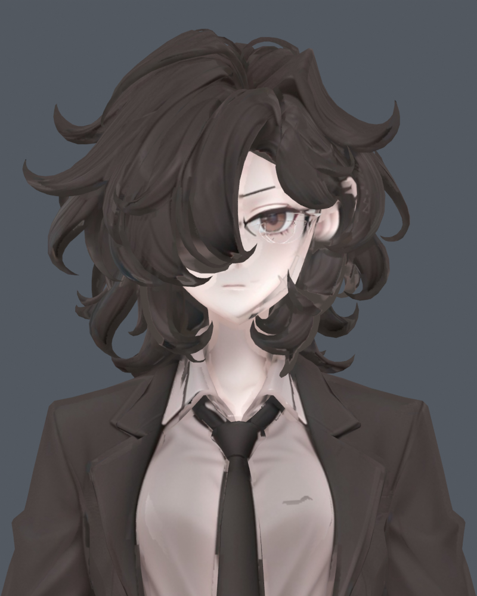

> **기록 시점 안내:** 아래는 해당 단계 당시의 보고서입니다. 후속 결정은 [최신 상태](../../STATUS.md)를 기준으로 읽어주세요. 모델·원본 텍스처·검증 원시 데이터는 이 문서 공유본에 포함하지 않습니다.

# 눈 국소 시험 — 원본과 별도 파일 비교

**두 시험 모두 미채택입니다.** 작은 정점/UV 조절로는 그려진 눈과 입체 눈 조각의 겹침이 충분히 해결되지 않아 기존 v002를 유지합니다.

별도 정점 시험본 (공유본 미포함: `bianca_eyes_v003_VERTEX_ONLY_TRIAL.blend`) · UV만 조절한 시험본 (공유본 미포함: `bianca_eyes_v003_UV_ONLY_TRIAL.blend`) · [범위·검증·남은 문제](REVIEW.md)

## 눈 정면 — 머리카락을 임시로 숨긴 검수

| 기존 v002 | UV만 조절 | 정점만 조절 |
|---|---|---|
|  |  |  |

정점 시험: 홍채와 작은 장식 5조각만 가로·세로 3% 확대, 0.4mm 아래로 이동. 최대 이동 0.657mm. 원래 UV, 눈꺼풀·눈꼬리·얼굴 외곽 유지. 새 정점·면·컷 없음.

## 45도

| 기존 v002 | 별도 정점 시험 |
|---|---|
|  |  |

## 머리카락을 표시한 모습

| 기존 v002 | 별도 정점 시험 |
|---|---|
|  |  |

두 파일의 121프레임 좌표 검사와 변경 범위 검증을 완료했습니다. 검증 통과가 눈의 미관 문제 해결을 뜻하지는 않습니다. 파일마다 별도 Blender 실행에서 렌더한 최종 비교 이미지입니다.
