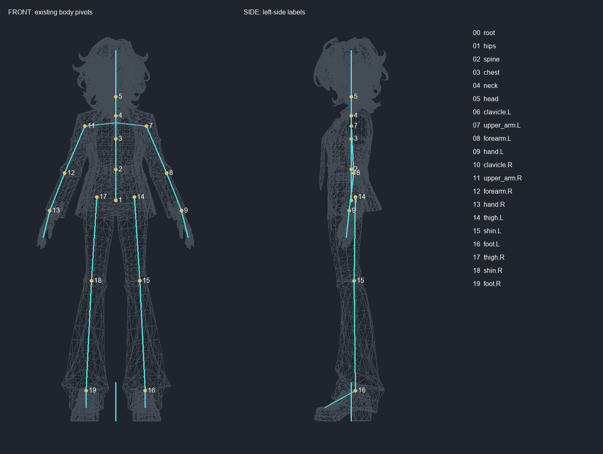
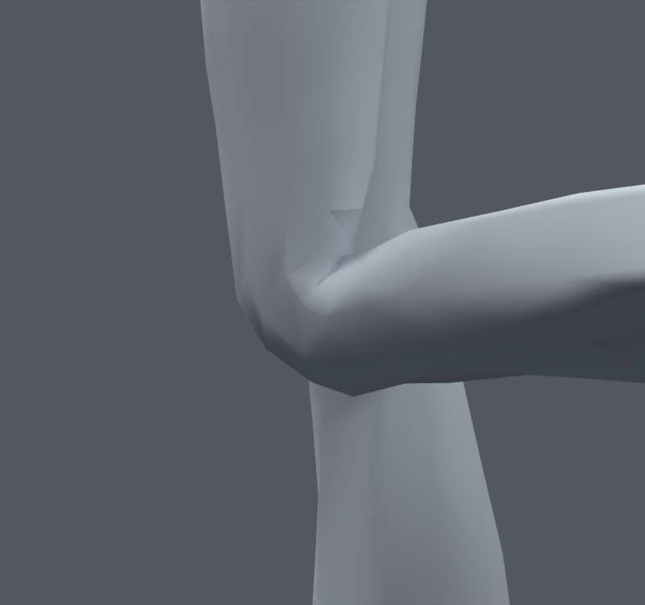
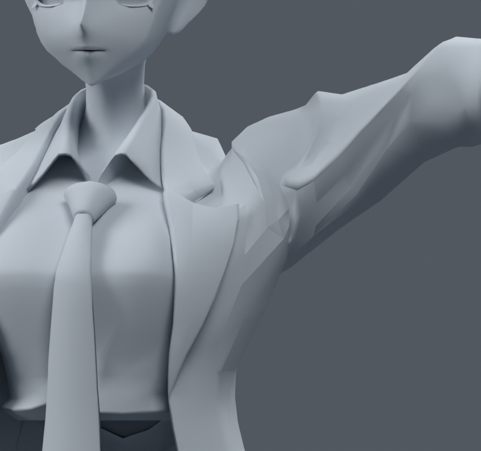

> **기록 시점 안내:** 아래는 해당 단계 당시의 보고서입니다. 후속 결정은 [최신 상태](../../STATUS.md)를 기준으로 읽어주세요. 모델·원본 텍스처·검증 원시 데이터는 이 문서 공유본에 포함하지 않습니다.

# v015 전신 진단과4보조 본 사본 비교

2026-09-09. 사용자가 전신 본 작업과 필요한 구조 변경을 승인했고, 새 메시 생성·부분 대체는 금지했다. 이 단계에서는 기존 메시를 전혀 수정하지 않았다. 전체 작업은 계속 진행 중이며 여기서는141자세 진단과 보조 본4개 비교만 마감한다.

## 전체 본 재검수

기준은 v014 무릎 후보3, 기존32본이다.141개 자세로 목/가슴/허리, 어깨/팔꿈치/손목/전완 비틀림, 고관절/무릎/발목과 기존 자락 자세를 검사했다. 손가락은 아직 본이 없으므로 이141자세에 손가락 굽힘은 포함하지 않는다. 설정한 각도는 모델 진단용 표본이며 해부학적 정상 범위 인증이 아니다.

기존 원래20본은 진단 단계의 위치에서 이어졌다. 배치를 보존한 사실을 배치가 최적이라는 증거로 해석하지 않았다. 가슴 숙임40도에서 셔츠 압축55면, 큰 고관절 굽힘과 발목에서 바지 변형, 높은 팔에서 겨드랑이 변형을 추가 확인했다. 이후 가슴/밑단 보정과 손가락 단계는 별도 기록이다.

## 보조 본 비교

무릎2개와 어깨2개의 보조 변형 본을 기존 부모 아래 형제 구조로 추가했다. 원래 몸 본을 대체하지 않는다. 각 본은 해당 굽힘 본의 로컬 회전을 절반 따라가는 Blender Copy Rotation Constraint를 사용했다. 본 길이는20mm다. 원래 메시/UV/노멀/텍스처/재질/변환을 유지했다.

|141자세 누적 지표|v014 기준|약한 보조|강한 보조|
|---|---:|---:|---:|
|재킷 압축/과신장|34 / 69|34 / 69|38 / 69|
|바지 압축/과신장|76 / 73|62 / 73|84 / 73|

약한 보조의 측정된 압축·과신장 개수가 증가한 자세는0이다. 강한 보조는 일부 어깨와 무릎 자세에서 악화되어 미채택이다. **약한 안은 후속 비교 기준**이며 관절 외형 완료가 아니다. 특히 큰 무릎 각짐과 겨드랑이 납작함이 여전히 보인다.

별도 파일은 bianca_SUPPORT4_WEIGHT_0_5_TRIAL.blend, 강한 비교는 bianca_SUPPORT4_WEIGHT_1_0_TRIAL.blend, 웨이트를 바꾸지 않은 구조 대조는 bianca_SUPPORT4_RIG_ONLY_TRIAL.blend다. 원래 본의 head/tail/부모는 정확히 유지, 기존 축 행렬 최대 원소 차이는 0이다. 중립 평가 표면 최대 차이는 7.37569863e-08m다. 웨이트 변경은 383 raw 정점, 원래 모델34,597정점·17,625면·31,363삼각형은 그대로다.254동작 표본도 추가 평가했고 원시 결과는 helper_preservation.json에 기록했다.

초기 구현에서 본 추가 후 컬렉션 순서가 바뀌는 것을 발견했다. 웨이트를 이름 기준으로 재매핑하고 대상 밖 웨이트 불변 검사로 수정했다. 잘못된 중간 데이터는 검증 결과나 채택본으로 쓰지 않는다. 초기와 수정 후 모두 중립 렌더만 보면 오류를 놓칠 수 있어 실제 포즈 검사가 필요했다.

Blender Constraint 시험은 Unity/VRChat 자동 변환을 보장하지 않는다. 사용자의 지시에 따라 Unity는 실행하지 않았고 본/웨이트 작업을 계속한다. 눈·표정, 손가락, 머리카락과 의상 흔들림은 이4개 보조 본으로 완료되는 기능이 아니다.

[참고 자료와 적용 범위](REFERENCES.md)
