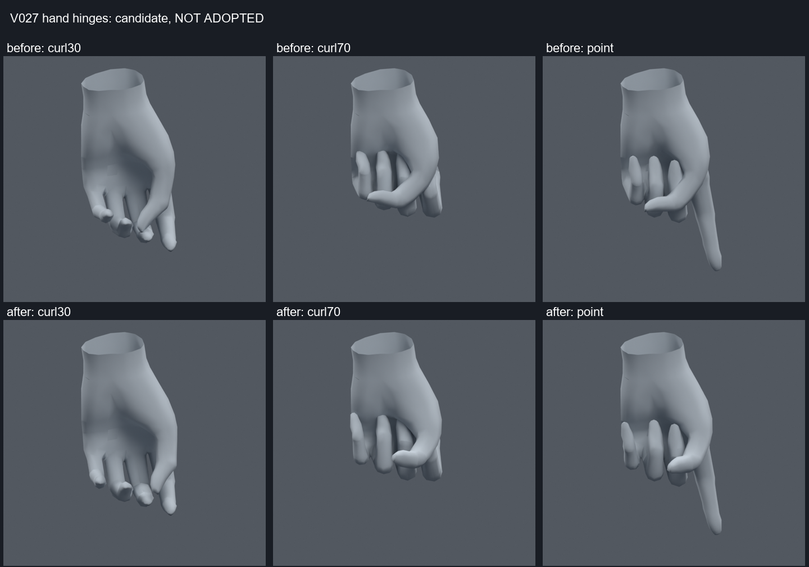

> **기록 시점 안내:** 아래는 해당 단계 당시의 보고서입니다. 후속 결정은 [최신 상태](../../STATUS.md)를 기준으로 읽어주세요. 모델·원본 텍스처·검증 원시 데이터는 이 문서 공유본에 포함하지 않습니다.

# 손가락 회전축·웨이트 비교 v027

2026-09-09. 손을 쥘 때 엄지와 다른 손가락이 겹치는 문제를 기존 본과 웨이트만으로 조사했다. **교차는 감소했지만 악화 자세가 남아 미채택 비교 후보로 보존한다. v030 몸 사본에 합치지 않았다.**

## 파일과 보존 범위

검수 사본은 `bianca_HAND_REVIEW_NOT_ADOPTED.blend`, 재생은 `bianca_HAND_MOTION_NOT_ADOPTED.blend`다. 원본 v025는 보존했다. 메시 좌표·면·에지·UV·노멀·텍스처·재질·modifier·변환과 본 head/tail을 유지했다. 새 메시·본·정점·컷은 없다. 94본, 최대4웨이트다.

양손 엄지3마디의 기존 본 roll을 손바닥에 맞는 굽힘 방향으로 정렬했다. 사용한 방향 벡터는 `(1, ±2, 0.4)`이며, 본의 길이 방향에 수직인 평면으로 투영해 local X 굽힘축을 얻었다. 양손 새끼손가락3마디는 좌우 부호를 반대로 10도 roll 보정했다. 엄지 굽힘 제어도 기존 고정 월드축에서 수정한 본의 local X로 맞췄다. **똑같은 입력 각도지만 회전 평면이 바뀌는 비교**이며, 각도를 줄여 교차를 숨긴 결과가 아니다.

새 축에서 생기는 국소 압축은 기존 12 raw 정점의 웨이트를 보정했다. 6개 고유 위치의 조정이며 이음새의 중복 정점을 함께 처리했다. 몸 웨이트는 바꾸지 않았다. 검수 사본은 검사 대상과 fingerprint/웨이트 동일함을 확인했다.

위 v025, 아래 v027이다. 엄지가 다른 손가락을 가로지르는 경로가 줄지만, 약지·새끼손가락 주변 겹침과 각진 관절 형상은 남는다. 회색 이미지의 손목 단면은 주변 소매를 숨긴 검수 표시다.

## 검사 결과

양손 각각 기존37자세+4제스처+보정에 포함한 연속값80자세+추가 연속값120자세, 합482자세를 실제 평가했다. 제스처는 point/victory/rock/thumbs_up이다. 추가120의 최초 검사는 별도 seed270912였지만 후속 roll 후보 선택에도 사용했으므로 최종 비교 전체를 블라인드 시험이라고 하지 않는다.

| 항목 | v025 | v027 비교 후보 |
|---|---:|---:|
| 새 교차가 있는 자세 | 242 /482 | 179 /482 |
| 삼각형 교차쌍·자세 누적 | 16580 | 7844 |
| 심한 압축/과신장 삼각형·자세 누적 | 1 | 0 |
| 손 밖 평가 좌표 차이 | 기준 | 0 |

v025 대비 교차가 늘어난 자세는 5개다: `L_continuous_61`, `L_continuous_79`, `L_fresh_71`, `L_fresh_114`, `R_continuous_17`. 이 중2개는 최초 추가 연속값 검사에서 발견됐다. 면적 이상0과 교차 없음은 다른 조건이다. BVH의 비인접 삼각형 교차에서 중립 자세 쌍을 제외했으며, 접촉 깊이나 충돌 물리의 품질 측정은 아니다.

32개 일반 손가락 roll 후보, 엄지 월드축48개 진단, 실제 엄지 hinge8개 후보를 비교했다. 이어 새끼손가락 roll0/5도와 엄지 각 마디 ±5도6개 후보도 조사했지만 회귀가 남았다. 단순 합계가 더 작아도 새 압축이나 다른 자세 악화가 생기는 후보는 통합하지 않았다. 실제 본 수정 전의 월드축 실험을 저장된 리그 개선으로 세지 않는다.

87프레임(기존82+악화5자세)의 저장/재로드 전체 정점 오차는0이다. 프레임 사이 보간·Unity Humanoid 제스처·VRChat은 미검증이다. 다음 작업은 남은 교차쌍을 엄지/약지/새끼의 표면 위치별로 나누고, 원래 모양을 유지하는 회전 중심과 국소 웨이트를 조정해야 한다.

근거 및 열람 범위는 [추가 참고](REFERENCES.md), 원시 기록은 `hand_audit.json`, `hinge_trials.json`, `thumb_roll_followup.json`, `motion_reload.json`이다.
