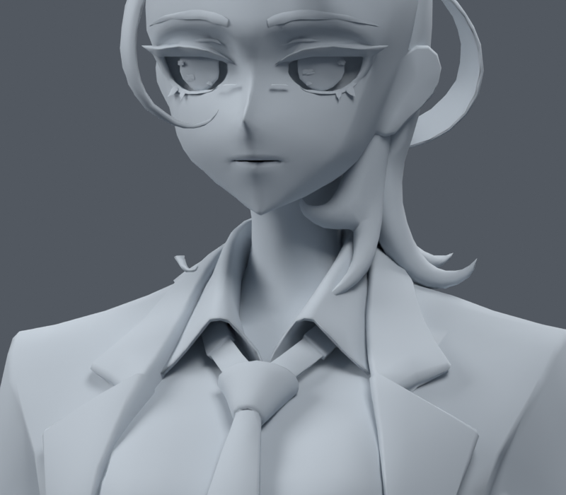
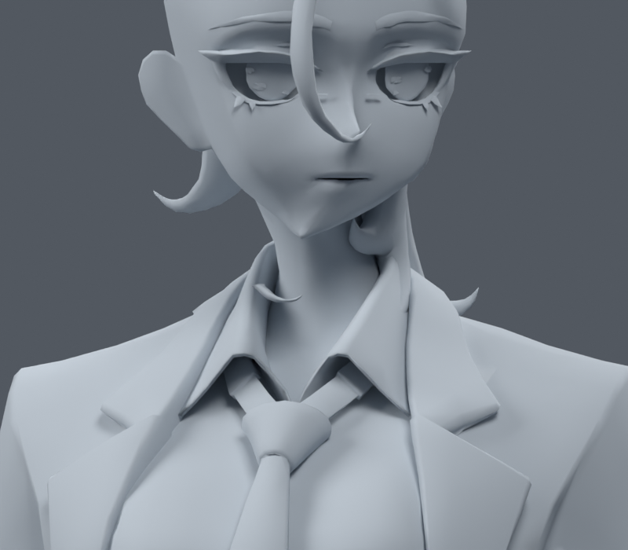
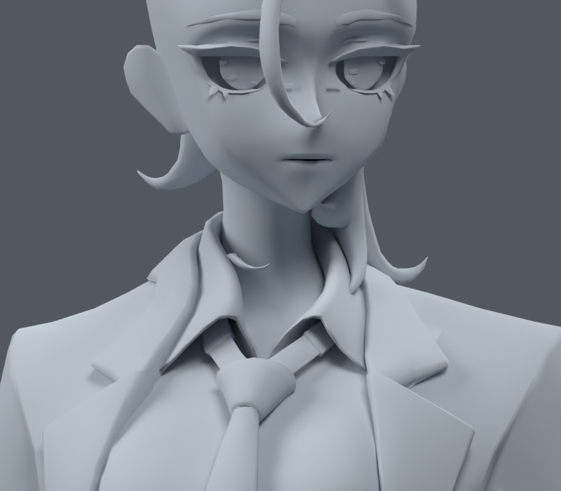
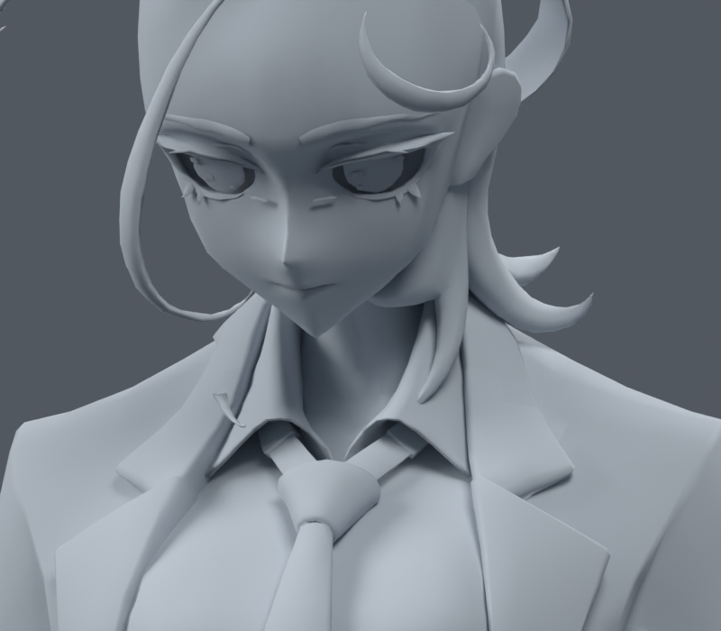

> **기록 시점 안내:** 아래는 해당 단계 당시의 보고서입니다. 후속 결정은 [최신 상태](../../STATUS.md)를 기준으로 읽어주세요. 모델·원본 텍스처·검증 원시 데이터는 이 문서 공유본에 포함하지 않습니다.

# v006 관절 재검수 — 사용자 피드백 반영

사용자가 무릎·겨드랑이·옷자락·목이 여전히 이상하다고 지적했다. **관절 마무리는 미완료이며 v006은 재수정 대상이다.** 이 기록은 원인 검수이며 수정 완료 보고가 아니다. v006 및 텍스처 파일은 변경하지 않았다.

## 확인한 문제

| 부위 | 실제 렌더에서 남은 문제 | 다음 수정에서 확인할 항목 |
|---|---|---|
| 무릎 | 안쪽이 급하게 접히고 바깥 윤곽도 각진다. 한 줄 컷의 개선으로 충분하지 않다. | 회전 중심과 앞/뒤 웨이트를 먼저 분리 평가. 필요한 경우에만 작은 국소 컷 또는 굽힘 보정. |
| 겨드랑이 | 팔 올리기에서 소매 아래가 납작해지고 어깨 윤곽이 급하게 꺾인다. | 쇄골·상완의 동작 배분과 몸통/소매 경계. 기존 검수 포즈는 쇄골을 움직이지 않고 상완만 회전시킨다. |
| 옷자락 | 허벅지와 겹치며 부분적으로 끌려 올라가 옷의 형태가 어색하다. | 피부와 별개의 옷 동작 필요 여부. 허벅지 웨이트 강화만으로 해결됐다고 판단하지 않는다. |
| 목 | 머리 회전 시 턱 아래와 목의 연결이 비틀리고, 숙임에서 목 밑과 칼라 연결이 부자연스럽다. | 턱/얼굴의 머리 추종과 목/가슴 연결 범위를 구분. 목 회전과 머리 회전을 각각 검사. |

현재 리그는 `test_restart_rig.py`에서 좌표를 추정해 만든 `DIAGNOSTIC_RIG_NOT_FINAL`이다. 얼굴/목 기본 웨이트는 높이만으로 가슴→목→머리를 전환한다. v006에서도 이 리그의 본 위치를 유지했고 목 웨이트를 별도로 손보지 않았다. 이 점은 재검토할 근거이며, 모든 현상의 단일 원인이 확정됐다는 뜻은 아니다. 웨이트·회전 중심·기존 면 구조의 영향을 각각 비교해야 한다.

앞선 121프레임 검사는 여섯 기본 시험 자세와 복귀 자세 사이의 보간 프레임을 포함한다. 121개의 독립적인 동작을 검증한 것이 아니다. 추가 4자세도 제한된 스트레스 검사다. 좌표 유효성·면적 비율·새 퇴화 면 없음은 데이터 보존 검사이며 자연스러운 관절의 합격 기준을 대신할 수 없다.

## 목 재검수 — 동일 카메라, 중립 재질, 주 헤어 성분 숨김

주 헤어 성분만 임시 투명 처리했고 다른 분리된 머리카락 조각은 남아 있다. 아래 렌더는 원본 모델을 저장하지 않는 읽기 전용 검사에서 만들었다.

| 기본 자세 | 머리 본 좌우 30도 |
|---|---|
|  |  |

| 목 본 좌우 30도 | 목 본 숙임 25도 |
|---|---|
|  |  |

[무릎 확대](../deformation_v006/final_knee_close.png) · [겨드랑이](../deformation_v006/final_armpit.png) · [앉기 측면](../deformation_v006/final_sit_side.png) · 본 위치·목 웨이트 기록 (공유본 미포함: `audit.json`)

## 다음 작업 기준

목 → 겨드랑이 → 무릎 → 옷자락 순서로 한 부위씩 별도 파일에서 비교한다. 각 부위는 기본 자세와 작은 각도·중간 각도·큰 각도의 앞/옆/사선 모습을 확인한다. 합격 기준은 턱 형태, 관절 부피, 자연스러운 접힘과 옷 겹침이다. 데이터 보존 검사도 유지한다.

모델 재생성·자동 리메시 금지는 유지한다. 임의의 큰 본 구조 변경, 옷자락의 넓은 형태 수정이나 면 재구성은 먼저 구체적인 범위와 예상 변화를 설명하고 사용자 의견을 받는다. 이 재검수에서는 메시·웨이트·본·텍스처를 저장 변경하지 않았다.
