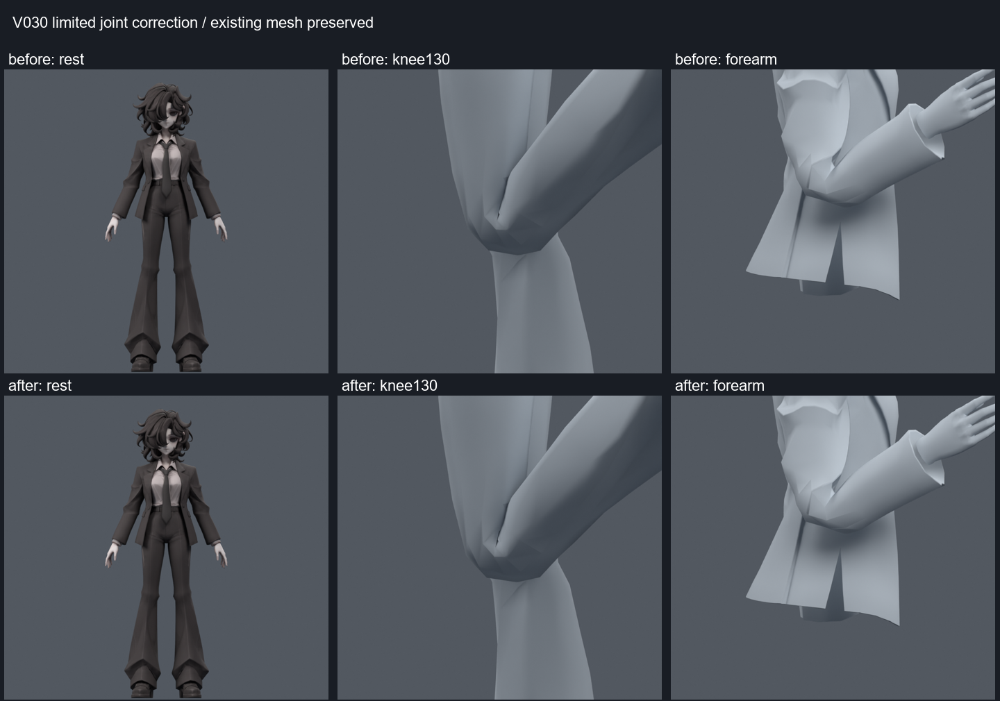

> **기록 시점 안내:** 아래는 해당 단계 당시의 보고서입니다. 후속 결정은 [최신 상태](../../STATUS.md)를 기준으로 읽어주세요. 모델·원본 텍스처·검증 원시 데이터는 이 문서 공유본에 포함하지 않습니다.

# 관절 후속 검수와 제한적 통합 v030

2026-09-09. **기존 무릎 보조 본2개를4mm 낮추고 오른쪽 전완 주변33정점 웨이트만 보정한 사본이다. 전체 관절 완료본은 아니다.** 손/고관절의 실패 후보는 별도 보존하고 이번 사본에 합치지 않았다.

## 바로 열 파일

- `bianca_LOCAL_JOINT_REVIEW.blend` — 이번 후속 몸 검수 사본. SHA256 `b69a9a5609c214ba0ce04c14ea38de7bb5589c8a4d61dcef502d9fe6a7197326`
- `bianca_LOCAL_JOINT_MOTION_REVIEW.blend` — 494개 진단 프레임, 타임라인 자세 이름 표시
- 손 비교는 `../hand_axis_v027/bianca_HAND_REVIEW_NOT_ADOPTED.blend`와87프레임 재생 사본. **미채택**이다.

v025와 v014 안전 기준을 보존했다. v026 코트 정점 수정, v027 손, v028 바지/왼쪽 전완 수정은 제외했다. 새 메시·정점·면·컷·본을 만들지 않았다.

## 변경과 보존

양쪽 knee_support의 head/tail을 동일하게 z -0.004m 이동했다. 주 무릎 본과 계층·절반 회전 제약은 유지했다. 오른쪽 재킷의 팔꿈치/전완 부위 33 raw 정점 웨이트만 채택했다. 본94개, 원래34,597정점·17,625면·31,363삼각형과 최대4웨이트를 유지했다.

좌표/에지/면/UV/노멀/그룹/재질/이미지/modifier/오브젝트 변환의 fingerprint는 v025와 정확히 같다. 정규화 오차 최대 1.04e-07, 중립 자세 전체 표면 차이 최대 0.00003353mm다. 변경 본은2개뿐이다. 저장된 파일을 다시 읽어 확인했다.

위 v025, 아래 v030. 원형과 큰 실루엣은 유지되며 관절 차이는 국소적이다. 소매/무릎의 날카로운 주름은 아직 남는다. 면적 임계값 통과가 시각적 완성을 뜻하지 않는다.

## 검증 결과

| 검사 | v025 | v030 |
|---|---:|---:|
| 전신1281표본: 면적 이상 자세 | 41 | 39 |
| 전신1281표본: 이상 삼각형·자세 누적 | 66 | 64 |
| 새 면적 악화 자세 | 기준 | 0 |
| 코트/바지·소매 교차 증가 자세 | 기준 | 0 /0 |
| 추가 무릎124표본: 이상 누적 | 5 | 0 |
| 494프레임 저장/재로드 전체 표면 차이 | — | 0.0m |

전신 검사는 기존897+추가 연속값384, 모든67표면 조각을 포함한다. 개선된 전완 자세는 `independent_003_1_R`, `fresh_147_1_R`다. 384개는 최초의 추가 시험 이후 후보 분리에 활용했으므로 최종 통합의 완전히 새로운 블라인드 시험이라고 하지 않는다. 1281과124는 중복을 포함하며, 면적 임계값은 원래 면적의20% 미만/3배 초과다. 교차 검사는 삼각형 접촉 수이고 침투 깊이/물리 안정성 보장은 아니다.

무릎 전용124자세는 통합 파일에서도 모든67조각과 코트 접촉을 추가 검사했다. 손 보정은 넣지 않았으며 기존 손74자세의 평가 표면 동등성을 확인했다. 저장494프레임의 모든 정점 좌표를 재평가했다. 정수 프레임 사이의 보간과 Unity/VRChat 실행은 미검증이다.

## 시도했지만 통합하지 않은 작업

- [v027 손가락](../hand_axis_v027/REVIEW.md):482자세에서 교차 자세242→179, 누적16580→7844, 면적 이상1→0. 그러나5개 자세의 교차가 늘어 미채택.87프레임 비교 파일을 남겼다.
- [v028 고관절](../rotation_followup_v028/REVIEW.md): 압축을 크게 줄였지만99자세에서 코트/바지 교차가 증가했다. 전체 바지 보정은 미채택. 오른쪽 전완만 분리해 이번1281검사를 다시 통과했다.
- [v029 무릎](../knee_pivot_v029/REVIEW.md):7개 회전 중심 비교 중4mm 낮춘 작은 보정만 통합. 외형 개선은 제한적이다.

## 남은 관절 작업

1. 손은 엄지·약지·새끼의 교차 위치와 각 마디 회전 경로를 분리해 고친다. 현재 축 후보를 곧바로 전체 파일의 기준으로 쓰지 않는다.
2. 고관절은 압축과 코트 간격을 함께 보정해야 한다. 기존1개 삼각형만 좋아지는 웨이트 최적화를 전체 해결로 삼지 않는다.
3. 무릎/겨드랑이/큰 상완 비틀림의 각진 접힘을 면 방향과 실제 표면 교차로 확인하고, 기존 메시의 소량 국소 편집 범위에서 처리한다. 넓은 형태 변경은 사용자의 별도 의견 대상이다.
4. 남아 있는 코트/소매 접촉, 목·옷깃 복합 자세, 손목/발목/허리 복합 동작을 계속 회귀 검사한다. 전신1281표본에39개 면적 실패 자세가 남는 현 상태를 전체 가동 합격으로 표현하지 않는다.
5. 눈/턱·깜박임·립싱크는 여전히 미완료다. PC Unity/VRChat은 이후 단계이며 PhysBone/콜라이더/바람/런타임 제약은 아직 실행하지 않았다.

추가 자료의 실제 열람 수준은 [손 관련 참고](../hand_axis_v027/REFERENCES.md)와 이전 [제작자 조사](../rotation_review_v025/RESEARCH_NOTES.md)에 기록했다. 상세 수치/보존/재생은 `SUMMARY.json`, `preservation.json`, `motion_reload.json`, `knee_verification.json`, `inherited_hand_equivalence.json`이다. 사용자 최종 외형 채택과 이번 검수 사본 저장을 구분한다.
