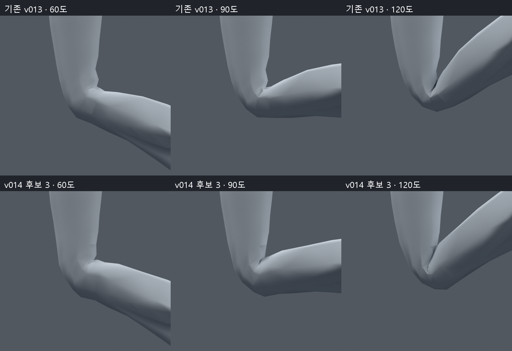
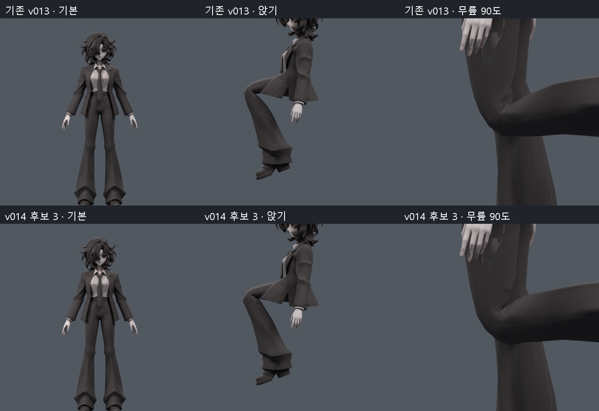
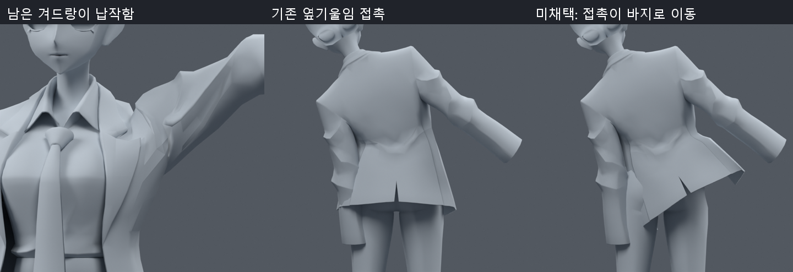
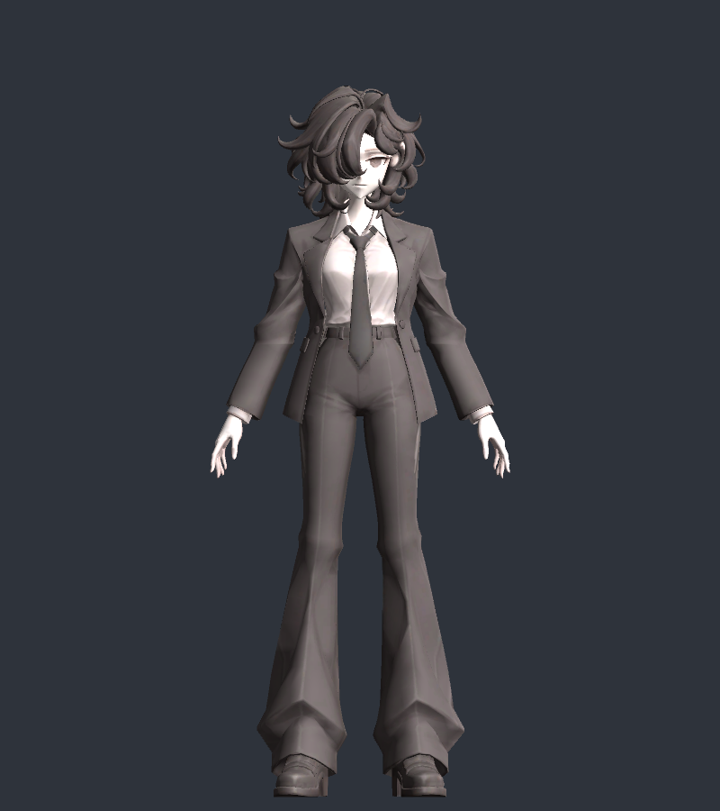

> **기록 시점 안내:** 아래는 해당 단계 당시의 보고서입니다. 후속 결정은 [최신 상태](../../STATUS.md)를 기준으로 읽어주세요. 모델·원본 텍스처·검증 원시 데이터는 이 문서 공유본에 포함하지 않습니다.

# v014 — 무릎 국소 웨이트 개선과 Unity 가져오기 검수

2026-09-09. 후속 우선 후보는 **bianca_KNEE_PROFILE_3_TRIAL.blend**다. 움직임 확인은 **bianca_KNEE_V014_MOTION_REVIEW.blend**, 프레임1–254의 V014 마커를 사용한다. 원래 v013을 보존한 별도 파일이며 전체 관절 완성이나 사용자 최종 채택은 아니다.

## 바꾼 것과 보존한 것

무릎 주변383 raw 정점의 기존 thigh/shin 웨이트만 재분배했다. 앞/뒤 전환 높이와 폭을 달리하고 높이 .305–.425m의 제한 영역에서 부드럽게 적용했다. 두 본 영향의 합과 나머지 본 웨이트를 유지했다. 후보별 저장 후 다시 읽어 실제 웨이트를 비교했다.

34,597정점·17,625면·31,363삼각형, 기존32본, 중립 좌표·UV·노멀·텍스처·재질·modifier·오브젝트 변환은 v013과 같다. 정점 이동, 추가 컷, 리메시, 재생성은 없다. 최대4본 영향과 정규화를 유지했고, 검사 포즈에서 무릎 대상 밖의 평가 좌표 차이는0이다.

## 후보 선택과 실제 검증

제한된1,801개 전환 프로파일을 탐색하고 세 후보를 별도 저장했다. 면적이 원래의20% 미만인 무릎 삼각형을 심한 압축 지표로 사용했다. 아래는 **각 표본의 개수를 더한 누적 수**이며 고유 결함 개수나 품질 점수가 아니다.

| 비교 | 기존 v013 | 후보1 | 후보2 | 후보3 |
|---|---:|---:|---:|---:|
| 48자세 압축 누적 | 66 | 33 | 20 | **16** |
| 기존보다 압축 개수가 늘어난 자세 | — | 6 | 1 | **0** |
| 254동작 표본 압축 누적 | 412 | 미실행 | 미실행 | **66** |

48자세는 양쪽 무릎15–120도 단독 굽힘16개와 기존 몸/자락 자세32개다. 후보3은254동작에서도 악화 표본0이며 무릎3배 초과 과신장0이다. 기존 자락 진단 결과를 유지했다. 저장된254프레임 동작을 다시 불러와 직접 평가한 표면과 비교한 최대 차이는0이다. 이 동작 파일은 검사 포즈를 저장한 것이며 자동 추종 구현은 아니다.

후보1/2는 일부 자세 악화와 렌더의 접힘/각짐 때문에 비교용으로만 남긴다. 후보3도 안쪽 눌림과 바깥 각진 실루엣이 남으므로 무릎 완료로 판정하지 않는다.

위쪽이 v013, 아래쪽이 후보3이다. 외곽 흐름과 무릎 뒤 접힘의 변화가 보이지만 현재 면 배치와 두 본 변형의 한계가 남는다. 같은 조명·카메라에서 비교했다.

기본 자세의 원래 외형을 유지하고, 앉기와90도 굽힘에서 변경을 확인했다. 텍스처를 이번에 다시 생성하거나 수정하지 않았다. 수치 근거는 knee_verification.json, knee_motion_verification.json, knee_profile_3_changes.json, motion_saved_verification.json이다.

## 자락·겨드랑이에서 실패한 시도

기존4개 자락 부모에 몸통 회전을 더 전달하는7단계와 앞/뒤 자락을 따로 여는36조합을 검사했다. 전체 추종1.5배는 옆기울임의 소매 교차175/193쌍을0/0으로 줄였지만, 바지 교차를194/204쌍 만들었다. 일부 비틀기 압축도 생겼다. 앞/뒤 벌림도 접촉을 충분히 없애지 못했다. 모두 미채택이며 후보3에 합치지 않았다.

왼쪽은 높은 팔 들기의 겨드랑이 납작함, 가운데는 기존 옆기울임, 오른쪽은 소매 접촉 대신 바지 관통이 생긴 미채택 시험이다. 교차쌍은 깊이나 관통 면적이 아니다. 원시 근거는 torso_follow_search.json, side_contact_avoidance_search.json, contact_locations.json이다.

## Unity에서 실행한 범위

기존 설치 **2022.3.62f2**의 독립 프로젝트에서 공식 SDK **3.10.5**를 사용해 실제 Editor 가져오기·렌더를 실행했다. Humanoid isValid/isHuman은 true, 몸 슬롯19개 누락0, 전체32본과 자락 부모4개, 최대4본 영향과 정규화를 확인했다. 과거 라이선스 실패는 현재 시작 장애가 아니다.

최종 FBX는 Blender의 원래31,363개 삼각형 구성을 명시했다. 초기 quad 전달에서는 Unity의 대각선 선택이 달랐지만 이 변경 후 삼각형 꼭짓점 비교 최대오차는0.001487mm, UV 꼭짓점 차이는0이었다. 본 좌표로 축 변환을 맞춰 비교했다. Unity는 속성 경계에서 정점을 분리하여34,609개로 읽었으며, 이를 원본 정점 추가로 오해하지 않는다. 상세는 unity_surface_verification.json이다. Blender 원본은17,625면 그대로 보존한다.

이 그림은 Standard 미리보기 재질과 검사 조명이다. 최종 셰이더/표정/립싱크/물리 설정과 VRChat 실행 합격은 아니다. 참조 T-pose는 Humanoid 정의에 설정했고 원본 메시 파일은 변경하지 않았다. 시점은 머리 높이의 임시값이며 실제 눈 정렬 검토가 남는다.

현재 지원 버전2022.3.22f1용 unity_v014 프로젝트와 재현 Editor 코드를 준비했다. 공식 설치 파일의 서명을 확인했지만 Windows 관리자 승인에서 기다리고 있어 **22f1 실행과 VRChat Build & Test는 미실행**이다. 지원되지 않는62f2 검사를 이를 대신한 합격으로 기록하지 않는다. PhysBone/콜라이더는 타입·필드를 확인한 준비 단계이며 실제 컴포넌트 구동을 구현하지 않았다.

## 다음에 필요한 범위

1. 지원 Unity 설치 승인 후 같은 가져오기 검사와 SDK 검사를 실행한다. 자락 추종·물리·충돌은 별도 실제 동작 검증이 필요하다.
2. 무릎/겨드랑이4개 보조 본은 [구체적인 사본 제안](NEXT_SCOPE.md)에 정리했다. 현재32본에는 추가하지 않았으며, 큰 구조 변경 전 의견을 묻기로 한 사용자 조건에 따라 답을 기다린다.
3. 소매/자락 접촉, 무릎의 큰 각짐, 겨드랑이, 손가락, 표정·립싱크와 전체 런타임은 여전히 미완료다. 현재 단계의 개선을 전체 아바타 완료로 확대하지 않는다.

[추가 조사와 공식 출처](RESEARCH_NOTES.md)에 이번에 열람한 범위와 적용 판단을 기록했다. 새 유튜브 영상을 시청한 것으로 표현하지 않는다.
