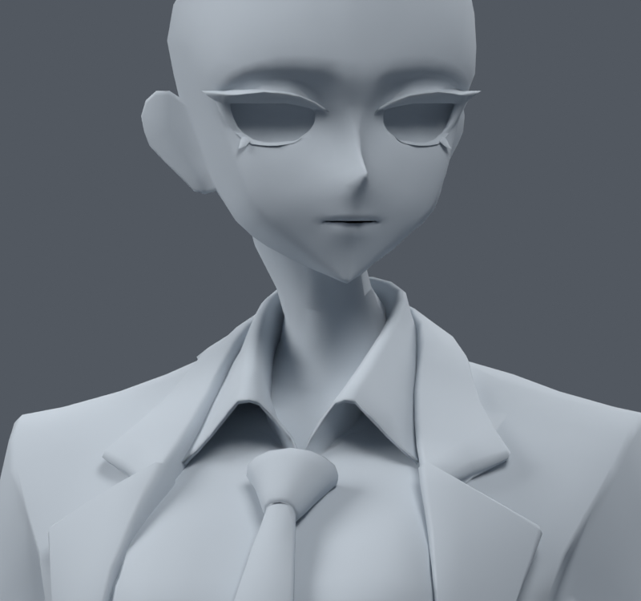
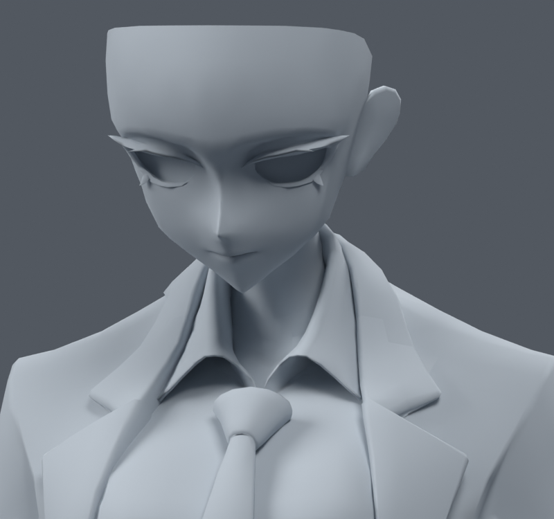
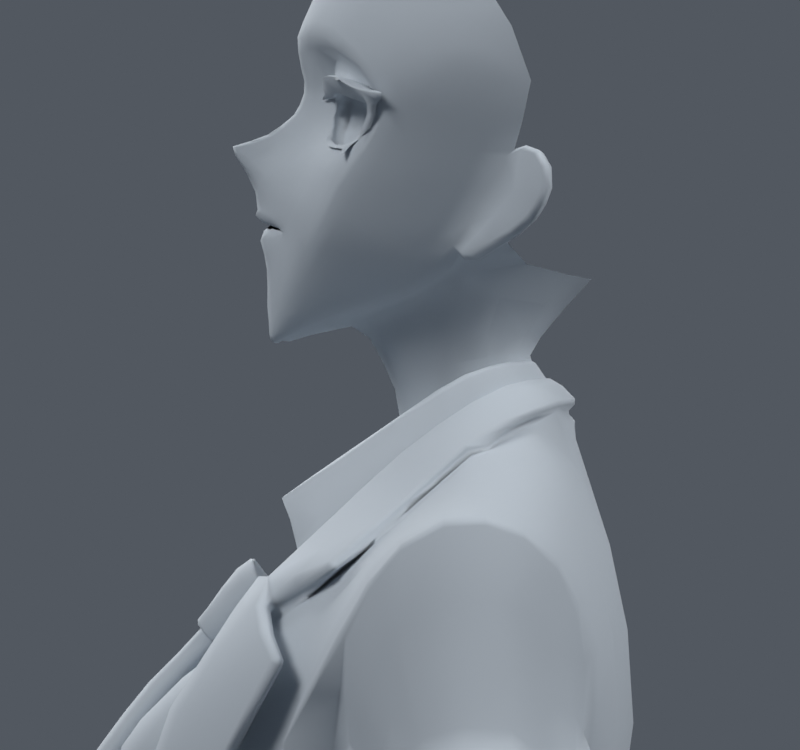
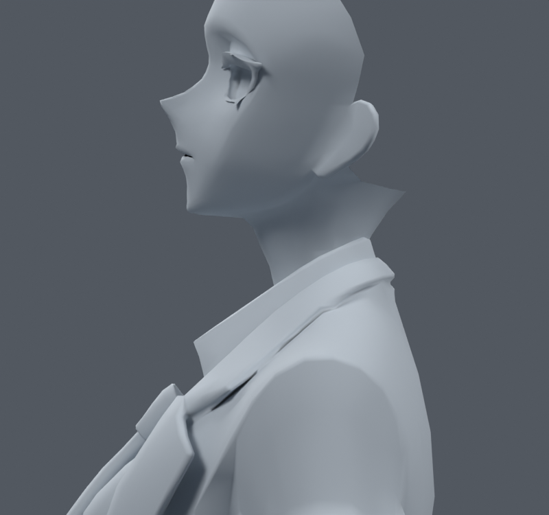
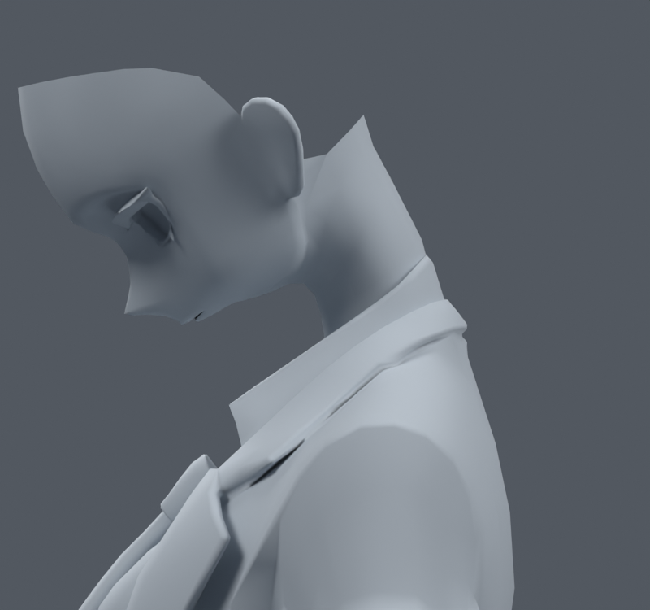
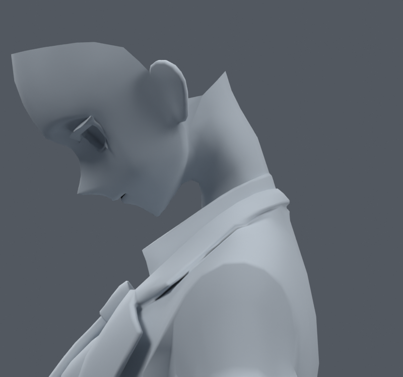
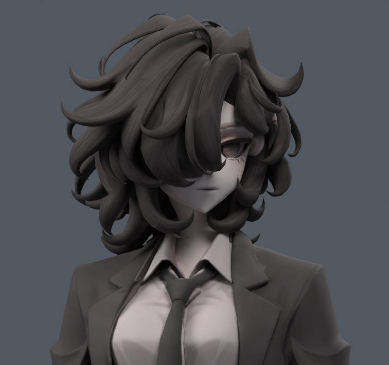

> **기록 시점 안내:** 아래는 해당 단계 당시의 보고서입니다. 후속 결정은 [최신 상태](../../STATUS.md)를 기준으로 읽어주세요. 모델·원본 텍스처·검증 원시 데이터는 이 문서 공유본에 포함하지 않습니다.

# v009 관절 단계 작업 — 목·턱·칼라

## 현재 상태

사용자가 조사에 따른 단계별 작업 진행을 승인했다. 첫 단계는 **기존 본과 형상을 유지한 목·턱·칼라의 웨이트 보정**이다. 현재 우선 후보는 bianca_neck_collar_wide_WEIGHTS_TRIAL.blend (공유본 미포함: `bianca_neck_collar_wide_WEIGHTS_TRIAL.blend`)이며, 사용자 최종 채택이나 전체 관절 완료본은 아니다.

**재생성·리메시·본 추가/이동·정점 이동·면/컷 추가·UV/텍스처 수정은 전부 0.** 원본 v006은 보존했다. 34,597정점 / 17,625면 / 31,363삼각형을 유지한다. 이번 웨이트 변경은 분할 포함 1,716정점, 정확히 같은 위치 기준 875곳이다. 얼굴/목 성분 739정점, 셔츠 601정점, 재킷 중앙 칼라 부위 376정점이다.

## 실제로 확인한 원인과 변경

기존 턱 끝 표본은 head 약 0.245 / neck 약 0.755였다. 머리만 돌리면 얼굴 위쪽은 head를 따라가지만 턱은 덜 따라가므로 턱이 옆으로 끌리고, 머리만 크게 숙이면 아래 얼굴이 압축되는 현상이 있었다. 목 본의 회전은 자식인 머리도 함께 돌리므로 머리 단독 회전과 같은 문제로 해석하지 않았다.

기존의 높이만 사용한 경계를 얼굴 앞뒤 위치를 반영하는 경계로 바꿨다. 낮게 내려오는 앞쪽 턱은 머리를 안정적으로 따라가고, 뒤쪽의 실제 목 연결은 더 높은 위치까지 점진적으로 나눠 움직인다. 얼굴·목 주 성분 밖으로 이 규칙을 퍼뜨리지 않았다. 목 밑은 가슴으로 연결하고 목 전체를 head=1로 고정하지 않았다.

셔츠와 재킷 중앙 칼라에 이미 존재하던 head/neck 영향 중 일부를 chest로 옮겼다. 머리만 돌릴 때 칼라가 따라 비틀리는 것을 줄이고, 목 회전에는 제한적으로 반응하게 했다. 칼라 범위 바깥으로 영향이 급히 끊기지 않도록 좌우 감쇠를 사용했다.

## 네 후보의 비교와 선택

| 파일 구분 | 내용 | 판단 |
|---|---|---|
| `neck_only` | 얼굴/목 경계만 수정 | 머리 단독 회전의 턱 보존 개선. 칼라 문제는 유지 |
| `neck_collar` | 칼라의 head/neck 영향도 감소 | 칼라 추종 개선. 좌우 경계가 급한 안이므로 우선 후보에서 제외 |
| `neck_collar_taper` | 칼라 좌우 영향 감쇠 추가 | 칼라 경계 개선. 목의 짧은 전환 폭 때문에 일부 숙임/젖힘 수치 악화 |
| **`neck_collar_wide`** | 위 안에서 목 연결의 전환 폭 확대 | **현재 우선 후보.** 턱 보존과 극단 자세의 급격한 압축/늘어남을 함께 완화 |

이름의 wide는 **웨이트 전환 폭**을 뜻한다. 목의 형상을 넓히거나 정점을 이동한 것이 아니다. 앞 후보는 삭제/덮어쓰기하지 않았고 각 변경 JSON과 렌더를 보존했다.

## 검증 결과와 한계

neck_verification.json (공유본 미포함: `neck_verification.json`)은 원본과 네 후보를 각각 다시 열어 **33개 명시적 자세**를 검사한 결과다. head/neck의 좌우 회전·숙임/젖힘·기울기, 분담 회전, 목+어깨 조합을 포함한다. 이 33개 전체를 렌더로 모두 시각 검수했다는 뜻은 아니다. 대표 자세는 정면·사선·측면 렌더로 별도 확인했다.

- 재로드 후 정점·면 연결·UV·기본 노멀·본 행렬/부모·텍스처 이미지·재질 슬롯/면 할당·모디파이어 설정의 해시 동일.
- 기록된 정점의 본 웨이트만 변경. 진단용 등 비변형 그룹의 값은 원본과 동일.
- 최대 4본 영향, 정규화 오차 1e-6 미만. 모든 시험 좌표 유효, 새 0면적에 가까운 면 없음.
- head yaw 30°에서 앞쪽 턱 표본의 머리 강체 추종 기준 최대 오차 **약 12.343 mm → 0.00006 mm 미만**. 이는 정의한 턱 표본의 추종 지표이며 얼굴 전체의 시각 품질 점수가 아니다.
- neck pitch 25°의 검사 칼라 면적 배율 범위 **0.680–1.692 → 0.880–1.315**. 시각적으로 칼라 전체가 고개를 따라 끌리는 현상이 줄었다.
- 초기 짧은 전환 후보는 head pitch -20°에서 심한 압축 면 4개, +40°에서 3배 초과 면 2개가 생겼다. wide 후보에서는 해당 수가 모두 0이고, 검사한 33자세에서 원본보다 심한 압축/늘어남 면 수가 증가한 얼굴/목 자세는 없었다. 수치만으로 채택하지 않고 같은 자세의 앞/옆 렌더도 확인했다.

**남은 한계:** 목과 칼라의 모든 접촉을 충돌 검증한 것은 아니다. 강한 머리 단독 숙임에서는 목의 윤곽과 뒤쪽 기존 면 경계가 여전히 드러난다. 뒤통수/헤어를 숨긴 렌더의 열린 기존 경계는 이번에 만든 구멍이 아니다. 실제 최종 Humanoid의 머리/목 회전 분담과 PC 클라이언트 검증이 남아 있다. 겨드랑이·무릎·옷자락은 이 목 단계에서 수정하지 않았다.

## 전후 이미지

비교 이미지는 같은 포즈·카메라·조명이다. 회색 진단에서는 얼굴/목·재킷·셔츠·넥타이만 보이도록 다른 성분을 렌더 메모리에서 숨겼다. 저장된 .blend의 재질과 부품은 유지했다. 색상 렌더는 원래 텍스처와 모든 헤어를 사용한다.

| 기존 v006 | 목·칼라 wide 후보 |
|---|---|
|  |  |
|  |  |
|  |  |
|  |  |
|  |  |

## 다음 작업

이 후보를 목 단계 비교 기준으로 보존하고 어깨/겨드랑이를 별도 시험한다. 쇄골 고정 포즈와 협력 포즈를 구분한 뒤 국소 웨이트의 효과를 평가한다. 본 위치나 구조를 넓게 바꿔야 하는 경우에는 구체적인 범위를 제시하고 사용자 의견을 받는다. 주요 단계마다 Git에 별도 백업한다.
