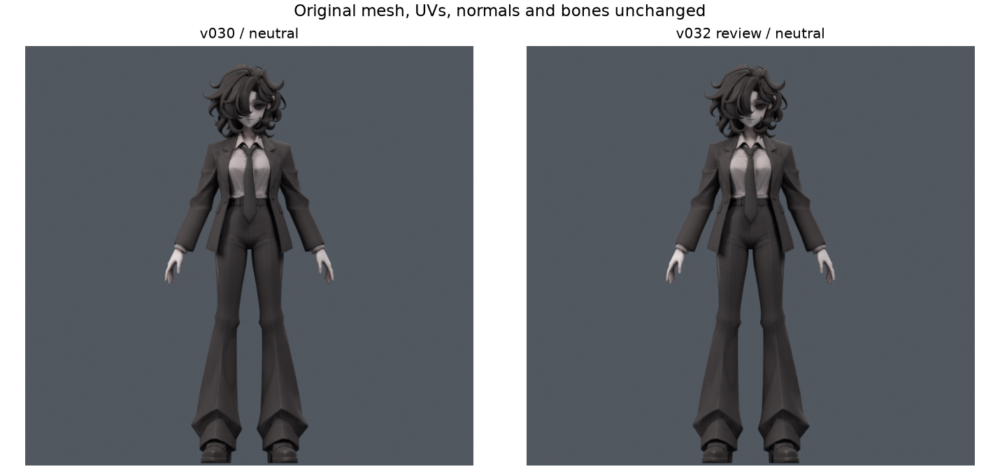
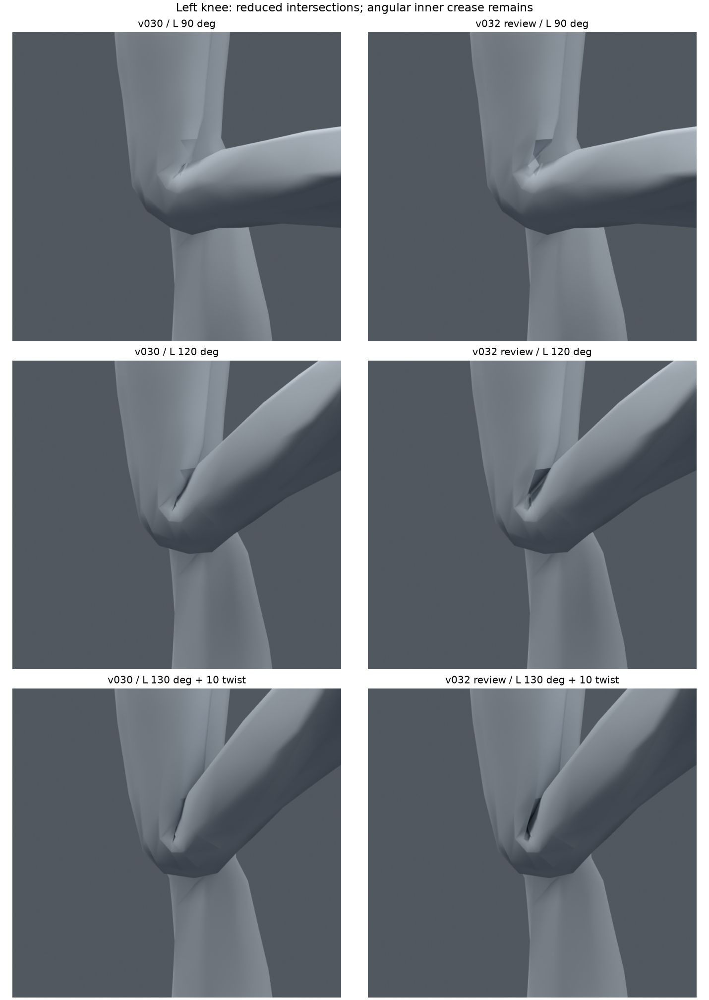
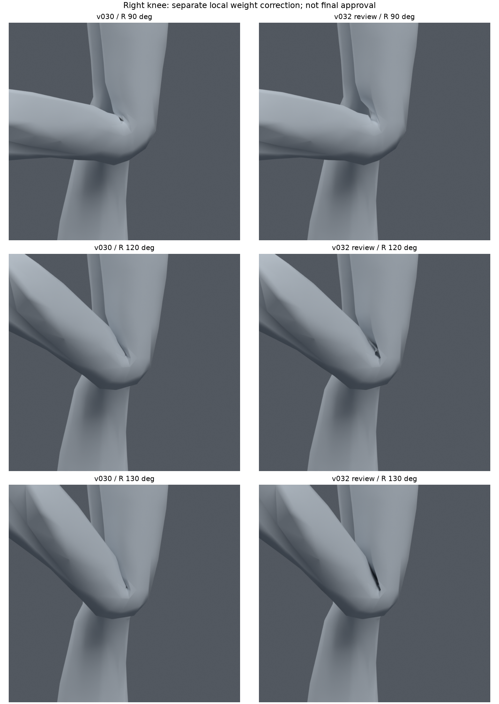
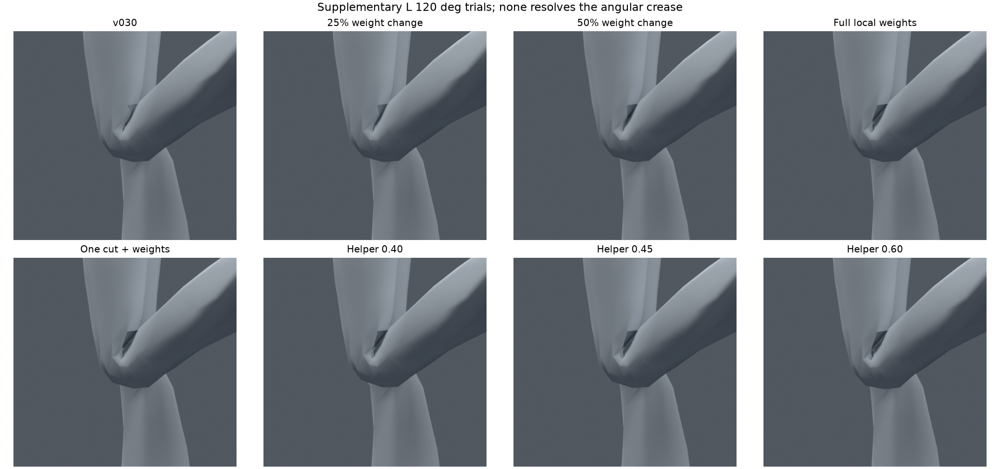
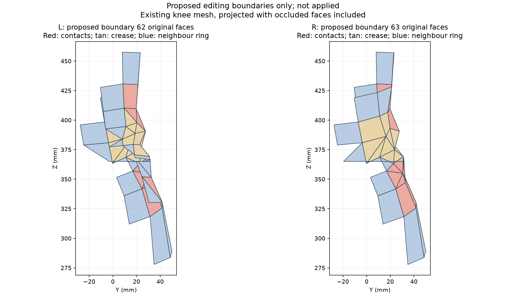

> **기록 시점 안내:** 아래는 해당 단계 당시의 보고서입니다. 후속 결정은 [최신 상태](../../STATUS.md)를 기준으로 읽어주세요. 모델·원본 텍스처·검증 원시 데이터는 이 문서 공유본에 포함하지 않습니다.

# 무릎 국소 수정과 실제 관절 검수 v032

2026-09-09. v030 사본에서 양쪽 무릎을 수정하고 비교했다. **면 교차는 크게 줄었지만, 안쪽의 각진 틈은 남고 일부 시점에서 더 두드러진다. 따라서 접촉 개선 검수 후보로 보존하며 최종 채택하지 않는다. 기준 v030은 유지한다.**

검수 후보: `bianca_KNEE_CONTACT_REVIEW.blend`. 재생 후보: `bianca_KNEE_MOTION_REVIEW.blend`(124프레임). 새 메시 생성·대체·리메시는 하지 않았다. 원본 캐릭터 레퍼런스를 실제로 열어 확인했고, 이번에는 PC Unity/VRChat 적용 전 Blender 검수를 수행했다.

## 이번에 실제 수정한 범위

- 접촉 검수 후보는 **기존35 raw 정점, 위치로 묶으면15곳의 웨이트만** 바꿨다. 왼쪽16 raw, 오른쪽19 raw다. 변경 구역은 모델 좌표 z0.375~0.397949m, y0.016357~0.027588m의 무릎 뒤쪽이다.
- thigh/shin/knee_support의 국소 분배를 조정했다. 단일 웨이트 최대 변화0.325, 정점당 최대4개 영향, 정규화 오차 최대1.04308e-7이다. 오른쪽은 가까운 대응 위치를 찾은 뒤 오른쪽 자세에서 별도 계산했다. 왼쪽 값을 단순 복사하지 않았다.
- 기존 정점 좌표·에지·면·UV·코너 노멀·재질·텍스처·본·modifier·오브젝트 변환 fingerprint가 전부 v030과 같다. 본94개,34,597정점/17,625면/31,363삼각형이다. 보조 본의 constraint도 그대로다.
- 중립 평가 표면의 정점 차이 최대3.07759e-8m(약0.0000308mm). 저장 후보를 다시 열어 웨이트 값 일치도 확인했다. 원형 유지와 변형 자세의 형상 품질은 별개로 판단했다.

## 실제 표시용 평가 면 검사

Blender의 변형 후 평가 메시에서 매 자세의 삼각형 분할을 다시 얻었다. 고정 휴지 삼각형을 사용한 탐색 결과만으로 통과시키지 않았다. 교차는 같은 위치를 공유하는 인접 삼각형을 제외한 BVH 교차이며, 중복된 삼각형 쌍을 원래 면 쌍으로 묶어 셌다. 아래 누적은 **면 쌍×자세의 합**이며 관통 깊이나 시각 품질 점수가 아니다.

| 검사 | v030 | 양쪽 무릎 후보 |
|---|---:|---:|
| 전신1,377자세: 왼무릎 교차 누적 | 1,207 | 0 |
| 전신1,377자세: 오른무릎 교차 누적 | 1,242 | 0 |
| 전신: 무릎 교차가 있는 자세, 왼/오른쪽 | 111 / 113 | 0 / 0 |
| 무릎 집중124자세: 왼무릎 교차 누적 | 311 | 27 |
| 무릎 집중124자세: 오른무릎 교차 누적 | 299 | 33 |
| 집중 검사: 교차가 있는 자세, 왼/오른쪽 | 23 / 23 | 3 / 3 |
| 두 검사 모음: 새 면적 이상 면·무릎 교차 증가·코트 접촉 증가 자세 | 비교 기준 | 0 |
| 재생124프레임: 저장/재로드 전체 정점 오차 | — | 0 |

전신 모음은 기존1,281개와 추가96개 연속값 자세(seed320909)다. 추가96개에서 양 무릎 교차 누적52→0이었다. 웨이트 탐색에는 각 무릎42개 굽힘/회전 표본을 사용했다. 후보 비교가 진행되며 알려진 표본이 늘어났으므로 다음 후보에서 이96개를 새로운 블라인드 검사라고 재사용하지 않는다.

전신 모음에 집중 검사의 모든130도 자세가 포함된 것은 아니다. **130도에서 왼쪽7/8/12쌍, 오른쪽14/11/8쌍**이 남는다(각각 비틀림 -10/0/+10도). 집중 검사에서120도 이하 표본의 양 무릎 교차는0이지만 그 사이 모든 연속 각도를 증명하지는 않는다.

전신 전체 표면의 실제 삼각형 면적 이상 누적은479→479로 기존 문제가 남았다. v030의 과거 고정 삼각형 검사 누적64와 직접 비교할 수 없는 검사 방식/표본이다. 고관절·다른 관절을 이번에 해결했다고 표현하지 않는다. 코트 비교도 원래 면 대응으로 세었으며, 재킷의 휴지 면 중심 z0.705m를 기준으로 자락/상부를 나누었다. 옷 전체의 연속 충돌 보장은 아니다.

## 렌더 판정

실제 렌더를 같은 카메라·각도로 열어 비교했다. 중립 외형은 유지되지만 굽힘 안쪽의 날카로운 접힘과 어두운 틈이 남는다. 일부90/120도 시점은 교차 감소에도 틈이 더 뚜렷해졌다. 따라서 **수치 회귀 없음과 시각적 합격을 구분하고, 전체 무릎 완료/최종 모델 채택으로 처리하지 않았다.** 주요 렌더의 카메라 행렬과 렌더 중 정점 이동0을 기록했다.

## 컷과 추가 비교를 합치지 않은 이유

1. **실제 한 곳 컷:** 왼무릎 기존 에지4602–4589를 절반으로 나누고 맞닿은 원래 삼각형2155/3194를 분할했다. 기존 메시 데이터 안에 새 정점1개·면2개만 추가했다. 기존 좌표/웨이트 유지, 원래 코너 UV 오차0. 노멀 대응 복구는 재양자화 때문에 최대 벡터 오차0.000509815다. 별도 `bianca_ONE_KNEE_EDGE_CUT_TRIAL.blend`로 보존했다.
2. **컷 효과 분리:** 124자세 왼무릎 누적은 컷만311, 웨이트만27, 컷+웨이트27이었다. 컷에 추가 이득이 없어서 접촉 검수 후보에는 합치지 않았다. 컷+웨이트 사본도 별도 보존했다.
3. **분배 프로파일12개:** 뒤쪽 전환 중심·폭·보조 영향량을 비교했다. 대부분 교차/압축이 늘어 국소 정점별 조정으로 범위를 줄였다. 프로파일 비교는42자세 탐색이며 모두 전신 검수한 후보는 아니다.
4. **수정량25/50/75%:** 왼쪽42자세 교차 누적166/123/82, 전체 국소 수정은27이었다. 작은 수정량은 틈이 덜 두드러지지만 교차가 더 남았다. 최종 해법으로 선택하지 않았다.
5. **보조 추종량0.40/0.45/0.55/0.60:** 기존0.50에서 소폭 바꿔42자세와 렌더를 비교했다.0.40/0.45는 면적 이상 누적8/1,0.55/0.60은 교차27로 추가 해결이 없었다. 검수 후보의 본/constraint는 변경하지 않았다.
6. **남은 접힘 주변3위치 추가 탐색:** 왼쪽은 변경0, 오른쪽은4 raw 웨이트가 바뀌었지만 초기 평가 삼각형 기준 교차 누적이 더 줄지 않았다. 이 후속 시험은 후보에 합치지 않았고 전신 재검수도 수행하지 않았다. 원래 v030 대비 웨이트 변화 상한0.35를 유지했다.

## 다음 면 연결 수정 제안 — 미적용, 범위 확인 필요

남은130도 교차 면, 눈에 보이는 접힘 주변 면, 그와 에지를 공유하는 이웃 한 겹을 묶어 **왼쪽62면·오른쪽63면의 편집 가능 경계**를 표시했다. 각각 위치67곳/68곳을 포함한다. 모두 바꾸겠다는 뜻이 아니며, 좁은 변형 구역과 연결부를 함께 다룰 수 있도록 잡은 상한이다.

빨강은 남은 교차에 참여한 면, 황토색은 국소 웨이트를 수정했던 접힘 주변 면, 파랑은 연결 전환을 위한 이웃 면이다. 선택한 면만 직교 투영했고 뒤쪽 면도 포함한다. 그림의 빈 곳을 실제 전체 메시 구멍으로 해석하지 않는다. 원래 면 ID 목록과 경계 좌표는 `next_scope.json`에 있다.

제안하는 다음 편집은 다음 범위다. **현재 사본에는 적용하지 않았다.**

- 왼무릎부터 별도 사본에서 기존 면의 에지를 재연결하고 필요한 짧은 지지 컷을 넣는다. 접힘 한 점으로 모이는 흐름을 분산하고, 안쪽 압축과 바깥 굽힘의 전환을 정리한다. 검증 후 오른쪽을 별도로 작업한다.
- 각 무릎에서 새 위치 최대16곳, UV 분리를 포함한 새 raw 정점 최대32개, 순증 면 최대32개를 상한으로 둔다. 기존 정점 삭제·메시 교체·자동 리메시는 하지 않는다.
- 기존 정점 위치를 유지하는 안을 우선한다. 필요한 경우에도 이동은 각 무릎 최대12개 위치, v030 기준 최대1mm 안으로 제한한다. 경계 밖 좌표·면 연결은 유지한다. 좌표를 옮겼을 때 생기는 중립 표면·실루엣·UV 변화를 별도로 제시한다.
- 원래 코너 UV를 대응 보존하고 새 컷의 UV를 보간한다. 노멀은 대응 복구한 뒤 수치와 실제 텍스처 렌더로 확인한다. 허용 거리/추가 수는 실험 상한이지 외형 합격 기준을 대신하지 않는다.
- 검사124무릎/1,377전신에 새 연속 각도와 접힘 시점의 여러 카메라를 더해 검사한다. 안쪽 각진 틈,130도 교차, 바지·코트 간격을 함께 통과해야 한다. 기존 검수 후보보다 수치만 좋아진 경우에는 채택하지 않는다.

이는 이번35 raw 웨이트/한 곳 컷보다 넓은 **기존 메시 구조 편집 제안**이다. 큰 수정 전에 의견을 받으라는 사용자 조건에 따라 범위를 확인받은 뒤 진행한다. 새 메시 생성 제안이 아니다.

## 파일과 재현 기록

`SUMMARY.json`, `preservation.json`, `verification_knee_*.json`, `verification_body_*.json`, `motion_reload.json`, 각 탐색 JSON에 원시 결과와 SHA가 있다. 스크립트는 상위 `knee_local_v032.py`, `knee_report_v032.py`. 실행 환경은 Blender5.2.1이며 그림은 기존 로컬 matplotlib 환경에서 생성했다. 새 외부 조사 대신 [v031 조사와 판단](../topology_v031/DIRECTION.md)을 실제 모델에 적용했다.

재생본은 독립 진단 자세를 정수 프레임에 저장한 검수용이다. 프레임 사이 보간·자연스러운 애니메이션·Unity/VRChat 실행·PhysBone·바람을 검증한 파일이 아니다. 어깨/겨드랑이·손·고관절·다른 회전 관절은 이번에 수정하지 않았다.
