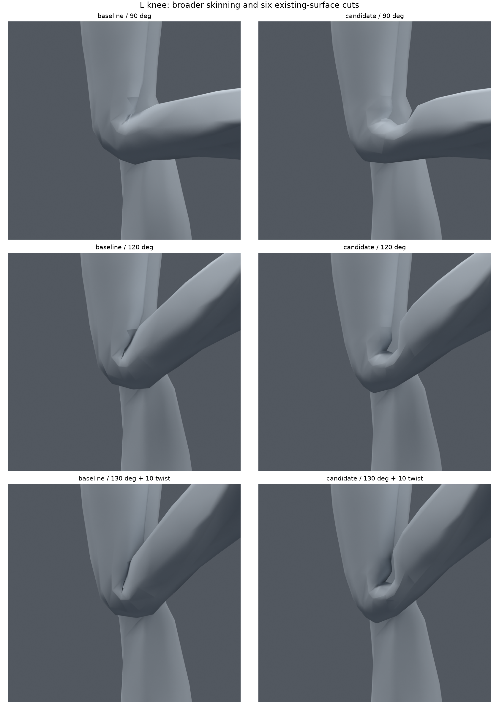
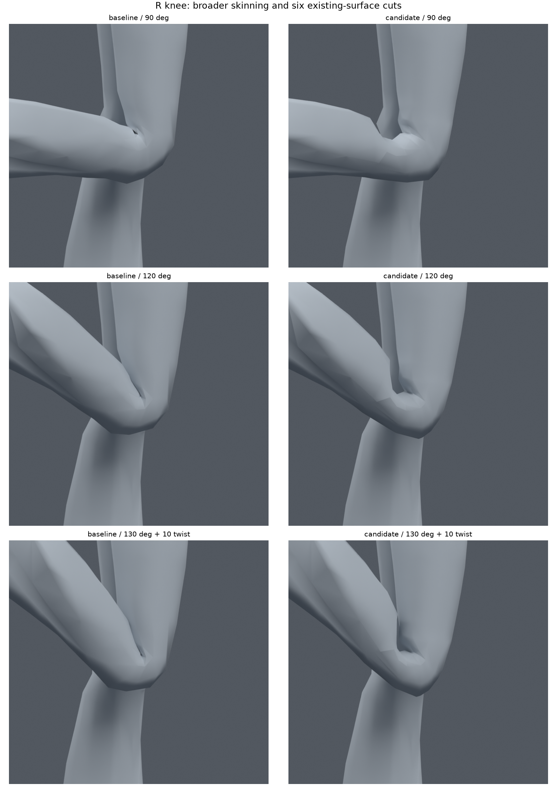
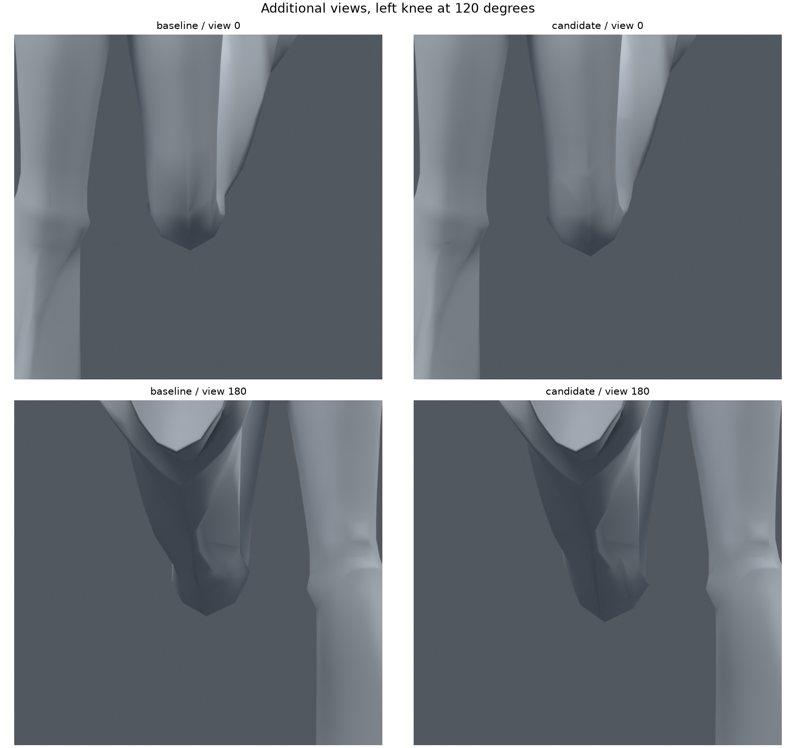
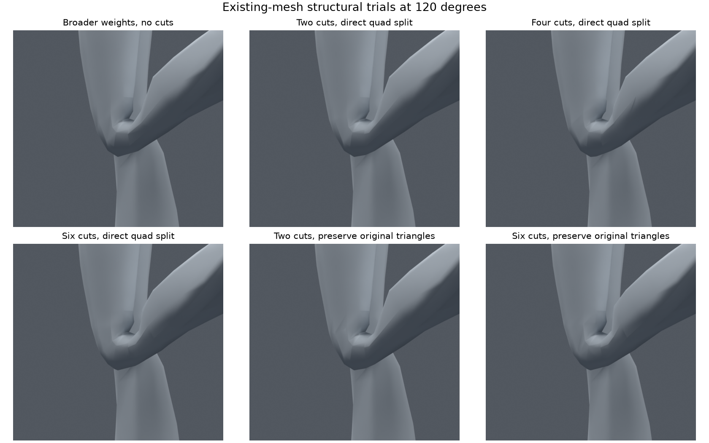
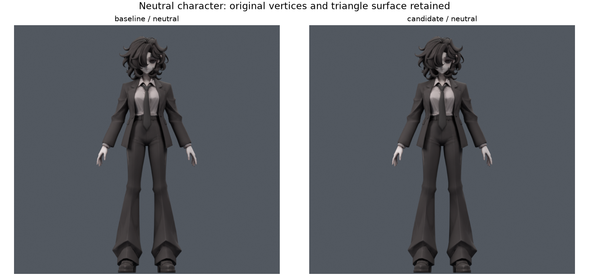

> **기록 시점 안내:** 아래는 해당 단계 당시의 보고서입니다. 후속 결정은 [최신 상태](../../STATUS.md)를 기준으로 읽어주세요. 모델·원본 텍스처·검증 원시 데이터는 이 문서 공유본에 포함하지 않습니다.

# v033 — 기존 무릎 구조 수정과 변형 분담 재설계

2026-09-09. PC용 Unity / VRChat 아바타의 **무릎 후속 검수 후보**입니다. 오래 남았던 안쪽의 깊은 삼각형 틈과 자기 교차를 개선했습니다. 검사한 무릎 자세에서는 교차와 과도한 압축이 사라졌습니다. 바지의 각진 주름과 다른 관절 문제는 남으므로 전체 아바타 완성이나 사용자 최종 채택으로 표현하지 않습니다.

사용자는 이번에 기존 구조 수정을 자유롭게 다양하게 시도하도록 승인했습니다. 기존 모델을 편집하는 별도 사본에서 진행했습니다. 재생성·대체 메시·자동 리메시는 하지 않았습니다. 안전 기준 v030과 이전 실험을 보존합니다.

## 확인할 파일

- `bianca_KNEE_STRUCTURE_REVIEW.blend`: 다음 무릎 검수에 권장하는 중립 사본.
- `bianca_KNEE_STRUCTURE_MOTION_REVIEW.blend`: 왼무릎, 오른무릎, 양다리 앉기 동작을 담은 183프레임 사본. 프레임 1/62/123에 구간 표식이 있습니다.
- `bianca_BILATERAL_six.blend`: 실제 전체 검증을 수행한 원본 후보. 위 중립 검수본은 검수 설명 속성과 저장 설정만 정리했고 mesh/bone fingerprint, 웨이트, 중립 평가 정점과 constraint 목록이 동일합니다.
- `SUMMARY.json`, `preservation.json`, `DELIVERY.json`, `motion_reload.json`: 내부 수치·보존·저장 검증 기록. 공유 문서 저장소에는 모델이나 원시 JSON을 배포하지 않습니다.

## 눈에 보이는 변화

왼쪽은 v030, 오른쪽은 v033입니다. 렌더 카메라·재질·조명 설정을 맞춰 실제 저장 모델을 다시 열어 비교했습니다. 90/120/130도에서 안쪽 표면이 길고 날카롭게 벌어지던 부분이 짧고 넓은 접힘으로 바뀌었습니다. 130도 그림은 추가로 10도 비틀었습니다. 이것은 주름을 완전히 매끈하게 제거한 결과가 아닙니다. 무릎 뒤쪽의 작은 각진 면과 정강이로 이어지는 일부 명암 경계는 보입니다.

정면·뒤쪽에서도 확인했습니다. 이 시점에서는 개선이 옆면만큼 크지 않고, 원래 바지의 각진 면 흐름이 남아 있습니다. 따라서 옆면 그림 하나로 모든 시점의 시각 품질을 합격시키지 않습니다.

## 원인 구분과 실제 실험

1. **중복 정점 검사:** 왼무릎의 동일 위치·동일 부품 정점 그룹에서 웨이트 불일치가 발견되지 않았습니다. UV/노멀 경계의 중복 정점을 전체 용접하는 방향은 필요하지 않았습니다.
2. **노멀 재계산만 비교:** v032의 바지 노멀을 자동 계산한 임시 렌더에서도 깊은 틈이 남았습니다. 해당 문제는 음영만 바꾸어 해결되지 않았습니다. 이 노멀 실험을 검수본에 적용하지 않았습니다.
3. **더 넓은 변형 분담:** 기존 thigh/shin/knee_support 세 본의 무릎 둘레 웨이트를 연속적인 분포로 바꿨습니다. 중심 4종·폭 4종·보조 비중 3종·안쪽 중심 이동 3종, 총 144분포와 원래 분포를 18개 굽힘/비틀림 자세에서 비교했습니다. 초기 자세의 삼각형을 사용하는 탐색이므로 아래 실제 변형 후 삼각형 검증과 구분합니다.
4. **기존 면의 지지 컷:** 왼쪽에 2/4/6줄 컷을 각각 추가한 사본을 만들었습니다. 새 점에 기존 웨이트를 단순 보간한 채로 끝내지 않고, 새 점도 선택한 연속 분포에 맞췄습니다. 각 후보는 124집중 자세에서 왼무릎 교차·면적 이상 0이었습니다. 오른쪽은 이 단계에서 v030 그대로였습니다.
5. **중립 표면을 보존하는 컷:** 비평면 사각형을 바로 나누면 원래 렌더 삼각형의 표면과 달라질 여지가 있어, 최종 경로에서는 컷에 걸리는 기존 사각형을 원래 중립 삼각형 대각선으로 먼저 분할했습니다. 그 삼각형 안에서 컷을 넣었습니다. 새 점은 기존 에지 또는 원래 삼각형 대각선 위에 있고, 원래 정점은 이동하거나 삭제하지 않았습니다.
6. **양쪽 비교:** 컷 없는 분포 수정, 원래 표면 보존 2줄, 원래 표면 보존 6줄을 양쪽에 각각 적용했습니다. 세 사본 모두 124집중 무릎 검사에서 교차·면적 이상 0이었습니다. 곡선을 더 잘 나누는 6줄 후보를 전체 검증 대상으로 골랐습니다. 교차 감소의 주요 원인은 넓은 변형 분담이며, 컷이 없으면 교차가 해결되지 않는다고 주장하지 않습니다.

최종 분포는 중심 높이 z=0.355m, 전이 폭 0.10m, 중앙 보조 비중 계수 0.65입니다. 부드러운 3차 전이로 허벅지/정강이 분담과 중앙 보조 비중을 계산하고, 국소 경계에서 기존 웨이트로 연결합니다. 본의 회전 중심·계층·추종 비율은 v030과 같습니다. 6줄 높이는 z=0.315/0.335/0.355/0.375/0.395/0.415m입니다. 기존 z=0.365m 컷도 유지했습니다. 이 값은 이 모델 좌표계의 실험 결과이며 다른 아바타에 그대로 적용할 일반 공식이 아닙니다.

## 원형과 데이터 보존

원본 캐릭터 레퍼런스와 중립 전신 렌더를 실제로 열어 비교했습니다. 외형을 새로 만들거나 원래 실루엣을 바꾸는 정점 이동은 하지 않았습니다.

| 항목 | 결과 |
|---|---|
| 기존 정점 | 34,597개, 좌표 정확히 유지 |
| 결과 정점 | 34,963개, 기존 면 분할로 366 raw 정점 추가 |
| 결과 면/삼각형 | 18,024면 / 31,911삼각형, 순증 399면 / 548삼각형 |
| 본 | 94개, 정적 본·그룹·modifier·변환 fingerprint 동일 |
| 기존 웨이트 변경 | 383 raw / 193고유 위치, 양쪽 바지만 변경 |
| 변경 웨이트 범위 | z=0.308105…0.423340m, 최대 값 변화 0.817382 |
| 최대 영향 수/정규화 오차 | 4본 / 1.04309e-7 |
| 기존 코너 UV | 대응 오차 0 |
| 기존 코너 노멀 | 복구 벡터 최대 오차 0.00149797, 비트 동일 아님 |
| 원래 면별 중립 표면적 | 최대 상대 오차 3.41659e-6 |
| 중립 표면 표본 3,638개 | 원래 삼각형 표면까지 최대 거리 약 0.000200mm |
| 기존 정점의 중립 평가 위치 | 최대 차이 약 0.0000308mm |
| 이미지/재질 | packed image와 재질 목록 fingerprint 동일 |

raw 정점에는 UV/노멀 경계의 중복 점이 포함됩니다. 단순히 366개의 서로 다른 공간 위치를 추가했다는 뜻은 아닙니다. 노멀은 BMesh 편집 후 원래 코너 값과 새 에지 보간값을 복구했고, Blender의 재저장 표현 오차를 위와 같이 기록했습니다. 전체 좌표·UV 배열은 새 점/코너가 추가되어 hash가 달라지며 이를 원래 전체 배열과 동일하다고 하지 않습니다.

## 실제 변형 후 검증

모든 아래 자세는 Blender에서 실제 평가한 정점과 그 자세의 삼각형 분할을 사용했습니다. 교차는 동일 위치를 공유하지 않는 삼각형의 BVH 교차를 원래 면 ID 쌍으로 묶어 셉니다. 분할에 따른 착시를 피하려고 삼각형 쌍 수도 함께 확인했고, 후보는 둘 다 0입니다. 관통 깊이나 모든 연속 자세의 무교차를 증명하는 검사는 아닙니다.

| 모음 | 양 무릎 원래 면 교차쌍 누적, v030→v033 | 후보 무릎 면적 이상 | 다른 부위 새 악화 |
|---|---|---|---|
| 기존 전신 1,377표본 | 왼 1,207→0 / 오른 1,242→0 | 양쪽 0 | 0 |
| 집중 무릎 124표본 | 왼 311→0 / 오른 299→0 | 양쪽 0 | 0 |
| 새 표본 384개 | 왼 724→0 / 오른 562→0 | 양쪽 0 | 0 |

집중 모음은 양쪽 0…130도, 10도 간격 × 비틀림 −10/0/+10도와 기존 다리 복합 자세입니다. 새384개는 seed330910 전신128개와 seed330911 무릎/허벅지 복합 연속각도256개입니다. 후보 선정 후 사용했고 결과를 보고 다시 맞추지 않았습니다. 이후 작업에서는 이미 알려진 회귀 모음으로 취급해야 합니다. 복합256개의 무릎 굽힘은0…130도, 무릎 비틀림±15도, 허벅지 비틀림±25도이며 허벅지 local X −30…95도는 넓은 수치 스트레스 범위입니다. 권장 인체 가동범위나 자연스러운 게임 애니메이션 범위로 해석하지 않습니다.

다른 부위 새 악화는 **새 면적 이상 원래 면, 코트/바지·코트/소매 교차쌍 증가**가 없는지를 뜻합니다. 전체 기존 문제까지 없다는 뜻은 아닙니다. 전신의 면적 이상 삼각형·자세 누적은 각각 479→479, 집중26→26, 새384의365→365로 남습니다. 서로 겹치는 자세가 포함될 수 있어 1,885개의 독립 자세라고 부르지 않습니다.

183프레임 동작은 각 무릎을 천천히 굽혔다 펴는 두 구간과 양다리 앉기 구간입니다. 저장 후 다시 열어 모든 정수 프레임의 전체 34,963 평가 정점을 비교했으며 최대 오차0입니다. 정수와 반 프레임을 합친365표본에서도 양 무릎 교차와 면적 이상0입니다. 반 프레임 사이 전체 연속 구간과 Unity/VRChat 실행은 별도 미검증입니다. 이 동작 검사의 접촉 판정 범위는 무릎이며 전신 의상 접촉 합격을 뜻하지 않습니다.

## 조사에서 적용한 점

- Johnson Martin은 변형 축에 맞는 면 흐름, 변형이 큰 부분의 밀도와 전이 영역까지 이어지는 루프를 설명합니다. 원문을 다시 읽고 **긴 면을 실제 접힘 방향으로 나누되 기존 중립 삼각형 표면을 보존**하는 실험에 적용했습니다. 이 자료만으로 현재 후보의 성공을 추정하지 않고 실제 검증으로 판단했습니다. [Topology Guides 원문](https://github.com/TopologyGuides/topologyguides.github.io/blob/master/modeling-for-animation.html)
- Blender의 Corrective Smooth 설명은 Armature 뒤에서 관절 변형을 보정하는 방식을 다룹니다. 이번에는 검색 결과의 공식 문서 본문을 확인했으나 직접 페이지 열기는402 오류였습니다. 이를 런타임 해결책으로 채택하거나 modifier를 추가하지 않았습니다. [Blender 공식 설명](https://docs.blender.org/manual/en/4.2/modeling/modifiers/deform/corrective_smooth.html)
- VRC Position Constraint는 여러 소스와 가중치로 위치를 추종할 수 있고 로컬 공간 옵션을 제공합니다. 공식 본문을 읽어 추가 보조 구조의 대안으로 확인했습니다. 그러나 이번 선택 후보는 기존 본과 constraint를 그대로 사용하며 이 컴포넌트를 새로 구현하지 않았습니다. [VRChat 공식 설명](https://creators.vrchat.com/common-components/constraints/vrc-position-constraint/)

Blender 전용 보정 효과가 Unity에 자동으로 옮겨진다고 가정하지 않았습니다. 이번 핵심 수정은 기존 메시의 국소 분할과 선형 스키닝 웨이트입니다. 기존 무릎 보조 추종의 엔진 재현, FBX 삼각형/노멀 확인과 VRChat 실제 동작 검사는 본 작업 다음 단계입니다. 새 YouTube 영상을 시청한 기록은 없습니다.

## 남은 작업과 다음 기준

이 단계로 무릎의 깊은 틈과 검사된 자기 교차 문제는 크게 개선되었습니다. 후속 작업에는 v033 검수본을 무릎 개선 후보로 사용하고 v030을 비교·복귀 기준으로 보존할 수 있습니다. v032의35점 후보나 미채택 손/고관절/코트 실험을 따로 합치지 않습니다.

남은 항목은 무릎 뒤쪽의 작은 각진 주름, 어깨·겨드랑이·소매의 큰 회전 형태, 손/손가락 교차, 고관절·허리와 코트 접촉, 표정과 물리입니다. 다음 관절에서도 문제점 몇 개의 웨이트만 좁게 바꾸는 방식에 고정되지 않고 **기존 면 흐름, 충분한 전이 폭, 실제 시점과 접촉 검사**를 함께 비교합니다. 새 생성·대체·자동 리메시 금지와 별도 사본 원칙은 유지합니다.
