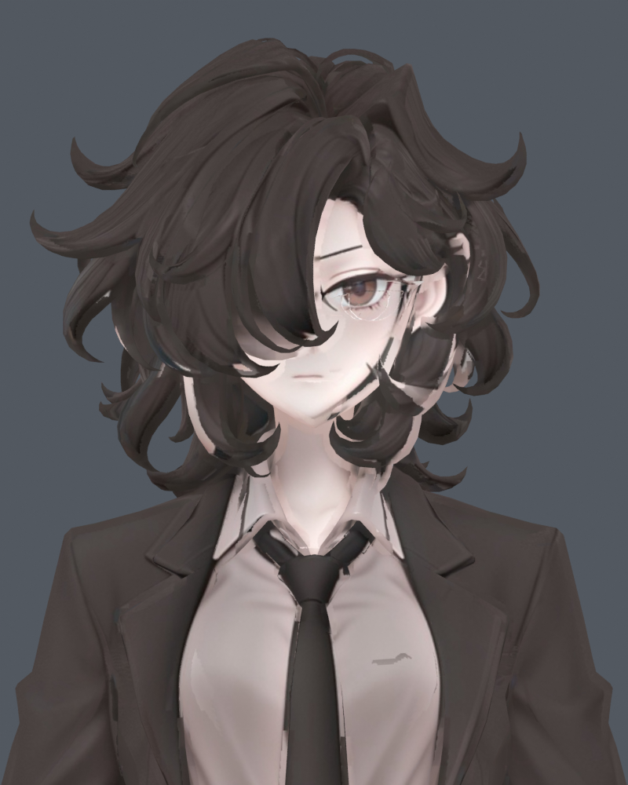
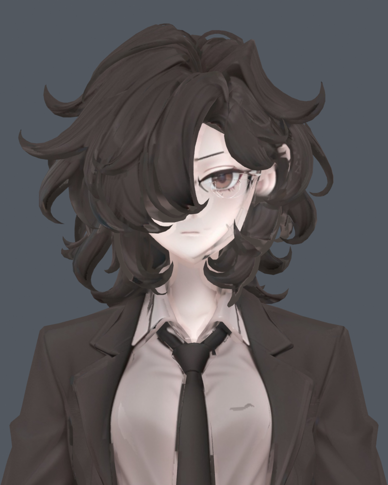
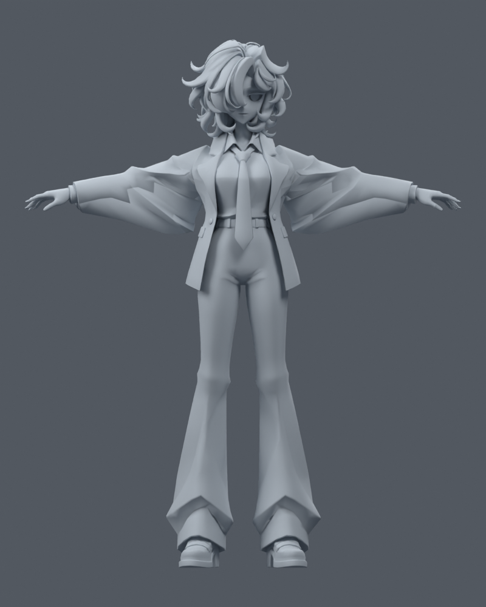
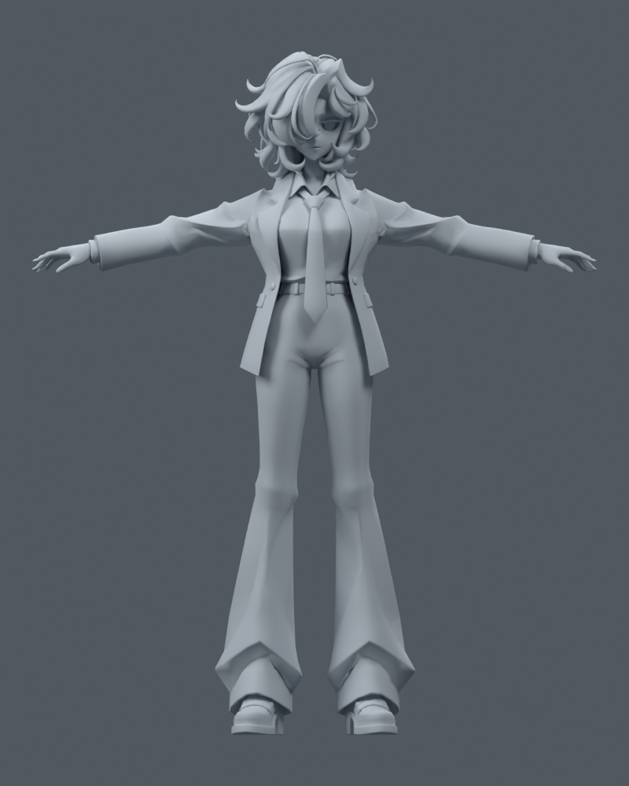
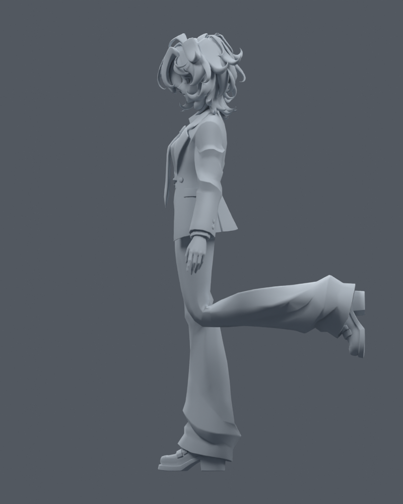
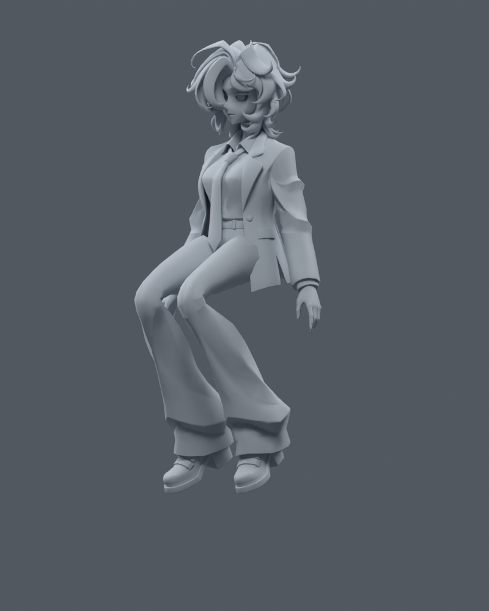

> **기록 시점 안내:** 아래는 해당 단계 당시의 보고서입니다. 후속 결정은 [최신 상태](../../STATUS.md)를 기준으로 읽어주세요. 모델·원본 텍스처·검증 원시 데이터는 이 문서 공유본에 포함하지 않습니다.

# 국소 색·몸 웨이트 보정 v002

2026-09-09. 원래 형상과 UV를 유지한 1차 보정본입니다. [상세 검증·남은 문제](REVIEW.md) · Blender 파일 (공유본 미포함: `bianca_local_refine_v002_baked.blend`)

## 얼굴·헤어 — 같은 카메라

| 수정 전 | 수정 후 |
|---|---|
|  |  |

헤어의 피부색 번짐과 이마·볼의 검은 무늬를 줄였습니다. 눈의 흰 테두리와 일부 얼룩은 남습니다. 홍채색 채우기는 눈 인상을 바꿔 제외했습니다.

## 팔 올리기 — 웨이트 수정

| 수정 전 | 수정 후 |
|---|---|
|  |  |

소매가 몸통에 붙잡히던 웨이트를 수정했습니다. 면적 3배 초과 면이 76개에서 2개로 줄었습니다.

## 무릎과 앉기 — 남은 한계

| 무릎 90도 | 고관절 + 무릎 |
|---|---|
|  |  |

무릎의 각짐과 자락 겹침이 남습니다. 네 Blender 파일의 형상·UV 해시가 같고, 121프레임 좌표 검사와 최대 4본 웨이트 검증을 통과했습니다. 이는 관통이나 미관 문제가 모두 해결됐다는 뜻은 아닙니다. 눈의 위치·크기/UV 수정은 사용자 의견 확인 후 진행합니다.
