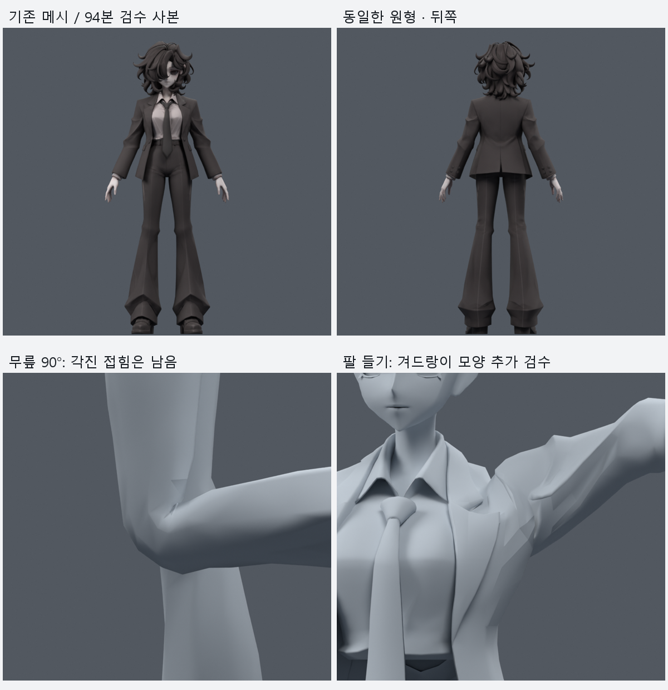
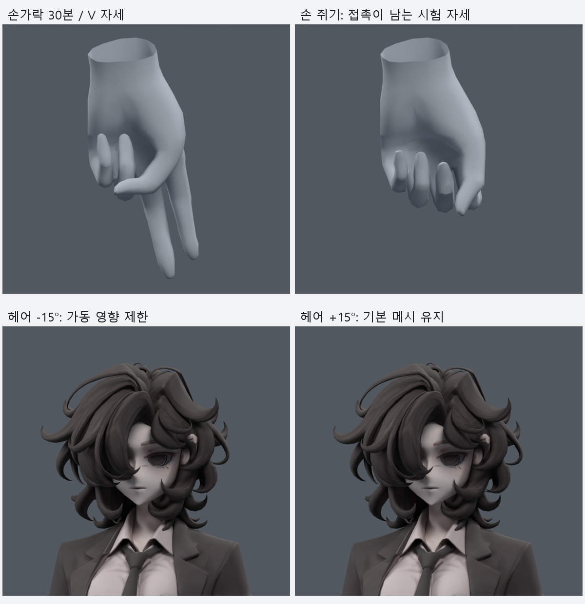
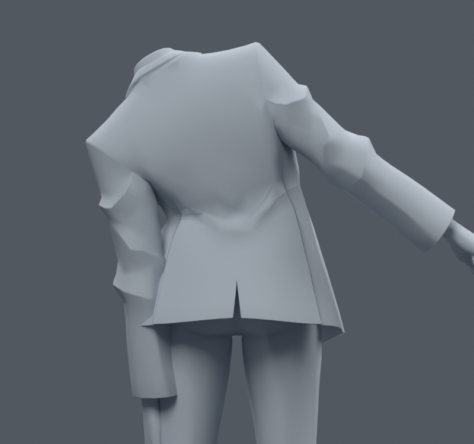

> **기록 시점 안내:** 아래는 해당 단계 당시의 보고서입니다. 후속 결정은 [최신 상태](../../STATUS.md)를 기준으로 읽어주세요. 모델·원본 텍스처·검증 원시 데이터는 이 문서 공유본에 포함하지 않습니다.

# 기존 메시 유지 · 전신 본 검수 사본 v023

2026-09-09. v016–v023의 본·웨이트 실험을 합쳐 검수한 기록이다. **새 메시를 만들지 않았고, 기존 메시 좌표·면·UV·노멀·재질·텍스처도 바꾸지 않았다.** 필요한 본 구조 변경만 승인 범위 안에서 수행했다.

## 판단과 열어 볼 파일

후속 작업 사본은 bianca_EXISTING_MESH_RIG_REVIEW.blend (공유본 미포함: `bianca_EXISTING_MESH_RIG_REVIEW.blend`), 동작 확인 사본은 bianca_ALL_BONES_MOTION_REVIEW.blend (공유본 미포함: `bianca_ALL_BONES_MOTION_REVIEW.blend`)다. **전체 관절이 자연스럽게 완성된 모델 또는 Unity로 넘길 최종 채택본은 아니다.** v014 안전 기준을 보존했고, 아래 접촉과 형상 문제 때문에 자동으로 대체하지 않는다.

420프레임 검수 사본에는 V023 타임라인 마커가 있다. 1–141은 몸 단독/복합 진단, 142–395는 기존 254개 자락 동작 표본, 396–405는 양손 제스처 비교, 406–420은 헤어·넥타이·발 앞부분의 시험이다. 모든 정수 프레임을 저장 후 다시 열어 실제 표면 좌표 오차 **0 m**를 확인했다. 섹션 전환과 정수 프레임 사이 보간을 완성된 모션으로 사용하지 않는다. 특정 제스처의 실패도 검수 파일에 그대로 포함한다.

## 1. 보존 검사

| 항목 | 결과 |
|---|---|
| 기준 | v014 무릎 후보3, 원래 32본 사본 |
| 메시 | 34,597 정점 / 17,625 면 / 31,363 loop triangle |
| 새 메시·교체·리메시 | 없음 |
| 정점 이동·새 컷·면 재구성 | 이번 단계에서는 없음 |
| 메시 오브젝트 목록 | 기준과 동일 |
| 좌표·에지·면·UV·노멀·재질·이미지·modifier·변환 | 기준 fingerprint와 동일 |
| 전체 본 | 32 → 94 |
| 웨이트 | 최대 4개, 합 오차 1.04e-07 |
| 중립 평가 표면 오차 | 최대 0.001595 mm |
| 본 무결성 | 길이 0·순환 계층 없음, 몸 Humanoid 계층은 hips 아래 유지 |

본 편집에 따른 내부 축 행렬의 작은 부동소수점 재계산은 원래 메시 변경과 구분했다. 원래 몸 본 중 **spine 끝/chest 시작 높이 .735 → .690 m**를 변경했다. 다른 원래 관절 위치를 새 캐릭터 비례로 재설계하지 않았다. 보존 상세는 preservation.json (공유본 미포함: `preservation.json`)이다. 본과 그룹 fingerprint를 제외한 검사만으로 웨이트 보존을 주장하지 않았으며, 웨이트와 추가 그룹은 따로 검사했다.

## 2. 구성한 본과 역할

| 구분 | 수 | 구조와 적용 |
|---|---:|---|
| 기존 몸 | 20 | root 및 기존 몸 계층. 흉곽 굽힘 중심만 하향 조정 |
| 기존 코트 | 12 | 4개 비변형 부모 + 4방향×2개 변형 본 |
| 관절 보조 | 8 | 좌우 무릎·어깨·팔꿈치·고관절 각각 1개 |
| 손가락 | 30 | 양손×5손가락×3마디, hand 아래 연결 |
| 헤어 | 18 | head 아래 6개 고정 부모 + 각 2마디 |
| 넥타이 | 4 | chest 아래 고정 부모1 + 3마디, 매듭은 몸통에 고정 |
| 발 앞부분 | 2 | 좌우 foot 아래 toes |

Body / Coat / Joint supports / Fingers / Hair / Tie / Toes 컬렉션으로 나눴다. 관절 보조 본에는 Blender LOCAL→LOCAL Copy Rotation의 0.5 영향값을 사용했다. 기존 자식의 중간 회전 방향을 분담하는 장치이며, Blender 제약이 Unity에 실행 코드로 전달된다는 뜻이 아니다. 현재 원래 몸 축의 비틀림을 완전히 재설계한 전용 twist 체인도 아니다.

### 목·몸통·어깨·팔·다리

목/턱/칼라 v009 보정을 유지하면서 head·neck·spine·chest의 굽힘/비틀림과 팔 들기·전후 회전·팔꿈치·손목·전완 비틀림·고관절·무릎·발목을 검사했다. 흉곽 중심을 낮추는 후보는 셔츠의 과도한 국소 찌그러짐을 줄였다. 바지 밑단의 foot 영향은 shin으로 옮겨 발목을 굽힐 때 밑단 전체가 신발과 함께 접히지 않게 했다.

전신 각도에 대해 기존 웨이트의 인접 본 그룹 사이에서 소량을 옮기고 최대4개를 유지했다. 기준은 각 면의 중립 면적 대비 20% 미만 압축/3배 초과 늘어남이다. 단일 자세에서 수치를 낮추는 대신 중간 각도에서 악화되는 경우가 있어, 141개 정적 검사 뒤 **254개 동작 표본을 포함한 재조정**을 추가했다. 면적 점수는 면 방향 뒤집힘·관통·자연스러운 주름을 모두 설명하지 못한다.

커프스/소매 단추는 forearm을 따르도록 하고 작은 벨트 장식은 조각 안에서 동일한 웨이트를 사용했다. 해당 조각 833 raw 정점의 웨이트가 바뀌었다. 신발의 분리된 스트랩/장식 638 raw 정점에도 본체와 같은 앞발 전환을 적용해 본체만 접히는 누락을 정리했다.

### 손가락

현재 메시의 실제 다섯 손가락 영역을 읽고, 끝부분의 연결 구조와 단면 중심에서 본을 배치했다. 이때 동일 위치 정점을 묶은 것은 선택/계산용이고 실제 메시 병합은 하지 않았다. 처음 손바닥 뿌리가 너무 높아 MCP 중심만 아래 6 mm·바깥 3 mm로 보정한 후보를 비교했다. 손바닥 전환과 문제 위치의 웨이트를 다듬고 손목 굽힘도 다시 검사했다.

82개 손 자세는 0–70°의 5° 간격 굽힘, 개별 손가락 15/30/45/60°, 벌림 ±10°, 가리키기/V/rock/thumbs-up을 포함한다. **면적 이상은 0이지만 30/82 자세에 새로운 비인접 삼각형 교차가 있다.** 면적 합격을 손가락 품질 완료로 쓰지 않는다. 표면상 같은 위치를 공유하는 인접 면 쌍은 교차 집계에서 제외했다. 최대 교차쌍은 152이며 관통 깊이 단위가 아니다.

주된 실패는 엄지가 검지/중지를 가로지르는 경로, 약지만 조금 접었을 때 새끼손가락과 닿는 경로, 큰 굽힘의 손가락 안쪽이다. 별도의 제스처 각도 탐색도 했다. 양쪽 V와 일부 가리키기는 교차0 후보를 얻었지만 주먹은 완전히 해결하지 못했다. 검수용 각도를 찾은 것이 전체 Humanoid 손가락 가동을 자동으로 제한/교정하는 기능은 아니다.

### 헤어·넥타이·발 앞부분

처음 헤어 하부 전체에 움직임을 준 후보는 얼굴/목 근처를 관통했다. 기존 몸 표면과의 거리, 중립 접촉 부위, 시험 중 최대 이동을 이용해 가동 영향을 제한했다. 같은 위치의 중복 정점에는 일관된 제한을 적용하고 이웃으로 완만하게 전환했다. 헤어 영향과 head 영향이 5개가 되는 경우는 작은 영향을 정리하여 다시 최대4개로 정규화했다.

최종 제한값은 시험한 안전계수 중 **0.1**다. 3축×±8/±15° 12개 비중립 표본에서 새 접촉0·면적 이상0, 헤어 최대 이동 5.650 mm였다. 이는 상당히 보수적인 흔들림이다. head에 남겨 둔 다른 분리 헤어 조각의 물리 반응까지 모두 완성했다는 뜻은 아니다.

원래 헤어/몸 중립 접촉 867쌍을 제거한 것은 아니다. 후보의 중립 평가에서 바뀐 3개 교차 분류도 따로 기록했다. 동일 후보의 중립 접촉을 기준으로 새 관통을 계산했으며 기준 근접 허용값은 0.001 mm다. 이를 원래 겹침까지 0이라고 해석하지 않는다.

넥타이는 매듭을 고정하고 하부3마디를 사용했다. 앞발은 좌우1개씩이며 신발 장식도 같이 검사했다. 최종 3부위×3축×5각도 **45개 표본에서 모든 메시 조각의 심한 면적 이상은 0**이었다. 현재 수치는 관성·충돌 응답의 물리 시뮬레이션 결과가 아니다.

## 3. 최종 검증 결과와 남은 실패

| 검사 | 결과 | 해석의 한계 |
|---|---|---|
| 몸 141 + 동작254 = 395표본, 전체67개 표면 조각 | 심한 압축0 / 과신장0 / 유한 좌표 | 관통·자연스러운 곡면의 합격과 다름 |
| 손82표본 | 심한 면적 이상0 | 30표본의 새 자기 교차는 남음 |
| 헤어·넥타이·앞발45표본, 모든 조각 | 심한 면적 이상0 | 물리·월드 바람·콜라이더는 미실행 |
| 동작 사본420프레임 저장/재로드 | 전체 평가 표면 최대차이0 | 정수 프레임 사이 보간은 미검증 |
| 기존 메시/텍스처 보존 | 통과 | 사용자 최종 외형 채택 아님 |

395개 표본을 기록할 때 왕복 모션의 중복 이름으로 결과가 덮이지 않도록 프레임 번호를 붙였다. 전체 검사 (공유본 미포함: `all_island_body_verification.json`), 손 검사 (공유본 미포함: `expanded_hand_verification.json`), 보조 체인 검사 (공유본 미포함: `secondary_all_islands.json`), 재로드 검사 (공유본 미포함: `motion_reload.json`)를 별도로 보관한다.

아래는 실제 남은 코트 접촉이다. 특히 깊은 왼쪽 다리 들기에서 **기존 v014 동작의 코트/바지0쌍이 이 통합 후보에서는12쌍으로 늘어난 회귀**가 있다. 따라서 새 후보를 완성본으로 승격하지 않았다. 새 손/헤어 본이 있다는 이유로 이 실패를 숨기지 않는다.

| 자세 | 코트/바지 교차쌍 | 코트/소매 교차쌍 |
|---|---:|---:|
| spine_y_-20 | 0 | 93 |
| spine_y_20 | 0 | 99 |
| chest_y_-20 | 0 | 131 |
| chest_y_20 | 0 | 132 |
| chest_z_-45 | 0 | 13 |
| chest_z_-20 | 0 | 3 |
| chest_z_20 | 0 | 4 |
| chest_z_45 | 0 | 13 |
| arm_swing_L_-35 | 0 | 8 |
| hip_flex_L_-105 | 12 | 0 |
| hip_spread_L_-35 | 30 | 0 |
| arm_swing_R_-35 | 0 | 7 |
| hip_spread_R_-35 | 61 | 0 |
| coat_twist_L | 0 | 3 |
| coat_twist_R | 0 | 3 |
| coat_leg_L_105 | 12 | 0 |
| coat_sidebend_L | 0 | 130 |
| coat_sidebend_R | 0 | 131 |
| motion_036_leg_L_105 | 12 | 0 |

무릎 안쪽과 겨드랑이의 각진 형태는 렌더에서도 남는다. 원래 삼각형 구조·옷 주름과 웨이트가 함께 만드는 문제다. 이번에는 좌표·면을 그대로 유지하는 본/웨이트 접근만 시행했으며, 전체 리메시나 대체 얼굴/몸/손을 생성하지 않았다.

## 4. 얼굴 본과 Unity 이전의 한계

현재 눈 주변은 여러 표면 조각이고 입 안쪽도 제한된 기존 구조다. 얼굴 표면을 격리해 정면/측면으로 읽고, 현재 eye/jaw 본과 shape key가 없음을 확인했다. 적절한 회전 안구나 입 내부를 이미 갖췄다고 가정해 빈 eye/jaw 본을 추가하지 않았다. **눈 회전·턱 벌림·깜박임·립싱크는 미완료**다. 새 안구·얼굴·입 메시 생성은 사용자 금지 범위라 실행하지 않는다. 기존 표면만 다듬는 후속 작업이 얼굴 인상/넓은 구조를 바꿀 규모가 되면 구체적 범위를 먼저 검토해야 한다.

현재 Blender의 Copy Rotation 보조 본과 계산한 자락 포즈는 PC 런타임 검증을 대체하지 않는다. Unity로 진행할 때 Humanoid 매핑·본 축/자식 순서·본 스킨 전달, 보조 회전 제약의 지원되는 형태로의 재현, PhysBone 체인/충돌체, 착석·추적·이동 중 실제 접촉을 별도로 확인해야 한다. 임의 C# 스크립트가 VRChat 아바타에서 실행된다고 가정하지 않는다.

코트 뿌리는 몸 추종, 하위 체인은 관성 흔들림이라는 역할을 구분했다. 검수 파일의 자락 위치/각도는 지정한 자세에서 계산한 키프레임이다. 자유로운 실제 움직임에 대한 자동 충돌 회피는 아직 없다. 캐릭터 이동에 따른 관성, 물리 체인의 복원력, 외부 바람은 서로 다른 기능이다. 모든 VRChat 월드의 바람에 자동으로 반응한다고 주장하지 않는다. PC만 대상으로 하며 Quest 작업은 추가하지 않았다.

## 5. 중간 후보의 선택과 기각

| 단계 | 내용 | 상태 |
|---|---|---|
| v015 | 약한 무릎/어깨 보조4본 | 후속 기반. 강한 후보는 악화되어 제외 |
| v016 | 손가락30본, MCP 보정, 국소 웨이트 | 통합하되 전체 손 품질 합격은 아님 |
| v017 | 흉곽 중심 하향 + 밑단 shin 추종 | 통합. 넓은 몸통/고관절 웨이트 재분배 후보는 제외 |
| v018 | 헤어/넥타이/앞발/고관절·팔꿈치 보조 통합 | 초기94본은 비교용. 고관절과 헤어 가동 실패를 후속에서 수정 |
| v019 | 다중 자세의 국소 웨이트 보정 | 141개 정적 검사 개선, 중간 동작에서 재발하여 그대로 채택하지 않음 |
| v020 | 독립 중간 각도·손 접촉 검사 | 실패를 드러낸 검사 단계 |
| v021 | 395몸 표본 및 손목/중간 손가락 각도 재조정 | v023의 몸·손 웨이트 기반 |
| v022 | 헤어 가동 제한 / 제스처 각도 비교 | 제한 헤어 채택, 주먹 각도 탐색은 미완료 결과 |
| v023 | 신발 장식·커프스·소형 장식 정리 / 통합 재로드 | 후속 검수 사본. 남은 접촉 때문에 최종 채택 보류 |

면적 목적함수만으로 최종 형태를 결정하지 않았고, 본 순서가 바뀔 때 웨이트 열을 이름으로 다시 매핑했다. 일부 초기 시행착오의 실패 파일을 기준으로 삼지 않는다. 중간 v019 재킷 최적화 파일은 후속 보정을 포함한 결과로 다시 저장되었으므로 JSON의 두 번째 보정 횟수를 전체 누적 변경 수로 읽지 않는다.

## 6. 다음 수정의 우선순위

1. 코트/바지의 새12쌍 회귀부터 제거한다. 바지 웨이트 보정과 자락 추종을 분리해 비교하며, 소매 관통을 바지 관통으로 옮기는 수정은 채택하지 않는다.
2. 무릎/겨드랑이는 변형 전후 면 방향과 접힘의 실제 선을 읽고 기존 웨이트 또는 허용된 소수 기존 정점/면만 수정한다. 새 메시·리메시로 해결하지 않는다.
3. 엄지의 opposition과 약지/새끼의 회전축, 손가락 안쪽 접힘을 각각 검토한다. 편한 특정 제스처만 골라 손 전체 완성으로 쓰지 않는다.
4. 헤어는 현재 보수적 가동을 기준으로 분리 가닥의 추종과 가동 한계를 확장할지 판단한다. 물리 단계에서는 얼굴·목·어깨 충돌 회피를 실제 실행해야 한다.
5. 얼굴 기능은 기존 표면으로 가능한 범위를 구체화하고, 위의 실패가 정리된 뒤에 Unity/VRChat에서 런타임을 검증한다.

[연구 근거와 실제 열람 범위](REFERENCES.md). 이 보고서는 실패를 포함한 검수 결과이며 “본 관련 모든 이슈 해결 완료”라는 보고가 아니다.
