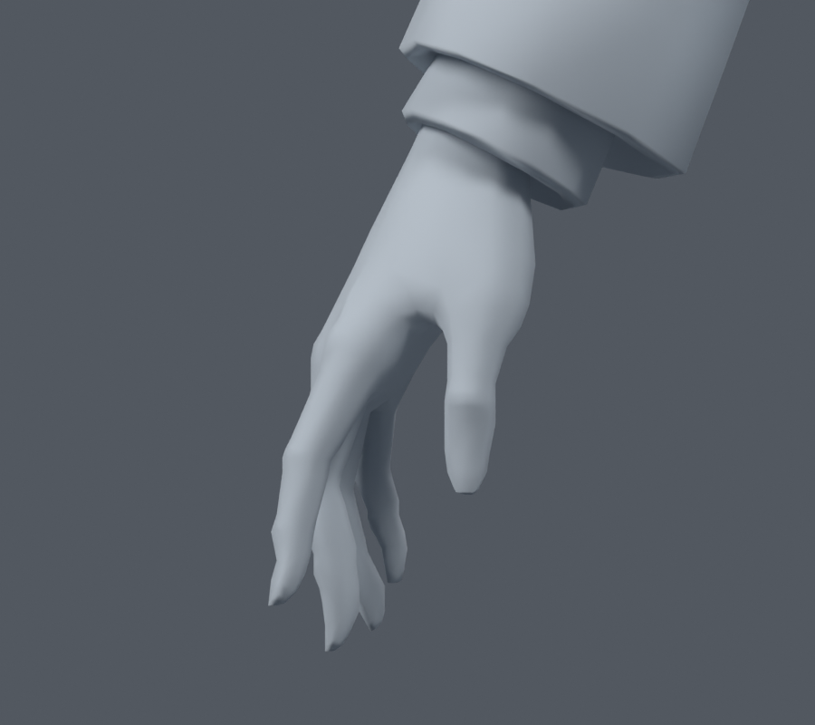
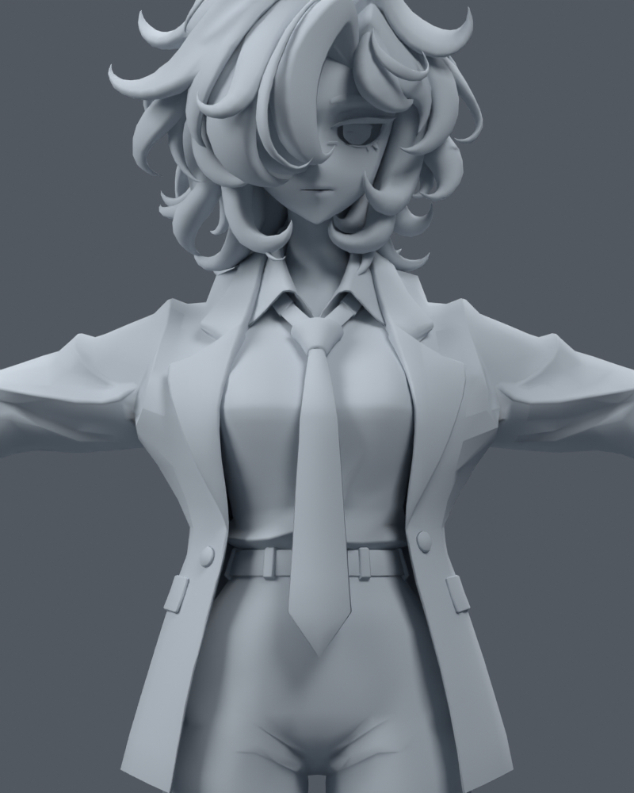
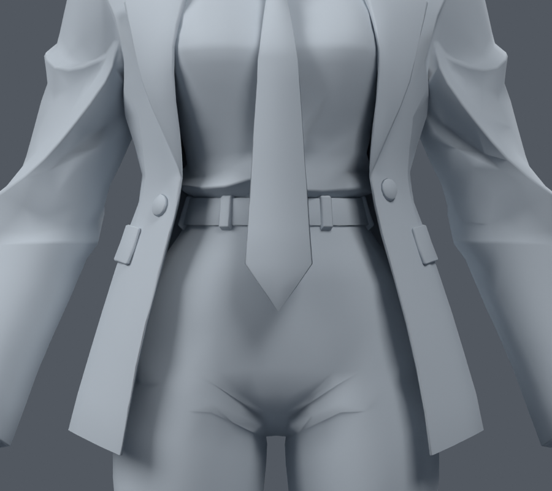
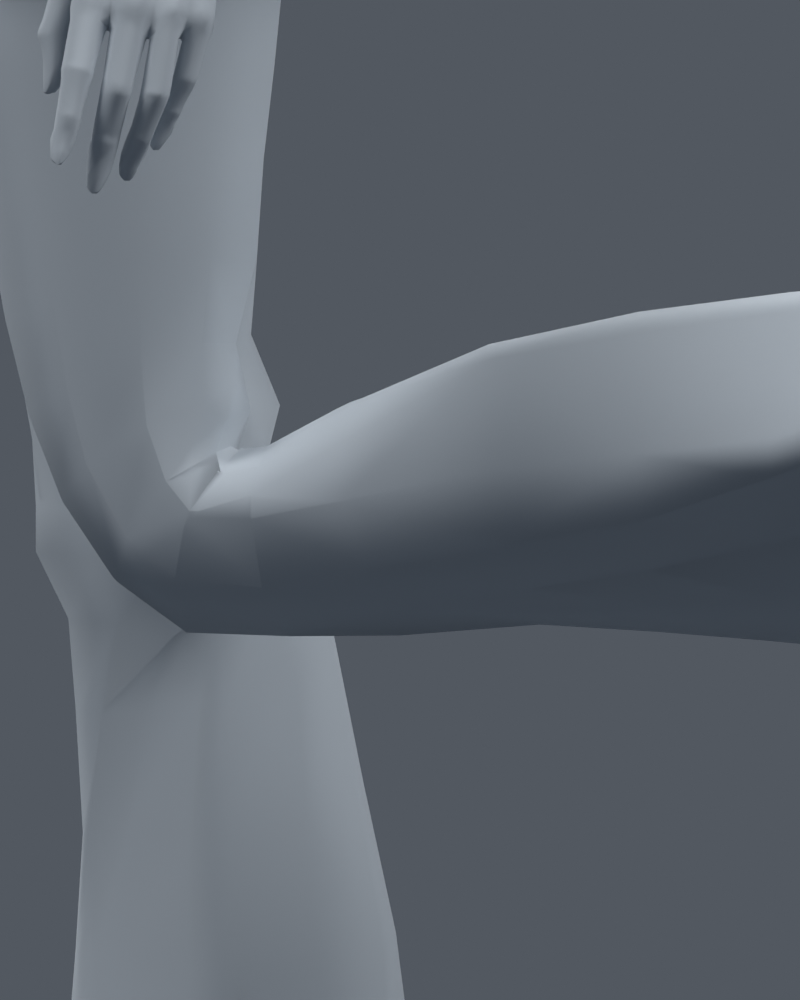
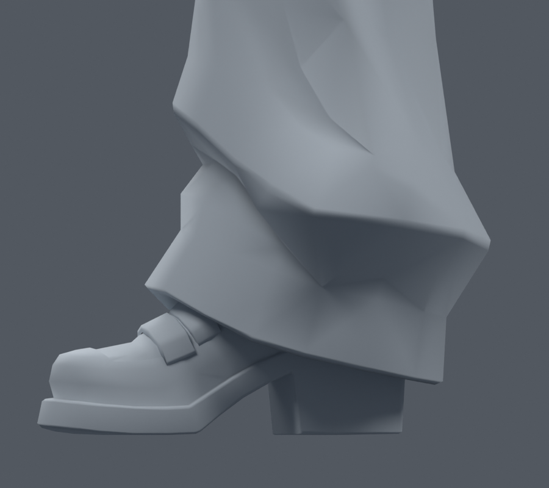

> **기록 시점 안내:** 아래는 해당 단계 당시의 보고서입니다. 후속 결정은 [최신 상태](../../STATUS.md)를 기준으로 읽어주세요. 모델·원본 텍스처·검증 원시 데이터는 이 문서 공유본에 포함하지 않습니다.

# Bianca 관절 구현 조사와 수정 설계

**PC · Unity / VRChat · 조사일 2026-09-09 · 연구 및 제안 단계**

현재 모델을 다시 만들지 않고, 원래 얼굴·체형·의상 실루엣을 보존하면서 자연스럽게 움직이게 만드는 것이 목표다. 이번에는 공식 문서, 변형 기법 논문, 제작자의 YouTube 강의를 대조하고 실제 v006 모델을 읽기 전용으로 검사했다. **모델·본·웨이트·텍스처는 수정하지 않았다.** 이 문서의 후보 설계는 구현 완료나 사용자 채택을 뜻하지 않는다.

읽기 순서는 이 본문 → [구체적인 작업 계획](IMPLEMENTATION_PLAN.md) → [검증 자세와 합격 기준](VALIDATION_PLAN.md)이다. 강의별 확인 구간은 [YouTube 조사 노트](YOUTUBE_NOTES.md), 전체 출처와 열람 한계는 [출처 목록](SOURCES.md)에 있다. 편하게 읽는 [공유용 Markdown 문서](REPORT.md)도 제공한다.

## 1. 먼저 내린 판단

지적한 목·겨드랑이·무릎·옷자락은 서로 다른 원인이 겹쳐 있다. 현재 20본 리그는 좌표를 추정해 만든 진단 리그이고, 일부 웨이트는 부품의 역할보다 높이로 분류했다. 무릎에 한 줄 컷을 추가하고 면적 지표가 개선된 사실만으로 전체 관절이 완성됐다고 판단한 것은 적절하지 않았다. 이전 121프레임도 121가지 독립 동작이 아니라 제한된 자세 사이의 보간을 포함한다.[^33][^34]

**첫 수정은 메시 재구성이 아니라 회전 중심과 웨이트의 역할 분리여야 한다.** 목에서는 턱과 얼굴이 머리를 따라 안정적으로 움직여야 하고, 어깨에서는 쇄골과 상완이 협력해야 한다. 무릎은 앞쪽 부피와 뒤쪽 접힘을 서로 다르게 다뤄야 한다. 재킷 자락은 피부처럼 허벅지를 따라붙게 만들면 앉을 때 다른 문제가 생긴다. 이 네 판단은 모델 검사와 아래 출처들을 종합한 프로젝트별 제안이며, 단일 원인이 실험으로 확정됐다는 뜻은 아니다.

또 하나의 핵심은 **Blender에서 보기 좋은 변형과 VRChat에서 실제로 실행되는 변형을 구분하는 것**이다. Preserve Volume, Corrective Smooth, Bendy Bones, 드라이버를 사용하는 강의의 결과를 FBX로 내보냈다고 해서 해당 계산이 그대로 VRChat에서 실행되지는 않는다. 기본 본·웨이트로 충분한 품질을 확보한 다음, 필요한 보조 본이나 보정 셰이프의 실행 경로를 작은 시험으로 입증해야 한다.[^2][^5][^6][^8][^19]

## 2. 조사 범위와 증거의 수준

대상은 **PC용 VRChat Humanoid 아바타**다. Unity는 VRChat이 지원하는 버전을 기준으로 하고, 데스크톱 조작·헤드셋과 양손 추적·가능한 경우 전신 추적을 나눠 검증한다. 특정 트래커나 손 추적 장치를 사용한다고 가정하지 않는다.

자료는 세 종류로 구분했다. 공식 문서는 엔진·SDK가 지원하는 기능을 판단하는 기준이다. 해부학 자료와 스키닝 논문은 움직임과 변형의 원리를 이해하는 데 사용했다. 제작자 강의는 실제 작업 순서와 실패 사례를 확인하는 자료이며, 강의의 Blender 결과를 PC 런타임 호환성의 증거로 사용하지 않았다.

YouTube 8편의 원본 자막을 확보해 관련 구간을 읽었다. 팔꿈치 강의의 실제 재생 장면도 표본 확인했다. **모든 영상을 처음부터 끝까지 실시간 완주한 것은 아니다.** 자동 자막에는 Bone Roll, Weight Paint 같은 전문 용어의 오기가 있어 문맥과 공식 자료로 교차 확인했다. 자막 전문과 강의 화면은 보고서에 복제하지 않았다. 인터넷·YouTube의 모든 자료를 빠짐없이 조사했다는 의미도 아니다.

이 보고서는 다음 표기를 따른다. **확인**은 로컬 파일이나 실제 열람한 자료에서 확인한 사실, **추정**은 아직 원인 분리 시험이 필요한 해석, **제안**은 이 모델에 적용할 작업 방식, **미검증**은 Unity/VRChat 실행 등 아직 수행하지 않은 항목이다. 이후 시험 각도는 제작용 샘플이며 사람의 정상 관절 가동 범위나 의학적 권고가 아니다.

## 3. 현재 모델의 정확한 출발점

| 항목 | 읽기 전용 검사 결과 |
|---|---|
| 주 검수본 | `deformation_v006/bianca_texture_weights_knee_finish_v006.blend` |
| 상태 | 관절 품질 미완료·재작업 대상. 최종 채택본 아님 |
| 정점 / 면 / 렌더 삼각형 | 34,597 / 17,625 / 31,363 |
| 모델 높이 | 약 0.999512 m. 실제 사용 크기 변경은 아직 결정하지 않음 |
| 본 | 20개, 진단용 본 배치 |
| 셰이프 키 | 없음 |
| 몸 변형 | Armature, Preserve Volume 꺼짐 |
| 손 | 기존 손 형상은 있음. 손가락 본 없음. 손/전완 그룹만 영향 |
| 신발 | 양쪽 각각 발 본 하나만 영향. 발가락 본 없음 |
| 얼굴·목 | 하나의 주 성분에 chest / neck / head 영향 |
| 넥타이 / 주 헤어 성분 | 각각 chest / head만 영향 |
| 검수용 요소 | 헤어 숨김용 Mask 모디파이어가 존재. 최종 내보내기 대상 여부 별도 점검 |

원본 파일 SHA-256은 `4d8b132419a6d90606e445f1c036e203a2181a6102fdb30608161b9c23d191ea`다. MODEL_INVENTORY.json (공유본 미포함: `MODEL_INVENTORY.json`)에 본의 이름·부모·좌표, 부품별 범위와 실제 활성 웨이트 그룹을 기록했다. 이번 이미지 6장은 같은 파일을 메모리에 열어 중립 재질로 렌더했으며 저장하지 않았다. 여러 패킹 이미지가 파일에 존재한다는 사실과 최종 Unity 재질에서 실제 사용하는 텍스처 수는 다르다.[^33]

손의 관절 부근이 이미 각져 보이는 부분은 있지만, 이 정지 렌더만으로 루프 수나 결함을 확정할 수 없다. 손바닥·손등·손가락 사이를 분리한 와이어 검사와 실제 굽힘 시험이 필요하다. 좌우 주 손 성분의 분할 정점 수는 각각 1,350 / 1,377이므로 단순히 동일 인덱스를 좌우 대응시키면 안 된다.

### 기존 Unity 시험 프로젝트의 의미

로컬 `unity_review/ProjectSettings/ProjectVersion.txt`는 **2022.3.62f2**, VPM 기록은 SDK **3.7.6**이다. 해당 README는 과거 Editor 시작이 라이선스 단계에서 멈췄고 실제 Humanoid·장면 검증을 완료하지 않았다고 명시한다. 이 프로젝트는 이전 모델 시험용이며 현재 v006의 런타임 합격 근거가 아니다. 라이선스의 현재 상태를 이번에 다시 시험하지는 않았다.

조사일 공식 VRChat 지원 Unity는 **2022.3.22f1**이다. 실제 구현 시 Creator Companion과 공식 버전 페이지를 다시 확인하고, 적합한 별도 검수 프로젝트를 준비해야 한다. 기존 시험 프로젝트가 존재한다는 이유로 환경 준비와 현재 모델 검증을 생략하지 않는다.[^12]

## 4. 관절이 자연스럽게 보이려면 무엇이 함께 맞아야 하나

관절 변형은 다섯 요소의 조합이다. 기본 형상은 중립 상태의 디자인이고, 본의 기준점과 축은 어디를 중심으로 회전할지 결정한다. 웨이트는 각 정점이 어느 본을 얼마나 따라갈지 정한다. 면의 흐름과 간격은 접힘·늘어남을 표현할 공간을 제공한다. 마지막으로 보조 본·셰이프·물리는 기본 변형으로 남는 문제를 제한된 범위에서 보완한다.

이 중 하나가 틀리면 나머지 요소를 과하게 조절하게 된다. 예를 들어 무릎 중심이 뒤틀린 상태에서 웨이트를 넓게 퍼뜨리면 종아리와 허벅지가 함께 휘는 고무관처럼 보일 수 있다. 겨드랑이 면을 늘려도 쇄골이 고정된 팔 올리기는 어깨 전체의 동작을 재현하지 못한다. 반대로 적절한 본과 웨이트가 있어도 접힘의 양쪽을 표현할 정점이 부족하면 윤곽이 각질 수 있다.

해부학적으로도 모든 부위가 같은 경첩은 아니다. 굽힘·폄, 벌림·모음, 축 회전, 전완의 회내·회외, 엄지 맞섬, 발목 움직임은 구분된다. 다만 실시간 아바타에서 모든 실제 뼈를 복제할 필요는 없다. 눈에 보이는 움직임과 입력 방식에 맞춰 단순화한다.[^1]

### 스키닝을 이해하는 최소한의 식

일반적인 선형 스키닝은 정점 위치를 여러 본의 변환 결과로 계산하고 웨이트로 평균 낸다. 개념적으로 `변형 정점 = Σ(본 웨이트 × 현재 본 변환 × 바인드 역변환 × 원래 정점)`이다. 웨이트 합을 1로 맞추는 것은 필요하지만, 합이 정확하다고 좋은 변형이 되는 것은 아니다. 어떤 본에 얼마나 분배했는지가 더 중요하다.

서로 크게 회전한 두 변환을 평균 내면 관절이 납작해지거나 비틀림 부위가 조여드는 문제가 생긴다. DQ 계열 스키닝은 회전 혼합의 부피 손실을 줄이지만 다른 형태의 부풀음까지 자동 해결하지는 않는다. 이 모델의 기본 비교는 현재처럼 Preserve Volume을 끈 상태로 유지하고, 켠 결과는 원인 비교용으로만 활용하는 것이 적절하다.[^2][^3][^31]

## 5. 사각형과 삼각형, 루프와 컷의 역할

**삼각형이라는 이유만으로 관절에 나쁜 것은 아니고, 사각형이라는 이유만으로 잘 접히지도 않는다.** 편집 중의 사각형은 루프 선택과 흐름 파악에 편리하다. 실제 변형 표면은 삼각형으로 평가되므로 비평면 사각형의 대각선 방향까지 결과에 영향을 준다. 최종 내보내기 전후의 삼각분할이 달라지지 않는지 확인해야 한다.

굴곡에서는 바깥쪽 표면이 길어지고 안쪽이 압축된다. 따라서 양쪽의 필요한 면 간격과 윤곽 지지 방식이 다를 수 있다. 관절 중심 한 줄만 둔 구조, 양옆에 지지선이 있는 구조, 바깥 윤곽을 더 지지하는 구조를 비교하되 모든 관절에 똑같이 세 줄을 넣는 규칙으로 바꾸지 않는다. 팔꿈치 강의와 Dikko의 사례는 이러한 차이를 관찰하는 좋은 자료지만 특정 캐릭터의 해결책을 그대로 복제할 근거는 아니다.[^26][^27]

이 모델에서는 기존 면의 흐름을 먼저 표시하고, 필요한 곳에만 짧은 컷 또는 제한된 면 연결 조정을 검토한다. 전체 삼각형→사각형 변환, 전역 Subdivision, 자동 리메시, 광범위한 Relax는 계획에 포함하지 않는다. 정지 실루엣을 바꾸는 정점 이동은 별도 파일에서 전후 좌표와 최대 이동량을 남긴다.

현재 FBX 유래 정점은 UV·노멀 등으로 분할되어 있다. 예전 진단용 위치 병합 결과의 경계·비다양체 수치를 현재 원본의 확정 결함 수로 쓰지 않는다. 같은 위치에 독립 의상 표면이 겹칠 수 있기 때문이다. 동일 위치 웨이트를 맞출 때도 의도된 한 표면의 분할 정점인지 먼저 확인한다. 전역 Merge by Distance로 해결하려 해서는 안 된다.

## 6. 몸 리그의 기본 구조와 좌표계

현재 `root → hips → spine → chest → neck → head`와 양쪽 팔·다리 구조를 먼저 검토한다. 제어용 본은 Blender에서 포즈를 쉽게 잡는 도구이고, 변형용 본은 정점을 실제로 움직이며, 보조 동작 본은 옷·머리카락 등을 담당한다. 이 세 역할을 구분하면 제어 리그 전체를 런타임에 가져오는 실수를 줄일 수 있다.

Unity Humanoid에는 실제 transform을 올바른 슬롯에 매핑해야 한다. 자동 매핑 성공 표시만 보고 끝내지 않고 T-pose, 좌우, 손가락 순서와 축, 어깨·목 연결을 확인한다. VRChat SDK3는 UpperChest와 손가락 누락을 지원한다. 과거 SDK2 문서의 제한을 현재 규칙처럼 적용하지 않는다. 다만 지원된다는 것과 사용자가 기대하는 손 동작이 구현됐다는 것은 별개다.[^9][^13]

**이 모델의 1차 제안은 기존 Chest–Neck/Clavicle 구조를 유지하며 위치를 검토하는 것**이다. UpperChest를 반드시 추가할 필요는 없다. 추가가 도움이 되는지는 몸통 테스트와 매핑 검증을 거쳐 결정한다. 본을 추가하거나 재배치하면 중립 바인드 상태와 기존 애니메이션 의미가 달라질 수 있으므로 메시가 그대로라는 이유만으로 무위험 변경이라고 보지 않는다.

Blender의 본 길이 방향과 Unity의 모델 전방·상향 축은 같은 개념이 아니다. 좌우 본 Roll을 무조건 0으로 맞추거나 튜토리얼의 Z 회전 수치를 그대로 Unity에 옮기지 않는다. 굽힘 축과 길이 축, 부모 공간, 바인드 상태를 기록하고 매핑 후 실제 움직임으로 확인한다. 손가락·엄지·발의 축은 특히 별도 확인 대상이다.[^4]

### 골반 위치에서 발견한 구체적 차이

현재 `hips` head의 z는 약 **0.575**, 양쪽 `thigh` head는 **0.583**이다. 모델의 현재 Z-up 좌표에서 골반 transform 원점이 허벅지 뿌리보다 약 **8 mm 아래**다. VRChat FBT 가이드는 Hips를 다리 본 시작점보다 위에 두도록 권고한다. 따라서 실제 골반 안에서 회전 중심을 재측정할 이유가 있다.[^14][^33]

이 수치만으로 현재 모든 변형의 원인을 골반으로 확정하거나, 무조건 8 mm 올리면 된다고 결론 내리지 않는다. 정면·측면의 골반 위치, 다리 길이, 바인드 포즈, 캐릭터의 원래 비례를 함께 검토해야 한다. 사용자 체형에 맞춘다고 캐릭터의 다리 길이와 머리 크기를 임의로 현실 비례로 바꾸지 않는다.

## 7. 목·머리·턱 아래·칼라

### 원리와 현재 문제

머리는 비교적 단단한 덩어리이고 목은 머리와 가슴 사이에서 회전과 굽힘을 분담한다. 턱 아래 피부가 목과 이어져 있어도 얼굴의 턱선 전체를 목처럼 늘어나게 만드는 것이 목표는 아니다. 머리 돌리기와 목 돌리기를 구분해야 어느 경계가 잘못 끌리는지 드러난다.

현재 얼굴·목은 높이에 따라 chest→neck→head가 전환되는 규칙을 사용했다. 이 방식은 같은 높이의 턱·목 뒤·셔츠 칼라를 역할별로 나누지 못한다. v007의 목 회전에서는 턱 아래가 눌리고 비틀리며, 숙임에서는 목 밑과 칼라의 연결이 부자연스럽다. CGDive의 목·칼라 작업 역시 머리의 안정적인 추종과 목·의상 연결 웨이트를 분리해서 다룬다.[^23][^34]

### 이 모델의 제안

먼저 얼굴·턱선·귀·목 윗부분·목 아랫부분·셔츠 칼라를 별도 검사 영역으로 표시한다. 눈과 얼굴 표면은 머리에 안정적으로 따라가게 하고, 턱 밑의 실제 연결 영역에서만 목으로 자연스럽게 넘어가도록 한다. 목 전체를 head=1로 고정하거나 턱 주변을 대규모로 평활화하지 않는다.

다음으로 head/neck 기준점을 앞·옆에서 확인한다. 본 위치만 바꾼 시험과 웨이트만 바꾼 시험을 분리한다. 웨이트 조정 시 목 뒤와 목 앞에 같은 높이 함수를 쓰지 않고, 실제 표면과 턱선 보존을 기준으로 분배한다. 칼라는 가슴에 기대는 부분과 목을 둘러싸는 부분을 나눠, 머리를 돌릴 때 칼라 전체가 끌려가지 않게 한다. 셔츠·목 표면의 겹침 경계는 같은 동작을 재생하며 함께 검사한다.

이 단계로도 한 단면에서 접힘이 집중되는 경우에만 목 둘레의 작은 지지 컷을 검토한다. 얼굴의 눈 높이·턱 실루엣을 바꾸는 보정은 포함하지 않는다. 목을 독립적으로 회전한 시험, 머리만 회전한 시험, 둘을 분담한 시험에서 정면 턱 폭·측면 턱선·칼라 틈을 모두 비교해야 통과다.

## 8. 어깨·쇄골·겨드랑이·견갑부

팔을 드는 모습은 상완 한 본의 회전만으로 설명되지 않는다. 쇄골과 어깨 주변이 함께 움직이고, 가슴·등에 붙은 영역과 팔을 따라가는 소매 영역의 역할이 달라진다. Anthony Gibbs의 어깨 사례는 다방향 변형을 위한 면 흐름과 회전 중심, 보조 변형을 나눠 보여준다. 이 중 Bendy Bones와 후처리 모디파이어는 Blender용 사례로 구분한다.[^25]

현재 팔 올리기 시험은 상완 회전 중심이고 쇄골은 고정되어 있다. 겨드랑이가 납작해지고 어깨 윤곽이 꺾이는 현상을 이 시험만으로 토폴로지 문제라고 단정할 수 없다. 현재 재킷 그룹에는 상완·전완·손 외에 머리·목 등의 영향도 존재한다. 해당 그룹의 존재만으로 오류는 아니지만, 어느 정점에 왜 들어갔는지 점검할 근거가 된다.[^33][^34]

**제안 순서:** 쇄골의 안쪽 기준점과 상완 뿌리를 확인한 뒤, 팔 옆으로 들기·앞으로 뻗기·뒤로 보내기를 쇄골 고정/협력 두 조건으로 비교한다. 협력 비율을 인체의 고정 상수처럼 정하지 않고 캐릭터·포즈에 맞춰 검토한다. 가슴 앞판, 어깨 윗면, 소매 아래, 겨드랑이 안쪽, 등판을 나누어 상완 영향이 몸통으로 번지거나 가슴 영향이 소매 끝까지 남는 곳을 정리한다.

웨이트만으로 해결되지 않는 압축 부위는 기존 겨드랑이 면이 어디서 접히는지 확인하고 짧은 국소 컷을 후보로 만든다. 넓은 어깨를 새로 조형하거나 팔 구멍을 전부 다시 만드는 방식은 적용하지 않는다. 견갑·삼각근 보조 본은 기본 변형이 안정된 뒤의 선택 사항이다. 실제 PC 런타임에서 어떻게 추종시킬지 입증하지 않은 보조 본을 여러 개 추가해 해결됐다고 보고하지 않는다.

합격은 팔을 올렸을 때 겨드랑이가 채워져 보이는 것 하나가 아니다. 팔을 내리면 원래 재킷 어깨선으로 돌아와야 하고, 팔을 앞으로 모을 때 가슴판이 과도하게 부풀지 않아야 하며, 뒤로 보낼 때 등판에 뾰족한 당김이 생기지 않아야 한다.

## 9. 팔꿈치·상완 비틀림·전완 회전

팔꿈치 굽힘과 전완의 회내·회외는 별도로 시험한다. 손바닥을 뒤집는 회전을 손목의 짧은 구간에 모두 몰면 손목이 조여들고 소매가 나선처럼 찌그러질 수 있다. 또한 어깨를 돌리는 상완 길이축 회전과 팔꿈치 경첩 동작을 분리해서 관찰해야 한다.[^1]

팔꿈치에서는 상완과 전완의 단단한 구간을 유지하고 그 사이에 제한된 전환 구간을 둔다. 안쪽 주름은 접히고 바깥 팔꿈치 윤곽은 길어질 공간이 필요하다. 전완 전체를 넓게 블러해 둥글게 휘는 막대로 만드는 것을 피한다. 기존 소매 주름이 회전 중심과 어긋났다면 텍스처 탓으로 숨기지 않고 회색 재질과 와이어로 검사한다.

**현재 모델의 1차 작업은 기존 상완–전완 본과 웨이트만 사용한 굽힘·비틀림 비교**다. 비틀림이 짧은 구간에 몰리는 경우 실제 변형용 twist 본을 추가하는 후보를 검토할 수 있다. 한쪽 전완에 1~2개로 시작하는 범위 제안이며, 개수와 위치는 표면 검사 후 결정한다. 손목 방향을 일부 따라가되 팔꿈치 굽힘까지 잘못 섞이지 않도록 길이축 회전과 다른 축 회전을 구분해야 한다.

VRChat Constraint로 중간 추종을 구현하는 시험은 가능하지만, 회전값 한 축에 단순히 0.5를 곱하는 것을 일반적인 swing–twist 분해로 간주하지 않는다. 부모가 이미 회전한 상태에서 다시 같은 회전을 더하는 문제, ±180도 부근의 표현 불연속, 팔 굽힘+손 뒤집기 조합을 시험해야 한다. 실제 보조 본 경로와 웨이트 변경은 새 리그 파일로 분리한다.[^17]

## 10. 손목·손바닥·손가락·엄지

### 손목과 손바닥

손목은 앞뒤 굽힘과 옆 기울기가 있고, 손바닥은 손가락을 쥘 때 완전한 판처럼만 움직이지 않는다. 그러나 이 캐릭터의 기본 손 제스처를 위해 손바닥의 모든 해부학 구조를 구현할 필요는 없다. 먼저 손바닥 중심을 hand 본에 안정적으로 묶고 손목의 짧은 연결 구간만 forearm과 나눠 움직이게 한다. 소매·셔츠 커프는 손목 피부와 별도의 단단함을 유지한다.

현재 손 주 성분은 `hand`와 `forearm`만 영향을 받는다. 손가락 모양이 있다고 손가락 애니메이션이 가능한 상태는 아니다. 양손 각각 손가락 5개를 식별하고 손끝에서 손바닥까지 면 연결을 확인한 후, 기존 형상 안에 본을 배치해야 한다. 손가락이 붙어 있거나 안쪽 면이 잘못 연결된 곳이 발견되더라도 먼저 범위를 기록하며 새 손 메시로 대체하지 않는다.[^33]

### 네 손가락

검지·중지·약지·소지는 기본적으로 손바닥 관절에서 굽힘과 벌림을 표현하고, 그 아래 두 마디에서는 주로 굽힘을 표현한다. 본은 겉의 피부 주름선만 따라 두기보다 실제 회전 중심을 추정해 손가락 내부에 배치한다. CGDive의 손가락 강의는 관절 위치와 Bone Roll을 분리해 다루므로 이 단계의 작업 순서에 유용하다.[^24]

각 손가락에 Proximal / Intermediate / Distal 세 슬롯을 준비하는 안을 기준으로 한다. 손끝은 마지막 본을 안정적으로 따르고, 관절 경계에서만 인접 마디로 전환한다. 손등의 관절 윤곽과 손바닥 쪽 압축을 같은 넓이로 블러하지 않는다. 손가락 사이 웨이트가 번져 검지를 접을 때 중지 옆면이 함께 움직이지 않도록 부위 마스크를 사용한다.

### 엄지와 맞섬

엄지는 네 손가락과 같은 평면·같은 Roll을 복제하면 물건을 집는 자세가 어색해질 수 있다. 손바닥 안쪽 뿌리에서 돌아 나와 검지와 마주 닿는 움직임을 먼저 맞춘다. Humanoid의 엄지 세 transform 슬롯은 해부학적으로 엄지에 지골이 세 개라는 뜻이 아니다. 이름과 해부학 구조를 혼동하지 않는다.

엄지 단독 굽힘뿐 아니라 검지 끝과 맞닿기, 원형 집기, 주먹에서 엄지가 바깥을 감싸는 자세를 검사한다. 이때 엄지 뿌리의 살집이 사라지거나 손바닥이 찢어져 보이면 본 중심·웨이트·기존 연결 면을 순서대로 확인한다. 손바닥 cupping 보조 본은 기본 제스처 통과 후 필요할 때만 제안한다.

### VRChat 입력과 손의 합격 기준

`GestureLeft/Right`의 제스처 번호와 `GestureLeftWeight/RightWeight`는 모든 손가락 관절의 실제 추적 각도가 아니다. 기본 제스처, 컨트롤러 입력, 가능한 손 추적을 동일한 데이터라고 가정하면 보정이 잘못 켜질 수 있다. 기본 8가지 제스처와 그 사이 전환을 먼저 확인하고 장치별 동작은 별도 기록한다.[^15]

양손 모두 편 손·주먹·가리키기·브이·엄지 들기·집기에서 관절 덩어리가 유지되어야 한다. 엄지와 검지가 닿는 것은 의도된 접촉일 수 있으나 손가락 면이 서로 뒤집혀 지나가거나 다른 손가락을 끌고 가는 것은 실패다. 손가락 전체 재조형이나 손바닥의 넓은 재배치는 큰 수정으로 분리한다.

## 11. 가슴·척추·허리·골반

몸통은 가슴과 골반의 상대적으로 단단한 덩어리 사이를 허리·등이 이어 주는 방식으로 설계한다. 허리를 굽힌다고 가슴 중앙까지 고무처럼 균일하게 휘거나, 모든 회전이 벨트 한 줄에 집중되는 것은 피한다. 골반 회전과 척추 굽힘은 분리해서 검사한다.

현재 `hips–spine–chest`의 구간이 실제 허리·흉곽과 맞는지 정면·측면에서 확인한다. 기존 spine 본 추가 없이 가능한 분배를 먼저 시험하고, UpperChest 또는 추가 변형 구간이 필요한 경우 이유를 기록한다. 허리 회전과 가슴 회전을 같은 방향으로 더한 자세뿐 아니라, 골반이 고정된 상태에서 가슴만 도는 자세도 필요하다.

이 모델은 벨트·바지 허리선·재킷 앞판·셔츠·넥타이가 겹친다. 따라서 단순히 높이에 따라 같은 웨이트를 주기보다 재질의 형태적 역할을 나눠야 한다. 벨트는 골반을 비교적 안정적으로 따르고, 셔츠는 몸통을 연결하며, 재킷 앞판은 원래 각진 라펠과 앞 여밈 형태를 지켜야 한다. 넥타이는 현재 chest 하나에 고정되어 있어 숙일 때 별도 처리가 필요하다.

앞 숙임·뒤 젖힘·옆 굽힘·좌우 비틀기를 독립 시험한 뒤 앉기와 합친다. 복부 압축을 줄였다는 이유로 벨트가 몸 안으로 들어가거나 앞판이 고무처럼 늘어나면 합격하지 않는다. 회전 부피 문제가 남을 때도 허리 전체를 재조형하기보다 제한된 웨이트/보조 변형 후보를 비교한다.

## 12. 고관절·엉덩이·사타구니

고관절은 다리를 앞뒤로 흔들고 옆으로 벌리며 길이축으로 회전하는 다방향 관절이다. 무릎처럼 한 줄의 경첩만 생각하면 앉기는 괜찮아도 다리 벌리기나 회전에서 사타구니가 찢어져 보일 수 있다. 골반에 남을 바지 윗부분과 허벅지를 따라갈 부분의 경계를 3차원으로 확인해야 한다.

현재 바지에는 hips, 양쪽 thigh/shin/foot 영향이 있다. 좌우 다리 사이에 반대쪽 thigh 영향이 불필요하게 넘어가는지, 엉덩이 아래 접힘이 너무 넓거나 좁게 잡혔는지 조사한다. 앞판과 뒤판에 같은 높이 경사를 쓰지 않는다. 이 단계의 첫 비교는 골반 기준점 검토와 국소 웨이트 변경이고, 허벅지 자체의 길이·두께를 바꾸지 않는다.

앉기에서는 고관절과 무릎을 함께 굽히되 단독 고관절 시험도 남겨 원인을 분리한다. 바지의 원래 주름이 모이는 부위가 접히면서 면을 뚫고 지나가는지 측면·후면에서 확인한다. 둔부 보조 본이나 pose corrective가 필요한 경우에도 먼저 PC 구동 가능성을 확인한다. 바지를 새로 재단하거나 골반 둘레를 넓게 재토폴로지하는 작업은 이 계획의 자동 실행 범위가 아니다.

## 13. 무릎·슬개부 윤곽·오금

v006의 각 무릎 한 줄 컷은 일부 면적 배율을 줄였지만, 사용자가 지적한 각짐과 압축을 해결하지 못했다. 기존 정점 이동이 없었다는 것은 원형 보존의 증거이지 관절이 자연스럽다는 증거가 아니다. 이번에는 컷 없는 v006 비교본도 함께 두고 본 위치·웨이트·면의 기여를 나눠 보아야 한다.[^34]

**회전 중심 검토:** 옆에서 무릎의 앞 윤곽과 뒤 접힘을 함께 보고 thigh 끝/shin 시작이 관절 내부에 적절히 놓였는지 확인한다. 피부 표면의 가장 튀어나온 지점에 pivot을 바로 두지 않는다. 무릎·발목이 완전히 일직선인 상태의 IK 모호성과 좌우 굽힘 방향도 검사한다.[^14]

**웨이트 검토:** 허벅지와 종아리의 단단한 부분을 유지하고 무릎 앞쪽과 뒤쪽 전환 폭을 따로 조절한다. 오금 안쪽의 과도한 압축을 줄이기 위해 전체 전환 폭을 넓히면 앞쪽 무릎 윤곽까지 흐려질 수 있으므로 앞/뒤 평가를 함께 한다. 무릎이 90도일 때만 좋은 후보를 채택하지 않고 30·60·90·120도에서 비교한다.

**국소 면 검토:** 적절한 pivot/웨이트로도 기존 한 구간이 접힘을 독점한다면 앞쪽 윤곽 지지 또는 뒤쪽 압축 분산을 위한 짧은 컷을 제안한다. 면 전체를 동일 간격으로 늘리는 대신 현재 렌더 삼각분할에 맞춰 표면과 UV를 보간한다. 몇 개 정점·면이 추가되는지 실제 후보를 만든 뒤 세고, 미리 특정 개수를 해결 보장처럼 약속하지 않는다.

무릎 corrective는 후순위다. 굽힘 각도를 실시간으로 읽는 구동 방식이 검증되지 않았는데 Blender의 120도 보정 키만 만들어 완료 처리하지 않는다. 기본 변형이 충분한지 먼저 보고, 남은 국소 윤곽을 보조 본이나 검증된 보정 경로로 해결할지 결정한다.

## 14. 발목·발바닥·발가락·바지 밑단

발목 굽힘, 발의 기울기, 발 앞부분의 접힘, 뒤꿈치 들기는 서로 다른 기준점이 필요하다. 제작용 foot-roll 제어 리그는 이 기준점을 조작하기 쉽게 만들지만, 그 제어 장치를 그대로 VRChat의 실시간 보행 IK로 옮기는 것은 아니다. CGDive 강의의 발끝·뒤꿈치·안팎 피벗은 이 구분을 이해하는 자료로 사용했다.[^29]

현재 신발은 각각 foot 본 하나만 따라가고 toes 본은 없다. 굽 있는 구두의 밑창과 굽은 원래 단단한 실루엣을 유지해야 한다. 기본 발목 회전을 먼저 검증한 뒤, 필요한 경우 발볼 위치의 toes 본을 추가해 앞부분만 제한적으로 굽히는 안을 제안한다. VRChat 리그 가이드는 발가락 본이 자동 발 자세에 도움이 될 수 있다고 설명한다.[^13]

단단한 굽까지 발가락을 따라 휘게 하지 않고, 신발 윗부분과 바지 밑단의 경계를 함께 검사한다. 바지 밑단을 foot에 과하게 붙이면 발목을 들 때 바지가 접혀 신발 안으로 들어갈 수 있다. 반대로 shin에만 묶으면 발등과 밑단이 벌어질 수 있어 국소적으로 균형을 맞춘다.

바닥 접촉은 Blender의 모양 검사와 Unity/VRChat의 보행 결과를 나눠 확인한다. 발 미끄러짐이나 발끝 들림은 메시뿐 아니라 Humanoid 매핑·모델 크기·추적 상태의 영향을 받을 수 있다. foot-roll 강의대로 보조 본을 만들었다는 이유로 실제 VRChat 발 접지가 해결됐다고 판단하지 않는다.

## 15. 눈·눈꺼풀·턱·입·표정

몸 관절 조사와 별도로 얼굴의 가동 구조도 설계해야 한다. 현재 셰이프 키·안구 본·턱 본은 없으며, 눈 주변은 기존 돌출 조각과 텍스처를 맞추는 작업을 거쳤다. 사용자가 선택한 것은 기존 형상에 텍스처를 맞추는 A 방식이므로 B의 눈 정점 변경을 합치지 않는다.[^33]

**시선:** 독립된 구형 안구가 있다고 가정하지 않는다. 현재 홍채·눈꺼풀 조각이 어떤 표면인지 먼저 확인하고, 눈 본 회전으로 눈꺼풀 밖으로 튀어나오지 않는지 시험한다. 적절한 회전 중심을 가진 안구 구조가 아니면 제한된 시선용 셰이프나 Eye Look 범위 제한을 비교해야 한다. 눈을 새 구체로 교체하는 것은 이번 제안의 기본 경로가 아니다.

**눈 감기:** 중립 눈매를 Basis로 보존하고 위·아래 눈꺼풀의 닫힘 경로를 설계한다. 0/50/100% 중간 상태에서 눈꺼풀 겹침, 흰 틈, 속눈썹·눈썹 끌림을 검사한다. 닫힌 한 프레임만 맞고 중간에서 눈이 납작하게 관통하는 키는 채택하지 않는다. 셰이프 키는 기존 정점 위치의 변화를 저장하므로, 본격적인 얼굴 키 제작 전 국소 토폴로지를 안정시키는 순서가 유리하다.[^7]

**턱·입:** 턱 본은 얼굴 전체를 돌리는 본이 아니다. 턱관절 주변 pivot과 아랫입술·턱의 움직임을 검사하고, 입꼬리와 윗입술은 별도로 다룬다. 입 내부·치아·혀가 현재 표현 가능한 구조인지 확인한 후 lip sync 방식을 선택한다. 입을 열기 위해 넓은 면 재구성이나 새 내부 구조가 필요하면 구체적인 범위로 별도 의견을 받는다.

**립싱크:** VRChat의 viseme 체계는 0~14의 입 모양 상태를 사용한다. 이 사실을 모든 얼굴에 턱 회전 하나면 충분하다는 뜻으로 해석하지 않는다. 실제 음성 입력에 사용할 입 모양과 표정을 함께 켰을 때 과장·관통이 생기는지도 검사한다. 몸 관절 수정 완료와 얼굴 기능 완료는 별도로 기록한다.[^15]

## 16. 재킷 자락·라펠·칼라·커프·넥타이·헤어

### 재킷 자락이 피부와 다른 이유

재킷은 허리에서 아래로 떨어지는 형태가 있고, 다리가 앞으로 움직여도 옷의 모든 점이 같은 비율로 허벅지를 따라가지는 않는다. v006에서 허벅지 영향만 강화한 후보가 다른 자세를 악화시킨 것은 이 구분을 검토할 근거다. 먼저 물리 없이 앉기·걷기의 기본 스키닝을 안정시키고, 이후 옷 전용 본으로 움직임을 추가하는 순서가 적절하다.

후보는 재킷의 앞/뒤·좌/우 패널을 구분해 **4개 체인 × 2개 변형 본 = 8개 본**을 시험하는 안이다. 이는 고정 설계가 아니라 검사 가능한 첫 구조 제안이다. 실제 메시를 4개로 잘라 새로 만드는 뜻은 아니다. 윗부분은 허리·몸통에 안정적으로 붙이고 아래로 갈수록 해당 자락 본을 따르게 한다. 패널 경계의 정점은 끊어져 보이지 않도록 함께 평가한다.

처음에는 옷 본을 수동 포즈해 앉기에서 필요한 공간이 나오는지 확인한다. 여기서 해결되지 않으면 물리를 켜도 안정적이라고 기대하지 않는다. 자락 폭을 크게 넓히거나 길이를 바꿔 관통을 숨기는 것은 사용자 디자인 변경에 해당한다.

### PhysBone과 충돌의 실제 역할

PhysBone은 헤어·옷 등의 본 체인에 후속 움직임을 주는 기능이다. Collider와 본 반경을 통해 충돌을 다루지만 재킷의 모든 삼각형과 허벅지 표면을 정확히 충돌시키는 천 시뮬레이션은 아니다. 따라서 관통 0을 자동으로 보장한다고 설명하지 않는다. Humanoid 몸 본 전체에 PhysBone을 걸어 관절 문제를 해결하려 하지 않는다.[^18]

제안은 자락 뿌리를 고정하고 끝의 작은 흔들림부터 조정하는 것이다. 과한 중력·Pull·Spring 값을 먼저 정하는 대신 중립 복귀, 급정지, 앉은 채 유지, 다리 교차를 비교하며 값과 버전을 기록한다. Collider는 허벅지·골반 등 필요한 접촉 상대만 지정해 불필요한 체크를 줄인다. 회전 제한은 원래 옷 실루엣이 허용하는 범위에 맞춘다.

Constraint와 PhysBone이 같은 transform을 서로 덮어쓰지 않도록 계층을 나누고 실행 결과를 확인한다. 예를 들어 기준 추종을 담당하는 부모와 물리를 담당하는 자식 체인을 나누는 후보를 검토할 수 있다. 단순히 컴포넌트를 추가했다고 실제 클라이언트의 평가 순서가 검증된 것은 아니다.[^18]

### Unity Cloth는 언제 검토할까

PC에서는 Unity Cloth를 허용 목록과 함께 검토할 수 있다. Cloth는 SkinnedMeshRenderer의 천 변형 기능이며 고정 영역·이동 허용 거리·명시적 충돌체 등을 설정한다. 일반 월드의 모든 Collider와 자동으로 상호작용한다고 가정하지 않는다.[^19][^21]

다만 현재 전체 캐릭터 메시를 Cloth 대상으로 쓰는 것은 적합하지 않다. PC 성능 표의 Total Cloth Vertices는 Good 50, Medium 100, Poor 200이므로 별도의 작은 옷 부분을 설계하더라도 비용을 먼저 계산해야 한다. 이 제한은 업로드 금지와 동일한 뜻은 아니지만 이번 캐릭터의 기본 대안은 옷 본+PhysBone으로 제안한다. 별도 메시 분리나 대규모 저해상도 시뮬레이션 구조가 필요하면 큰 변경 후보로 구분한다.[^20]

### 다른 의상과 머리카락

라펠과 어깨 앞판은 재킷의 단단한 선을 지킨다. 칼라는 목·가슴 연결을 먼저 해결하고, 커프는 손목을 따르되 고무 밴드처럼 조여들지 않게 한다. 넥타이는 매듭을 가슴에 두고 아래 2개 정도의 본을 시험하는 안을 검토할 수 있다. Pierrick Picaut의 매달린 장비 강의는 몸통 회전 추종과 기울기·매달림을 구분하는 데 유용하지만 Blender Constraint를 그대로 내보내는 처방은 아니다.[^28]

주 헤어는 현재 head만 따라간다. 머리카락이 길어 보인다고 전체를 같은 강도로 흔들면 원래 두꺼운 덩어리 실루엣과 눈을 가리는 디자인이 무너질 수 있다. 앞머리·옆머리·뒤쪽 끝 중 움직여도 되는 부분만 골라 짧은 체인을 제안하고, 뿌리와 얼굴을 가리는 핵심 부분은 안정적으로 둔다. 자동 헤어 재생성·가닥 재설계는 하지 않는다.

## 17. 보정 셰이프와 보조 본을 PC 런타임에서 쓰는 법

포즈 보정은 특정 자세에서 부족한 표면을 추가로 보완하는 방식이다. 예제 기반 변형 연구는 하나 또는 여러 관절 상태에 따른 보정을 다루며, 팔 올림+회전처럼 여러 축이 섞이면 단일 각도만으로 충분하지 않을 수 있다.[^22]

| 기법 | Blender에서의 역할 | Unity / VRChat 계획 |
|---|---|---|
| 일반 본 + 정규화 웨이트 | 기본 변형 | 1차 구현 기준. 바인드/매핑/실제 포즈 확인 |
| Preserve Volume | 부피 손실 비교 | 켠 결과를 기본 FBX 런타임 결과로 간주하지 않음 |
| Corrective Smooth | 포즈 후 표면 완화 | 모디파이어 자체의 실행을 기대하지 않음. 국소 보정 탐색용 |
| Bendy Bones 세그먼트 | 곡선형 본 변형 | 동일 이름의 실제 본 체인으로 자동 전환된다고 가정하지 않음 |
| Shape Key / BlendShape | 정점 변위 저장 | FBX 키 데이터와 Unity 변형을 왕복 검증 |
| Blender Driver | 자세에 따른 값 계산 | FBX에 구동 로직이 그대로 이식되지 않음 |
| VRChat Constraint | transform 추종·제약 | 보조 본 후보. 부모 공간·축·다중 포즈 실증 필요 |
| Animator의 포즈별 보정 | 정해진 클립과 보정 동기화 | 해당 제스처/애니메이션에 한정해 검증 |
| 임의 C# 관절각 드라이버 | 일반 Unity에서는 작성 가능 | 아바타 허용 컴포넌트 정책상 기본 해결책으로 채택하지 않음 |

**무릎 각도에 따라 보정 키가 저절로 켜진다고 약속할 수 없다.** VRChat 기본 Animator 파라미터에는 모든 관절의 실시간 각도가 제공되지 않는다. `AngularY`를 무릎·목 각도로 해석하거나 `Seated/Upright`를 실제 굽힘 각도처럼 쓰면 안 된다. 사용자 스크립트를 아바타에 넣으면 그대로 실행된다는 가정도 성립하지 않는다.[^15][^19]

따라서 이 모델에서는 기본 스키닝을 우선한다. 보조 본으로 해결할 수 있는 변형은 PC Constraint 시험으로 검증하고, 특정 제스처에만 필요한 보정은 해당 클립과 정확히 묶는다. 자유 추적의 모든 자세에서 작동하는 관절 corrective가 꼭 필요하다면 **각도 입력→보정값 계산→BlendShape 구동→다른 레이어와의 충돌 방지** 경로를 먼저 별도 시험해야 한다. 이번 조사에서 이 경로를 구현하거나 검증하지 않았다.

Playable Layer에는 몸·손 제스처의 transform과 FX의 BlendShape 등이 함께 관여할 수 있다. 하나의 보정을 추가하며 기존 Base/Tracking 동작을 덮어쓰지 않도록 Avatar Mask와 레이어 책임을 문서화한다. 전체 몸을 고정한 포즈가 예쁘다고 실제 추적에서도 정상이라고 판정하지 않는다.[^16]

## 18. 내보내기·Humanoid·실제 VRChat 검수

먼저 내보낼 변형 본과 메시를 명시하고, 진단 카메라·조명·헤어 숨김 등 검수용 요소를 제외하는 사본을 준비한다. 원본을 덮어쓰지 않는다. 모델 크기·축·오브젝트 transform·본 경로·바인드 포즈를 기록하고, 음수 또는 비균일 스케일이 있는지 확인한다. T-pose는 Humanoid 매핑을 위한 기준이며 현재 디자인의 중립 포즈와 혼동하지 않는다.

FBX 왕복 검증은 메시가 보인다는 확인보다 넓다. UV·삼각분할·재질 슬롯·본 계층·웨이트·BlendShape를 각각 비교한다. 정점 수는 UV/노멀 분할 방식 때문에 도구 간 달라질 수 있으므로 무조건 인덱스 1:1로 좌표를 비교하지 않고 원래 표면 대응도 확인한다. 변형용 본만 내보내는 옵션이 연결에 필요한 부모까지 어떻게 처리했는지 실제 파일에서 확인한다.

Unity에서는 Humanoid Mapping과 T-pose를 확인한 다음 Muscle Preview를 통해 몸과 손의 동작을 검사한다. Importer의 Skin Weights와 실제 SkinnedMeshRenderer의 제한을 함께 확인하고, 기본 작업은 정점당 최대 4본으로 유지한다. 4본은 이번 호환성·검수 기준이지 Unity가 더 많은 영향을 절대로 지원하지 않는다는 뜻은 아니다. Bounds가 작아 움직이는 팔·헤어가 사라지는지도 확인한다.[^9][^10][^11]

그 뒤 VRChat SDK Build & Test와 실제 클라이언트에서 서기·걷기·앉기·팔 들기·손 제스처·시선·물리를 검사한다. Blender 저장 재로드, FBX 왕복, Unity 미리보기, VRChat 실제 실행은 서로 다른 검증 단계다. 앞 단계를 통과해도 뒤 단계를 완료했다고 기록하지 않는다. 이번에는 이 실행 검증을 수행하지 않았다.

### 자료 충돌: FBX의 셰이프 키

Blender 5.2의 FBX Legacy 문서에는 셰이프 키 내보내기에 관한 오래된 제한 문구가 남아 있다. 반면 이 PC에 설치된 exporter에는 `fbx_data_mesh_shapes_elements`와 BlendShape 데이터를 쓰는 코드가 존재한다. 따라서 문구만 보고 “Blender FBX는 셰이프 키를 못 내보낸다”고 결론 내리지 않는다. 코드 존재만으로 현재 캐릭터의 모든 키가 정상 전송된다고 보장하지도 않는다. 실제 사용할 exporter의 작은 키 한 개로 왕복 시험을 하는 것이 결론이다.[^8][^32]

## 19. PC 성능 예산과 품질의 균형

제안 목표는 우선 **PC Good**이다. 현재 31,363삼각형은 Excellent의 삼각형 항목 기준 32,000보다 637 적지만, 이는 전체 등급이 Excellent라는 뜻이 아니다. 관절의 작은 개선에 필요한 컷을 삼각형 항목 하나 때문에 무조건 포기하지 않는다. 최종 등급과 실제 비용은 SDK 통계·재질·텍스처·물리 설정을 함께 봐야 한다.[^20]

| PC 항목 | Excellent | Good | 이번 계획의 해석 |
|---|---:|---:|---|
| 삼각형 | 32,000 | 70,000 | 원형 보존과 필요한 국소 편집 우선 |
| Bones | 75 | 150 | 손가락·선택 보조 본의 여유를 검토 |
| Skinned Meshes | 1 | 2 | 의상 분리는 비용과 함께 판단 |
| Material Slots | 4 | 8 | 실제 내보내는 슬롯 수 확인 |
| Texture Memory | 40 MB | 75 MB | 파일에 패킹된 이미지 수와 런타임 메모리를 구분 |
| PhysBone Components | 4 | 8 | 체인 구성 후 SDK 실측 |
| PhysBone Transforms | 16 | 64 | 뿌리·끝점·중복 영향 포함 여부 실측 |
| PhysBone Collision Checks | 32 | 128 | 불필요한 충돌 조합 제거 |
| Constraints / Depth | 100 / 20 | 250 / 50 | 수보다 계층 의존성도 관리 |

예시 본 수는 기존 20 + 손가락 30 + toes 2 + eyes 2 + jaw 1 = **55개**다. 이것은 기능 후보를 모두 포함한 산술이며 안구·턱 구조가 아직 검증되지 않았다. 여기에 twist 4, 자락 8, 넥타이 2, 헤어 6을 넣는 예시는 75개이고 UpperChest나 다른 보조 본이 추가되면 더 늘어난다. 개수를 맞추려고 불필요한 본을 만들거나 필요한 변형을 희생하지 않는다. 실제 SDK Bones 집계와 이 설계용 합계는 다시 대조해야 한다.

## 20. 수정 순서와 중단 기준

먼저 현재 상태와 원본 해시를 동결하고, 골반·어깨·목·팔꿈치·무릎·손목·발목 중심을 측정한다. 이어서 **목 → 겨드랑이 → 무릎 → 옷자락** 순으로 한 부위씩 기존 본/웨이트 후보를 비교한다. 몸통과 고관절은 해당 시험의 공통 기반으로 함께 점검한다. 그 다음 손가락·발가락·보조 비틀림, 얼굴 기능, 의상/헤어 후속 움직임, Unity/VRChat 통합 순서로 진행하는 안이다.

각 단계는 기준 파일, 바뀐 요소, 바꾸지 않은 요소, 실제 자세 렌더, 수치 검사, 남은 문제를 남긴다. 한 후보가 특정 자세를 개선하면서 다른 자세를 악화시키면 자동으로 누적하지 않는다. 실패 후보도 비교 이유를 남기되 주 파일과 혼동되지 않게 표시한다. 주요 단계마다 Git 커밋·push·원격 SHA 확인을 수행한다.

넓은 면 재구성, 본 구조의 큰 교체, 얼굴 인상 변화, 의상 폭·길이 변경, 손·발 재조형이 필요해지면 먼저 대상·필요성·예상 변화·대안을 구체적으로 보여 주고 의견을 받는다. 이번 연구 문서는 그런 작업을 이미 승인받은 것으로 처리하지 않는다. 재생성·자동 리메시는 후보에서도 제외한다.

## 21. 검증을 어떻게 바꿀 것인가

이전의 좌표 유효성·정규화·면적 비율은 유지하되 **보조 검사**로 둔다. 시각 합격은 정지 원형 보존, 작은 각도부터 큰 각도까지의 연속성, 관절 부피, 자연스러운 접힘, 의상 겹침, 중립 복귀를 모두 본다. 부위별 3~5개 각도와 조합 자세를 명시하고 좌우·앞·옆·사선에서 같은 카메라로 비교한다.

색상 렌더는 디자인을, 회색 렌더는 형상과 음영을, 와이어는 접힘 위치를 확인하는 역할이다. 세 종류를 서로 대체하지 않는다. 텍스처의 주름을 실제 면 접힘으로 오인하거나, 회색에서 드러난 문제를 조명으로 가리지 않는다. 변경 영역 밖은 좌표·UV·이미지 해시를 보존 검사하고, 변경 영역은 정점별 기록과 중립 실루엣 비교를 남긴다.

세부 시험은 [VALIDATION_PLAN.md](VALIDATION_PLAN.md)의 ID로 관리한다. 계획된 시험은 모두 **미실행**으로 시작한다. 장비가 없는 FBT·손 추적 시험은 미검증으로 남기며 데스크톱 미리보기로 대신 통과 처리하지 않는다. 자연스러운 동작의 최종 채택에는 실제 결과를 사용자가 확인할 수 있는 전후 자료가 필요하다.

## 22. 아직 모르는 것과 다음 구현에서 답할 것

현재 손가락 내부 연결과 각 마디의 정확한 지지 면 수, 눈 조각의 회전 가능한 표면 구조, 입 내부의 표현 가능 범위는 추가 와이어 검사가 필요하다. 관절의 새 pivot 좌표와 최적 웨이트는 이번 문서만으로 확정할 수 없다. 현재 텍스처를 최종 PC 재질로 내보냈을 때의 메모리와 셰이더 비용도 아직 실측하지 않았다.

기본 본·웨이트만으로 네 문제 부위가 어느 수준까지 개선되는지, 자락 8본 제안이 실제 메시의 패널 흐름에 적합한지, 추가 twist 본이 복합 회전에서 안정적인지 확인해야 한다. 임의 관절각 기반 corrective의 VRChat 구동은 별도 실증 과제다. 기존 Unity 시험 환경의 라이선스·지원 버전 정합성도 실제 실행 전에 다시 확인해야 한다.

현재의 확실한 결론은 **더 많이 생성하거나 더 많이 자르는 것보다, 기존 형상 안에서 관절의 역할을 다시 나누고 실제 동작으로 판정해야 한다**는 것이다. 이 문서와 동반 계획은 그 순서와 실패 시 판단 기준을 구체화한 결과다. v006 관절 품질은 여전히 미완료이며 새 수정 완료본은 없다.

## 참고문헌

아래 번호는 본문 각주와 연결된다. 열람 방식·버전·제한과 강의 구간은 [SOURCES.md](SOURCES.md), [YOUTUBE_NOTES.md](YOUTUBE_NOTES.md)에 별도로 기록했다.

<!-- REFERENCES -->

[^1]: OpenStax. [Anatomy and Physiology 2e, 9.5 Types of Body Movements](<https://openstax.org/books/anatomy-and-physiology-2e/pages/9-5-types-of-body-movements>). 2e. 열람 2026-09-09.

[^2]: Blender Foundation. [Armature Modifier](<https://docs.blender.org/manual/en/latest/modeling/modifiers/deform/armature.html>). 5.2 / latest. 열람 2026-09-09.

[^3]: Ladislav Kavan et al.. [Geometric Skinning with Approximate Dual Quaternion Blending](<https://dcgi.fel.cvut.cz/publications/2008/kavan-tog-adqb/>). ACM TOG 2008. 열람 2026-09-09.

[^4]: Blender Foundation. [Rigify — Bone Positioning Guide](<https://docs.blender.org/manual/en/latest/addons/rigify/bone_positioning.html>). 5.2 / latest. 열람 2026-09-09.

[^5]: Blender Foundation. [Corrective Smooth Modifier](<https://docs.blender.org/manual/en/4.2/modeling/modifiers/deform/corrective_smooth.html>). 4.2. 열람 2026-09-09.

[^6]: Blender Foundation. [Bendy Bones](<https://docs.blender.org/manual/en/3.5/animation/armatures/bones/properties/bendy_bones.html>). 3.5. 열람 2026-09-09.

[^7]: Blender Foundation. [Shape Keys — Introduction](<https://docs.blender.org/manual/id/3.0/animation/shape_keys/introduction.html>). 3.0; 5.1 dev Workflow 검색 본문 교차 확인. 열람 2026-09-09.

[^8]: Blender Foundation. [FBX (Legacy)](<https://docs.blender.org/manual/en/5.2/files/import_export/fbx_legacy.html>). 5.2. 열람 2026-09-09.

[^9]: Unity Technologies. [Importing a model with humanoid animations](<https://docs.unity3d.com/kr/2022.3/Manual/ConfiguringtheAvatar.html>). 2022.3. 열람 2026-09-09.

[^10]: Unity Technologies. [Avatar Muscle & Settings tab](<https://docs.unity3d.com/2022.3/Documentation/Manual/MuscleDefinitions.html>). 2022.3. 열람 2026-09-09.

[^11]: Unity Technologies. [Skinned Mesh Renderer component](<https://docs.unity3d.com/cn/2022.3/Manual/class-SkinnedMeshRenderer.html>). 2022.3. 열람 2026-09-09.

[^12]: VRChat. [Current Unity Version](<https://creators.vrchat.com/sdk/upgrade/current-unity-version/>). 조사일 지원 Editor 2022.3.22f1. 열람 2026-09-09.

[^13]: VRChat. [Rig Requirements](<https://creators.vrchat.com/avatars/rig-requirements/>). SDK3 기준. 열람 2026-09-09.

[^14]: VRChat. [Full-Body Tracking](<https://docs.vrchat.com/docs/full-body-tracking>). 조사일 문서. 열람 2026-09-09.

[^15]: VRChat. [Animator Parameters](<https://creators.vrchat.com/avatars/animator-parameters/>). 조사일 문서. 열람 2026-09-09.

[^16]: VRChat. [Playable Layers](<https://creators.vrchat.com/avatars/playable-layers/>). 조사일 문서. 열람 2026-09-09.

[^17]: VRChat. [VRChat Constraints](<https://creators.vrchat.com/common-components/constraints/>). 조사일 문서. 열람 2026-09-09.

[^18]: VRChat. [PhysBones](<https://creators.vrchat.com/common-components/physbones/>). 조사일 문서. 열람 2026-09-09.

[^19]: VRChat. [Allowed Avatar Components](<https://creators.vrchat.com/avatars/whitelisted-avatar-components/whitelisted-avatar-components/>). 조사일 문서. 열람 2026-09-09.

[^20]: VRChat. [Avatar Performance Ranking System — PC Limits](<https://creators.vrchat.com/avatars/avatar-performance-ranking-system/>). 페이지 표시 갱신 2026-04-21. 열람 2026-09-09.

[^21]: Unity Technologies. [Cloth](<https://docs.unity3d.com/2022.3/Documentation/Manual/class-Cloth.html>). 2022.3. 열람 2026-09-09.

[^22]: J. P. Lewis. [Example-based Shape Deformation](<https://www.skinning.org/example-based.pdf>). SIGGRAPH 2014 course material. 열람 2026-09-09.

[^23]: CGDive. [RIGGING L3-6 : Pro Weight Painting](<https://www.youtube.com/watch?v=rf3NDKXYpTk>). 2025-04-15, 약 54분. 열람 2026-09-09.

[^24]: CGDive. [RIGGING L2-2 : IK, Fingers, Bone Roll](<https://www.youtube.com/watch?v=QnCo0hzXKeQ>). 게시일 미확인, 약 16분. 열람 2026-09-09.

[^25]: Anthony Gibbs. [3D Character Creation for Animation - The Shoulder](<https://www.youtube.com/watch?v=c_XM01I6ed0>). 게시일 미확인, 약 6분. 열람 2026-09-09.

[^26]: Anthony Gibbs. [3D Character Creation for Animation - Elbow Topology](<https://www.youtube.com/watch?v=dEvWZwRxeWQ>). 게시일 미확인, 약 4분 39초. 열람 2026-09-09.

[^27]: Dikko. [Modeling For Animation 01 - TOP 5 Features of Good Animation Models!](<https://www.youtube.com/watch?v=01WQlMD7dsk>). 게시일 미확인, 약 30분. 열람 2026-09-09.

[^28]: Pierrick Picaut. [Rigging hanging equipment in Blender](<https://www.youtube.com/watch?v=Vg2oS1P9m2o>). 게시일 미확인. 열람 2026-09-09.

[^29]: CGDive. [RIGGING L3-3 : Improved Leg Rig](<https://www.youtube.com/watch?v=ErR4RysRy0g>). 게시일 미확인, 약 59분. 열람 2026-09-09.

[^30]: Pierrick Picaut. [This Blender Trick Makes Weight Painting EASY](<https://www.youtube.com/watch?v=4VI5jk7pZag>). 게시일 미확인, 약 12분. 열람 2026-09-09.

[^31]: Unity Technologies. [Importing skinned Meshes](<https://docs.unity.cn/2019.1/Documentation/Manual/ImportingSkinnedMeshes.html>). 2019.1, 역사적 공식 문서. 열람 2026-09-09.

[^32]: Blender 설치 코드. FBX exporter — fbx_data_mesh_shapes_elements (로컬 설치 코드 확인; 설치 경로 생략). 설치 Blender 5.2.1 LTS. 열람 2026-09-09.

[^33]: 프로젝트 읽기 전용 검사. v006 Model Inventory (공유본 미포함: `MODEL_INVENTORY.json`). 2026-09-09. 열람 2026-09-09.

[^34]: 프로젝트 재검수. [v007 관절 재검수](../joint_audit_v007/REVIEW.md). 2026-09-09. 열람 2026-09-09.
