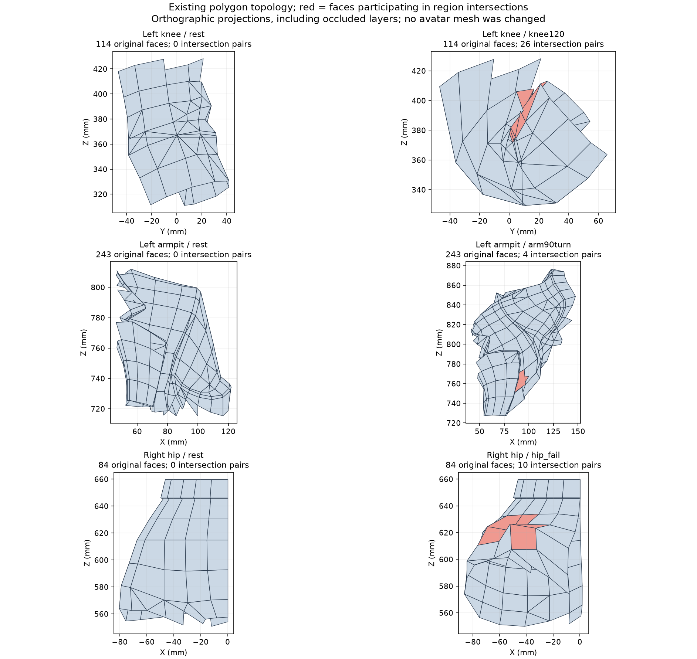
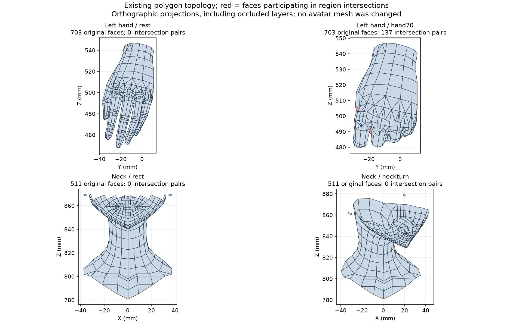

> **기록 시점 안내:** 아래는 해당 단계 당시의 보고서입니다. 후속 결정은 [최신 상태](../../STATUS.md)를 기준으로 읽어주세요. 모델·원본 텍스처·검증 원시 데이터는 이 문서 공유본에 포함하지 않습니다.

# 남은 관절 문제의 수정 방향 — 토폴로지 재검토 v031

2026-09-09. 사용자는 해결되지 않는 문제를 조사하고 방향을 확정한 뒤 실행하며 토폴로지도 다시 확인하라고 했다. 기준은 v030 사본이다. 기존 메시의 국소 수정만 허용하며 전체/부분 재생성·대체·자동 리메시는 하지 않는다. 본 구조 변경은 허용된 상태다.

**실행 후 갱신:** 아래 첫 방향에 따라 실제 두 면 컷 사본을 만들고610손 자세를 검증했다. 동시 적용41자세, 한 면씩 분리14/18자세 악화로 모두 미채택이다. 대각선 교체만을 주 해결책으로 삼는 방향을 제외하고 기존 관절 면 흐름과 회전축/웨이트를 함께 다루기로 확정했다. 실제 평가 삼각형 검사 보완과 부위별 후속 순서는 [실행 결과](REVIEW.md)를 따른다.

## 확정한 순서

1. **검사 표면을 실제 표시/내보내기 표면과 맞춘다.** 고정된 휴지 자세 삼각형만 보던 기존 면적 검사에, 변형 후 실제 사각형 분할과 부위별 자기 교차를 추가한다. 양성 면적이어도 안쪽 면끼리 뚫릴 수 있다.
2. **원래 정점을 유지한 국소 면 연결부터 시험한다.** 압축 또는 내부 교차에 연관된 기존 사각형의 대각선 방향을 비교하고, 최대8개 사각형에 명시적인 대각선 컷을 넣는 별도 사본부터 만든다. 새 점/외곽 이동 없이 최대8면 증가 범위다. 원래 UV와 코너 노멀을 대응시키고, 다른 대각선 때문에 중립 표면 내부가 달라지는 거리도 측정한다. 비교 단계의 허용 상한은0.5mm이며 기준 대비 교차/새 압축이 악화하면 채택하지 않는다. 이 수치는 이번 보수적인 실험 경계이며 외형 승인 기준을 대신하지 않는다.
3. **그래도 접힘 자체가 부족한 부위만 국소 루프/웨이트로 진행한다.** 무릎은 바깥쪽 굽힘 호와 안쪽 접힘을 분리하고, 겨드랑이는 가슴에서 팔로 이어지는 면 흐름과 폴 위치를 확인한다. 단순히 전체 면을 늘리거나 모든 웨이트를 평활화하지 않는다. 넓은 면 재배치가 필요하면 대상 면과 원형 변화를 제시한 뒤 사용자 의견을 받는다.
4. **손은 엄지 운동 경로와 손가락 사이 연결부를 따로 처리한다.** v027을 자동 합치지 않는다. 손 전체를 교체하지 않고 MCP/PIP/DIP와 엄지 뿌리·지간부의 회전축/국소 연결을 비교한다. 입력 각도를 줄이는 것으로 결함을 통과시키지 않는다.
5. **고관절·코트는 두 표면의 상대 간격을 함께 검사한다.** 바지 압축을 줄이면 코트 안쪽으로 들어가는 v028 회귀를 반복하지 않는다. 몸 스키닝과 자락 뿌리 추종을 먼저 정리한 뒤 런타임 PhysBone/충돌을 따로 검증한다. 물리 콜라이더를 달면 주 관절 스키닝 교차가 자동으로 해결된다고 가정하지 않는다.

## 이번 실제 구조에서 확인한 점

원본 메시17,625면은 삼각형3,887개와 사각형13,738개다. N-gon은 없다. 따라서 “삼각형이라서 문제” 또는 “사각형으로 전부 바꾸면 해결”이라는 결론은 맞지 않는다. 저장 정점34,597개 중 같은 표면 조각에서 좌표를 반올림해 묶은 분석상 위치는16,323개다. 이것은 메시를 용접한 결과가 아니며 UV/노멀 분리 정점을 일괄 병합하면 안 된다.

왼무릎 국소 영역은96개 위치/114면, 왼겨드랑이246개 위치/243면, 오른고관절102개 위치/84면이다. 무릎 에지 중앙 길이는16.42mm, 최장29.58mm이고, 5개 삼각형의 정삼각형 대비 품질값이0.1 미만이다. 손은652개 위치/703면과2~5mm 규모의 에지가 많아 단순한 전체 밀도 부족으로 단정하기 어렵다. 분석 영역은 임의 경계이며 정밀 해부학적 영역 인증이 아니다.

진단11자세에서 사각형 내부 삼각형 분할이 변했다. 무릎 굽힘+회전1면, 팔 들기+비틀림4면, 고관절 실패1면, 목/머리 회전5면, 허리 복합 회전10면, 손 쥐기3면이다. 부위 이름은 자세 이름이며 바뀐 모든 면이 그 관절 안에 있다는 뜻은 아니다. 이는 기존 휴지 자세 삼각형 지표만으로 실제 렌더를 대표하기 어려운 구체적 근거다.

무릎90도에서 국소 자기 교차5쌍,120도26쌍,130도+회전28쌍인데 기존 면적 지표는0이었다. 팔90도+비틀림에서는 겨드랑이4쌍, 특정 고관절 자세10쌍, 손70도137쌍이다. 이 수치는 휴지 삼각형 기반의 진단이며 다음 실행에서는 실제 표시 삼각형과 고정 내보내기 삼각형을 구분해 다시 검사한다. 접촉 깊이나 심미적 품질과 동의어가 아니다. 허리 영역은 원래 여러 의상 표면이 겹쳐 있으므로 중립73쌍을 신규 결함으로 세지 않는다.

좌표를 분석상 묶었을 때 경계 에지1239개,3면 이상 공유62개가 있다. 열린 옷·부품·겹침이 포함되므로 이것을 곧바로 “구멍1239개/오류62개”로 표현하거나 전역 병합/메우기를 하지 않는다.

그림은 실제 기존 면 좌표의 직교 투영이다. 뒤쪽 면도 포함되며 빨간색은 해당 부위 교차쌍에 참여한 면이다. 모델을 새로 만든 그림이 아니다.

## 조사 근거와 적용 판단

- Johnson Martin의 [Modeling with Animation in Mind 원문 저장소](https://github.com/TopologyGuides/topologyguides.github.io/blob/master/modeling-for-animation.html)를 읽었다. 회전 방향에 맞는 면 흐름, 변형이 적은 곳으로 폴을 옮기는 방법, 관절 연결부 바깥까지 이어지는 루프와 필요한 곳의 밀도 확보를 설명한다. 현재 모델에서는 전체 리토폴로지 대신 문제 구역을 고르는 근거로 사용한다.
- 같은 저자의 [손 모델링 원문](https://github.com/TopologyGuides/topologyguides.github.io/blob/master/human-hand.html)은 손목·손가락·관절·엄지 패드의 주 루프와 엄지 뿌리/손가락 사이의 전환부를 구분한다. 마디 위쪽의 변형 여유와 안쪽 과밀도 사이의 균형을 실제 모델에서 확인하기로 했다. 글의 신규 손 생성/다운로드 제안을 실행하지 않았다.
- [Blender 4.4 Triangulate 공식 매뉴얼](https://docs.blender.org/manual/en/4.4/modeling/modifiers/generate/triangulate.html)은 Fixed/Alternate 등 사각형 대각선 방식을 구분한다. 검색에 제공된 공식 본문을 읽었으나 직접 열람은402 오류였다. 실행 중인5.2의 동작은 실제 메쉬 평가와 로컬 API로 별도 확인한다.
- [Unity2022.3 모델 가져오기](https://docs.unity3d.com/2022.3/Documentation/Manual/FBXImporter-Model.html) 공식 본문은 Keep Quads와 정점 용접 조건, 노멀 가져오기/계산을 구분한다. 최종 PC 가져오기에서도 분할/노멀을 명시적으로 비교해야 한다. 이번 단계에서 Unity를 실행한 것은 아니다.
- [VRChat Rotation Constraint](https://creators.vrchat.com/common-components/constraints/vrc-rotation-constraint/)와 [허용 컴포넌트](https://creators.vrchat.com/avatars/whitelisted-avatar-components/whitelisted-avatar-components/)에 맞춰 보조 본의 런타임 구동 경로를 유지한다. Blender 드라이버로만 구동하는 교정 셰이프키를 자동으로 VRChat 해결책으로 채택하지 않는다. 정적 셰이프키의 존재와 관절 각도에 따른 런타임 구동은 별도 문제다.
- [MK Graphics Triangulate 설명 영상](https://www.youtube.com/watch?v=gSW42hCVbms)은 검색 결과의 제작자 설명/목차만 확인했다. 원본 열람 오류로 시청했다고 기록하지 않는다. CG Cookie/CGTyphoon 일부 원문도 접근 오류였다.

## 채택 기준

원래 외형·UV·텍스처와 기존 관절 범위를 유지한다. 휴지 자세뿐 아니라 무릎/어깨/손의 굽힘+회전, 고관절과 코트, 목과 칼라를 비교한다. 면적·자기 교차·표면 간 교차·실제 렌더를 모두 보고 판단한다. 새 구조 때문에 삼각형 수가 달라지면 단순 쌍 수만 비교하지 않고 원래 면 단위 대응과 변형 면적도 함께 기록한다. 전체 구조를 새로 만드는 방식은 현재 방향에서 제외한다.
