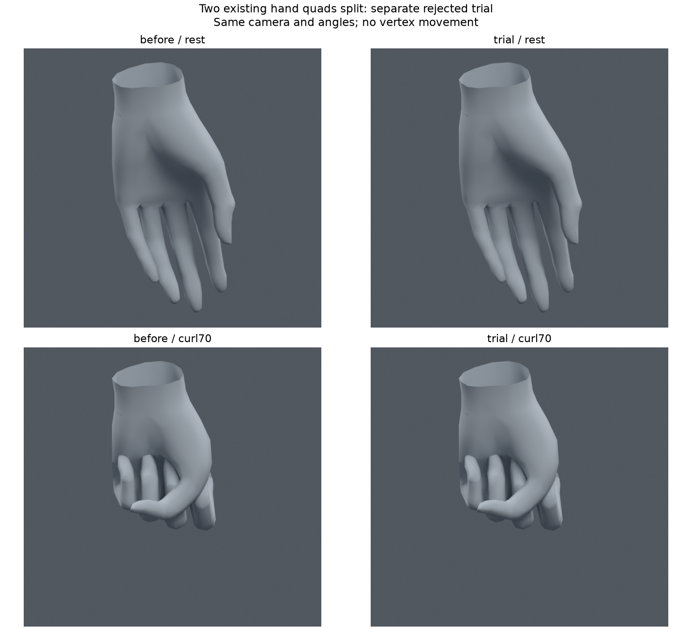

> **기록 시점 안내:** 아래는 해당 단계 당시의 보고서입니다. 후속 결정은 [최신 상태](../../STATUS.md)를 기준으로 읽어주세요. 모델·원본 텍스처·검증 원시 데이터는 이 문서 공유본에 포함하지 않습니다.

# 토폴로지 재검사와 국소 대각선 시험 v031

2026-09-09. **방향 조사와 첫 국소 편집 비교까지 실행했다. 시험 사본은 미채택이며 기준은 v030을 유지한다. 관절 문제 전체가 해결된 단계가 아니다.**

조사 원문·실제 면 흐름·첫 실행 범위는 [수정 방향](DIRECTION.md)에 있다. 원래 캐릭터 레퍼런스도 실제로 열어 확인했다. 전신/부분 새 메시, 재생성, 리메시를 수행하지 않았다.

## 기존 검사가 놓친 것

면적이 정상이어도 면끼리 교차할 수 있다. 또한 Blender 평가 메시의 일부 사각형은 자세에 따라 내부 삼각형 분할이 달라졌다. 고정 휴지 삼각형만 계산하던 검사에 **실제 평가 삼각형과 원래 면 단위 자기 교차**를 추가했다.

| 자세 / 부위 | 종전 고정 삼각형 교차쌍 | 실제 평가 삼각형 교차쌍 | 중복 제거한 원래 면 교차쌍 |
|---|---:|---:|---:|
| 왼무릎90도 | 5 | 5 | 4 |
| 왼무릎120도 | 26 | 26 | 20 |
| 왼무릎130도+회전 | 28 | 28 | 22 |
| 팔90도+비틀림 / 왼겨드랑이 | 4 | 4 | 2 |
| 고관절 실패 자세 / 오른고관절 | 10 | 6 | 4 |
| 손70도 / 왼손 | 137 | 137 | 83 |

전체 표면의 면적 이상 삼각형도 고관절 실패 자세에서 종전3개→실제4개, 허리 복합 회전에서 종전0개→실제1개로 달랐다. 이는 실제 검사의 보완 결과이며 모델이 추가로 나빠졌다는 뜻이 아니다. 목 진단1자세의 영역 내부 교차0을 목/칼라 전체 합격으로 확대하지 않는다.

교차 검사는 BVH의 비인접 삼각형 교차를 사용한다. 같은 조각의 같은 위치로 분석상 묶인 정점을 공유하는 면은 인접으로 제외한다. 접촉 깊이, 접선 접촉 허용량, 인체 가동 품질을 모두 측정하는 검사는 아니다. 허리의 중립 교차73쌍은 겹친 의상층을 포함하므로 신규 결함과 구분했다.

## 실제로 수정한 별도 사본

`bianca_TWO_DIAGONALS_NOT_ADOPTED.blend` — **미채택**.

- v030 문제 관련141면에서 대각선을 검토했다. 삼각형21면은 대각선 교체 대상이 아니고, 사각형15면은 중립 표면 내부의 표본 거리0.5mm 상한을 넘어 제외했다. 나머지105사각형을 진단11자세에서 비교했다.
- 초기 비교에서만 개선된 왼손 원래 면12083·12085를 골라 기존 메시 데이터 안에서 각각 두 삼각형으로 분할했다. 새 정점0, 좌표 이동0, 새 본0, 기존 웨이트 변경0이다. 면은17,625→17,627, 평가 삼각형은31,363으로 동일하다.
- 두 면의 중립 표면 내부 표본 거리 최대는 각각 약0.000043mm와0.070719mm다. 양방향 삼각형 내부 격자 표본으로 측정했으며 연속 표면의 엄밀한 최대 거리 증명은 아니다. 정점 고정만으로 사각형 내부 표면까지 불변이라고 표현하지 않는다.
- 원래 면/정점에 대응해 UV를 복구했고 UV 오차0, 본/웨이트/좌표/이미지/재질/modifier/오브젝트 변환은 유지했다. 코너 노멀을 대응 복구했으나 Blender 저장 표현의 재양자화로 최대 벡터 오차0.000509815가 있다. 노멀 비트 동일은 아니다. 면 순서가 바뀌어 전체 UV/재질 인덱스 배열 해시는 다르지만 원래 코너 대응 UV와 면 재질은 복구했다.

같은 카메라·각도의 실제 렌더를 열어 비교했다. 큰 외형 차이가 없고 손바닥/지간부 접힘 문제도 남아 있다. 렌더 중 평가 좌표 이동0이다. 원래 파일은 보존했다.

## 추가 검증과 미채택 이유

손610자세 = 기존482자세 + 이번에 처음 만든128연속값 자세(각 손64개, seed310909). 같은 요청 각도와 v030 손 제어를 사용했다. 엄지 제어를 v027 방식으로 바꾼 시험이 아니다.

| 비교 | 기존 대비 교차 또는 면적 악화 자세 |
|---|---:|
| 두 면 동시 적용 | 41 |
| 면12083만 가상 분리 적용 | 14 |
| 면12085만 가상 분리 적용 | 18 |

동시 적용 악화41개 중8개는 새128표본에 속한다. 두 면은 각각11자세에서 괜찮아 보였지만 함께 수정하면 두 면 사이에 새 간섭이 생겼다. 예를 들어 왼손45도 쥐기에서 두 면 사이에 없던 교차가 생겼다. 한 면씩 분리한610자세 계산도 악화가 남아 별도 채택하지 않았다. 이 분리 계산은 실제 새 파일을 각각 저장한 시험과 구분한다.

실제 저장 사본도610자세 전부 다시 평가했다. 전체34,597정점은 기준 평가와 차이0이고, **전체31,363삼각형의 정점 집합이 두 컷을 반영한 예상 표면과 매 자세 일치**했다. 따라서 실패를 가상의 표면만 계산한 결과로 남기지 않았다. 후보 선정 후 새128표본을 분리 분석에도 사용했으므로 다음 후보의 독립 최종 시험으로 재사용하지 않는다.

원시 기록은 `topology_audit.json`, `diagonal_screen.json`, `diagonal_preservation.json`, `diagonal_validation.json`, `render_audit.json`이다. 재현 도구는 상위 폴더 `topology_audit_v031.py`, `diagonal_trial_v031.py`, `topology_figures_v031.py`다. Unity/FBX 왕복·VRChat 런타임·프레임 사이 연속 충돌은 이번에 실행하지 않았다.

## 실행 결과로 확정한 후속 방향

**대각선만 교체하거나 면적만 최소화하는 방법을 주 해결책으로 쓰지 않는다. 관절별 기존 면의 연결과 회전축·웨이트를 함께 수정한다.** 전체 삼각화/사각화, 전체 밀도 증가, 전역 웨이트 평활화는 이번 해결 방향으로 채택하지 않는다.

| 우선 부위 | 다음에 다룰 구체적 원인과 편집 순서 | 통과에 필요한 비교 |
|---|---|---|
| 무릎 | 안쪽 접힘에 모인 가늘고 긴 면과 높은 연결 수의 정점을 먼저 지정한다. 안쪽 압축 구역과 바깥 굽힘 호를 분리해 기존 에지 연결/소량 지지 컷을 비교한 뒤 해당 구역의 thigh/shin/knee_support 웨이트를 함께 조정한다. 보조 본 중심만 더 이동하는 시도를 주 방향으로 삼지 않는다. | 중립 외곽·UV, 굽힘90/120/130+회전, 기존124무릎 및 전신1281, 안쪽 자기 교차·코트 상대 접촉·실제 측면 렌더 |
| 겨드랑이·어깨 | 팔을 들 때 흉곽에서 상완으로 이어지는 전환부와 폴 위치를 지정한다. 해당 면의 국소 연결을 먼저 비교하고 쇄골/어깨 보조 추종과 웨이트를 함께 확인한다. 단순 팔 들기와 들고 비틀기를 분리한다. | 어깨 실루엣/함몰, 팔90/120+비틀림, 셔츠·소매·코트 접촉, 반대쪽과 중립 원형 |
| 손가락·엄지 | MCP/PIP/DIP의 위치·회전면과 지간부 면 흐름을 별도 문제로 둔다. 이번12083/12085 대각선 후보를 합치지 않는다. 먼저 한 마디·한 연결 구역에서 시험하고 주먹·포인팅·V자·벌림 조합까지 확장한다. | 손 전체와 손 밖 변위, 모든 손가락 간 교차, 기존482+노출된128 회귀 검사, 후보 확정 후 다른 seed의 새 표본 |
| 고관절·허리 | 원래 실패 면5056 주변의 평가 분할/압축과 코트 상대 간격을 함께 다룬다. v028 바지 웨이트를 합치지 않는다. 허리 회전 시 새로 검출한 실제 면적 이상1개도 수정 대상에 포함한다. | 앉기/다리 들기+회전/허리 복합 회전, 바지 자기 교차와 코트 양쪽 간격, 중립 의상층 교차를 제외한 신규 결함 |
| 목·팔꿈치·손목·발목 | 이번11진단에서 문제를 못 찾았다는 이유로 완료 처리하지 않는다. 기존 넓은 회전 모음을 새 실제 삼각형 검사로 재평가하고 실패 지점이 나온 구역만 편집한다. 목은 피부뿐 아니라 칼라·턱, 손목은 커프, 발목은 바짓단·신발을 함께 본다. | 단독/복합 굽힘·회전, 인접 의상, 좌우 비대칭, 끝 각도 사이 중간 자세 |
| 코트·헤어 등 보조 체인 | 주 관절 변형이 안정된 뒤 자락 뿌리 추종과 PhysBone/충돌의 런타임 구동을 확인한다. 머리카락·옷이 바람/움직임에 자동 반응하는 기능은 현재 미구현이다. | Blender 포즈 검수와 PC Unity/VRChat 자동 구동을 별도 검증 |

이 표는 후속 대상과 검증 순서를 확정한 것이며 국소 루프 수정까지 이미 적용했다는 뜻이 아니다. 다음 편집도 기존 메시의 작은 구역을 별도 사본에서 다룬다. 관절 둘레 전체 재배치나 넓은 면 구조 변경이 필요해지면 대상 면·추가/이동 정점 수·중립 실루엣 변화를 먼저 제시하고 사용자의 의견을 받는다. 작은 수정을 누적해 큰 형상 변경으로 확대하지 않는다.
