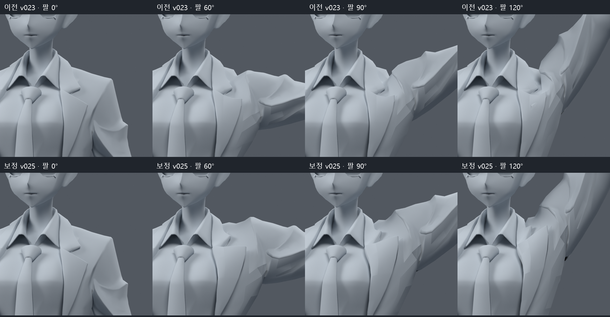
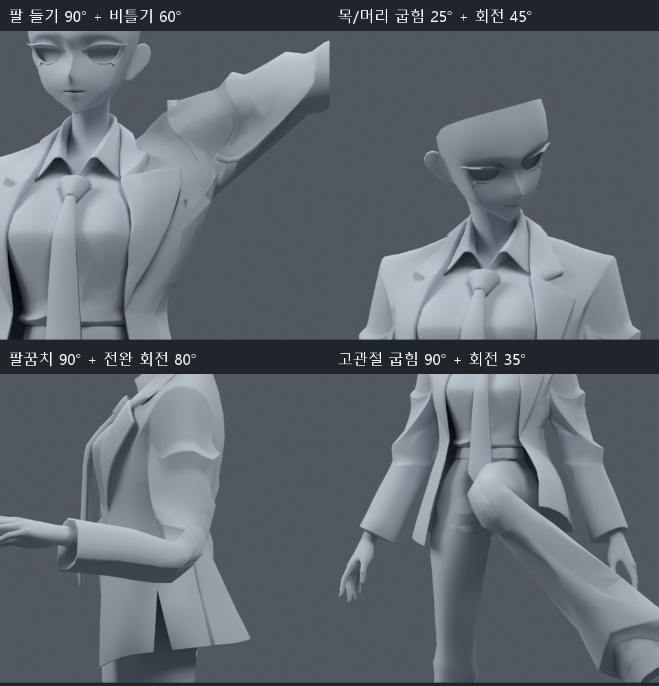

> **기록 시점 안내:** 아래는 해당 단계 당시의 보고서입니다. 후속 결정은 [최신 상태](../../STATUS.md)를 기준으로 읽어주세요. 모델·원본 텍스처·검증 원시 데이터는 이 문서 공유본에 포함하지 않습니다.

# 어깨 함몰 보정과 복합 회전 검수 v025

2026-09-09. 사용자가 팔을 들 때 어깨가 파이는 문제와 모든 회전 관절 검사를 요청했다. **어깨의 깊은 함몰을 줄인 별도 사본을 만들었지만 전체 관절 완료본은 아니다.** 보정에 쓰지 않은 중간 각도와 의상 접촉 검사에서 남은 실패도 확인했다.

## 검수 파일

- 후속 보정 사본: `margin/bianca_SHOULDER_ROTATION_REVIEW.blend`
- 회전 확인 사본: `margin/bianca_ROTATION_MOTION_REVIEW.blend` — 370개 진단 프레임, 타임라인에 자세 이름 표시
- 초기 보정 사본: 이 폴더 루트의 `bianca_SHOULDER_ROTATION_REVIEW.blend` — 비교용으로 보존
- 이전 기준: v023 검수 사본과 v014 안전 기준을 보존
- 파일별 해시: `DELIVERY.json`; 상세 결과: `margin/verification.json`, `margin/preservation.json`, `margin/motion_reload.json`

## 무엇을 바꿨는가

양쪽 상완의 시작점을 z=.768m에서 .790m로 조정했다. 쇄골 끝과 기존 shoulder_support의 위치/방향도 맞췄다. 팔꿈치·손목·손가락 본의 head/tail은 그대로다. Blender 편집 모드 재계산으로 그 하위 본의 축 행렬에는 최대 약4.18e-7의 수치 차이가 생겼으며 비트 동일하다고 기록하지 않는다. 본 수는94개 그대로다.

어깨 윗부분에 남아 있던 목/가슴 웨이트를 쇄골 쪽으로 재분배하고, 주변 웨이트를 여러 굽힘·비틀림 자세에서 조정했다. 재킷1540, 바지174, 셔츠8로 총1722 raw 정점의 웨이트가 v023과 다르다. 정점 위치·에지·면·UV·커스텀 노멀·재질·텍스처·modifier·오브젝트 변환과 메시 목록은 유지했다. **새 메시·정점·면을 만들지 않았고 v025에서는 정점 이동도 없다.** 최대4본 영향과 웨이트 정규화를 확인했다. 저장 후 중립 표면의 v023 대비 최대 차이는 약0.001886mm로 수치 오차 범위다.

같은 카메라·같은 포즈의 비교다. 위는 v023, 아래는 v025이다. 90도에서 목 옆의 깊은 함몰이 줄었다. 120도에서는 소매와 겨드랑이의 큰 접힘/각짐이 여전히 보인다. 모든 각도에서 자연스러운 어깨가 완성됐다고 판단하지 않는다. 회색 검수는 헤어 등 일부 조각을 숨겨 관절을 드러낸 렌더이며 모델에서 삭제한 것이 아니다.

## 원인 분리와 채택하지 않은 시도

v024에서 회전 중심 높이4개, 체적 보존 옵션, 쇄골 영향 강도와 어깨 윗부분의 추가 고정 후보를 별도로 비교했다. 회전 중심만 옮기면 다른 자세의 과신장이 증가했다. Preserve Volume 진단은 일부 형태가 달라지지만 재킷 면적 이상이 오히려 증가했다. 상완 영향을 지나치게 쇄골로 옮긴 후보는 어깨가 판처럼 솟아 채택하지 않았다.

실제 정점 웨이트를 읽어 보니 어깨 윗부분 일부가 쇄골 대신 가슴/목에 고정되어 있었다. 낮은 회전 중심과 함께 작용하는 문제였다. 최종 비교 사본은 두 요소를 함께 수정하고 다중 자세에서 웨이트를 보정한 결과다. 상세 조사와 제작자 해결 사례는 [추가 조사](RESEARCH_NOTES.md)에 기록했다.

## 회전 검사 범위와 결과

기존395몸 표본에 상완 축 회전, 전완 회내/회외, 손목과 전완 복합 회전, 굽힌 고관절의 회전, 굽힌 무릎의 작은 축 회전, 발목 굽힘/기울임, 목·머리와 허리·가슴의 복합 회전을 추가했다. 수정에 사용한705표본과 고정 난수로 만든 연속값192표본을 합해 **897표본**을 이전/수정 사본 각각 실제 Blender 평가 메시로 검사했다. 동일한 자세가 일부 반복되므로897은 고유 관절 상태의 수가 아니다.

| 항목 | v023 | v025 여유 구간 보정 |
|---|---:|---:|
| 심한 면 압축/과신장이 있는 자세 | 172 /897 | 13 /897 |
| 이상 삼각형·자세 누적 | 789 | 23 |
| 보정에 사용한705표본의 면적 이상 | 있음 | 0 |
| 별도 연속값192표본의 면적 이상 | 있음 | 13자세, 압축 누적23 |
| 코트/바지 또는 코트/소매 접촉 자세 | 97 | 94 |
| 코트/바지 교차쌍 최대 | 185 | 220 |
| 코트/소매 교차쌍 최대 | 132 | 132 |

기준은 원래 삼각형 면적의20% 미만 또는3배 초과다. 모든67개 표면 조각을 포함했다. 누적 수는 고유 결함 개수가 아니다. 초기 보정은 별도 각도14자세/누적24가 남았고, 임계값 근처에서 바로 멈추지 않는 추가 보정 후13자세/23이 됐다. 추가 보정의 효과는 제한적이었다.

**별도 중간 각도8개에서는 v023보다 면적 이상 수가 늘었고, 코트/바지 최대 교차도 증가했다.** 총합이 줄었다는 이유로 이 회귀를 숨기지 않는다. 남은 압축은 주로 고관절의 굽힘+축 회전과 전완 회전이다. 이192개 값을 직접 최적화 표본으로 추가하지는 않았지만, 첫 검사 결과를 보고 추가 보정 방법을 선택했으므로 두 번째 검사를 완전히 새로운 블라인드 시험이라고 부르지 않는다.

팔을 든 채60도 비틀면 소매에 큰 접힘이 남는다. 목/머리와 팔꿈치·전완, 고관절 복합 회전도 동일 사본에서 확인했다. 면적 통과와 자연스러운 모양, 자기 교차 없음은 별개의 판단이다.

## 저장과 재생 검증

추가 회전178표본과 연속값192표본을370프레임에 저장했다. 저장 후 다시 열어 모든 정점의 평가 좌표를 원래 계산값과 비교한 최대 차이는0이다. 이 파일은 포즈 검사용이며 프레임 구간 사이를 자연스럽게 연결한 완성 애니메이션이 아니다. 소수 프레임의 보간과 실제 Humanoid IK/VRChat 실행은 검사하지 않았다.

## 남은 문제와 후속 상태

- 어깨 위의 깊은 함몰은 개선됐지만 큰 비틀림의 소매 접힘과 겨드랑이 각짐이 남는다.
- 고관절/전완의 일부 연속값 압축과 코트 접촉은 미완료다. 접촉만 없애려고 웨이트를 과하게 바꾸면 다른 자세가 압축되므로 별도 회귀 검사를 유지한다.
- 왼다리105도의 코트12쌍 회귀는 [v026 국소 여유 시험](../v026_coat_contact/REVIEW.md)에서 추가로 다룬다. v025 파일 자체에는 그 후속 수정이 없다.
- 손가락의 자기 교차와 무릎의 큰 각짐은 이전 미완료 상태를 유지한다. 이번897몸 검사를 손가락 전체 동작 합격으로 확대하지 않는다.
- 눈/턱 회전, 깜박임과 립싱크, PhysBone·콜라이더·자동 바람은 미완료다. Unity 작업은 여전히 후순위다.

새 구조는 허용된 본 범위에서 검토하되 새 메시 생성/대체/리메시는 진행하지 않는다. 단순한 Blender 제약이나 계산 포즈를 PC VRChat 자동 동작으로 설명하지 않는다. 사용자의 최종 외형 채택도 아직 받지 않았다.
