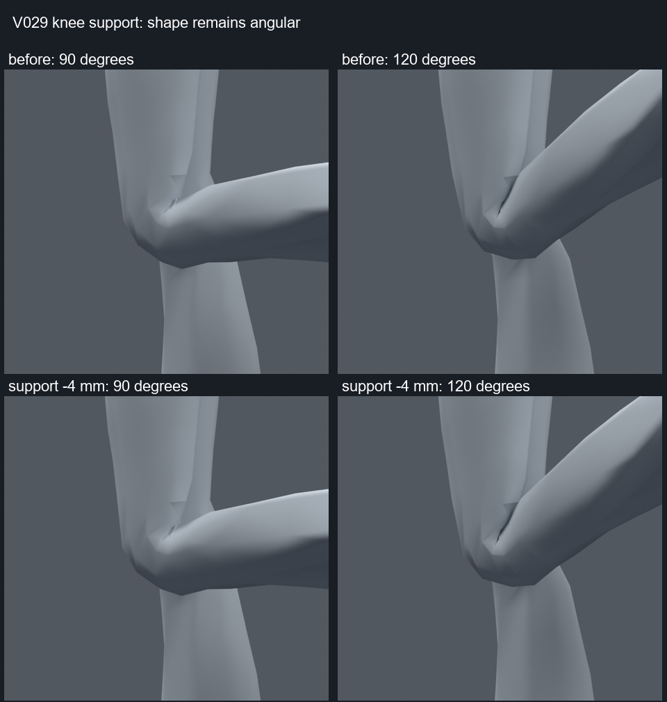

> **기록 시점 안내:** 아래는 해당 단계 당시의 보고서입니다. 후속 결정은 [최신 상태](../../STATUS.md)를 기준으로 읽어주세요. 모델·원본 텍스처·검증 원시 데이터는 이 문서 공유본에 포함하지 않습니다.

# 기존 무릎 보조 본 회전 중심 비교 v029

2026-09-09. 기존 knee_support 2개의 중심만 국소 이동했다. 본을 새로 만들거나 원래 thigh/shin의 관절 중심을 바꾸지 않았다. 메시/좌표/UV/면/노멀/웨이트/텍스처는 유지했다.

7개 후보는 기준, 앞뒤 ±4/8mm, 높이 ±4mm다. 각124자세(양쪽 무릎0~130도 굽힘과 ±10도 작은 축 회전, 고관절 복합 자세 일부)를 비교했다. 130도와 비틀림 조합은 모델 진단용 스트레스 자세이며 실제 인체 가동 범위 인증이 아니다.

| 보조 중심 | 압축/과신장 삼각형·자세 누적 |
|---|---:|
| 기준 | 5 |
| Y -8mm | 19 |
| Y -4mm | 5 |
| Y +4mm | 5 |
| Y +8mm | 8 |
| Z -4mm | 0 |
| Z +4mm | 20 |

Z -4mm 후보는 수치상 개선되었지만90/120도 렌더의 전체 윤곽 차이는 작다. 특히 안쪽의 각진 주름과 날카로운 접힘은 그대로 남는다. 이 이동만으로 자연스러운 무릎이 완성됐다고 하지 않는다.

선택 후보는 `bianca_KNEE_SUPPORT_y0_z-0.004.blend`다. 1281전신 표본, 모든67표면 조각의 면적/코트 접촉 검사에서 기준 대비 악화0을 확인했다. 기존 Copy Rotation의 절반 회전과 부모 구조를 유지했다. Blender 제약이 VRChat에서 그대로 실행된다는 의미는 아니다.

이 작은 보정만 [v030 국소 통합 사본](../v030_joint_checkpoint/REVIEW.md)에 이어 갔다. 다른6개는 비교용이다. 초기 렌더가 생성 중인 파일을 먼저 읽어 실패했으며, 모든 후보 저장이 끝난 뒤 전체10장 렌더를 다시 실행해 완료했다. 실패한 실행을 검증 완료로 세지 않았다.
