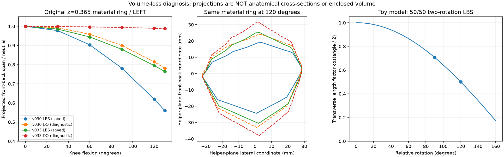
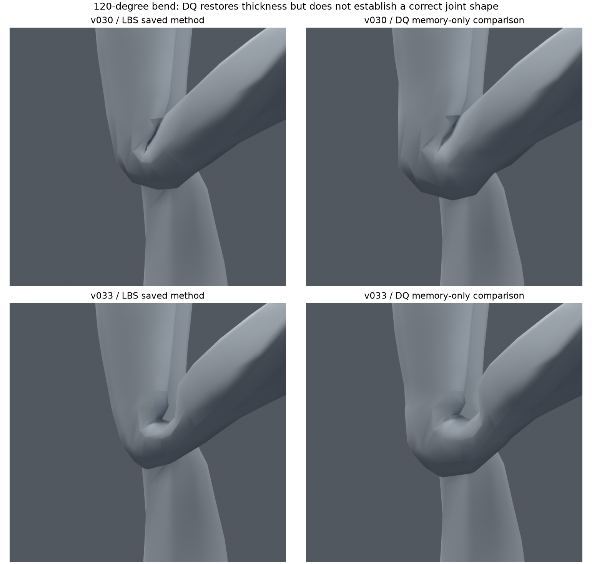

> **기록 시점 안내:** 아래는 해당 단계 당시의 보고서입니다. 후속 결정은 [최신 상태](../../STATUS.md)를 기준으로 읽어주세요. 모델·원본 텍스처·검증 원시 데이터는 이 문서 공유본에 포함하지 않습니다.

# v034 — 관절 두께 손실 조사와 현재 리그 비교

2026-09-09 · PC Unity / VRChat · **조사·읽기 전용 진단 완료, 모델 수정안은 미실행**

## 결론

사용자가 지적한 “뼈가 없는 고무 호스처럼 얇아지는 접힘”은 현재 검증에서 빠진 중요한 품질 문제다. 현재 무릎은 본과 보조 본으로 표면을 회전시키지만, 관절 중심의 최소 두께나 앞쪽 뼈 돌출부, 안쪽 살·옷의 압축을 따로 유지하지 않는다. 저장된 두 후보 모두 선형 스키닝(LBS)이고, 관절 중심 보조 본은 정강이 회전의 절반을 따라간다. 이 구조만으로는 단단한 관절 형상을 보장하지 못한다.

**접촉 형태, 두께 유지, 면 관통은 서로 다른 평가 항목이다.** v030의 접힌 안쪽 실루엣을 사용자가 선호한 판단은 유지한다. 다만 이번 정점 띠 측정에서는 v030의 두께 감소가 v033보다 컸다. 따라서 v030 전체로 되돌리는 것만으로 두께 문제가 해결되지는 않는다. v033 역시 교차 검사 통과를 근거로 자연스러운 최종 후보라고 볼 수 없다.

후속 방향은 **v030의 접촉 실루엣을 비교 기준으로 삼고, 기존 메시에서 관절 중심부의 형태를 지키는 변형 본과 안쪽 접힘의 웨이트를 분리하는 것**이다. 절반 회전 보조 본을 하나 더 추가하는 수준을 넘어, 유한한 두께를 가진 관절 구간·앞쪽 돌출부·안쪽 접촉을 각각 검토한다. 필요하면 자세별 보정 형상을 비교하되, VRChat에서 실제 구동 가능한지 별도로 증명한다. 구체적 순서와 중단 조건은 [개선 실행 계획](IMPLEMENTATION_PLAN.md)에 기록했다.

## 1. 실제 파일에서 확인한 현재 구현

검사 원본은 `v030_joint_checkpoint/bianca_LOCAL_JOINT_REVIEW.blend`와 `v033_knee_structure/bianca_KNEE_STRUCTURE_REVIEW.blend`다. 레퍼런스 `avator_references/ref_char.png`도 실제 열어 의상과 원형을 확인했다. 아래는 추정이 아니라 저장 파일 및 구현 코드에서 확인한 사항이다.

| 항목 | 현재 구현 | 부족한 점 |
|---|---|---|
| 스키닝 | Armature modifier의 Preserve Volume 꺼짐: LBS | 회전을 평균하는 과정에서 관절 주변 수축 가능 |
| 무릎 중심 | thigh/shin 연결 높이 약 z .365m | 본 표시 자체는 물리적인 뼈나 충돌체가 아님 |
| 무릎 보조 | thigh의 자식, 길이 약20mm, 머리 높이 .361m | 4mm 아래 피벗은 있으나 뼈 두께 제약은 없음 |
| 보조 추종 | shin을 LOCAL→LOCAL COPY_ROTATION, REPLACE, influence .5 | 위치·스케일·자세별 부피 보정 없이 회전만 분담 |
| 형상 보정 | 대상 메시 shape key 없음, 조사 대상 데이터 driver0 | 깊은 굽힘 전용 돌출부/압축 형상 없음 |
| v033 웨이트 | thigh/shin/knee_support의 세 그룹, 폭 .10m의 부드러운 분담 | 채택 프로파일은 앞·뒤를 구별하는 해부학적 목적 함수가 없음 |
| v033 토폴로지 | 기존 무릎에6줄 컷, 원래 중립 표면 유지 | 움직일 자유도는 늘지만 두께나 뼈 모양을 자동 생성하지 않음 |
| 기존 점수 | 삼각형 교차, 면적비 임계값, 이전 대비 악화 | 단면·관절 중심 두께·접촉 윤곽·옷 주름의 품질 기준 부족 |

관련 구현은 `full_rig_v015.py`의 knee_support 생성과 `knee_structure_v033.py`의 profile/score다. 현재 파일에는 어깨·팔꿈치·고관절 보조도 있으나, 이번 본 목록 검사에서 별도 twist라는 이름의 체인은 없었다. 이것만으로 모든 부위의 회전 분산이 전무하다고 단정하지는 않는다. 후속 전완 작업에서는 실제 영향 그룹과 축을 따로 확인한다.

원시 감사는 `CURRENT_RIG_AUDIT.json`, 재현 스크립트는 `joint_volume_audit_v034.py`다. 두 파일 SHA256 전후 일치와 메모리 상태 복구를 검사했다. DQ 비교는 메모리에서만 실행했으며 `.blend`를 저장하지 않았다.

## 2. 왜 회전만 했는데 두께가 줄어드는가

LBS는 여러 본이 계산한 정점 위치를 가중 평균한다. 서로 다른 회전의 평균은 다시 순수한 회전이 되지 않을 수 있어 관절 안쪽으로 수축한다. 이 문제는 알려진 스키닝 한계이며 DQ(dual quaternion) 스키닝은 이런 회전 혼합 손실을 줄이도록 고안됐다. [Kavan의 DQ 설명과 원 논문 연결](https://users.cs.utah.edu/~ladislav/dq/index.html)

단순화한 설명으로, 같은 피벗의 두 회전 0°와 θ를 정확히50:50으로 섞으면 회전 평면에서 길이 배율은 `cos(θ/2)`가 된다. 따라서90°에서는 약0.707,120°에서는0.5다. 이것은 수축이 생기는 이유를 보여주는 **분석용 두 본 예제**다. 현재 모델은 피벗·웨이트가 서로 다르고 보조 본도 있으므로 이 값을 현재 무릎의 실제 수축률이나 부피 감소율로 대입하면 안 된다.

Blender의 Preserve Volume은 이 회전 손실을 줄이는 쿼터니언 기반 변형 옵션이다. 하지만 이 옵션은 관절의 해부학적 구조, 살끼리의 접촉, 바지의 접힘을 이해하지 않는다. 공식 문서의180° 부근 불연속 설명도 이번120° 안쪽 홈과 같은 현상이라고 단정하지 않는다. [Blender Armature 공식 문서](https://docs.blender.org/manual/en/latest/modeling/modifiers/deform/armature.html)

## 3. 동일 정점 띠로 한 읽기 전용 비교

기존 정점 중 중립 world z=.365m에 있는 바지 무릎 둘레를 선택했다. 겹친 위치를 정리하면 왼25개·오른24개 위치다. 동일한 원래 정점 ID를0/30/60/90/120/130°에서 추적하고, 회전한 knee_support의 X/Z 평면에 투영했다. 양쪽 무릎, 두 모델, LBS/DQ의48개 측정 기록을 저장했다. 다음 표는 왼쪽의 대표 결과다.

**측정값은 같은 재료 정점 띠의 투영 앞뒤 폭이다. 진짜 평면 절단 단면, 인체의 뼈 두께, 닫힌3차원 부피가 아니다.** 띠가 휘거나 기울어져도 투영 폭이 달라질 수 있다. 이번에는 스키닝 모드만 바꿨을 때 차이를 분리하는 지표로 사용했다.

| 모델·평가 모드 | 중립 폭 | 120° 폭 / 중립 대비 | 130° 폭 / 중립 대비 |
|---|---:|---:|---:|
| v030 저장 LBS | 70.08mm | 43.46mm / 62.0% | 39.21mm / 56.0% |
| v030 임시 DQ | 70.08mm | 57.10mm / 81.5% | 54.71mm / 78.1% |
| v033 저장 LBS | 70.08mm | 55.74mm / 79.5% | 53.53mm / 76.4% |
| v033 임시 DQ | 70.08mm | 69.37mm / 99.0% | 69.26mm / 98.8% |

같은 원형·같은 웨이트에서 스키닝 모드만 바꿔도 폭이 회복되므로, LBS 혼합이 현재 얇아짐에 기여한다는 근거가 있다. **v033 DQ의99%를 실제 부피99% 보존으로 표현하면 안 된다.**

위 비교와 진단 도표를 실제 열어 검토했다. DQ에서 무릎 바깥쪽 덩어리가 두꺼워지지만 안쪽의 각진 접힘은 남는다. 특히 v033의 넓은 U자 홈은 DQ만으로 없어지지 않는다. v030도 안쪽의 날카로운 접힘과 국소적인 형상 문제를 계속 보인다. 이 그림은 재질을 단순화한 한 시점의120° 비교이므로 전신·다른 각도·텍스처·엔진 품질 합격을 뜻하지 않는다. DQ 상태의 전체 교차 회귀 검사는 이번에 수행하지 않았다.

## 4. 애니메이션·게임 제작 자료와의 차이

### DQ도 최종 형상을 자동 보장하지 않는다

Disney의 Frozen 제작 논문은 DQ를 LBS의 무조건적인 대체로 쓰지 않고, 스케일·계층 보정과 제작용 보조 처리를 결합한 사례다. 현재의 “LBS+절반 회전 보조”에 옵션만 켜서 같은 제작 수준이 되는 것은 아니다. [Disney 제작 설명](https://www.disneyanimation.com/publications/enhanced-dual-quaternion-skinning-for-production-use/) · [논문 원문1쪽](https://media.disneyanimation.com/uploads/production/publication_asset/98/asset/dualQ.pdf)

회전 중심을 정점별로 최적화하는 연구도 LBS/DQ의 수축·비틀림·부풀음 문제를 다룬다. 다만 이는 런타임 스키닝 알고리즘 변경이며, 기존 보조 본 피벗을 조금 옮기는 것과 다르다. 현재 PC VRChat 작업의 첫 구현 경로로 선택하지 않는다. [Disney Research: Optimized Centers of Rotation](https://studios.disneyresearch.com/2016/07/11/real-time-skeletal-skinning-with-optimized-centers-of-rotation__trashed/)

### 관절 중심에 길이를 가진 변형 구간을 둔다

애니메이션 캐릭터 제작자의 무릎 실험은 얕은 굽힘에서는 괜찮던 단일 축이 깊게 접힐 때 무너지는 문제를 다룬다. 무릎 보조와 정강이를 허벅지 아래에 두고, 회전 추종과 위치 추종을 결합하는 이중 관절 사례가 있다. **현재 구현과 핵심 차이는 절반 회전 자체가 아니라 관절 구간의 길이와 위치 관계까지 제어한다는 점**이다. [Amaoto 무릎 제작 기록](https://amaotolog.com/vr/125) · [dskjal 이중 관절 구조](https://dskjal.com/unity/dual-joint)

이 자료는 기계적인 이중 힌지를 실제 무릎 해부학과 동일시하는 근거가 아니다. 캐릭터의 유한한 관절 두께를 표현하기 위한 제작 기법이다. 과거 튜토리얼의 Humanoid 계층 변경이나 Add Leaf Bones 설정을 그대로 복사하지 않는다. 먼저 기존 Humanoid 제어 체인을 유지하는 변형용 보조 구조로 시험한다.

최신 VRChat 보조 본 제작 글에도 위팔의 자식인 보조가 아래팔 회전을 절반 따라가는 기본 방식이 나온다. **이 기본 방식은 우리 모델에 이미 있다.** 따라서 “보조 본을 추가하자”만으로 조사 결론을 끝내지 않는다. 위치 관계·축·영향 구역·깊은 접힘 형상을 함께 바꿔야 한다. [みみー의 VRC Constraints 제작 기록](https://note.com/mimyquality/n/neb73de496c60)

### 굽힘과 비틀림을 분리하고, 필요한 자세에 보정 형상을 준다

전완 제작 사례는 팔꿈치 굽힘을 개선해도 손목을 비틀면 찌그러질 수 있고, 회전 분담 체인을 따로 구성해야 함을 보여준다. 우리도 무릎의 단순 굽힘 개선을 전완·어깨 회전 품질까지 해결한 것으로 확대하면 안 된다. [Amaoto 전완 비틀림 제작 기록](https://amaotolog.com/vr/126)

Autodesk Pose Editor는 관절 자세와 보정 blend shape를 연결하고 중간 자세를 보간하는 제작 도구다. 이는 “중립 웨이트 하나로 모든 자세를 해결”하는 현재 방식과 다르다. 무릎 앞쪽 덩어리와 안쪽 접힘, 어깨를 들 때의 삼각근/겨드랑이처럼 자세에 따라 달라지는 형상에 적용할 수 있다. [Autodesk Pose Editor](https://help.autodesk.com/cloudhelp/2022/ENU/Maya-CharacterAnimation/files/GUID-2AB6C4C3-75AC-4094-A65C-C232739AFB30.htm)

다만 스키닝 전·후 보정은 같은 데이터가 아니다. 포즈 상태에서 만든 변위를 그대로 중립 shape key에 넣으면 이중 변형이나 방향 오류가 생길 수 있다. 역변형 또는 적절한 보정 제작 절차와 실제 가져오기 비교가 필요하다. [Autodesk 변형 순서와 보정 옵션](https://help.autodesk.com/cloudhelp/ENU/MayaCRE-CharacterAnimation/files/GUID-C954C197-6D56-4EB8-BEA0-70DD1BBBAD6B.htm)

### 피부·옷의 접촉과 뼈 주변 형태를 구분한다

깊은 무릎 굽힘에서는 허벅지와 종아리 접촉이 실제 발생하지만 시작 각도는 체형·자세에 따라 달라진다. 이 사실은 “모든 각도에서 빈 공간을 없애야 한다”거나 “메시 관통은 정상”이라는 뜻이 아니다. [고굴곡 자세 접촉 연구 초록](https://pubmed.ncbi.nlm.nih.gov/29248190/) · [허벅지–종아리 접촉 연구 초록](https://pubmed.ncbi.nlm.nih.gov/17512647/)

현재 표면은 바지이므로 실제 뼈 윤곽을 직접 관측한 것이 아니다. 후속에는 원형 안에 수학적인 관절 중심 영역을 정해 지나친 납작해짐을 감시하고, 그 바깥의 압축·주름·접촉은 별도로 평가한다. 새 뼈 메시나 피부 메시를 생성할 필요는 없다. 콜라이더를 본에 붙이기만 해도 일반 스키닝 정점이 자동으로 충돌·보정되는 것은 아니다.

## 5. Unity / VRChat에 맞춘 선택

| 방법 | 장점 | 현재 선택 |
|---|---|---|
| 웨이트·국소 루프 수정 | 기존 메시와 일반 스키닝을 유지 | 필요하지만 단독 해결책으로 반복하지 않음 |
| DQ | 같은 형상에서 회전 혼합 손실을 분리하기 좋음 | 이번 진단 기준. 그대로 엔진에 이전된다는 근거 없이 채택하지 않음 |
| 관절 중심·표면용 보조 본 | 원래 메시를 유지하며 부위별로 강성/접힘 분리 가능 | 다음 우선 실험 |
| 길이를 가진 관절 구간·위치+회전 추종 | 단일 피벗 접힘과 다른 실루엣 가능 | 별도 후보. 발 위치·Humanoid·제약 순서 회귀 필수 |
| 자세별 shape key/PSD | 특정 포즈의 접힘 형상을 직접 지정 가능 | 본 구조로 부족할 때. 런타임 구동 가능성부터 확인 |
| 전완/상완 twist 분담 | 축 회전 집중을 분산 | 해당 부위 별도 조사·실험 |
| 근육 시뮬레이션·CoR·추가 변형 modifier | 더 복잡한 변형 제어 가능 | 현재 배포 경로 첫 선택에서 제외 |

Unity는 blend shape 데이터를 가져올 수 있지만, 이것만으로 Blender의 드라이버나 Maya의 pose reader까지 자동 이전되지는 않는다. 특히 임의의 실시간 Humanoid 관절 각도를 읽어 shape key를 구동하는 경로는 별도 과제다. 이번 조사에서 그 자동 경로를 구현·검증하지 않았다. [Unity Model Import 문서](https://docs.unity3d.com/kr/2022.3/Manual/FBXImporter-Model.html)

VRChat 아바타는 허용 컴포넌트 범위 안에서 구현해야 하며 임의 런타임 C#을 붙이는 계획을 세우지 않는다. 편집기에서 데이터를 제작하는 스크립트와 아바타 런타임은 구분한다. [VRChat 허용 컴포넌트](https://creators.vrchat.com/avatars/whitelisted-avatar-components/whitelisted-avatar-components/)

위치·회전 추종은 VRC Constraints를 우선 검토한다. 공간 설정, 오프셋, 원본/전체 가중치를 명시하고 Blender 결과와 대조해야 한다. 제약 개수와 깊이도 비용이므로 불필요한 체인을 늘리지 않는다. [VRC Constraints](https://creators.vrchat.com/common-components/constraints/) · [Position](https://creators.vrchat.com/common-components/constraints/vrc-position-constraint/) · [Rotation](https://creators.vrchat.com/common-components/constraints/vrc-rotation-constraint/)

## 6. 조사 범위와 한계

- 위의 저자·제작자 원문과 공식 자료를2026-09-09에 확인했다. Disney 제작 논문은1쪽 원문, CoR는 공식 초록, 해부학 논문은 PubMed 초록 수준이다.
- 제작자 글과 VRC 위치·회전 문서는 본문을 읽었다. Blender Armature, 일부 Unity/VRChat 공식 항목은 검색 도구가 제공한 관련 본문도 함께 사용했다.
- 이번 단계에서 YouTube 영상을 재생·검수하지 않았다. 제작자 글에 포함된 동영상이 있다는 사실과 직접 시청은 구분한다.
- 기존 토폴로지 연구는 [v031 보고서](../v031_topology/REVIEW.md)를 계승한다. 이번에는 새 면 연결 시험 대신 스키닝·관절 두께의 누락을 분리했다.
- 관절 전부의 새 형상 평가, DQ 전신 회귀, Unity/VRChat 실행, 보정 본 제작은 아직 하지 않았다. 이번에 검증한 것은 현재 파일 상태, 동일 정점의 각도별 반응,120° 비교 렌더와 원본 파일 불변성이다.
