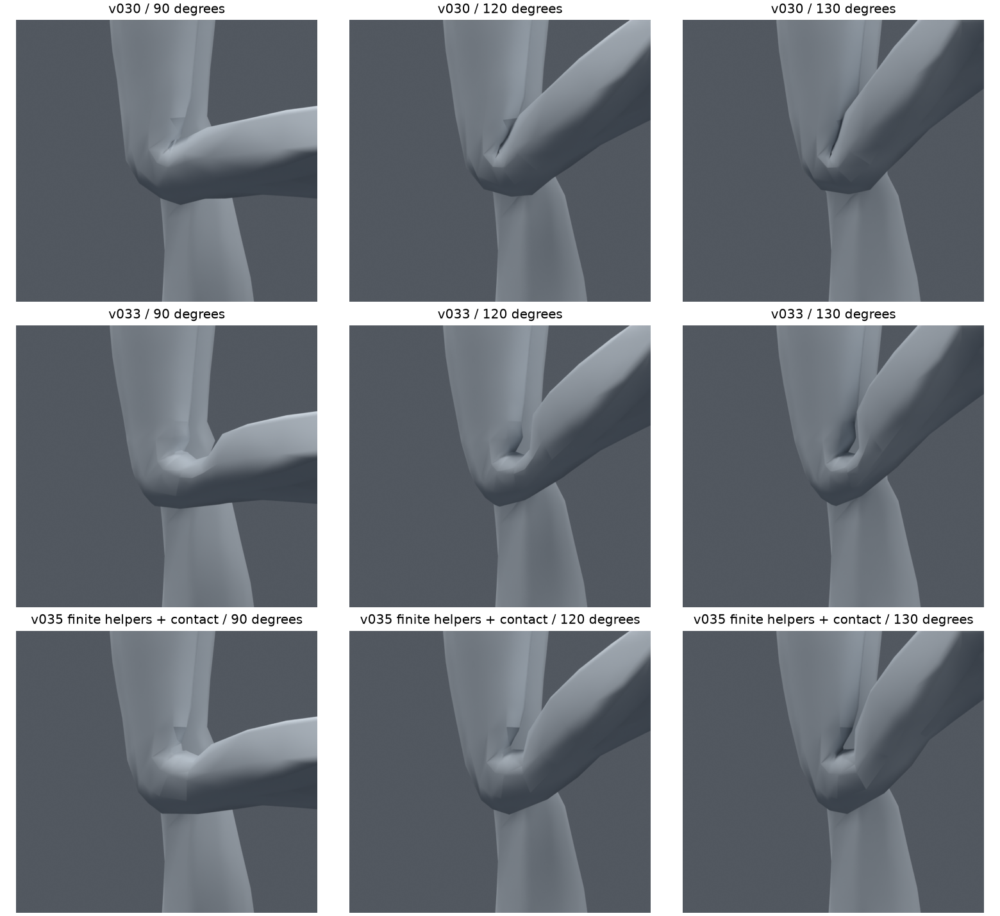
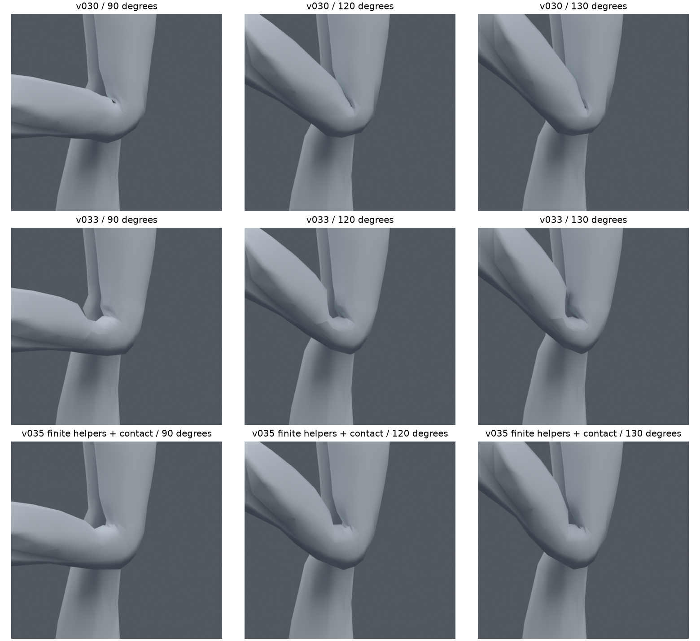
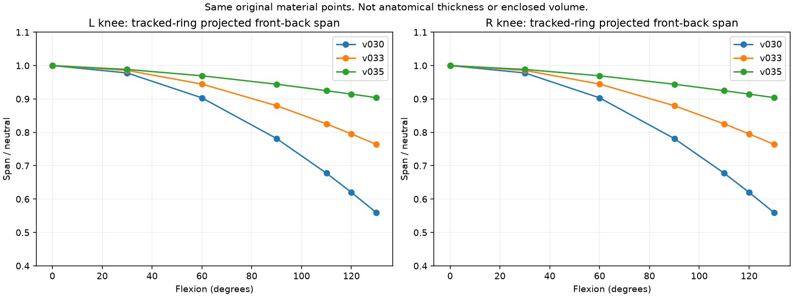
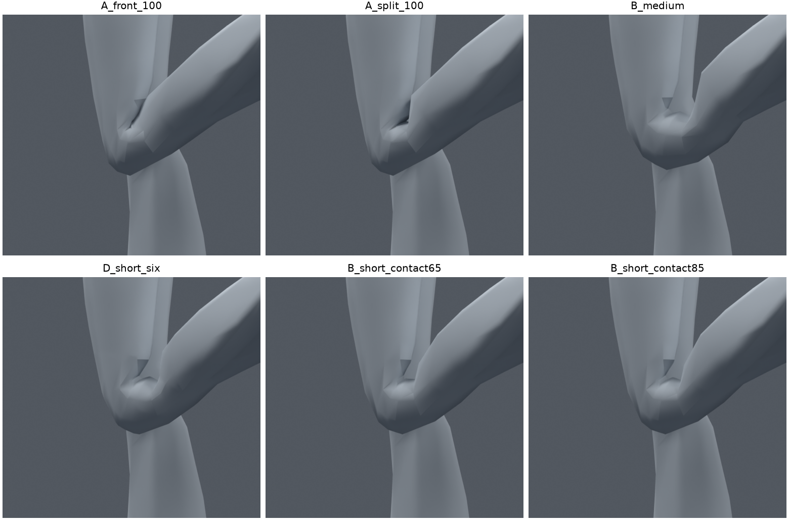
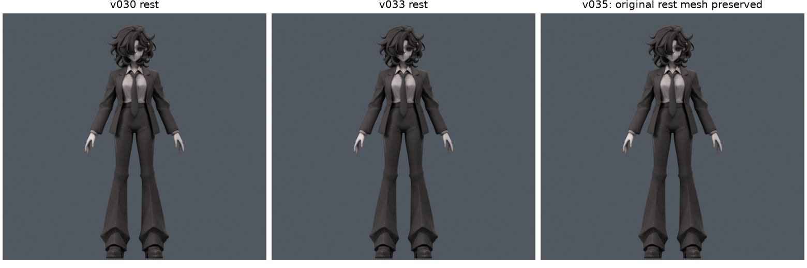
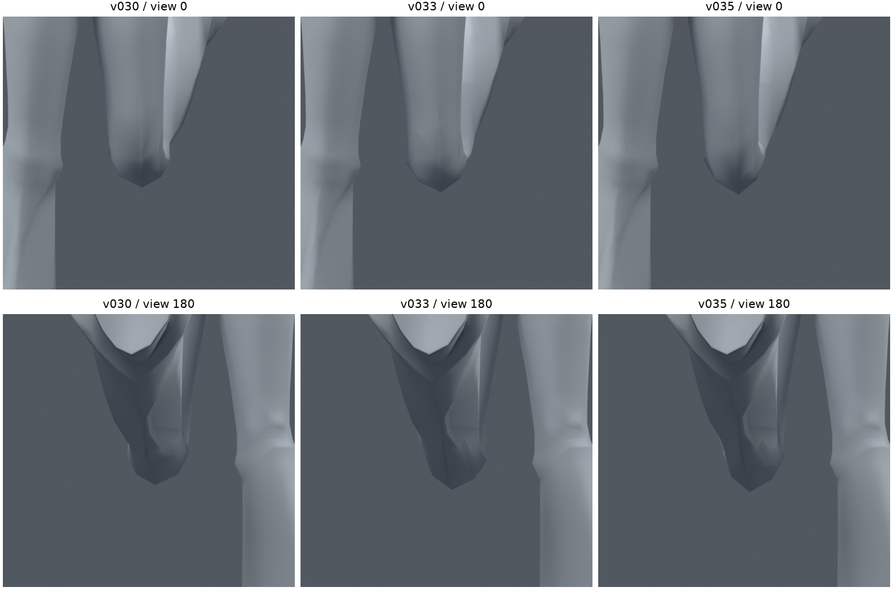

> **기록 시점 안내:** 아래는 해당 단계 당시의 보고서입니다. 후속 결정은 [최신 상태](../../STATUS.md)를 기준으로 읽어주세요. 모델·원본 텍스처·검증 원시 데이터는 이 문서 공유본에 포함하지 않습니다.

# v035 — 짧은 보조 관절로 무릎 두께 유지

2026-09-09 · PC Unity / VRChat · **무릎 개선 후보 제작·검증 완료. 전체 관절 완료나 사용자 최종 채택은 아님.**

## 결과와 확인 파일

[v034 계획](../v034_joint_volume_research/IMPLEMENTATION_PLAN.md)에 따라 기존 v030의 별도 사본에서 A 웨이트 분리, B 유한한 관절 구간, D 국소 컷을 실제 비교했다. **후속 비교 후보는12mm 보조 관절 구간과 뒤쪽65% 분담을 적용한 B_short_contact65다.** 기존 메시의 좌표·면 연결·UV·노멀·재질·텍스처를 그대로 유지하면서, 무릎이 접힐 때 중심부가 얇아지는 현상을 줄였다.

- 검수 파일: bianca_KNEE_VOLUME_REVIEW.blend (공유본 미포함: `bianca_KNEE_VOLUME_REVIEW.blend`)
- 동작 파일: bianca_KNEE_VOLUME_MOTION_REVIEW.blend (공유본 미포함: `bianca_KNEE_VOLUME_MOTION_REVIEW.blend`)
- 실제 전체 검증 원본: `bianca_B_short_contact65_TRIAL.blend`
- 재생 구간:1–61 왼 무릎,62–122 오른 무릎,123–183 양다리 앉기. 보조 본 추종은 Blender 제약으로 작동한다. 이 파일은 엔진용 자동 물리·코트 구동 완료본이 아니다.

v030과 v033은 보존했다. v033의 컷을 이 후보에 합치지 않았다. 새 메시 생성·대체·리메시는 하지 않았다. 컷 시험은 기존 면을 분할한 별도 미채택 사본에만 존재한다.

## 1. 실제로 바뀐 구조

원래 Humanoid 체인 thigh→shin→foot와 기존 knee_support를 유지했다. 각 다리에 다음 변형용 보조2개, 합계4개를 추가했다. **94본→98본**이며 기존94본의 머리·꼬리·행렬·부모는 검사에서 정확히 같았다.

| 보조 본 | 중립 배치 | 부모 | 자동 추종 |
|---|---|---|---|
| knee_bridge.L/R | 원래 무릎 피벗에서 정강이 축 반대 방향6mm부터 아래 방향6mm까지, 길이12mm | thigh.L/R | shin의 로컬 회전 절반 |
| shin_volume.L/R | bridge의 중립 끝에서 정강이 방향, 표시 길이80mm | thigh.L/R | shin의 로컬 회전 전체 + bridge 끝의 월드 위치 |

bridge가 짧은 구간을 회전시키고, 정강이 표면용 보조의 시작점이 그 끝을 따라간다. 원래 shin/foot을 움직여 발 위치를 바꾸는 구조가 아니다. 원래 shin→bridge→shin_volume의 단방향 의존성이므로 제어 shin을 다시 구동하는 순환도 없다. 회전 제약4개와 위치 제약2개를 추가했다.

앞·옆 중심부는 새 보조 구간의 영향을 충분히 받도록 하고, 뒤쪽은 원래 접힘과 새 구간의 분담을 섞었다. 여기서65%는 뒤쪽 끝의 새 프로파일 혼합률이며, 보조 본의 회전 비율이나 물리적인 강성값이 아니다. 수정 영역은 바지의 중립 높이 .28–.46m 안으로 제한했고 경계에서 부드럽게 사라진다. 영향 수는 최대4개로 정리했다.

변경된 기존 정점은405 raw /203개 위치다. 기존 그룹의 최대 웨이트 차이는 .9959245로 크다. 기존 정점을 움직인 것이 아니라 영향 본을 바꾼 것이며, 변경량을 “미세한 웨이트 조정”으로 축소해서 표현하지 않는다. 상세 ID와 보존 결과는 `PRESERVATION.json`에 있다.

## 2. 접힘과 두께 비교

실제 그림을 열어 비교했다. v035는 v030보다 무릎 바깥쪽 덩어리가 남고, 깊은 굽힘에서도 납작하게 접힌 호스 같은 형태가 줄었다. v033의 가늘고 깊은 U자 홈과도 달라졌지만, 안쪽 공간을 완전히 없앤 결과는 아니다. 작은 각진 주름과 앞·옆 연결부의 각짐이 여전히 보인다. **두께 개선과 모든 시점의 자연스러움 완성은 구분한다.**

v034와 같은 원래 정점 띠를 같은 회전 보조 평면으로 투영한 왼 무릎 수치는 다음과 같다. 중립 폭은 모두 약70.08mm다.

| 후보 | 90° 폭 | 120° 폭 / 중립 대비 | 130° 폭 / 중립 대비 |
|---|---:|---:|---:|
| v030 | 54.75mm | 43.46mm /62.0% | 39.21mm /56.0% |
| v033 | 61.65mm | 55.74mm /79.5% | 53.53mm /76.4% |
| v035 B_short_contact65 | 66.17mm | 64.09mm /91.5% | 63.35mm /90.4% |

이 비율은 **재료 정점 띠의 투영 폭**이며 실제 뼈 두께나3차원 부피 보존율이 아니다. 이번 후보는 DQ를 켠 결과도 아니다. 기존 LBS를 유지한 상태에서 본 구조와 웨이트를 바꿨다.

실제 평가 삼각형을 평면과 교차시켜 폐곡선도 추출했다. 후보의 왼 무릎 중심 근처 단면은 중립 약2929mm²,90° 약2857mm²였다.120°에서는 중심 근처 윤곽 약2755mm² 외에 인접한 다리 표면 윤곽 약775mm²도 함께 나타났다.130°에도 두 윤곽이 나타났다. 따라서 전체 면적을 합치거나 가장 큰 윤곽을 무조건 고르면 깊은 굽힘에서 오판한다. 열린 연결·분기·자기 교차 여부와 모든 윤곽을 원시 진단에 남겼으며, 이것을 합산 부피 점수로 쓰지 않았다.

계획의 해부학적 중심 영역과 닫힌 국소 부피 기준은 아직 완료하지 않았다. 현재 바지 표면만으로 실제 뼈 치수를 단정하지 않고, 이번에는 정점 띠·실제 단면·실루엣·관통을 분리해서 판단했다. 후속 목표 형상을 정한 뒤 중심 영역을 추가할 수 있다.

## 3. 비교한12개 수정 후보

초기 진단은 각 후보에서 좌우 각각13개, 총26개 자세다.0/30/60/90/110/120/130° 단순 굽힘과90/120/130°의 ±10° 비틀림을 포함한다. 표의 교차는 원래 면 쌍의 자세별 누적이고 면적 이상도 누적이다. 컷 후보는 면 구성이 달라져 교차 숫자를 원형 후보와 절대 점수로 직접 비교하지 않는다.

| 후보 | 변경 방향 | 교차 누적 / 면적 이상 | 판단 |
|---|---|---:|---|
| A_front_085 | 앞·옆 보조 영향 .85 | 304 /0 | 관통 남음 |
| A_front_100 | 앞·옆 중심 영향1 | 297 /0 | 두께 증가, 각진 경계·관통 |
| A_wide_100 | 같은 방향의 넓은 분담 | 296 /0 | 관통 해결 부족 |
| A_split_100 | 뒤쪽 별도 안전 프로파일 | 92 /2 | 압축·관통 남음 |
| B_short |12mm 구간, 뒤쪽 전부 새 분담 | 0 /0 | 두께 개선, 뒤쪽이 더 벌어짐 |
| B_medium |24mm 구간 | 0 /0 | 관절 덩어리·홈이 과장됨 |
| B_contact |24mm, 뒤쪽25% 혼합 | 114 /25 | 접촉을 좁히다 회귀 |
| D_short_two |12mm + 양쪽2줄 컷 | 2 /17 | 새 면적 이상 |
| D_short_six |12mm + 양쪽6줄 컷 | 0 /41 | 부드러워진 일부 시점과 별개로 압축 회귀 |
| D_contact_six |12mm +6줄 컷 + 뒤쪽50% | 0 /51 | 면적 이상 회귀 |
| B_short_contact65 |12mm, 뒤쪽65% 혼합 | 0 /0 | 후속 검수 후보 |
| B_short_contact85 |12mm, 뒤쪽85% 혼합 | 0 /0 | 비교용, 뒤쪽 분담 차이 보존 |

참고로 같은26개 자세의 v030은308/0, v033은0/0이다. A만으로는 목표를 만족하지 못해 계획 B를 실행했고, 추가 컷 D는 새 면적 이상이 생겨 합치지 않았다. 기본 본 구조로 유효한 개선 후보를 얻었으므로 C 자세별 shape key는 이번에 만들지 않았다. VRChat에서 임의 관절 각도로 자동 보정을 구동하는 경로도 여전히 미검증이다.

## 4. 원형·발 위치 보존

| 항목 | 결과 |
|---|---|
| 정점 / 면 / 원래 삼각형 수 |34,597 /17,625 /31,363 유지 |
| 정점 좌표·에지·면·UV·노멀 | fingerprint 정확 일치 |
| 재질·면별 재질·패킹 이미지·modifier·오브젝트 변환 | fingerprint 정확 일치 |
| 기존94본 머리·꼬리·행렬·부모 | 정확 일치 |
| 편집 영역 밖 웨이트 | 정확 일치 |
| 중립 평가 표면 최대 차이 | 약9.03e-8m |
| 영향 본 수 / 정규화 최대 오차 | 최대4 /1.04308e-7 |
|13개 보존 검사 포즈의 편집 밖 표면 | 차이0 |
| 같은 포즈의 발·발목 표면 및 원래 shin/foot 행렬 | 차이0 |

첫 실행의 중립 검사는 원래 모델의 평가 결과가 아니라 raw 정점과 비교해 assertion이 실패했다. 원래 리그의 평가 상태를 포함해야 하므로 기준을 **같은 중립 포즈의 v030 평가 표면**으로 수정한 뒤 다시 실행했다. 실패한 검사를 통과로 세지 않았다.

## 5. 전체 회귀와 새 표본

실제 포즈 후 삼각형을 다시 얻어 검사했다. 고정된 중립 삼각형만 사용한 결과가 아니다. 기존 모음은 회귀 검사로, 후보 선택 뒤 seed350910으로 만든256개는 별도 새 검사로 구분했다. 새 검사 결과를 보고 후보를 재조정하지 않았다.

| 검사 모음 | 표본 수 | 무릎 교차: v030 왼/오른 → v035 | v035 양 무릎 면적 이상 |
|---|---:|---|---:|
| 기존 전신·복합 회전 |1377 |1207/1242 →0/0 |0 |
| 기존 집중 무릎 |124 |이전 기준311/299 →0/0 |0 |
| 기존 v033 스트레스 |384 |724/562 →0/0 |0 |
| 선택 뒤 새 복합 무릎·앉기 |256 |600/682 →0/0 |0 |

1377/384/새256 모음에서 **새 면적 이상 면, 코트–바지·코트–소매 교차 증가 자세가 없었다.** 원래 다른 관절/의상에 남아 있던 문제는 그대로이며 이것을 전신 합격으로 확대하지 않는다. 표본들은 일부 겹치므로 합계를 독립적인 고유 자세 수라고 표현하지 않는다. B_short도 별도로 전신1377 검사를 수행했지만 최종 전달은 뒤쪽65% 후보만 사용한다.

동작 파일183프레임은 저장·재로드 전체 정점 차이0이었다. 정수 프레임과 반프레임의365표본에서 양 무릎 교차·면적 이상0이다. 표본 사이 연속 전체나 엔진 실행을 증명하는 검사는 아니다.

## 6. 전달 동일성과 남은 작업

`DELIVERY.json`은 전체 검증 원본과 검수 전달본의 fingerprint·웨이트·중립 평가 표면 재로드 일치를 기록한다. 전달본은 설명 속성과 저장 설정만 정리했다.

| 파일 | SHA256 |
|---|---|
| 전체 검증 원본 | `23622b0aa795a73517d1985c036ec70ff5629ef51562a690b60dc554baf097ea` |
| 검수 전달본 | `7c1f6b29b201e883d47eb6f88c66a33654f485d86787d5cba3dd1988e2bdebe7` |
| 동작 전달본 | `5ceca3d44615a114bc8aef0dd793e82b897168da6103b08cdcb6bc36b80620c9` |

다음은 작은 무릎 주름·옆면 각짐의 시각 품질과 팔꿈치/전완의 굽힘·비틀림 분리다. 어깨·고관절·손·목·허리·발목 전체를 이번에 수정한 것은 아니다. 코트·머리카락 물리와 표정도 미완료다. 후속 편집은 이 후보를 자동 최종 승인으로 취급하지 않고 v030/v033과 함께 비교한다.

Unity는 사용자가 정한 순서대로 뒤에 남겨뒀다. 이 보조 구조의 Blender Copy Rotation/Location이 FBX를 통해 VRC Constraints로 자동 전달된다고 가정하지 않는다. 엔진 단계에서 여섯 제약의 공간·오프셋·대상·순서를 재구현하고 Humanoid·발 접지·동작을 검증해야 한다. 기존 조사 근거는 [v034 보고서](../v034_joint_volume_research/REPORT.md)를 따른다. 이번 구현 단계에서 외부 자료를 새로 열람했다고 주장하지 않는다.

재현: `knee_volume_v035.py`의 build/build_b/refine_b/build_d/diagnose/verify/fresh/audit/motion/delivery, 그림·요약은 `knee_volume_report_v035.py`다. 원시 결과는 `PRESERVATION.json`, `SUMMARY.json`, `verification_*.json`, `MOTION_RELOAD.json`과 후보별 진단에 보존한다.
