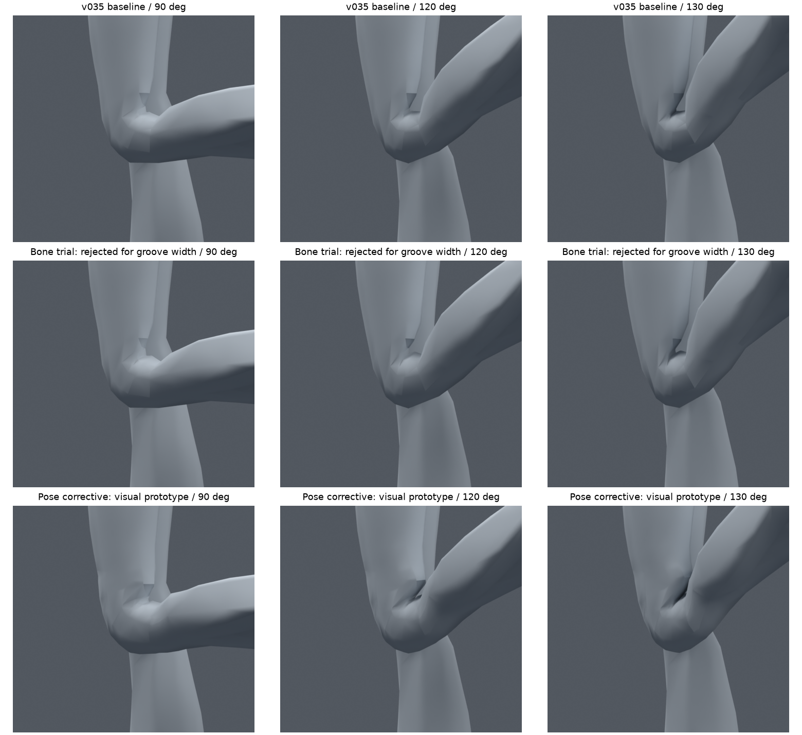
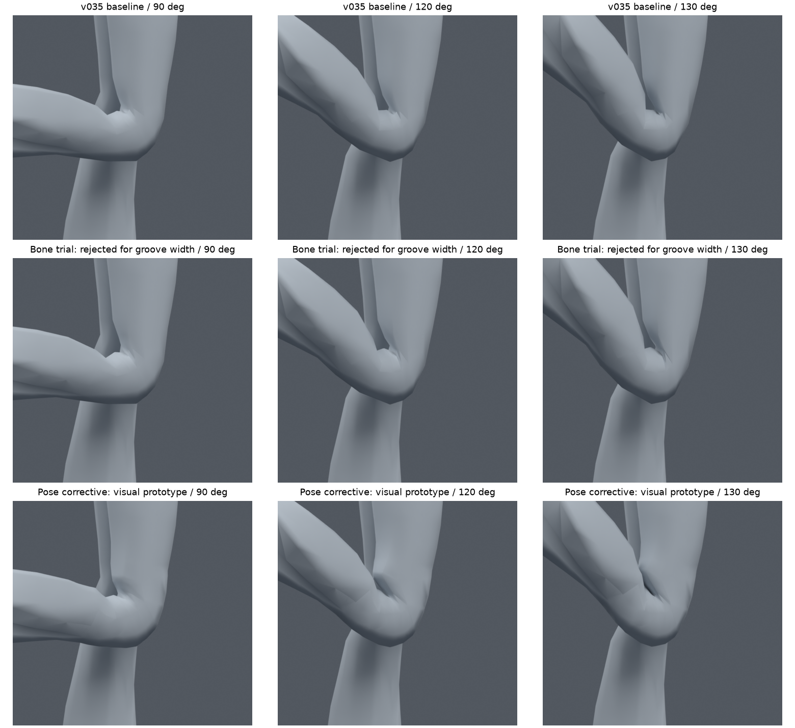
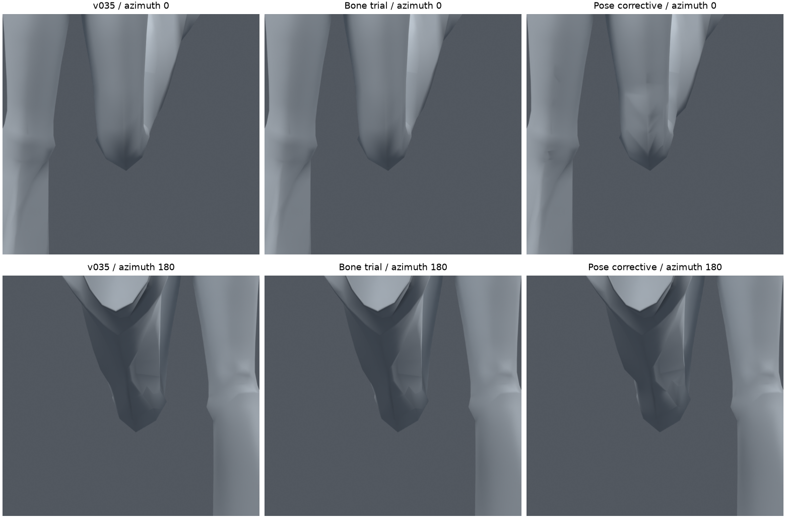
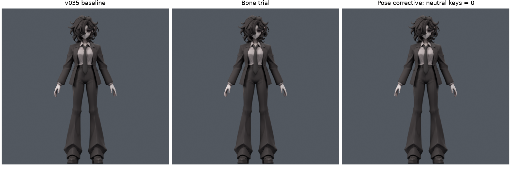
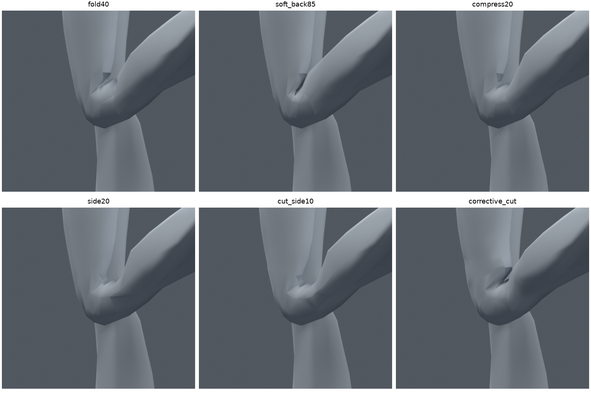
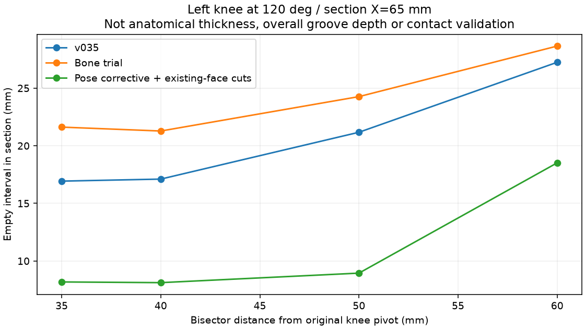

> **기록 시점 안내:** 아래는 해당 단계 당시의 보고서입니다. 후속 결정은 [최신 상태](../../STATUS.md)를 기준으로 읽어주세요. 모델·원본 텍스처·검증 원시 데이터는 이 문서 공유본에 포함하지 않습니다.

# v036 — 무릎 안쪽 홈: 본 보정과 자세 보정 비교

2026-09-09. v035의 깊고 각진 안쪽 홈을 계속 수정해 달라는 요청에 따른 실행 기록이다. **홈을 좁히는 시각적 개선은 얻었지만, 무릎 완성·사용자 최종 채택·VRChat 적용 완료는 아니다.** 원본 캐릭터 이미지를 실제로 다시 확인했고, 새 메시 생성·부분 대체·리메시는 하지 않았다.

## 현재 결론과 확인 파일

본으로 홈 바닥을 밀어주는 방식은 두께와 교차 검사를 통과해도 빈 공간이 더 넓어졌다. 이 방식은 후속 채택하지 않는다. 기존 정점의 자세 보정과 기존 면의 컷을 함께 쓴 사본은 넓은 U자 홈을 더 좁은 접힘으로 바꿨다. 다만 위쪽의 날카로운 주름과 압축되는 면이 남고, Blender 드라이버를 VRChat에서 구동하는 경로는 미구현이다. **이번 전달본은 목표 형태를 검토하기 위한 시제품이다.**

| 파일 | 용도 |
|---|---|
| `bianca_KNEE_CREASE_REVIEW.blend` | 자세 보정 + 기존 면 컷 검수 사본. 중립 자세로 저장 |
| `bianca_CREASE_SHAPE_MOTION_REVIEW.blend` | 같은 보정안의 183프레임 재생. 1–61 왼쪽, 62–122 오른쪽, 123–183 양다리 앉기 |
| `bianca_CREASE_CORRECTIVE_CUT_TRIAL.blend` | 본문 검증을 실제 실행한 사본 |
| `bianca_mix20_TRIAL.blend` | 교차 검사는 통과했지만 홈 폭 때문에 미채택한 본 보정안 |
| `bianca_CREASE_BONE_MOTION_REVIEW.blend` | 미채택 본 보정안의 재생 비교 |

검수 사본 SHA256 `d389ff34bba00752af98ed4839bd3f178a7aea50933a42fd73679f1d4c1135b4`, 검증 사본 `a0f50d08b3771571dccff0d53770040f93f4aac6bb522a45690d80e96c5186bd`. v035 원본 `7c1f6b29b201e883d47eb6f88c66a33654f485d86787d5cba3dd1988e2bdebe7`과 v030은 보존한다.

Blender에서 재생 파일을 열고 타임라인을 재생하면 된다. 검수 파일은 `shin.L` / `shin.R`를 구부리면 보정 키가 따라간다. 테스트 범위는 굽힘 0–130도, 비틀림 ±10도 및 본문 복합 자세다. 모든 가능한 회전이나 과신전 동작을 검증한 것은 아니다.

## 같은 시점 비교

각 그림의 위쪽은 v035, 가운데는 미채택 본 보정, 아래쪽은 자세 보정 시제품이다. 열은 90/120/130도다. 아래쪽의 홈은 좁아졌으나 매끈하고 자연스러운 최종 접힘이라고 단정할 수 없다. 특히 윗부분의 날카로운 꺾임과 앞에서 보이는 국소 주름을 다음에 정리해야 한다.

## 실제로 바꾼 것

총 **35개 별도 실험 사본**을 만들고 각 사본에서 26개 기본 굽힘·비틀림 자세를 평가했다. 실패 사본도 원본 작업 저장소에 남긴다. 모든 실험을 전신·동작 검증한 것은 아니며, 확대 검증 대상은 아래의 본 보정안과 자세 보정안 두 개다.

| 실험 묶음 | 수 | 결과 |
|---|---:|---|
| 뒤쪽을 밀어주는 보조 본, 반경 0/20/40/60mm | 4 | 강하면 돌출·교차, 약해도 넓은 홈 잔존 |
| 보정 범위 확대 4개 + v030 뒤쪽 웨이트 복원 3개 | 7 | 복원은 틈을 좁히지만 교차 재발 |
| 뒤쪽 복원과 위치 보조 혼합 | 4 | mix20은 검사 통과, 단면의 빈 공간은 확대되어 미채택 |
| 뒤쪽 두 본 분담 폭과 보조 비율 | 6 | 교차·압축 회귀 |
| 길이 방향 압축 보조 | 4 | 강한 값은 과팽창·압축, 홈 형태 미완료 |
| 압축 보정의 옆면 적용 범위 확대 | 3 | 옆면에 큰 각짐이 생김 |
| 위 보정에 기존 면 6/14줄 컷 추가 | 3 | 옆면의 각짐 일부 개선, 홈 자체 해결 부족 |
| 기존 정점 자세 보정, 컷 없음/14줄 | 2 | 컷 병행안에서 더 좁은 접힘, 압축 면과 런타임 문제 잔존 |
| 자세 보정 강도 50%/70% | 2 | 기본26자세 교차0, 면적 경고7/12로 여전히 잔존 |

본 보정은 허벅지/정강이에 각각 둔 기준점의 중간 위치와 절반 회전을 이용했다. 원래 Humanoid 정강이와 발을 움직이는 제어 계층은 유지했다. mix20은 v035 대비 6본 추가로104본, 263raw 정점/127개 위치의 웨이트 변경이다. 원래98본의 머리·꼬리·행렬·부모를 유지했고, 13개 보존 자세의 편집 밖 표면·발/발목·원래 shin/foot 행렬 차이는0이다. 중립 전체 차이는 부동소수점 수준인6.25e-8m다. 메시/UV/노멀은 동일하다.

길이 압축 실험은 두 끝점의 중간 위치를 추가하고 Stretch To로 접힘 방향 길이만 줄였다. 총110본 사본이며 최종 검수 사본에 합치지 않았다. 반경값은 보조 기준점의 배치 거리이지 피부가 그 거리만큼 이동한다는 뜻이 아니다.

### 전달한 자세 보정 사본

- v035의98본과 기존34597정점 좌표·웨이트를 그대로 유지한다. 본 보정 실험의 추가 본은 없다.
- 양쪽 무릎의 기존 면을 z=0.305–0.435m, 10mm 간격14줄로 나눈다. 기존 정점 이동/면 대체 없이 원래 삼각형과 모서리 위에서 컷했다.791raw 정점·871면 추가, 결과35388정점·18496면이다.
- 추가 정점은 원래 모서리에서 최대5.39e-9m 이내다. UV는 원래 면 코너에서 보간·복원했다. 토폴로지가 달라져 UV/노멀/재질 인덱스 배열 전체의 해시는 동일하지 않으며, 노멀의 비트 동일을 주장하지 않는다.
- 좌우 각각90/120/130도용 자세 보정6개와 Basis를 둔다. 해당 자세의 변형 공간에서 홈 주변을 올리고 폭을 좁힌 뒤, 정점별 스키닝 행렬을 역산하여 기존 메시의 shape key 좌표로 저장한다.
- 실제 최대 목표 이동은90도6.10mm,120도13.76mm,130도16.48mm다. 작은 정점 미세 조정만 했다고 표현하지 않는다. 사용자가 허용한 넓은 기존 구조 수정의 별도 사본이다.
- 키별 이동 대상은 왼642raw/오른631raw 정점이다. 새 컷 정점도 포함한다. 중립 자세는 모든 키0이며 기존 정점의 평가 위치 차이0, 기존 웨이트 차이0이다.
- 목표 위치 재구성 최대 오차7.13e-8m. Blender의 shin 로컬 X 회전으로60–90–120–130도 구간을 선형 보간한다. 순수 굽힘뿐 아니라 복합 회전도 아래 표본으로 검증했다.

## 홈 측정: 두께 지표와 분리

왼 무릎120도, X=65mm 절단면에서 관절 피벗의 굽힘 이등분 방향으로40mm 떨어진 위치를 비교했다. 뒤쪽 표면과 만나는 두 점 사이의 빈 구간은 **v035 17.11mm → 본 보정21.28mm → 자세 보정8.12mm**였다. 이 측정에서 자세 보정은 약52.5% 감소했다. 단면의 한 구간 측정이며 전체 홈 깊이, 해부학적 두께, 접촉 깊이 또는 자연스러움의 점수가 아니다.

같은 원래 정점 띠의 투영 앞뒤 폭은120도 v03564.09mm → 본 보정70.00mm → 자세 보정73.61mm다. 본 보정의 폭이 늘면서 빈 공간도 넓어진 사실은 “폭이 커지고 교차가0이면 좋은 접힘”이라는 기준이 부적절함을 보여준다.

## 검증 결과와 남은 실패

실제 변형 후 삼각형으로 검사했다. 교차는 이웃 면·같은 위치의 경계 정점을 제외한 무릎 내부 자기 교차다. 면적 경고 기준은 중립 대비0.2 미만 또는3 초과이며 그대로 유지했다. 아래 값은 **삼각형 면적 경고 누적/좌우 각각**이며 고유한 면 수나 자세 수가 아니다.

| 검증 | 본 보정 mix20 교차 / 면적 경고 | 자세 보정 + 컷 교차 / 면적 경고 |
|---|---|---|
| 기존 전신1377자세 | 좌우0 / 0,0 | 좌우0 / 1,56 |
| 무릎 집중124자세 | 좌우0 / 0,0 | 이 모음은 별도 실행하지 않음 |
| 선택 이후 새256복합 자세 | 좌우0 / 0,0 | 좌우0 / 24,18 |
| 재생183프레임의 정수·반프레임365표본 | 좌우0 / 0,0 | 좌우0 / 56,67 |

두 확대 검증안 모두 전신1377/새256에서 코트-바지·코트-소매의 새 교차 쌍 증가 자세는0이다. mix20의 새 면적 이상면은0이지만 홈 폭 때문에 미채택이다. 자세 보정의 새 면적 이상 원래 면은 전신에서203/3191, 새256에서203/3191/4776/11780/11803이다. 상세 위치·비율은 `CORRECTIVE_PRESERVATION.json`과 각 검증 JSON에 기록했다. 16개 추가 기본 자세 진단의 최저 무릎 면적 비율은0.0921이다. **접힘에서 압축이 필요하다는 이유만으로 이 경고를 합격으로 바꾸지 않았다.** 실제로 보이는 날카로운 주름과 함께 잔여 문제로 남긴다.

새256은 seed360910이며 형상을 고정한 뒤 생성했다. 검증한 강한 자세 보정안은 이 표본으로 다시 조정하지 않았다. 이후 추가한50%/70% 사본은 별도26자세 진단만 했고, 강한 사본의 확대 검증 결과를 상속하지 않는다. 이후 같은256개를 쓰면 알려진 회귀 모음이다.

두 재생 사본 모두 저장 전후 전체 정점의 평가 차이0이었다. 전달용 검수 파일도 메시/웨이트/키 좌표/드라이버 식 동일, 19개 복합 자세 재로드 차이0을 확인했다. 이는 전체 시간 연속 구간이나 Unity에서의 동일성 검증은 아니다. 원래 다른 관절의 미해결 문제도 남는다.

## 추가 확인한 구현 근거

[dskjal의 이중 관절 구현](https://dskjal.com/unity/dual-joint)은 허벅지 아래 분리한 관절과 위치·회전 제약을 참고하는 자료다. 이번에 본문을 다시 확인했다. 특정 U자 홈이 정답이라는 근거로 사용하지 않는다.

[Blender Stretch To 문서](https://docs.blender.org/manual/en/latest/animation/constraints/tracking/stretch_to.html)의 검색 제공 설명에서 Y축 추적·스케일과 다른 축의 부피 보존 설정을 확인했다. 본문 직접 열기는 도구 오류로 실패했다. 이를 바탕으로 Blender에서 실제 제약을 만들어 중립·굽힘을 검증했다. [Corrective Smooth 문서](https://docs.blender.org/manual/en/4.2/modeling/modifiers/deform/corrective_smooth.html)도 검색 설명을 확인했으나 본문 열기는 실패했다. 해당 modifier는 적용하지 않았다. YouTube는 검색 결과가 나타났지만 재생·시청한 것으로 기록하지 않는다.

[VRChat Scale Constraint](https://creators.vrchat.com/common-components/constraints/vrc-scale-constraint/)는 소스의 스케일을 추종하는 구성이다. 두 점의 거리로 길이를 계산하는 Blender Stretch To가 그대로 복제된다고 볼 수 없다. [VRChat Constraints](https://creators.vrchat.com/common-components/constraints/)의 공식 제공 유형도 검색 결과로 확인했다. 이번 작업에서 엔진을 실행하거나 구동 호환성을 증명하지 않았다.

## 다음 수정의 구체적 순서

1. 강한 자세 보정 사본을 시각 목표로 남기되, 위쪽 꺾임과 앞쪽 새 주름을 먼저 완화한다. 경고 원래 면5개 및 그 주변 기존 연결에서 보정 이동량의 차이가 급격해지는 위치를 찾아 분산한다. 전체 보정 강도만 줄이는 방법은50%에서도 경고가 남아 단독 해결책으로 채택하지 않는다.
2. 기존 컷 정점의 위치·면 연결과 키별 변위를 함께 정리한다. 무조건 컷을 늘리거나 전체 메시를 새로 만들지 않는다. 중립 형상·UV 보존, 압축 면·법선·실제 삼각형 교차, 다른 시점의 접힘을 함께 비교한다.
3. 정리된90/120/130도 목표와 중간 각도·비틀림을 다시 검증한다. 접촉 공간이 없어야 한다고 강제하지 않고, 넓은 홈·날카로운 틈·과도한 두께 손실을 함께 평가한다.
4. PC VRChat 구동 가능한 기존 본/제약 조합으로 목표 변형을 근사할 수 있는지 검증한다. shape key를 쓸 경우 실제 관절 각도를 읽어 키를 구동할 경로를 별도로 증명한다. Blender Python 드라이버나 임의 C# 스크립트가 아바타에서 그대로 작동한다고 가정하지 않는다.
5. 무릎의 외형과 구동 경로가 확보된 뒤 팔꿈치/전완 등 남은 관절로 이어간다. Unity 작업 전에 본과 접힘을 정리한다는 사용자 순서는 유지한다.

재현 코드는 `knee_crease_v036.py`, `knee_crease_corrective_v036.py`, `knee_crease_review_v036.py`, `knee_crease_report_v036.py`다. `SUMMARY.json`, `SECTION_GAPS.json`, `PRESERVATION.json`, `CORRECTIVE_PRESERVATION.json`, `CORRECTIVE_CUT_BUILD.json`, `MOTION_BONE.json`, `MOTION_SHAPE.json`, `DELIVERY.json`에 검사와 식별자를 남겼다. 종합 비교 그림6개를 실제로 열어 확인했다. 문서 공유본에는 이 보고서와 해당6개 그림만 추가하며 모델·코드·원시 데이터·레퍼런스는 포함하지 않는다.
