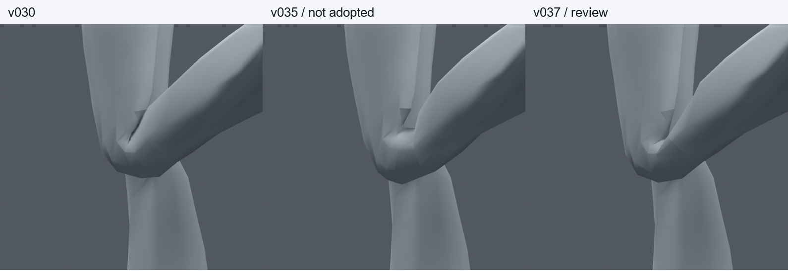
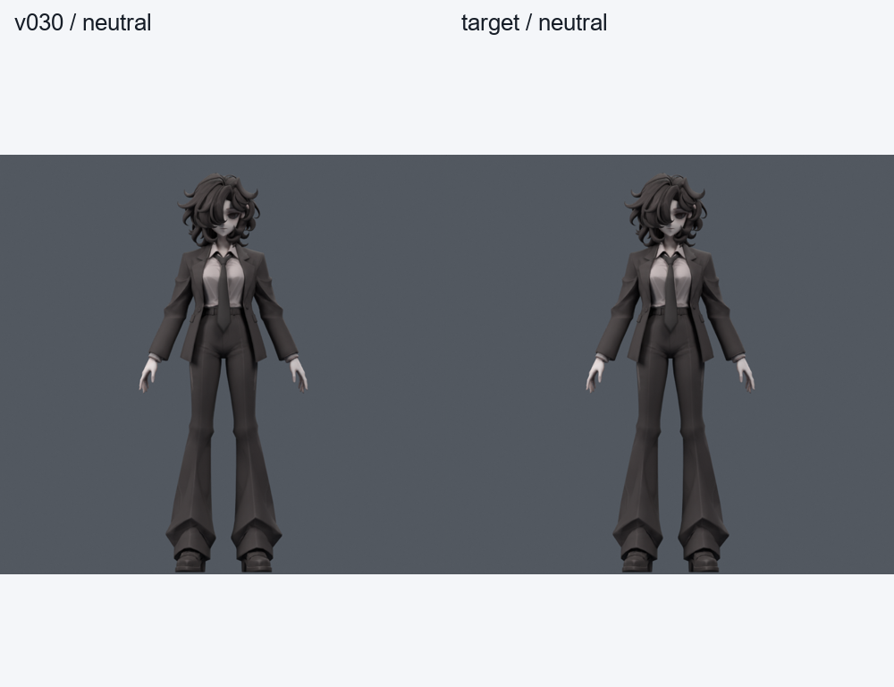
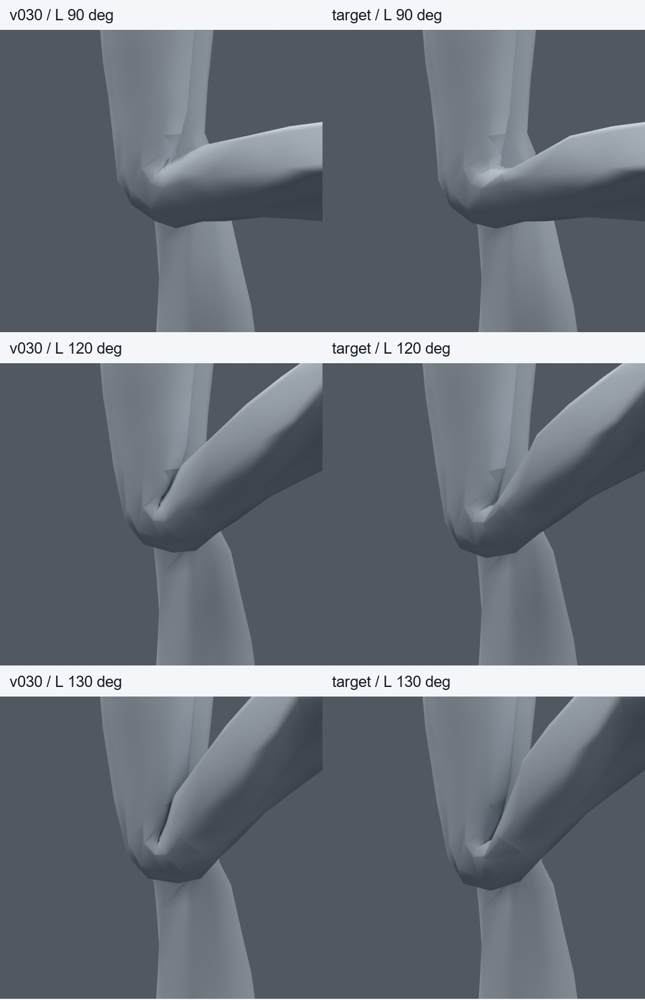
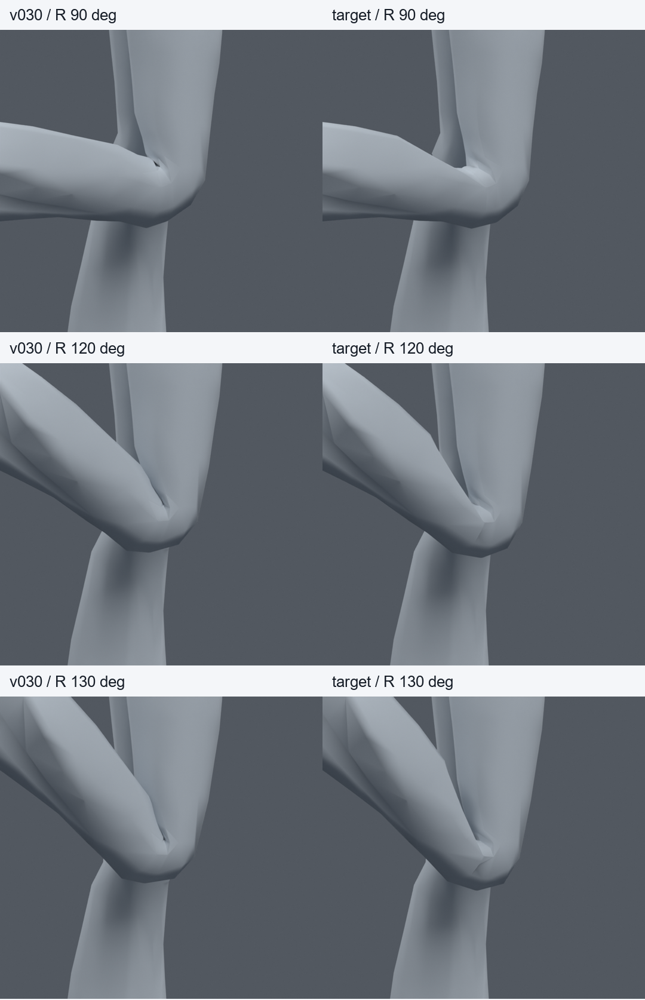
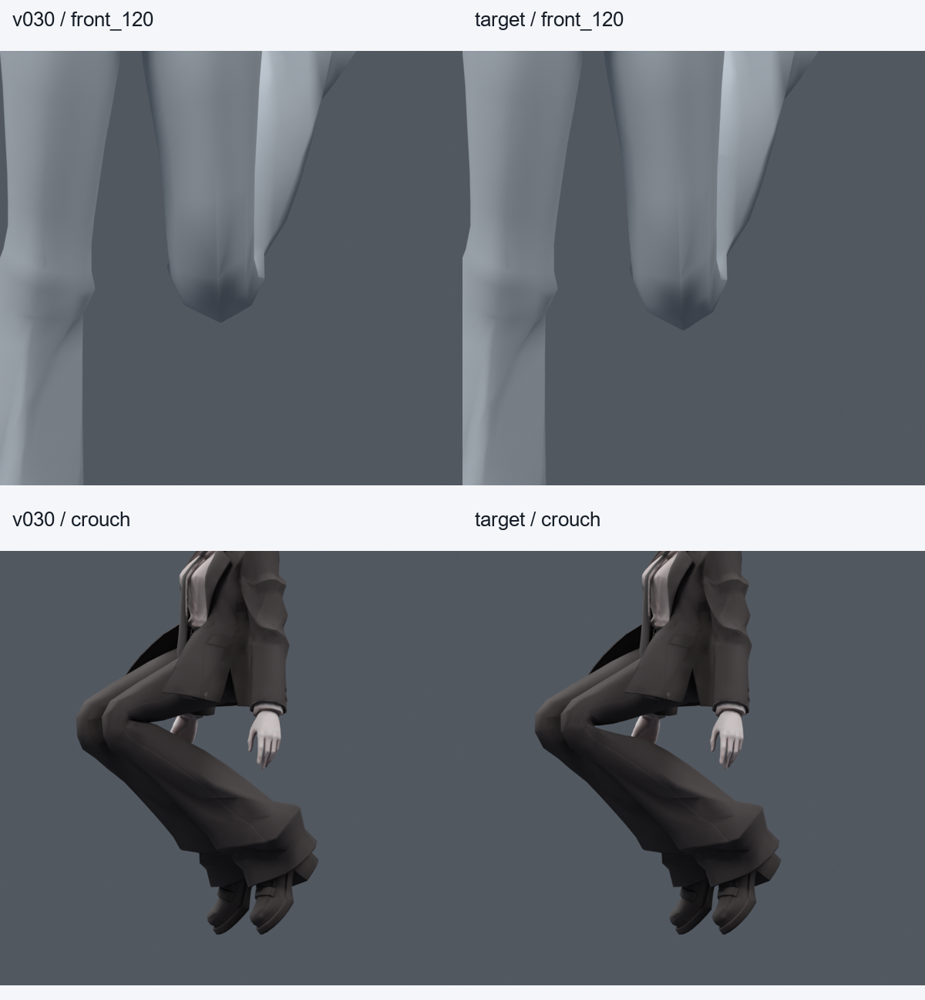

> **기록 시점 안내:** 아래는 해당 단계 당시의 보고서입니다. 후속 결정은 [최신 상태](../../STATUS.md)를 기준으로 읽어주세요. 모델·원본 텍스처·검증 원시 데이터는 이 문서 공유본에 포함하지 않습니다.

# v037 — v030에서 무릎만 다시 조절한 검수 사본

2026-09-09. 사용자의 조사·계획 실행 요청에 따라 **v030 사본에서 다시 시작했다.** v035의 추가 관절이나 v036의 자세 키·14줄 컷을 가져오지 않았다. 새 메시, 부분 교체 메시, 자동 리메시는 만들지 않았다. 원형 레퍼런스와 아래 비교 이미지를 실제로 열어 검수했다.

## 결과와 채택 상태

검수 파일은 `bianca_KNEE_TARGET_REVIEW.blend`, 동작 비교 파일은 `bianca_KNEE_TARGET_MOTION_REVIEW.blend`다. 실제 검사 대상은 `bianca_KNEE_TARGET_TRIAL.blend`다. 파일별 SHA는 `DELIVERY.json`, `MOTION_RELOAD.json`에 기록했다. **사용자 최종 채택 전의 후보이며, 전체 관절이나 Unity 작업 완료가 아니다.**

v030의 좁은 뒤쪽 접힘을 기준으로 삼고 앞쪽 납작함을 줄였다. 이번에는 앞쪽의 목표 정점을 먼저 정하고, 기존 본의 웨이트로 그 목표를 맞췄다. 뒤쪽은 엇갈리는 윗다리·아랫다리 면을 따로 조정했다. v035처럼 무릎 전체를 두껍게 만드는 대신 앞쪽 보강량을 제한했다. 그 결과 두께 회복량도 v035보다 작다.

현재 그림에서 v030의 안쪽 검은 면 교차가 줄고, 접힌 끝의 앞면이 덜 납작해졌다. v035의 넓은 U자 공간보다 좁은 접힘을 남겼다. 다만 안쪽의 작은 각진 주름과 정면 끝의 다각형 윤곽은 여전히 보인다. 이것을 실제 인체의 완전한 재현이나 자연스러움의 최종 합격으로 표현하지 않는다. 대상은 원래 주름과 비대칭 연결을 가진 바지 표면이다.

## 실제 수정 범위

| 항목 | v030 → v037 |
|---|---|
| 기존 정점 | 34,597개 유지, 원래 좌표 정확히 동일 |
| 면 | 17,625 → 17,630. 기존 사각형 5개만 대각선 분할 |
| 삼각형 수 | 31,363 유지. 사각형의 삼각화 연결만 달라짐 |
| 본 | 기존 94개 유지. 추가·재부모화·피벗 변경 없음 |
| 웨이트 수정 | raw 정점 324개, 중복 위치를 합치면 164곳 |
| 편집 위치 | 양쪽 바지, 원래 높이 약312.0~423.3mm |
| 영향 본 | 무릎의 기존 thigh / shin / knee_support 조합 |
| 자세 키·새 드라이버 | 추가 없음 |
| 원래 UV | 원래 면/코너 대응값 오차0 |
| 커스텀 노멀 | 재기록 후 최대 단위벡터 차이0.000510, 약0.029도. 비트 동일 아님 |

전체 최대 영향 본 수4, 웨이트 합 최대 오차1.0431e-7이다. 중립 자세 전체 평가 정점 차이는 최대3.08e-8m다. 보존 검사10자세에서 수정 정점 밖 표면 차이0, 기존94본의 포즈 행렬 차이0이었다. 따라서 얼굴·머리·옷 전체 비율을 새로 만드는 방식으로 수정한 것이 아니다. 단, 면 분할 뒤 커스텀 노멀은 재양자화되므로 모든 배열이 비트 단위로 같다는 주장은 하지 않는다.

자세가 접힌 상태에서 기존 표면 대비 최대 이동은 보존 검사 중 약20.02mm였다. 이는 무릎 뒤쪽 교차를 해소하는 변형까지 포함한다. **원래 중립 정점을20mm 이동한 것이 아니며**, 앞쪽만의 두께 증가량도 아니다.

## 목표를 만든 방법

1. **앞·옆 목표:** v030의120도 실제 정점과 연결을 읽었다. 왼쪽 기준30곳의 이동 목표를 개별 표로 작성했다. 중앙은 Y−9/Z−5mm, 옆은−4/−2mm, 윗아랫 경계는−1/−0.5mm처럼 부위별로 조절했다. 이후 경계13곳을 추가해 갑작스러운 꺾임을 줄였다. 오른쪽은 반사 위치의 가까운 기존 정점에 대응시켰다. 중복 UV 정점은 같은 위치 단위로 동기화했다.
2. **기존 본으로 맞추기:** 세 본이 각각 정점을 변형시킬 수 있는 위치를 계산했다. 목표에 가장 가까운 음수 없는 합1 웨이트를 구했다. 새 shape key로 목표를 강제하지 않았다. 앞쪽 목표 오차는 최대0.860mm였으며, 정점별 목표·실제값·웨이트를 `FRONT_BOUNDARY_TARGETS.json`에 남겼다.
3. **뒤쪽 접힘:** v030의 면 교차가 주로 뒤쪽에 몰려 있음을 확인했다.120도에서 윗다리와 아랫다리 사이 방향으로 얇은 두 면의 목표를 설정하고, 접힌 공간의 기존 깊이는 목표값으로 유지했다. 경계는 주변으로 감쇠시켰다. 이는 개별 정점에 기록된 절차적 접촉 목표이며, 모든 점을 사람이 직접 조각한 형상이라는 뜻은 아니다. 기존 세 본만으로 정확히 도달하지 못하는 점도 있었고, 확장 목표 오차는 최대12.50mm다. 따라서 실제 결과를 다시 렌더·검사해 판단했다.
4. **과압축 연결 정리:** 사각형11764/15045/17568/17595/17611의 두 대각선을 비교했다. 실제 굽힘에서 얇은 삼각형이 생기는 대각선을 바꾸고 고정했다. 새로운 정점은 만들지 않았다. 원래 면의 대응 ID를 저장해 전신 검사의 면 목록을 비교했다.
5. **접힘 끝:** 기존6773 위치와 반대쪽 대응 위치를120도에서0.8mm 더 분리하는 목표로 조정했다. 그 정점의 중복 위치 웨이트만 함께 바꿨다. 실제 오차는 `CREASE_TIP.json`에 있다.

전역 가우시안 팽창이나 일괄 수평 컷 탐색을 실행하지 않았다. 목표 작성 → 기존 본 분담 → 문제가 남는 기존 면 연결 → 작은 끝점 수정의 순서로 진행했다. 수정 정점 전체 목록은 `PRESERVATION.json`, 대각선 선택 근거는 `CONNECTIONS.json`에 있다.

## 단계별로 탈락시킨 문제

아래는 동일한 좌우26자세에서 관측된 면 쌍 교차/면적 경고의 누적값이다. 자세마다 같은 면이 중복 집계될 수 있다. 면적 경고는 원래 면적 대비0.2 미만 또는3 초과이며, 실제 삼각화된 표면을 사용한다.

| 사본 | 교차 | 면적 경고 | 판단 |
|---|---:|---:|---|
| FRONT_TARGET | 309 | 27 | 앞쪽 회복, 경계 꺾임. 미채택 |
| FRONT_BOUNDARY | 308 | 10 | 경계 일부 개선, 뒤쪽 교차 그대로 |
| REAR_TARGET | 4 | 13 |120도 교차 해소,130도 비틀림 잔존 |
| REAR_EXTEND | 0 | 13 | 뒤쪽 편집 경계를 확장해 교차 해소 |
| LOCAL_CONNECTIONS | 0 | 3 | 기존 사각형5개 대각선 정리 |
| KNEE_TARGET | 0 | 0 | 접힘 끝 국소 조정 후 확대 검사 대상으로 고정 |

대표 자세를 확인한 뒤에만 전신 검사로 넓혔다. 여섯 단계의 사본은 원본 작업 저장소에 보존했다. 초기에 노멀 보존 검사의 비트 수준 허용오차가 실패했고 실제 재기록 오차를 확인했다. 이를 숨기지 않고0.001 이내의 단위벡터 오차 기준과 실측값을 따로 기록했다. 형상·교차 검사 기준은 완화하지 않았다.

## 시각 비교

같은 원래 정점 띠를 같은 보조 본 평면에 투영한 좌측 앞뒤 폭은120도에서 **43.46→52.01mm**,130도에서 **39.21→49.01mm**다. 중립은70.08mm다. 이는 동일 추적점의 투영 폭으로, 진짜 무릎의3D 부피나 인체 두께 보존율이 아니다. v035의120도64.09mm보다 작지만, 사용자가 지적한 넓은 안쪽 공간을 다시 만드는 것을 피하기 위해 제한했다.

전신 앉기에서는 코트가 무릎 일부를 가리므로 무릎 단독 검사를 대신할 수 없다. 정면 윤곽과 다른 관절의 기존 문제는 별도 검수 대상이다.

## 확대 검증과 한계

검사 원시 파일은 `verification_body_*`, `verification_focused_*`, `verification_fresh_*`, `MOTION_RELOAD.json`이며 최종 집계는 `SUMMARY.json`이다. 전신1377자세, 무릎 집중124자세, 후보 고정 뒤 새256자세(seed370910),183프레임의 정수·중간값365표본을 검사했다. 세트 사이에는 공통 자세가 있으므로 전부 독립 검증이라고 합산하지 않는다. 새256자세도 이번 이후에는 알려진 회귀 세트다.

| 검사 | v030 좌/우 교차 누적 | v037 좌/우 교차 | v037 좌/우 면적 경고 |
|---|---:|---:|---:|
| 전신1377 | 1207 / 1242 | 0 / 0 | 0 / 0 |
| 집중124 | 이번 집계에서 기준 미재실행 | 0 / 0 | 0 / 0 |
| 새256 | 1019 / 896 | 0 / 0 | 0 / 0 |
| 기존 스트레스384 | 724 / 562 | 0 / 0 | 0 / 0 |
| 동작365표본 | 기준 미재실행 | 0 / 0 | 0 / 0 |

전신1377·새256·기존384에서 원래 면 ID로 비교한 **다른 부위의 새 면적 경고 면0, 코트/바지·코트/소매 교차 증가 자세0**이었다. 기존 다른 관절의 경고까지0이라는 뜻은 아니다.

깊은 굽힘0~130도와 무릎 비틀림±10도 범위에서 만든 후보이며, 추가로 무릎 비틀림±15도 범위를 포함한 기존 스트레스384표본도 통과했다. 모든 연속 각도·모든 애니메이션을 증명한 것은 아니다. 원래 다른 관절/코트 문제의 존재와 이번 무릎 통과를 구분한다. 실제 파일을 다시 연 동작 검사의 전체 정점 최대 오차는0이다. 전달 사본도 fingerprint와 웨이트 재로드 일치를 확인했다.

## 계획 대비 진행과 다음 작업

[v030 재시작 계획](../v036_knee_crease/RESTART_FROM_V030.md)의 목표 작성·기존 본 분담·필요한 국소 연결·대표/전신/재생 비교를 실행했다. 조사 자료를 새로 전부 재열람한 턴은 아니며, 앞서 확인한 [CoderNunk의 앞/뒤 면 구성](https://codernunk.com/tutorials/complete-3d-character-guide/#the-crotch-legs-and-knees), [Blender Studio의 수동 웨이트·보정 작업 흐름](https://studio.blender.org/tools/artist-guide/asset-creation/rigging), [amaotolog의 Unity 무릎 제작 기록](https://amaotolog.com/vr/125)을 그 범위에서 적용했다. 이번 결과를 외부 제작자의 파일과 직접 비교 검증했다고 주장하지 않는다.

**PC Unity/VRChat 안에서의 최종 실행 검증은 아직 하지 않았다.** 이번 후보는 원래94본과 기존 knee_support 절반 회전 제약을 사용하며 새 Blender 전용 드라이버는 없다. 하지만 기존 Blender 제약이 FBX에 자동 전달된다는 뜻은 아니다. Unity 단계에서 기존 보조 본의 회전 분담을 실제로 재현하고, 동일 자세·삼각화·웨이트로 대조해야 한다. 사용자의 Unity 전 관절 정리 순서를 유지한다.

먼저 사용자가 v030 대비 접힘 모양과 두께의 균형을 확인할 수 있는 상태로 남긴다. 이 후보를 승인된 최종본으로 바꾸지 않는다. 이후 형상 피드백이 있으면 이 사본의 제한된 영역을 조정하고, 다른 관절·어깨·전완 회전 및 의상/머리카락 물리의 잔여 검수로 이어간다. 새 모델 생성은 계속 금지한다.

Blender MCP는 설치하지 않았다. 현재 Blender Python으로 필요한 기존 정점·웨이트·면 편집과 렌더·재로드 검증이 가능했다. 설치 허가는 유지하며, 이번에는 별도 연결이 필요한 기능이 확인되지 않았다.

재현 도구: `knee_target_v037.py`의 inspect → front → boundary → rear → extend → connections → tip → verify / audit / stress. 비교 집계는 `knee_target_summary_v037.py`다. 원형 수정본과 원시 데이터는 별도 작업 저장소에만 포함한다.
