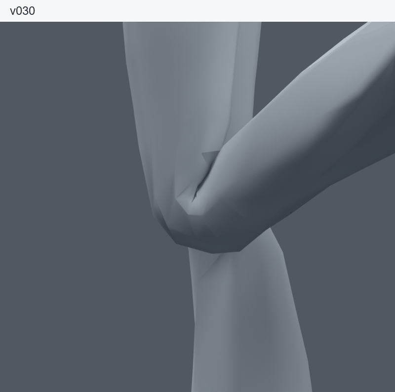
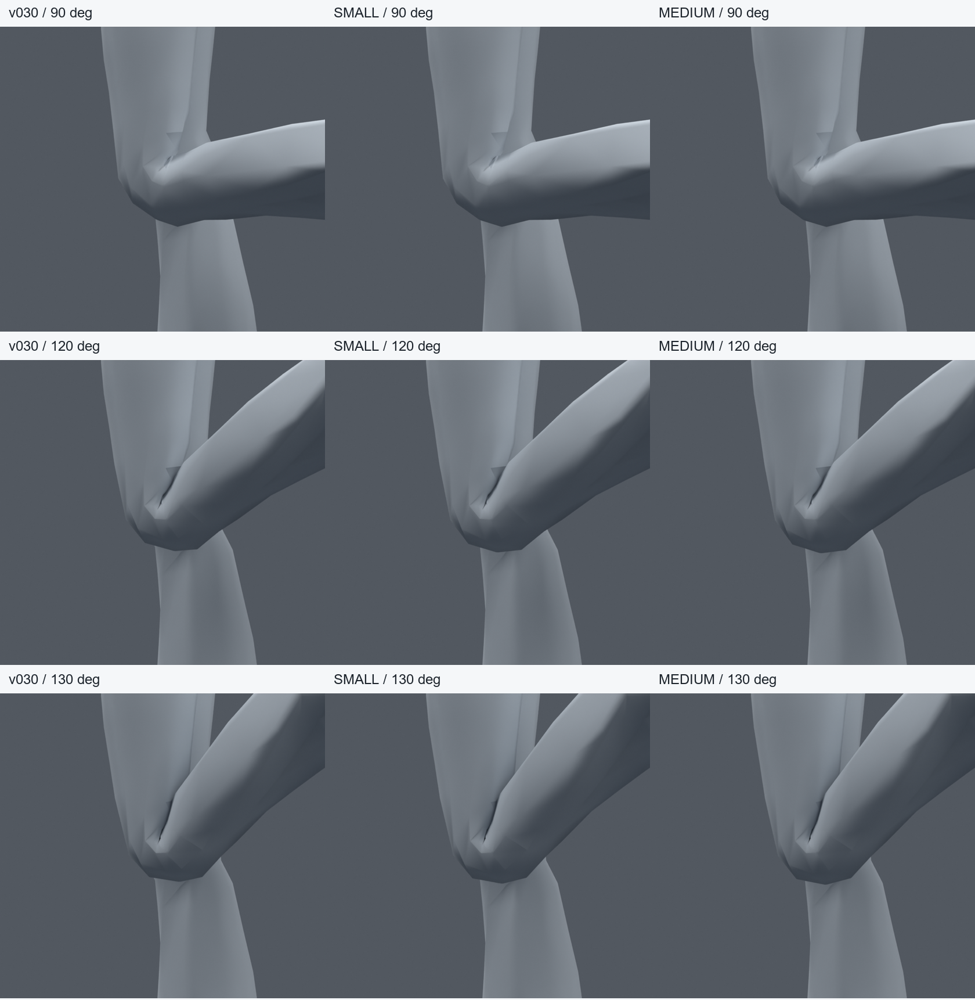
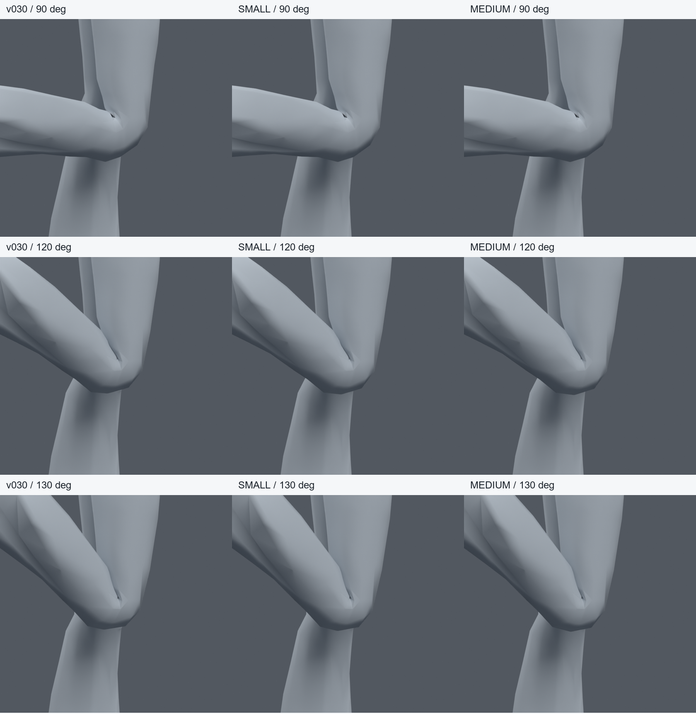
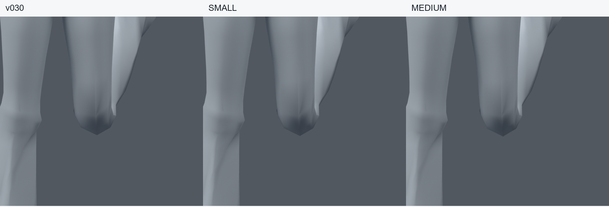

> **기록 시점 안내:** 아래는 해당 단계 당시의 보고서입니다. 후속 결정은 [최신 상태](../../STATUS.md)를 기준으로 읽어주세요. 모델·원본 텍스처·검증 원시 데이터는 이 문서 공유본에 포함하지 않습니다.

# v038 — v030의 뒤쪽 접힘을 유지한 앞면 미세 보정

2026-09-09. 사용자가 v037보다 v030이 낫다고 판단한 뒤, **v030의 뒤쪽 접힘을 유지하고 앞쪽만 작게 보정**하는 작업을 승인했다. v030 원본에서 별도 사본 두 개를 만들었다. v037은 계속 미채택이다.

## 검수할 결과

`bianca_KNEE_FRONT_SMALL_REVIEW.blend`는 작은 보정 사본이다. 동작 확인용은 `bianca_KNEE_FRONT_MOTION_REVIEW.blend`다. 원본 v030을 덮어쓰지 않았으며 **사용자 채택 전의 비교용 파일**이다.

이번 결과는 차이가 작다. 앞쪽 끝의 납작함을 조금 보완하지만, v030의 전체 윤곽을 크게 바꾸거나 무릎의 모든 문제를 해결한 결과는 아니다. 큰 보정 사본 MEDIUM도 비교했으나, 변화량을 늘릴 만큼 뚜렷한 시각적 이점이 있다고 판단하지 않아 작은 사본을 검수 대상으로 남겼다. SMALL이 원본보다 반드시 우수하다는 판정은 하지 않는다.

GIF는 두 정지 렌더를 번갈아 보여 주는 비교 자료이며 관절 애니메이션이 아니다.

## 바꾼 것과 고정한 것

- 앞면38위치, UV 중복을 포함하면64정점의 기존 thigh / shin / knee_support 웨이트만 수정했다.
- 원래 위치 기준 Y가−15mm보다 앞인 정점만 허용했다. 실제 변경 높이는340.3~402.3mm다.
- SMALL의120도 최대 실제 변위는2.574mm,32개 보존 검사 자세 전체 최대는2.914mm다. MEDIUM은120도 최대4.12mm 이동 목표의 비교 사본이다.
- 원래34,597정점 좌표,17,625면 연결,94본,UV,커스텀 노멀,재질,텍스처와 오브젝트 변환을 모두 유지했다. 새 정점·면·본·shape key·드라이버를 추가하지 않았다.
- 뒤쪽과 보호 영역의 웨이트는 v030과 정확히 같다.32자세에서 보호 영역 및 변경 정점 밖의 평가 위치 차이도0이었다.

원래 정점을 중립 상태에서2.6mm 이동한 것이 아니다. 접힌 자세의 앞면 목표를 먼저 정하고, 기존 세 본의 웨이트로 맞춘 결과다. 중립 좌표는 그대로 유지한다. 목표 표와 변경 ID는 `BUILD.json`, 보존 검사는 `PRESERVATION.json`에 기록했다.

## v037과 다른 판단 기준

v030 뒤쪽의 좁은 접힘을 변경 금지 영역으로 잡았다. 교차를 없애려고 뒤쪽 면을 밀거나, 앞뒤 전체 컷을 추가하거나, 본의 피벗을 옮기는 작업은 하지 않았다. v037의 계층·토폴로지·웨이트 수정본을 출발점으로 사용하지 않았다.

따라서 **v030에 있던 뒤쪽 면 교차와 안쪽의 검은 주름도 남아 있다.** 이번 작업은 그것들을 해결했다고 주장하지 않는다. 전체 면 교차 수가0인지 대신, 원본에 없던 교차/압축이 추가됐는지와 뒤쪽 형상이 실제로 동일한지를 검사했다. 기존 교차를 전부 자연스러운 접촉으로 판정한 것도 아니다. 향후 눈에 띄는 찢어짐이나 깜빡임이 확인되면 해당 위치만 별도로 판단해야 한다.

원형 레퍼런스와 모든 종합 비교 그림을 실제로 열어 확인했다. 정면의 원래 다각형 윤곽도 유지한다. 이번에는 원본보다 두껍게 보이는 것 자체를 개선의 합격 기준으로 삼지 않는다.

## 검증

SMALL과 MEDIUM은 먼저 좌우26자세에서 비교했다. 둘 모두 v030과 같은 교차 누적308, 무릎 면적 경고0이었다. MEDIUM에 SMALL의 확대 검사 결과를 적용하지 않는다.

SMALL은 전신1377·집중124·기존 스트레스384자세,183프레임의 정수/반프레임365표본으로 넓혀 검사했다. 같은 자세별 교차 면 쌍의 집합, 원래 면적 대비0.2 미만/3 초과 경고, 다른 부위의 새 면적 경고와 코트 교차를 원본과 비교했다. 최종 결과는 `SUMMARY.json`에 있다. 검사 범위는 깊은 굽힘0~130도와 비틀림±15도 표본을 포함하며 모든 연속 자세를 증명하는 것은 아니다.

| 검사 | v030 및 SMALL의 좌/우 교차 누적 | 새 교차 쌍 | SMALL 무릎 면적 경고 |
|---|---:|---:|---:|
| 전신1377 | 1207 / 1242 | 0 | 0 |
| 집중124 | 311 / 299 | 0 | 0 |
| 스트레스384 | 724 / 562 | 0 | 0 |
| 동작365표본 | 1257 / 1249 | 0 | 0 |

숫자뿐 아니라 **각 자세에서 교차 면 쌍의 집합 자체가 원본과 같았다.** 전신·집중·스트레스 검사에서 다른 부위의 새 면적 경고 면과 코트 교차 증가 자세도0이었다.32자세의 보호 영역 최대 위치차0, 동작365표본의 보호 영역 최대 위치차0을 확인했다. 중립 전체의 최대 정점 차이는 부동소수점 계산에 따른3.00e-8m였다. 기존 내부 교차를 의도적으로 유지하는 결과이므로 전체 교차0으로 보고하지 않는다.

동작 파일을 다시 열었을 때 저장 전후 정점 최대 오차는0이었다. 동일 동작에서 원래 v030 웨이트를 메모리에 복원해 뒤쪽 위치와 교차 면 쌍도 대조했다. 원본 파일은 수정하지 않았다. 검수용 별도 파일의 fingerprint와 웨이트 재로드도 일치했다.

## 파일과 남은 범위

- `bianca_FRONT_SMALL_TRIAL.blend`: 실제 확대 검사 대상. SHA `80d00c3f79c9773ad18b5b195e42cf41aa1cbfbce92f1d1616078aaa63e6eeaa`.
- `bianca_KNEE_FRONT_SMALL_REVIEW.blend`: 검수 전달 사본. SHA `0a38e19e978e5322a5cfb50b23b1c78e68915f0355ff2f3f93f340b6104aecfd`.
- `bianca_FRONT_MEDIUM_TRIAL.blend`: 더 큰 보정의 비교 기록. 사용자 채택 아님.
- `bianca_KNEE_FRONT_MOTION_REVIEW.blend`:183프레임 동작 비교. 원래 교차를 유지하는 사본이며 완성된 아바타가 아니다.

Unity/VRChat 실행은 이번에 진행하지 않았다. 기존 보조 본의 엔진 구동 검증, 다른 관절과 의상·머리카락 물리 작업은 남는다. 먼저 v030 대비 이 정도의 미세 보정이 실제로 더 나은지 검수할 수 있도록 파일과 비교 자료를 남긴다. 추가 구조 변경은 이번 결과에 섞지 않는다.

재현: `knee_front_v038.py`의 build → diagnose → audit / verify / baseline_focus, `knee_front_report_v038.py`, `knee_front_summary_v038.py`. 모델·원시 검증 데이터·코드는 작업 저장소에만 보관한다.
