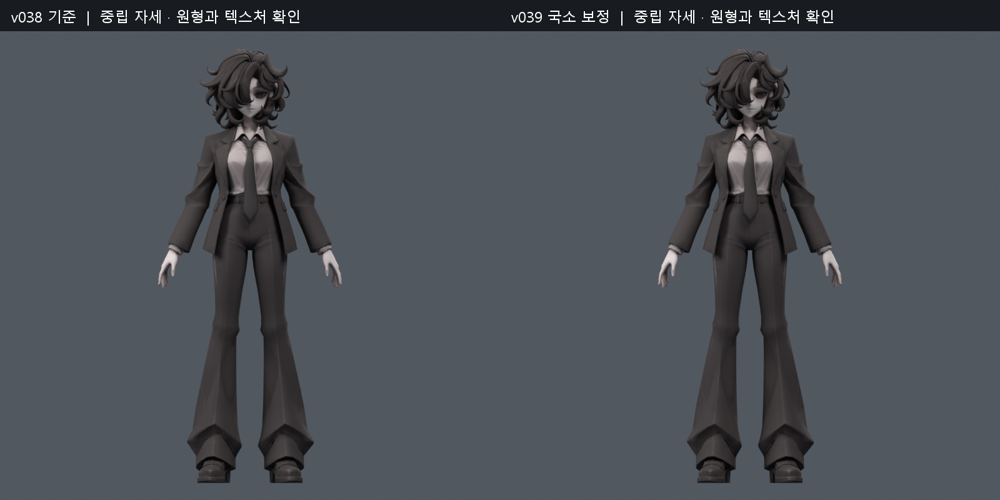
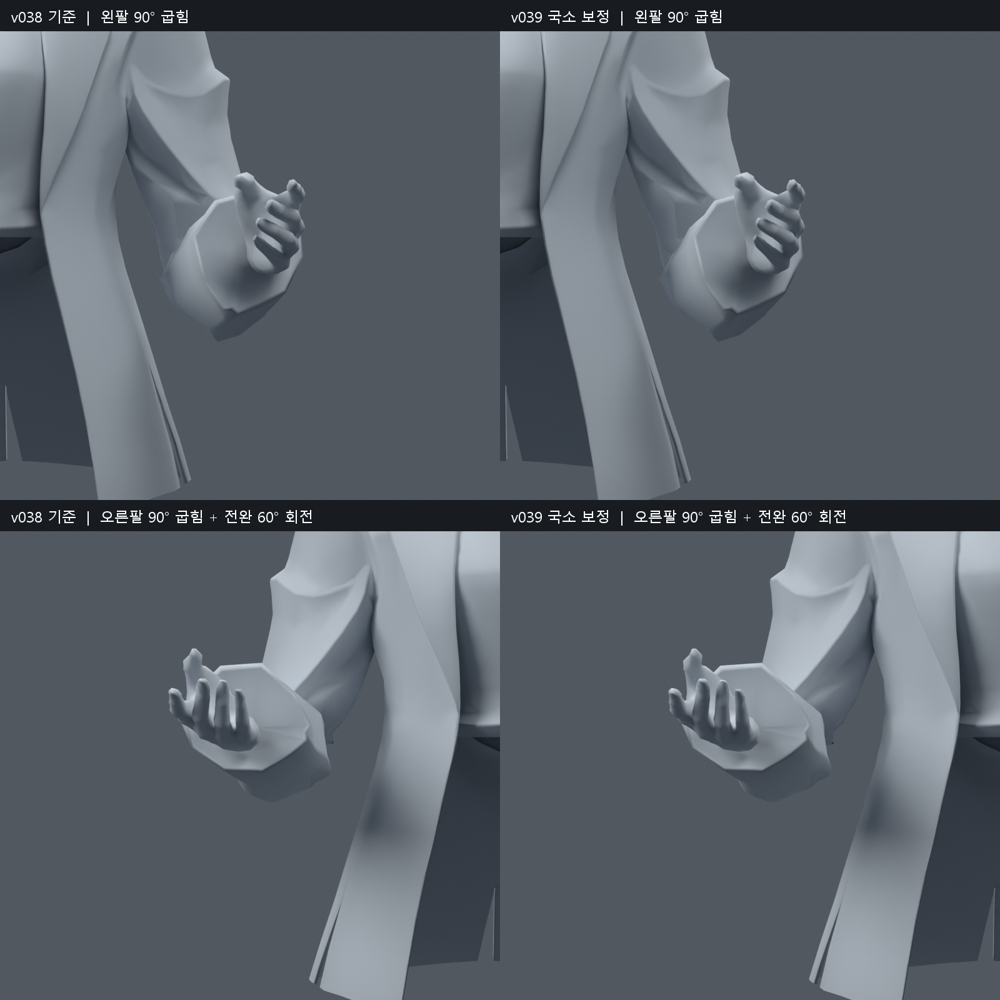
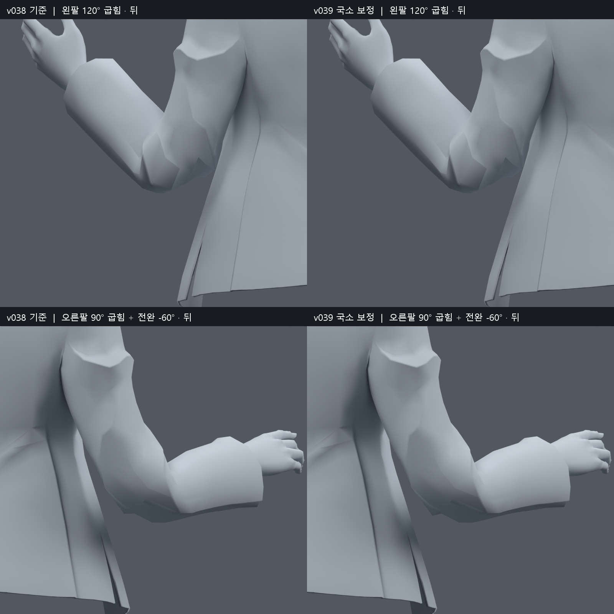
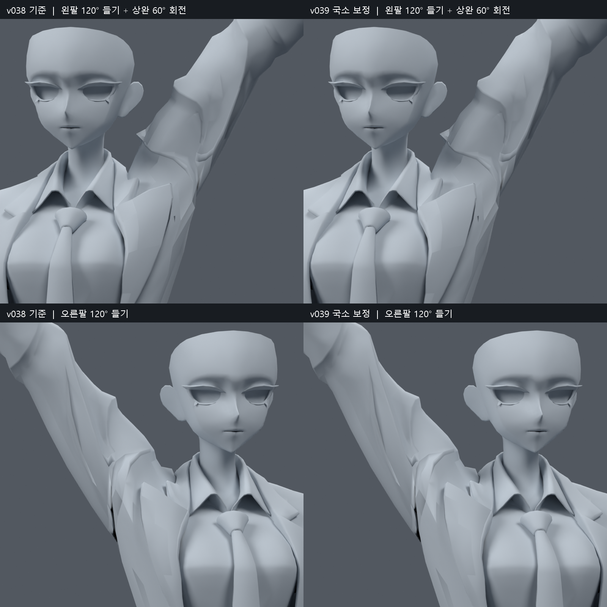
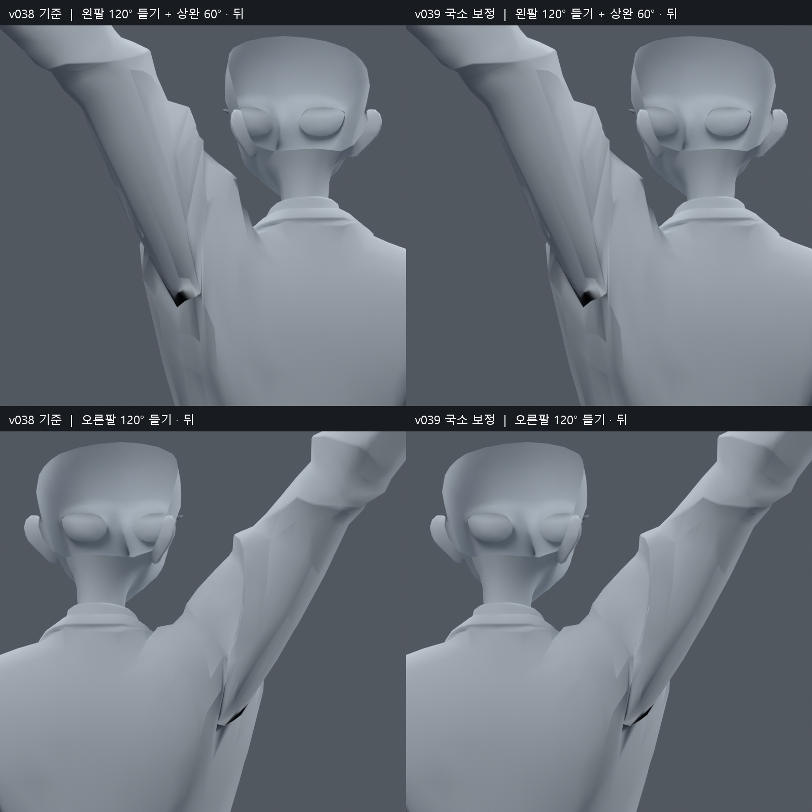
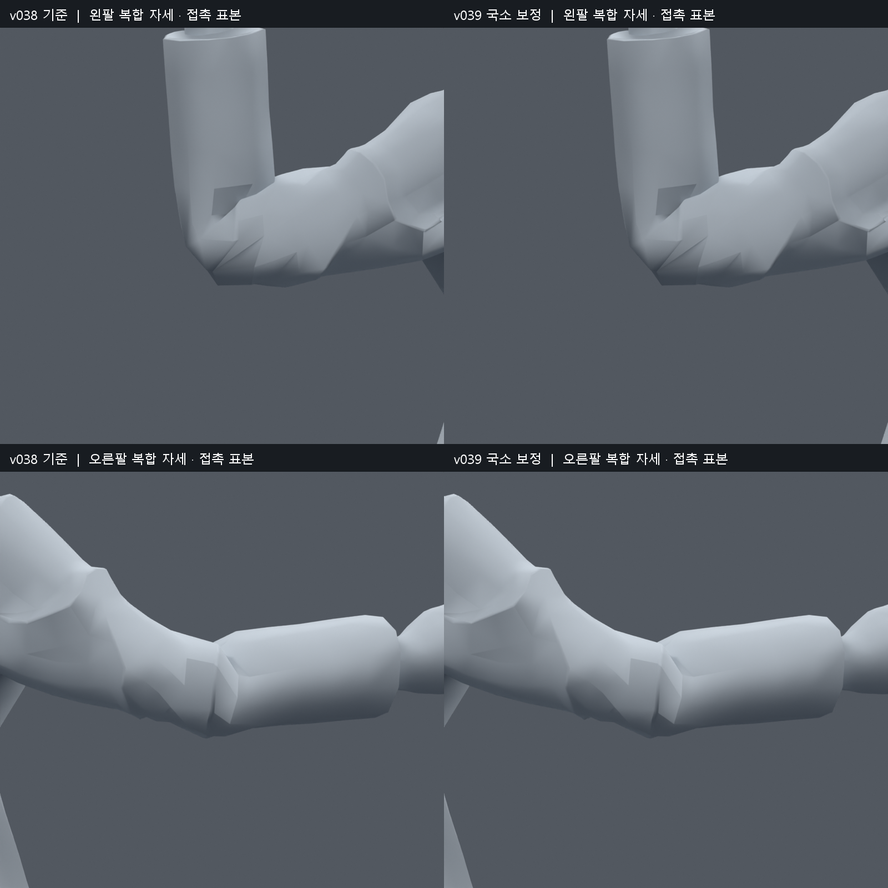

> **기록 시점 안내:** 아래는 해당 단계 당시의 보고서입니다. 후속 결정은 [최신 상태](../../STATUS.md)를 기준으로 읽어주세요. 모델·원본 텍스처·검증 원시 데이터는 이 문서 공유본에 포함하지 않습니다.

# v039 — 팔꿈치·전완 국소 보정과 어깨 회전 검수

2026-09-09. 사용자 “1번 먼저 해봐”에 따라, 채택한 v038 SMALL에서 팔 작업을 진행했다. **검수 후보이며 사용자 최종 채택이나 팔·전체 관절 작업 완료를 뜻하지 않는다.** v038의 무릎 채택은 유지한다. PC용 Unity / VRChat이 대상이며 Quest는 고려하지 않았다.

팔꿈치와 전완의 일부 압축을 줄였고, 왼쪽 팔꿈치의 사각형 두 면에만 대각선을 추가해 자세마다 분할 방향이 바뀌는 문제를 줄였다. 오른쪽 겨드랑이 뒤쪽에도 작은 웨이트 보정을 남겼다. 왼쪽 어깨의 웨이트 시험은 별도 회전에서 악화가 있어 원래 값으로 돌렸다. **큰 소매 주름, 깊은 겨드랑이 접힘과 일부 소매끼리의 접촉은 남는다.** 그 모양을 개선했다고 과장하지 않는다.

## 열어볼 파일

- 검수 모델 (공유본 미포함: `bianca_ARM_LOCAL_REVIEW.blend`): 중립 자세, 상체를 보기 좋은 화면 위치로 저장.
- 동작 검수 (공유본 미포함: `bianca_ARM_LOCAL_MOTION_REVIEW.blend`): 244프레임, 24fps. 타임라인에서 재생한다. 1–61 왼어깨, 62–122 오른어깨, 123–183 양 팔꿈치·전완 회전, 184–244 팔을 든 복합 굽힘이다.
- 실제 검사 대상은 `bianca_ARM_LOCAL_TRIAL.blend`이며, 위 두 파일과 메시·리그·웨이트가 재로드 후 일치하는지 검사했다. 동작 파일은 검사용 애니메이션이지 VRChat 런타임 구현이 아니다.

검수 SHA256: `9459ec3d4ebea5ddd939585f9df8c5ac647f467075b32164e9c1ee6b4e7e9018`. 원본 v038 SMALL SHA256: `0a38e19e978e5322a5cfb50b23b1c78e68915f0355ff2f3f93f340b6104aecfd`.

## 변경 범위와 원형 보존

| 항목 | 결과 |
|---|---|
| 원래 정점 | 34597개, 추가·삭제·이동 0 |
| 면 | 17,625 → 17,627; 기존 사각형 12647·12648에 대각선 2개 추가 |
| 렌더 삼각형 | 31,363개로 동일 |
| 웨이트 수정 | 136 raw 정점 / 63개 위치 |
| 본 | 94개 유지, 계층·제약·드라이버·Shape Key 동일 |
| 최대 본 영향 수 | 4개, 정규화 오차 1.04e-07 |
| 중립 평가 표면 차이 | 6.01e-08m |
| 271개 보존 검사 자세의 최대 위치 차이 | 3.030mm |
| UV | 원래 면·정점 코너 대응 오차 0.0 |
| 커스텀 노멀 | 복원 후 최대 벡터 오차 0.000510, 약 0.029° |

새 메시·대체 메시·리메시·새 본·새 보정 Shape Key를 만들지 않았다. 동작 파일에는 검수용 본 애니메이션을 별도로 저장했다. 원래 좌표, 본, 재질과 텍스처 이미지를 유지했다. 면 분할 뒤 UV/노멀 배열의 순서는 달라지므로 전체 fingerprint가 비트 단위로 같다고 쓰지 않는다. 노멀은 원래 코너 대응으로 복원했지만 재기록 오차가 있고, 분할하지 않은 면에도 최대 같은 수준의 오차가 있다. 중립 색상 그림으로 외형을 다시 확인했다.

무릎 웨이트는 v038 SMALL과 정확히 같다. 전신/스트레스 검사의 무릎 측정 결과도 원래와 같았다. 기존 무릎 안쪽 교차를 없앤 것으로 해석하지 않는다. 수정 웨이트 밖 정점의 271자세 평가 위치 차이는 0이다.

## 원인 확인과 시도한 방법

오른팔 원래 정점 602와 606은 이웃하지만 elbow_support 영향이 약 0.066과 0.465로 크게 달랐다. 왼팔 안쪽과 겨드랑이 뒤쪽에도 급격한 분담 차이가 있었다. 다만 그 값만 평균내면 다른 자세가 나빠졌다. 15%/30% 국소 smoothing 사본은 전신 1,377자세에서 새 면적 경고가 각각 8/25건 생겨 제외했다.

이후 기존 본 영향 집합 안에서 작은 웨이트 수정 후보를 맞췄다. 팔 자세만으로 판단하지 않고 몸통 회전과 연속 동작 표본을 추가했다. 최종 적합 자료는 1914개 기록이며 반복되는 기본 자세도 포함한다. 최대 LBS 근사 오차는 3.11e-07m였다. 반복 횟수를 제한한 수치 적합으로, 수학적 최적해를 찾았다고 주장하지 않는다. Blender 실제 평가·면 분할·시각 검수는 별도로 수행했다.

웨이트만 바꾼 FIT1/FIT2/FIT3에서는 검사 세트를 넓히면 새 경고가 남았다. FIT3은 전신/스트레스/두 번째 복합/동작에서 새 면적 경고가 없었으나 첫 복합 1건, 각도 격자 2건이 남았다. FIT2와 FIT3 사이 21개 비율도 14개 실패 주변 자세에서 함께 비교했지만 모두 회귀가 있어 적용하지 않았다.

왼팔꿈치 12647·12648의 대각선 두 방향을 비교한 결과를 바탕으로, 원래 정점 사이에 대각선만 고정했다. 특히 12648은 원본에서 경고가 없던 복합 자세에 다른 대각선이 선택되면 압축이 나타났다. 반면 왼쪽 어깨 15402는 단순 대각선 고정도 다른 자세를 악화시켜 적용하지 않았고, 그 주변 27 raw 정점의 웨이트 수정을 원래 값으로 돌렸다. 이 선택은 큰 주름을 고친 것이 아니라 회귀를 피한 것이다.

참고한 기존 [어깨·회전 조사 기록](../v025_rotation_review/RESEARCH_NOTES.md)의 결론도 유지한다. 굽힘 보조 본과 길이축 twist 분담은 같은 기능이 아니며, 단순 체적 보존 옵션이나 일괄 smoothing을 해결책으로 가정하지 않는다. 이번에는 이 기록과 실제 파일·포즈를 재검토했으며 외부 웹/YouTube를 새로 시청했다고 주장하지 않는다.

## 회전 검사

면적 경고는 실제 자세의 삼각형 면적이 같은 삼각형의 원래 면적 대비 0.2배 미만 또는 3배 초과인 경우다. 이는 부피·인체 가동 범위·시각 품질의 합격 기준이 아니다. 각도 역시 이 리그의 진단 입력이며 의학적인 정상 범위를 뜻하지 않는다.

| 검사 | 표본 수 | 새 면적 경고 면·자세 | 원래 경고에서 해소된 면·자세 |
|---|---:|---:|---:|
| 전신 회귀 | 1377 | 0 | 10 |
| 기존 스트레스 | 384 | 0 | 1 |
| 복합 자세 1 | 271 | 0 | 24 |
| 복합 자세 2 | 271 | 0 | 33 |
| 각도 격자 | 361 | 0 | 23 |
| 저장 동작·반 프레임 | 487 | 0 | 103 |

각 검사 세트에서 새 면적 경고가 없었다. 세트 사이에 자세가 겹치므로 합산을 고유 자세 수로 표현하지 않는다. 복합 1/2와 동작은 실패 뒤 보정에도 사용했으므로 최종 후보의 독립 시험이라고 쓰지 않는다. 각도 격자는 팔꿈치 0–120°/10° 간격과 전완 -80–80°/20° 간격, 팔 들기 0–120°/15° 간격과 상완 -60–60°/20° 간격을 확인한 361표본이다. 일부 기본 각도는 앞선 자료와 겹친다.

전신 검사의 팔 영역 경고 누적은 48 → 38다. **원래 경고가 모두 없어진 것은 아니다.** 전신 다른 부위의 기존 경고, 손·고관절·자락 등의 미완료는 유지한다. 전신/기존 스트레스의 새 코트-바지·코트-소매 교차 쌍은 각각 0이었다. 동작 487표본은 원래 v038 메시 위에 동일한 저장 채널을 재구성해서 비교했다. 정수 프레임 재로드 오차는 최대 0m다. 모든 연속 시간이나 Unity를 검증한 것은 아니다.

## 어깨와 접촉의 한계

팔을 높이 올린 큰 접힘은 전후 그림에서도 남는다. 왼쪽 어깨 웨이트는 원래대로이고, 오른쪽 뒤 겨드랑이의 변화도 작다. 어깨가 완전히 자연스러워졌다고 판정하지 않는다.

뒤 겨드랑이의 검은 부분은 원본 렌더 6개 픽셀에서 ray를 추적했으며 15390·15395·12696의 기존 면에 닿았다. 조사한 픽셀은 빈 배경으로 뚫린 구멍이 아니었다. 이 확인만으로 전체 메시가 닫혔다고 증명한 것은 아니며, 깊은 안쪽 접힘과 어두운 음영은 남는다.

소매 자기 접촉도 따로 검사했다. 같은 정점 위치를 공유하는 인접 면은 제외하고 원래 면 번호로 비교했다. **새 접촉 면 쌍도 존재한다.** 이를 모두 해결했거나 모두 자연스러운 접촉이라고 단정하지 않는다. 아래는 좌/우 누적 쌍이며 깊이·심각도·고유 결함 수가 아니다.

| 검사 | 새 쌍 L / R | 사라진 쌍 L / R |
|---|---:|---:|
| 복합 1 | 82 / 52 | 93 / 41 |
| 복합 2 | 68 / 60 | 66 / 48 |
| 각도 격자 | 80 / 53 | 87 / 40 |
| 동작 | 228 / 134 | 283 / 110 |

동일 카메라의 대표 접촉 자세에서 전체 실루엣과 큰 각진 주름은 원래와 비슷했다. 모든 접촉 쌍의 관통 깊이를 검수했다는 뜻은 아니다. 원래 좁은 접힘을 억지로 벌려 교차 개수만 줄이는 방식은 적용하지 않았다.

## 이후 남은 일

1. 큰 겨드랑이·소매 주름은 원형과 비교하며 별도 국소 형상 정리가 필요하다. 왼쪽 어깨의 이번 웨이트 시험은 최종 후보에 남기지 않았다.
2. 회전 시 남는 소매 자기 접촉은 겉으로 보이는 관통과 안쪽 접촉을 더 구분해야 한다. 필요시 기존 면 연결과 twist 분담을 별도 사본에서 비교한다.
3. Unity의 실제 삼각형 분할·스키닝·Humanoid 회전과 현재 Blender 제약의 대응은 아직 확인하지 않았다. 이번 파일만으로 VRChat 구동 완료라고 표시하지 않는다.
4. 손가락, 고관절·자락, 표정, PhysBone/콜라이더 작업은 이번 1번 범위에 포함하지 않았다.

## 재현과 근거 파일

`arm_local_v039.py`는 원본 진단과 smoothing 비교, `arm_fit_v039.py`/`arm_optimize_v039.py`는 제한된 웨이트 적합, `arm_connections_v039.py`는 최종 두 면 분할과 왼어깨 복원, `arm_verify_v039.py`는 원래 면 번호로 비교하는 실제 Blender 검사다. 최종 후보를 다시 만들 때는 보존된 FIT3 사본에서 `arm_connections_v039.py`를 실행한다. 최종 `verify`, `final_checks`, `motion`, `final_render`, `rest_render`, `file_consistency` 후 `arm_summary_v039.py`, `arm_report_v039.py`, `arm_document_v039.py` 순으로 정리한다.

원시 근거는 `TOPOLOGY_PRESERVATION.json`, `PRESERVATION.json`, `RIG_PRESERVATION.json`, `FINAL_FILES.json`, `SUMMARY.json`, `MOTION_RELOAD.json`, 각 `verification_*.json` 및 `COMPARISON_*.json`이다. 모델·원시 데이터·코드는 작업 저장소에 보관하고 공유 문서에는 이 보고서와 직접 확인한 비교 그림만 포함한다.
