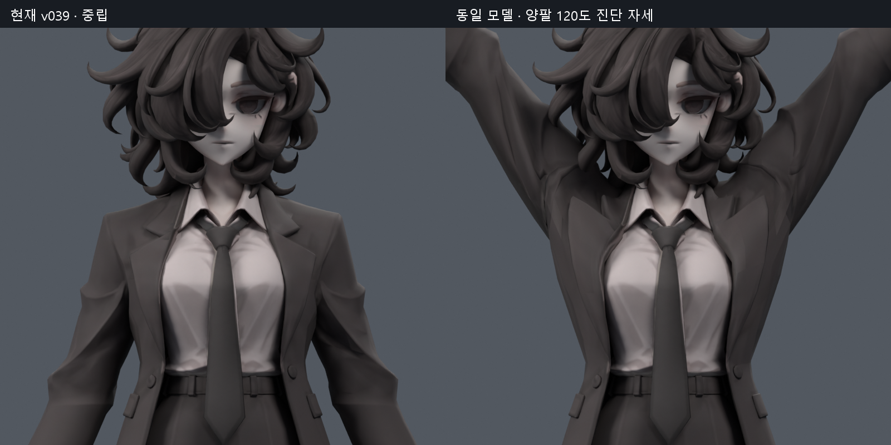
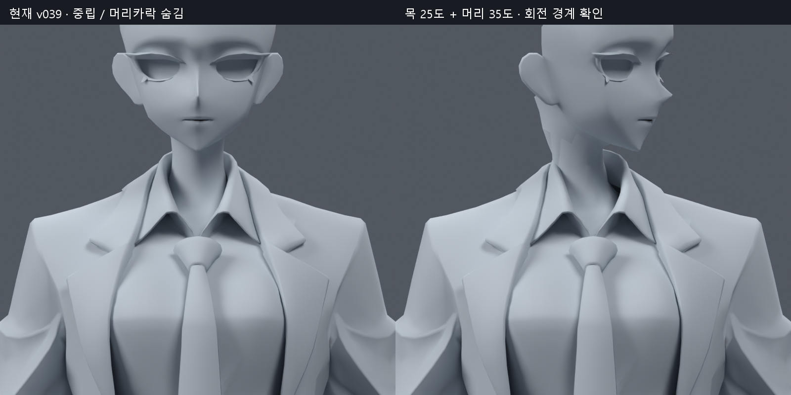
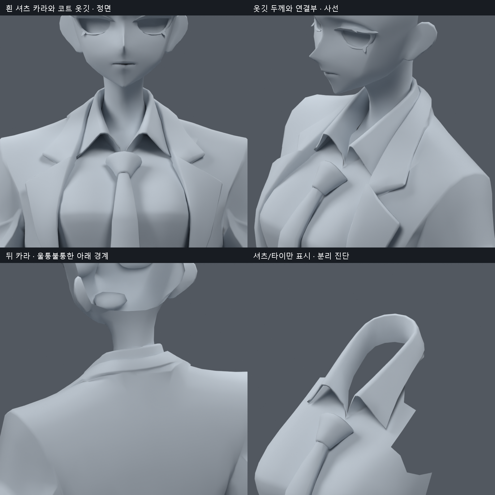
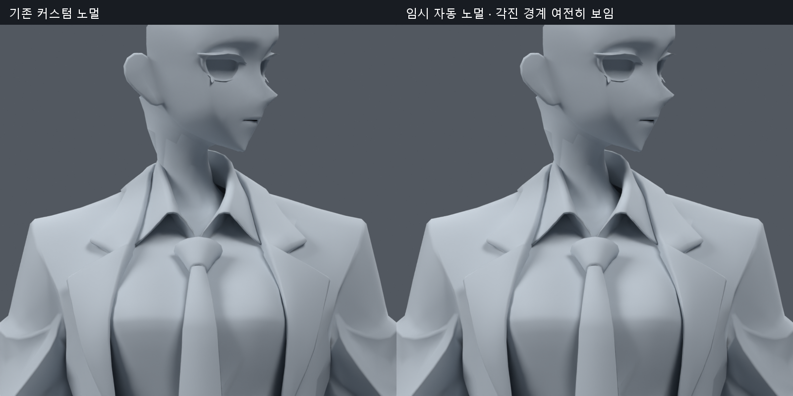

> **기록 시점 안내:** 아래는 해당 단계 당시의 보고서입니다. 후속 결정은 [최신 상태](../../STATUS.md)를 기준으로 읽어주세요. 모델·원본 텍스처·검증 원시 데이터는 이 문서 공유본에 포함하지 않습니다.

# v040 — Blender MCP 연결 시험과 카라·목·어깨 상태 진단

2026-09-09. 사용자의 MCP 작업성 확인 요청에 따라 **실제 Blender MCP 통신으로 v039 검수 후보를 검사했다.** 카라 문제는 텍스처만의 문제가 아니다. 특히 양팔을 올리면 코트의 접힌 옷깃과 어깨 경계가 뾰족하게 솟으며, 목 회전에서는 턱 아래와 목 옆의 각진 경계가 드러난다. 이번 결과는 수정 후보가 아닌 **진단 사본과 후속 수정 계획**이다.

최신 채택 기준은 계속 v038 SMALL 무릎이다. v039 팔 보정은 채택 전 후보이고, v040을 새 채택본으로 해석하지 않는다. 원본 캐릭터 레퍼런스도 직접 열어 대조했다. 레퍼런스의 부드러운 옷 접힘과 층이 있는 카라 표현을 목표로 하되, 단일 정면 그림으로 뒷면이나 실제 옷감 두께를 확정하지 않는다.

## 1. MCP로 실제 수행한 일

[Blender MCP 프로젝트](https://github.com/ahujasid/blender-mcp)의 설치 안내와 소스를 확인했다. Blender 공식 기능이 아닌 커뮤니티 도구다. 프로젝트 버전1.9.1, 소스 커밋 `5f8ddaf6e987c4aa0c3467fcc548838b28f64477`, 애드온 프로토콜5, Blender5.2.1 LTS를 사용했다. MCP SDK는1.30.0이다. 서버가 initialize에서 보고한1.30.0을 Blender MCP 패키지 버전과 혼동하지 않는다.

- 프로젝트 내부 가상환경에 MCP 서버를 설치하고, Blender 검사 세션에서 해당 애드온을 로드했다. 사용자 전역 Add-ons 폴더나 Codex 설정에 상시 연결을 등록한 것은 아니다.
- 호출 경로는 **로컬 MCP SDK 클라이언트 → stdio MCP 서버 → Blender 애드온 → 현재 Blender 장면**이다. 직접 소켓 호출만 하고 MCP라고 부른 것이 아니다. 이 대화에 새 네이티브 MCP 도구가 동적으로 추가된 것도 아니다.
- `list_tools`, `get_scene_info`, `get_object_info`, `get_viewport_screenshot`, `execute_blender_code`를 실제 실행했다. 조회·뷰 변경·자세 변경·렌더·웨이트/면 검사·사본 저장과 재로드 검증을 이 통신으로 수행했다.
- 뷰포트 캡처 호출 자체는 약0.11~0.12초, 장면/오브젝트 조회는 약0.06초였다. 새 클라이언트 시작 비용과 파일 열기/렌더 시간은 별도다. CLI보다 작업 전체가 빠르다는 벤치마크는 하지 않았다.
- 모델 생성 서비스·외부 에셋 다운로드는 호출하지 않았다. 텔레메트리는 이번 서버 프로세스의 환경변수로 비활성화했다. 애드온은127.0.0.1:9876에 연결했다.

작업성 판단: **화면을 보며 특정 부위의 자세·표시를 바꾸고 면/웨이트를 조사하는 데 유용하다.** 다만 MCP가 관절을 자동으로 이해하거나 토폴로지를 고치는 것은 아니다. 정밀 진단은 여전히 Blender Python 코드가 필요하다. 반복 계산은 재현 가능한 스크립트로 남기고, MCP는 활성 장면의 확인과 국소 편집 결과 검토에 사용하는 구성이 적합하다. 이번에는 기존 진단 코드도 MCP 안에서 재사용했다.

## 2. 현재 모델과 보존 확인

검사 출발점은 `bianca_ARM_LOCAL_REVIEW.blend`다. 34,597정점,49,130엣지,17,627폴리곤,94본,아바타 메시 오브젝트1개다. 새 메시/대체 메시/리메시/정점 이동/웨이트 변경은 최종 사본에 없다.

`bianca_MCP_INSPECTION.blend`는 중립 자세와 상체 검사 뷰로 저장했다. 원본 파일 SHA256은 `9459ec3d4ebea5ddd939585f9df8c5ac647f467075b32164e9c1ee6b4e7e9018`로 유지됐다. 검사 사본을 다시 열어 좌표·면·UV·노멀·재질·이미지·모디파이어·본·행렬 fingerprint와 전체 웨이트, 제약·드라이버·Shape Key 구성의 일치를 확인했다. 카메라/뷰 상태와 파일 자체 SHA는 원본과 다르다.

노멀 원인 분리 시험에서 메모리상의 노멀을 잠시 초기화했지만, 그 상태를 모델 결과로 저장하지 않았다. 단색 렌더의 머리카락·주변 부품 숨김 역시 검사 표시다. 실제 검사 사본에는 원래 머리카락과 텍스처가 남아 있다. 자동 노멀 초기화만으로 목의 각진 경계는 없어지지 않았다.

## 3. 직접 확인한 수정 필요 부위

| 우선순위 | 부위 | 직접 관찰 | 다음 수정 방향 |
|---|---|---|---|
| 1 | 코트 옷깃과 어깨 연결 | 중립에서 판처럼 보이는 면이 있고, 팔 올림에서 옷깃이 뾰족한 갈고리 형태로 들린다 | 옷깃과 소매의 웨이트 범위를 의미상 분리해 국소 조정. 이미 접힌 경계 면의 변형도 함께 확인 |
| 1 | 어깨·겨드랑이 | 양팔 올림에서 큰 각진 주름과 함몰이 남는다 | 옷깃을 안정시키는 과정에서 접힘이 겨드랑이로 이동하는지 동시 비교. 전체 일괄 스무딩 금지 |
| 2 | 목–턱 아래 전환 | 회전 시 목 옆에 다각형 경계와 비틀린 띠가 보인다 | 경계의 웨이트 변화·기존 면 흐름·노멀을 함께 검사. 현재 노멀 초기화만으로 해결되지 않음 |
| 2 | 뒤 카라 | 중립에서도 아래 경계가 울퉁불퉁하고 각진다 | 해당 테두리의 기존 정점 몇 개와 접힌 면/노멀부터 정리. 큰 목둘레 변경은 하지 않음 |
| 3 | 흰 셔츠 카라와 타이 접점 | 앞 카라는 형태를 유지하나 접힌 모서리가 두껍고, 텍스처의 강한 음영이 홈을 더 강조한다 | 형상/접촉을 먼저 정리한 뒤 해당 음영만 제한적으로 수정 |

### 코트 옷깃: 실제로 어느 면이 끌리는가

아래는 같은 카메라·같은 배율의 중립과 팔 올림이다. 수정 전후 비교가 아니다. 양쪽 쇄골에30도,상완에90도 회전을 준 진단 입력이며 의학적 가동범위 수치가 아니다.

렌더 픽셀에 광선을 쏴 보이는 면과 웨이트를 연결했다. 원래 면번호5534/13073은 양쪽 앞 옷깃 주변이며 해당 면의 정점들은 쇄골 약54~69%,상완 약8~24% 영향을 받는다. 이 자세에서 면 중심 높이가 약28.9mm 올라간다. 주변 면5541/13710도 팔 회전 영향을 강하게 받는다. **의상 앞부분이 쇄골과 상완에 끌리는 것은 수치로 확인했으나, 적절한 새 웨이트 비율은 아직 정하지 않았다.** 지점별로 제한한 사본에서 비교해야 한다.

기존 사각형9103은 고정0–2대각선 기준 두 삼각형 사이 각도가 약1.35→69.0도로 변한다.15651은15.1→68.7도다. 면적이 크게 줄지 않아도 한 사각형이 심하게 뒤틀릴 수 있음을 보여준다. 이 각도는 진단용 분할 기준이며 실제 렌더러 대각선과 항상 같지 않다. 기존 concave 면13107의 큰 각도를 곧바로 오류로 판정하거나 모든 면을 삼각형으로 바꾸는 근거로 사용하지 않는다.

### 목과 뒤 카라

목 회전에서 각진 띠가 보이지만, 중립/목 회전/양팔 올림3자세의 지정 부위에서 같은 원래 위치를 공유하는 분리 정점들의 위치 벌어짐은0이었다. 따라서 이 표본에서 보이는 경계를 곧바로 UV seam의 열린 틈이라고 설명할 수 없다. 서로 다른 위치의 면끼리 교차하는 문제와 표면 음영은 별개다.

흰 셔츠 카라와 검은 코트 옷깃은 구분해서 다뤄야 한다. 흰 카라는 목 주변을 따라가는 별도 표면 조각이며, 상체의 소매까지 함께 영향을 받는 코트와 다른 웨이트 구성을 가진다. 뒤쪽 아래 경계의 울퉁불퉁함은 중립 단색에서도 보여 텍스처만 고쳐서는 없어지지 않는다. 셔츠만 표시한 그림의 바깥 잘린 윤곽은 원래 다른 옷으로 가려지는 범위까지 드러낸 것으로, 그대로 노출 구멍이라고 판단하지 않는다.

자동 노멀 시험에서도 목 옆의 각진 경계가 남았다. 노멀만 초기화하는 처방은 채택하지 않는다. 원본의 면별 부드러운 음영 설정과 회전 때의 면 흐름, 목과 머리 사이 웨이트 변화까지 분리해서 확인해야 한다.

## 4. 수치 진단의 범위와 한계

24자세를 검사했다: 중립1, 목/머리 각각 yaw·pitch·roll 양방향12, 목+머리 복합 양방향6, 단측 팔 올림2, 양팔1, 흉곽 회전/굽힘2다. 측정 ROI는 원래 좌표 `z>.735m, abs(x)<.09m`, 코트/피부/셔츠/타이이며 삼각형의 모든 정점이 ROI 안에 있어야 집계된다. 다른 관절 전체를 다시 검증한 결과가 아니다.

- 이 영역에서 원래 면적의20%미만/300%초과 경고는24자세 모두0이었다. **이를 자연스러운 형상 합격으로 해석하지 않는다.** 위의 옷깃 변형이 그 반례다.
- 중립에서도 코트–피부10,셔츠–피부121,코트–셔츠147,셔츠–타이22개의 원래 면 쌍에 BVH 교차 후보가 있었다. 후보에는 안쪽 겹침·숨은 경계·접촉이 포함된다. 전부 화면에 보이는 관통이거나 전부 제거해야 할 오류라는 뜻은 아니다.
- 목 회전·기울임에 따라 후보 쌍이 달라진다. 깊이/외부 노출 여부를 아직 전부 판정하지 않았다. 자연스러운 접촉을 없애려고 카라를 크게 띄우지 않는다.
- 동일 위치 분리 정점 검사는 더 좁은 `z>.775m` 영역의3자세다. 교차 검사나 전체 메시 watertight 검사를 대체하지 않는다.
- 새로운 면적 검사 임계값·MCP 연결 성공·노멀 시험 성공을 전체 아바타 품질 완료로 확대하지 않는다.

기존에 남아 있던 팔꿈치/전완 자기접촉, 손가락, 골반·코트자락, 발목, 표정, 머리카락·의상 물리, Unity/VRChat 런타임 검증은 이번에 완료하지 않았다. 이 항목들은 기존 인계의 잔여 작업이며 이번에 모두 새로 시각 검사했다고 주장하지 않는다.

## 5. 다음 수정 순서와 합격 기준

1. **코트 옷깃/어깨부터 작은 사본 비교.** 광선으로 확인한 앞 옷깃 면과 실제 인접 면만 선택한다. 옷깃에 전달되는 상완 회전을 줄이고 흉곽·쇄골 사이 분담을 맞추는2~3개의 제한된 후보를 비교한다. 쇄골 값을 일괄0으로 만들거나 앞판 전체를 고정하지 않는다. 중립 윤곽은 그대로 두고,60/90/120도 올림·전방 들기·상완 비틀림에서 확인한다.
2. **필요한 기존 면만 정리.** 웨이트만으로 면 뒤틀림이 남으면 해당 기존 사각형의 대각선 또는 소수 정점 위치를 조정한다. 전체 삼각화/새 메시/리메시는 하지 않는다. 구조 변경이 외형을 크게 바꾸면 비교 결과를 먼저 보여준다.
3. **목과 뒤 카라를 별도 보정.** 목–머리 경계의 변형·음영을 확인하고, 뒤 카라 테두리는 원래 목둘레와 높이를 유지하며 소수 정점/웨이트만 조정한다. 목 회전·숙임·젖힘·측굴과 팔 올림의 복합 자세까지 비교한다.
4. **그 뒤 텍스처 음영 조정.** 형상이 정리된 카라/옷깃 주변만 원본 그림의 명암에 맞춘다. 텍스처로 찢어짐이나 함몰을 덮는 방식으로 완료 처리하지 않는다.
5. **검증과 기록.** 중립 동일시점,각도별 동작,기존 v038 무릎 보존,수정범위 밖 변화,UV/노멀/원본 파일,접촉의 외부 노출을 검사한다. 면적뿐 아니라 옷깃 끝의 이동·꺾임과 어깨 실루엣이 실제로 나아져야 채택 후보로 제시한다. Blender 검증 후 Unity/VRChat 결과는 별도로 확인한다.

이번에 확정한 것은 문제 위치와 우선순위다. 새 수정 비율이나 구조의 효과는 아직 실행·검증 전이며, 해결됐다고 기록하지 않는다.

## 6. 재현 자료

검사 사본 `bianca_MCP_INSPECTION.blend`, 장면 및 보존 기록 `SCENE_AUDIT.json`/`PRESERVATION.json`,24자세 원시 기록 `COLLAR_MEASUREMENTS.json`,광선/분리 정점/면 뒤틀림 `GEOMETRY_DETAIL.json`,실제 MCP 호출 `MCP_CALLS.jsonl`/`MCP_TOOLS.json`을 원본 작업 저장소에 남겼다. 마지막 사본 SHA는 보존 기록을 따른다.

재현 코드는 `mcp_bootstrap_v040.py`, `mcp_inspect_v040.py`, `tools/blender_mcp_client.py`, 이 단계의 번호별 실행 스크립트다. 애드온/서버 설치 소스는 무시된 프로젝트 가상환경에 보관한다. 재개할 때 검사 파일과 bootstrap으로 Blender를 열고 MCP 클라이언트의 `list`/조회부터 확인한다. 앱 전역 자동 시작 등록은 되어 있지 않다.

공유본에는 이 문서와 직접 확인한4개 진단 보드만 포함한다. 모델·원시데이터·실행코드·레퍼런스·텍스처 원본은 공유 문서 저장소로 내보내지 않는다.
