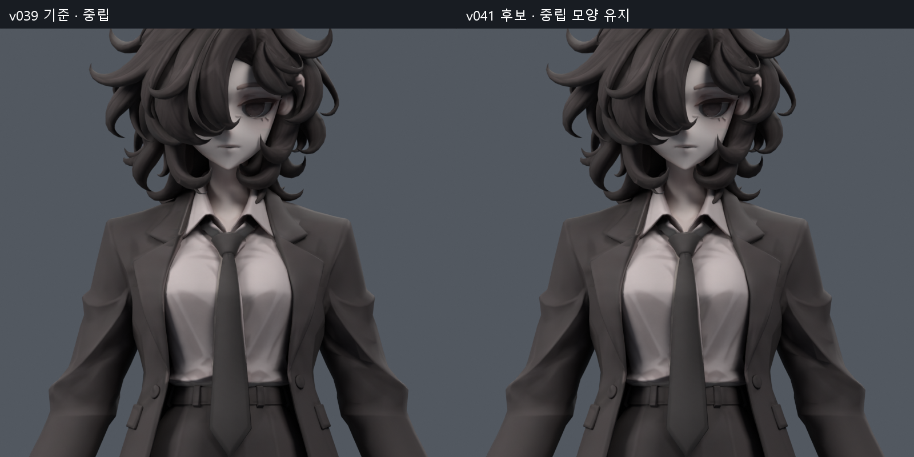
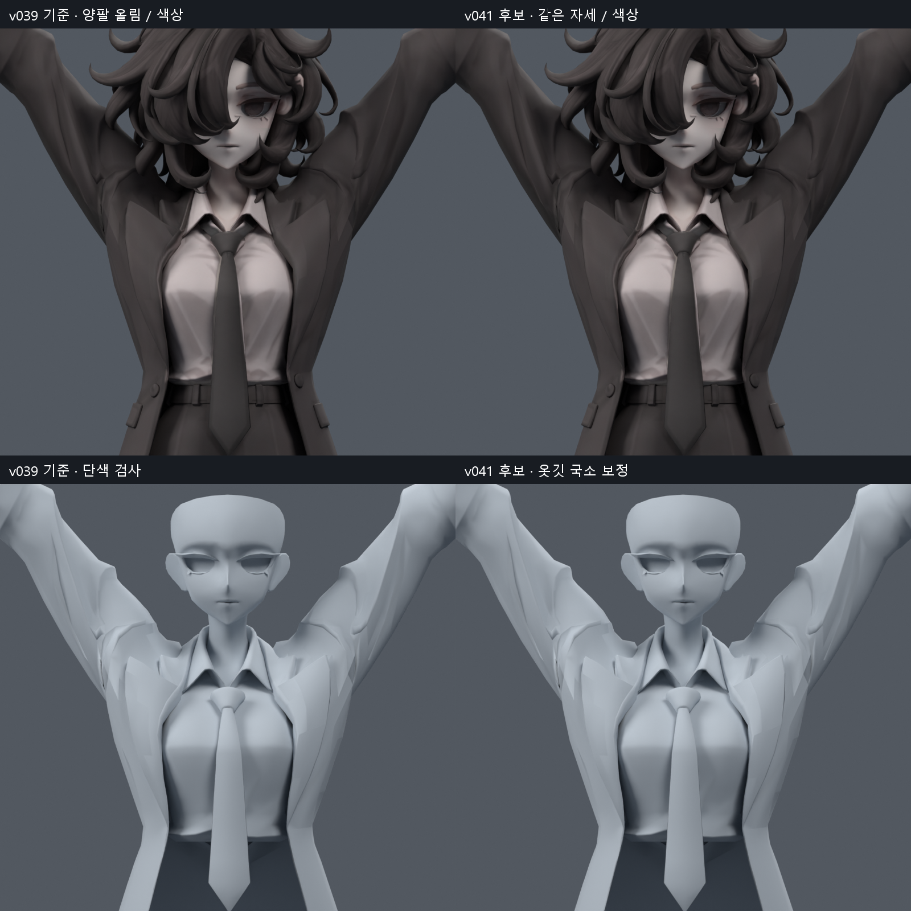
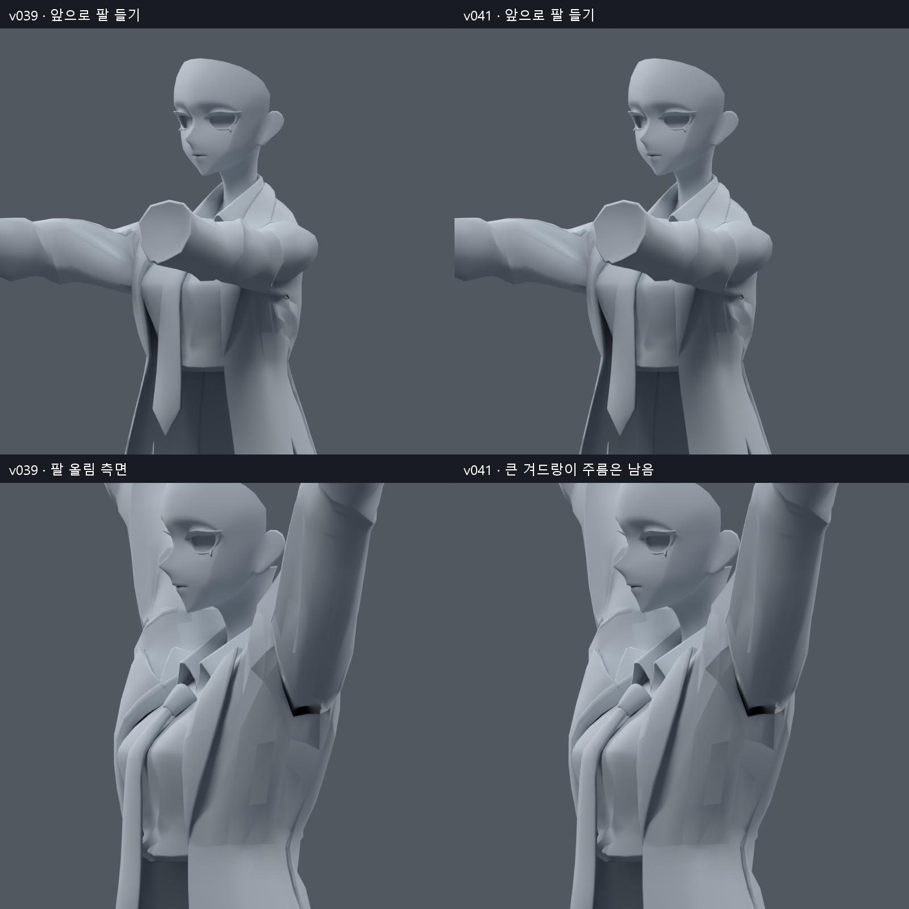
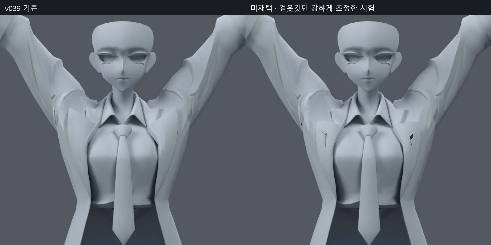
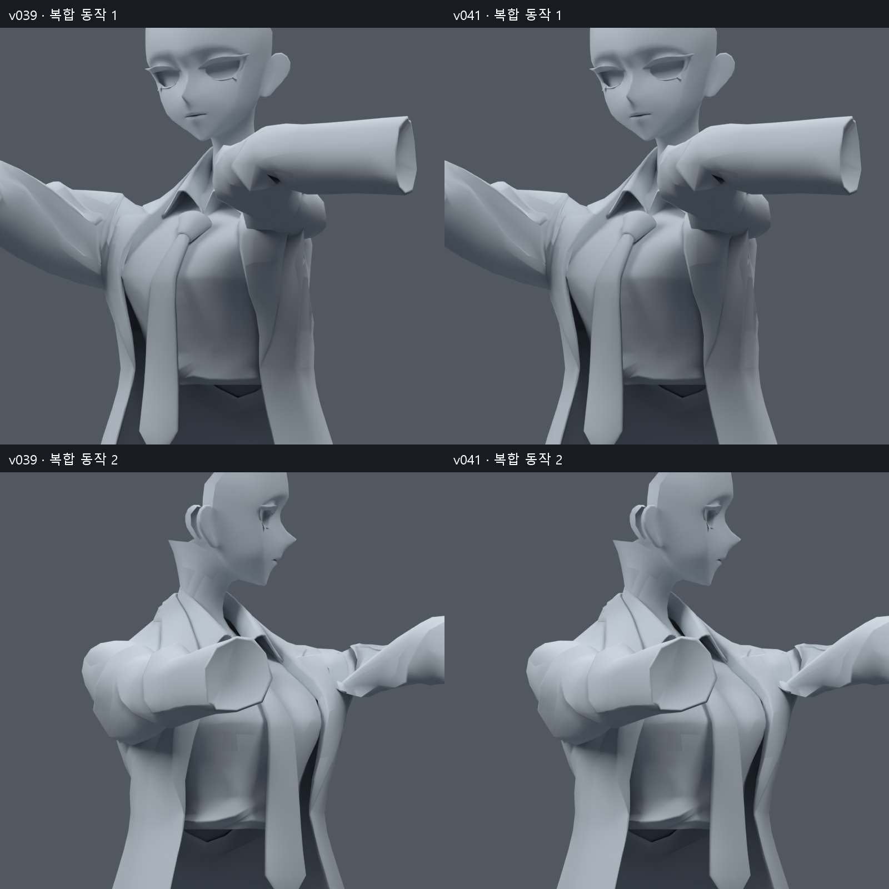

> **기록 시점 안내:** 아래는 해당 단계 당시의 보고서입니다. 후속 결정은 [최신 상태](../../STATUS.md)를 기준으로 읽어주세요. 모델·원본 텍스처·검증 원시 데이터는 이 문서 공유본에 포함하지 않습니다.

# v041 — 코트 옷깃 국소 웨이트 보정과 회전 검증

2026-09-10. 사용자가 승인한 다음 단계에 따라 v039 사본에서 코트 옷깃의 팔 끌림을 작게 줄였다. **검수 후보이며 어깨·겨드랑이 전체 해결이나 사용자 채택 완료는 아니다.** v038 SMALL 무릎 채택은 유지한다. 원본 레퍼런스는 실제로 열어 대조했고, 중립 외형을 바꾸지 않는 범위로 제한했다.

## 결과와 확인할 파일

- 검수: bianca_LAPEL_LOCAL_REVIEW.blend (공유본 미포함: `bianca_LAPEL_LOCAL_REVIEW.blend`)
- 동작: bianca_LAPEL_MOTION_REVIEW.blend (공유본 미포함: `bianca_LAPEL_MOTION_REVIEW.blend`),244프레임/24fps. 옆으로 들기→앞으로 들기→옆으로 들며 비틀기→목/상체를 함께 움직이며 앞으로 들기.
- 실제 검사 원본 후보: `bianca_LAPEL_FINAL.blend`.

208raw 정점/95위치의 **웨이트만** 수정했다. 기존34,597정점·17,627면·94본 유지, 정점 추가/삭제/이동·면 분할·리메시·새 메시·새 본·새 Shape Key는0이다. 원래 UV·커스텀 노멀·텍스처·재질·계층·제약·드라이버를 보존했다. 동작 검수 파일에는 확인용 애니메이션 키가 추가됐으므로 키프레임까지 원본과 같다는 뜻은 아니다.

최대 웨이트 변화는 0.050269, 약5.03%p다. 정점당 최대4개 본 영향, 기존에 양수였던 영향만 사용했다. 가슴 본 영향이 원래 없는 곳에서는 기존 척추 영향으로 분담해 다섯 번째 영향을 만들지 않았다. 정규화 오차 1.04e-07, 중립 평가 정점 최대 차이 3.73e-09m다.

## 실제로 좋아진 부분과 남은 부분

옷깃의 상완 영향을 일부 쇄골로 옮기고, 쇄골 영향 일부는 기존 흉곽 쪽으로 분담했다. 앞쪽 접힌 옷깃은 덜 올라가지만 원래 뾰족한 디자인 자체를 둥글게 바꾸지 않았다. **변화는 작다.** 큰 겨드랑이 홈·어깨 판 같은 접힘·뒤 카라 요철·목 회전 경계는 아직 남는다. 이 단계로 그것들이 해결됐다고 설명하지 않는다.

같은 원래 면 중심의 수직 이동을 추적했다. 이 값은 옷깃의 추적 지점 이동이며 실제 옷 전체의 자연스러움을 대신하지 않는다. 각도는 진단용 본 입력이다.

| 입력 | 원래 면 번호 | v039 상승 | v041 상승 | 상승 감소 |
|---|---|---|---|---|
| 60도 | 5534 | 12.758 mm | 12.235 mm | 0.523 mm |
| 60도 | 13073 | 12.756 mm | 12.233 mm | 0.523 mm |
| 90도 | 5534 | 20.599 mm | 19.633 mm | 0.966 mm |
| 90도 | 13073 | 20.603 mm | 19.637 mm | 0.966 mm |
| 120도 | 5534 | 28.872 mm | 27.399 mm | 1.472 mm |
| 120도 | 13073 | 28.884 mm | 27.411 mm | 1.473 mm |

수정 범위는 원래 위치 z=731.4~784.7mm의 앞 옷깃 주변이다. 면 연결을 따라 표시한 최초 선택만으로는 접힌 겉면 아래의 코트 층을 놓쳤다. 최종적으로 가까운 층도 함께 포함하되, 소매 연결부·옷깃 뿌리·아래 연결부는 원래 웨이트를 유지하도록 부드럽게 범위를 줄였다. 전체 앞판을 고정하거나 전체 어깨를 일괄 스무딩하지 않았다.

## 실패한 시험에서 바꾼 점

총15개의 이름 붙은 웨이트 사본을 만들었다. 강도만 다른 시각 시험과 수치 검증까지 수행한 후보를 구분한다.

| 시험 | 확인 결과 | 판단 |
|---|---|---|
| SMALL/MEDIUM/STRONG | 겉옷깃만 이동하면서 아래 코트가 비치는 얼룩·겹침 발생 | 시각 비교에서 제외; 전신 합격 주장 없음 |
| LAYER_SMALL/MEDIUM | 가까운 안쪽 층까지 같이 조절하면 초기 비침 완화, 강한 쪽은 경계 주름 증가 | 선택 범위 수정의 근거; 최종 미채택 |
| SYMMETRIC25/35 | 좌우 공간 선택 통일;137자세에서 새 면적 경고124/162건 | 소매 연결부까지 퍼진 범위를 축소 |
| FRONT25/40 | 앞쪽으로 제한해 새 경고7/18건으로 감소 | 복합 동작의 뿌리 면 회귀 때문에 제외 |
| CLAV25/40 | 상완 영향을 쇄골로 분담; 새 경고4/7건 | 뿌리 보호 필요 |
| ROOT_SAFE |137자세 새 면적0;1377자세 새 코트 접촉1쌍, 일부 정점에5본 영향 | 엔진 영향 수와 아래 연결부 보호 필요 |
| FOUR_SAFE | 영향 수 검증 실패 | 원래 가슴 영향이 없는 곳에 새 영향이 생긴 경로를 수정 |
| FOUR_EXISTING | 기존 영향만 유지하여 최대4개;1377자세 새 면적0, 새 코트 접촉1쌍 | 아래 연결부의 불필요한 수정 제거 |
| FINAL | 소매·뿌리·아래 연결부 보호; 아래 검사 결과 | 최종 검수 후보 |

기존 면12547/12555의 새 교차는 팔을 조금 들고 비트는 표본에서 발생했다. 교차선의 최대 표본 간 거리는 약4.21mm였으며 **관통 깊이4.21mm라는 뜻은 아니다.** 원래 위치 z=.726m 아래를 고정하고 .745m까지 완만하게 변경량을 올리는 것으로 해당 연결부를 보호했다. 최종 전신 비교에서는 새 코트–소매 쌍이0이다. 자연스러운 모든 내부 접촉을 없애는 목표는 세우지 않았다.

겹친 층의 웨이트 대응을 다시 검토하면서 [Blender Data Transfer 설명](https://docs.blender.org/manual/en/3.0/modeling/modifiers/modify/data_transfer.html)의 공간 대응·보간 개념도 참고했다. 실제로 별도 메시를 만들거나 Data Transfer 모디파이어로 전체 웨이트를 복사하지 않았다. 기존 한 메시의 지정 부위에서 좌우 공간 선택과 기존 본 영향 분담을 직접 구현했다. 최신 URL 조회는 실패하여 확인된3.0문서로 링크했으며,5.2 UI 검증 자료라고 표시하지 않는다.

## 검증 결과와 한계

| 검증 | 최종 결과 |
|---|---|
| 집중137자세: 옆/앞60·90·120도, 비틀림, 목·흉곽 복합,96무작위 | 새 면적 경고 0, 기존 경고 해소 2면·자세 |
| 전신1377자세 | 새 면적 경고 0, 새 코트–바지 0, 새 코트–소매 0 |
| 전신 무릎 | 원래 좌우 검사 결과 정확히 동일 |
| 저장 동작244프레임 및 중간값487표본 | 새 면적 경고 0, 기존 경고 해소 1면·표본 |
| 동작 정수 프레임 재로드 | 전체 정점 최대 오차 0m |
| 동작487표본의 수정 웨이트 밖 정점 | 최대 오차 0m |
| 동작 중 최대 변경 변위 | 5.331mm |
| 정적 검수 재로드 | 메시 fingerprint·전체 웨이트 일치, 제약·드라이버·Shape Key 구성 보존 |

면적 경고 기준은 원래 삼각형 면적의20%미만 또는300%초과다. 숫자가0이어도 큰 어깨 주름이 여전히 보이므로 전체 형상 합격으로 확대하지 않는다.

집중137자세의 코트 상부 자기 접촉은 **새 면 쌍·자세 576건, 사라진 쌍·자세 571건**이다. 접촉 집합 전체가 동일한 결과가 아니고, 모든 교차가 해결된 것도 아니다. 새 쌍이 많은 복합 자세2개를 같은 시점으로 확대 비교했다. 모든 새 쌍의 깊이·노출 여부까지 전수 판정하지 않았으므로 접촉 전체 합격을 주장하지 않는다.

집중137자세와 전신 결과는 범위 조정에도 사용했으므로 독립된 최종 시험이라고 부르지 않는다. 전신 기준 데이터는 기존 v039 TRIAL의 저장된1377자세 결과를 재사용했으며, 파일 SHA·원본과의 fingerprint/웨이트/리그 동일성·자세 목록을 다시 확인했다. 후보는 실제 Blender에서1377자세를 새로 계산했다. 원시 기준의 식별은 `BODY_REFERENCE.json`에 있다.

동작 비교는 원래 v039와 후보에 **같은 저장 본 채널**을 적용했다. 정수/반 프레임 검사이며 모든 실수 시각의 무결성 증명은 아니다. 이 검수 애니메이션은 Unity/VRChat용 완성 동작이나 실제 런타임 검증이 아니다.

## MCP 사용과 다음 단계

이번 수정·자세 검사·렌더·저장/재로드는 실제 MCP SDK→stdio 서버→Blender 애드온을 통해 실행했다. Python 코드는 재현성을 위해 파일로 남겼다. 이전 v040 기록을 덮어쓰지 않도록 클라이언트의 출력 폴더를 지정하는 옵션도 추가했다. 앱 전역 MCP 등록이나 새 모델 생성 서비스는 사용하지 않았다.

현재 판단은 **작은 옷깃 보정 후보까지**다. 큰 어깨·겨드랑이 변형은 별도 해결이 필요하다. 다음에는 접힌 기존 면의 방향과 어깨 주변 웨이트를 부위별로 검토하되, 이번 앞 옷깃의 작은 보정 범위를 무작정 넓히지 않는다. 큰 외형 변경이 필요하면 비교 사본을 먼저 제시한다. 그 뒤 목 회전 경계/뒤 카라, 마지막 국소 텍스처 음영 순서다. 새 메시·리메시는 진행하지 않는다.

원본 v039 SHA `9459ec3d4ebea5ddd939585f9df8c5ac647f467075b32164e9c1ee6b4e7e9018`는 그대로다. 검수 SHA `73ad590ee1a5ce59c717cd47bd0483891b734159b9cc1f722f3535de790ebc34`, 시험 SHA `e11aa4c9218f89467adae93e734b99b91a1608862a23d9b38cc95e00e620c74b`, 동작 SHA `79ef2e608101588e4c96e006af6764d185c780e1be9674a5004642532ea68229`. 원시 검사와 실패 사본도 원본 저장소에 보관한다. 공유 문서 저장소에는 이 보고서와 직접 확인한 비교 보드5개만 내보내며 모델·실행 코드·원시 JSON·레퍼런스·텍스처 원본은 제외한다.
