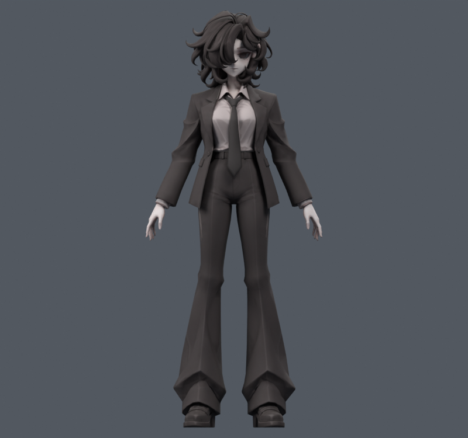
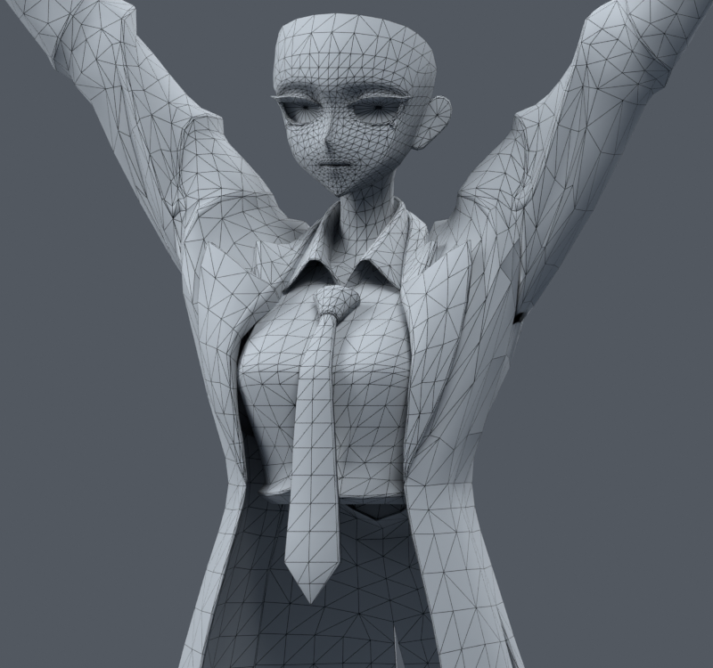
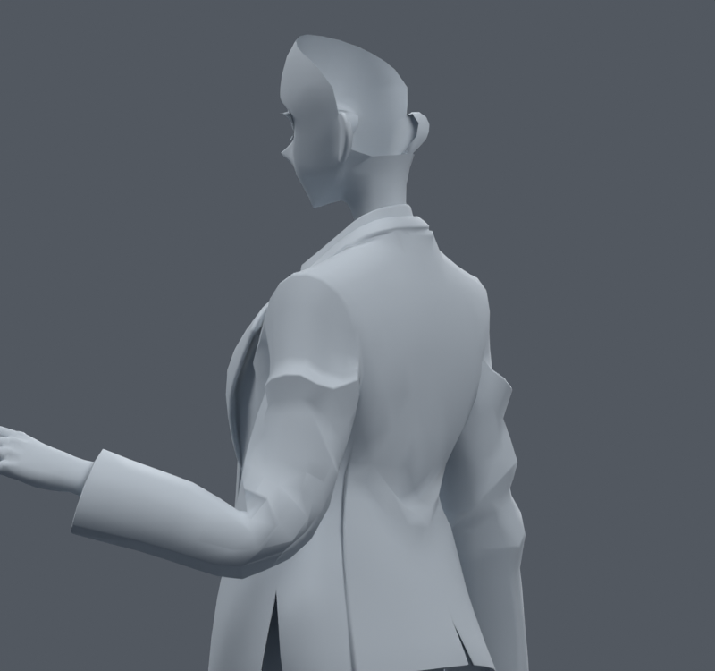
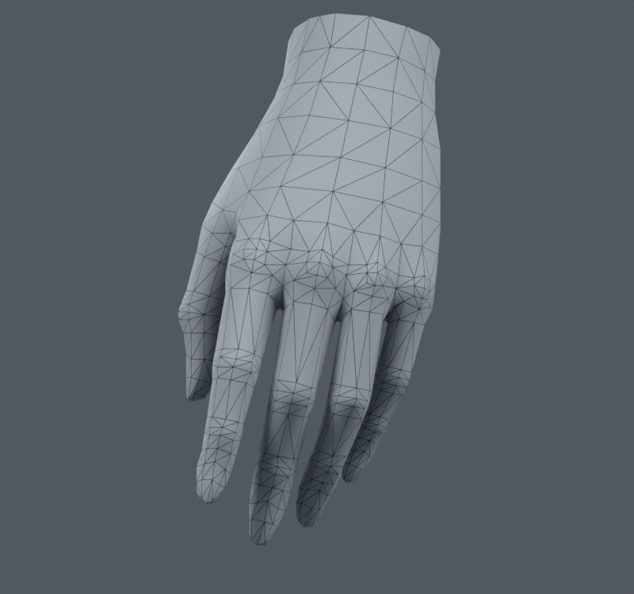
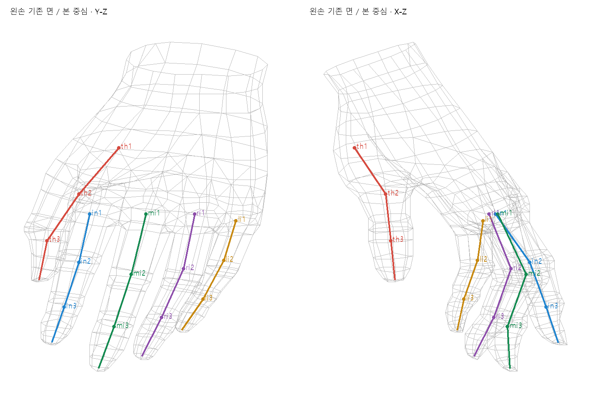
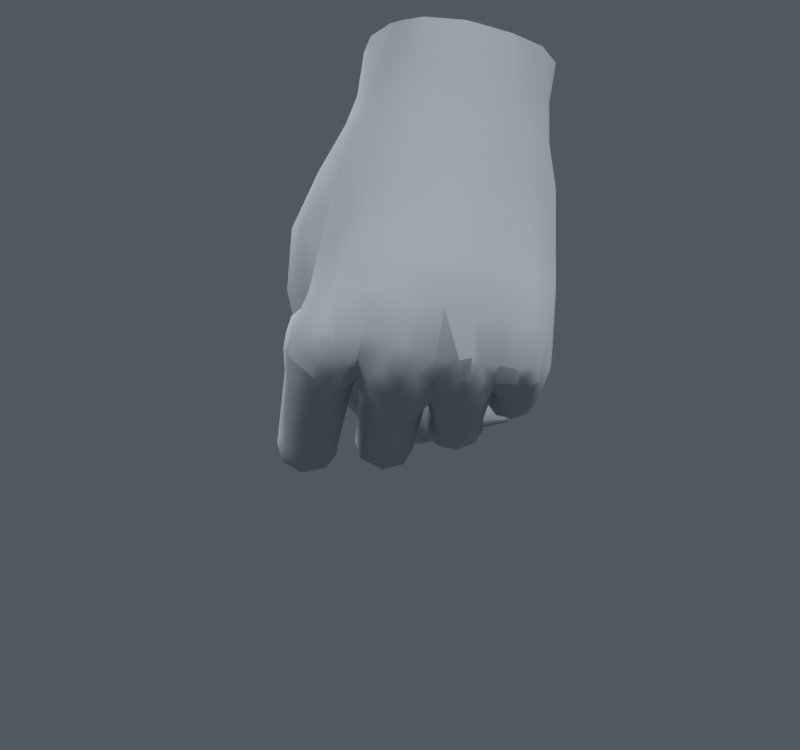
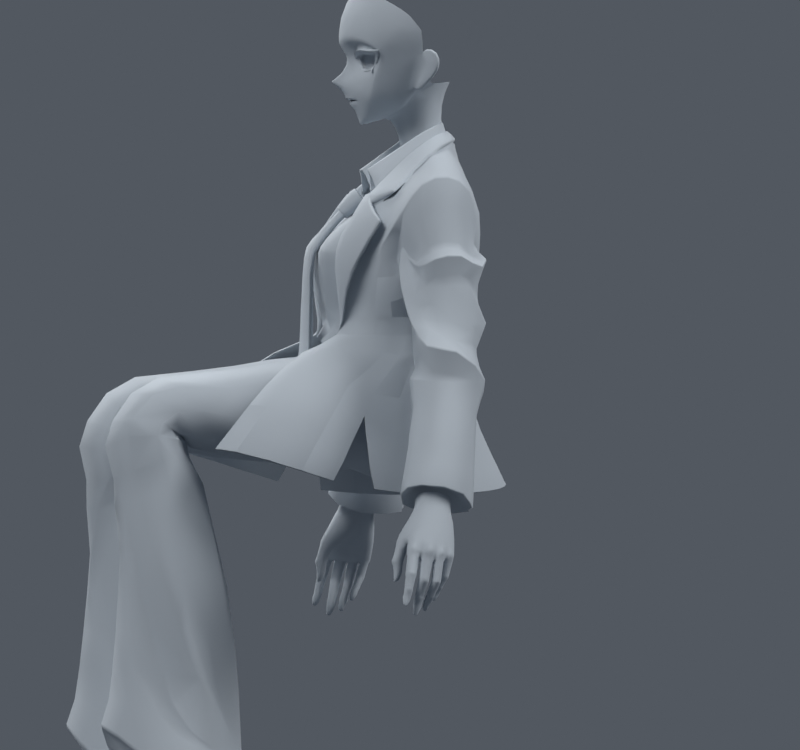

> **기록 시점 안내:** 아래는 해당 단계 당시의 보고서입니다. 후속 결정은 [최신 상태](../../STATUS.md)를 기준으로 읽어주세요. 모델·원본 텍스처·검증 원시 데이터는 이 문서 공유본에 포함하지 않습니다.

# 옷·팔·손의 변형 구조와 개선 설계

이 아바타의 다음 개선은 한 가지 웨이트 수치의 최적화로 끝나지 않는다. 어깨와 소매에는 원래 재킷의 주름을 보존하는 자세별 형상 보정이 필요하고, 손에는 관절축·회전 중심·웨이트 전환 위치를 함께 맞추는 작업이 필요하다. PC Unity/VRChat에서 재현할 수 있는 변형 구조를 우선하며, Blender 전용 기능의 보기 좋은 결과와 엔진에서 실행되는 결과를 구분한다.

원래 메시를 유지한 사본에서 작업한다. 큰 수정은 별도 파일에서 시험할 수 있으므로, 기존의 매우 작은 웨이트 조정 범위에만 묶이지 않는다. 새 캐릭터·대체 메시·리메시를 만드는 방향은 제외한다. 채택된 v038 SMALL 무릎과 원본 외형은 보호 기준이다. v041은 자동 채택된 완성본이 아니라 이번 비교의 출발 사본이다.

## 현재 모델을 다시 확인한 결과

v041 검수 파일을 다시 읽고 실제 자세 렌더와 메시·본 데이터를 추출했다. 총34,597 raw정점,17,627원래면,31,363평가삼각형,94본이다. UV 경계나 노멀 경계의 중복 정점을 합쳐 센 코트 위치는1,736개이고, 손은 좌우 각각652개다. raw정점 수만 보고 관절에 충분한 면이 있다고 판단할 수 없다. 실제 관절 방향과 기존 면 띠의 위치를 봐야 한다.

원형 레퍼런스의 재킷은 허리가 들어가고, 앞 옷깃은 뾰족하며, 소매에는 각진 주름이 있다. 이를 매끈한 운동복처럼 펴면 변형 검사가 좋아져도 캐릭터 디자인이 달라진다. 반대로 레퍼런스에 주름이 있다는 이유로 팔을 들 때 큰 판이 겹치거나 겨드랑이가 패이는 현상을 그대로 둘 수도 없다. 보존 대상은 중립에서의 디자인이며, 큰 움직임에서 생긴 함몰과 교차는 교정 대상이다.

레퍼런스에는 한 손이 주머니에 들어가 있고 다른 손은 자연스럽게 내려와 있다. 주먹·손가락 벌림·엄지 맞섬·팔 머리 위 올림의 정답 형상은 이 한 장에서 확정할 수 없다. 따라서 손의 길이와 가는 실루엣은 원형에서, 움직임의 구성은 공개 제작 사례와 실제 모델의 구조에서 판단한다. 숨겨진 면을 임의의 새 모델로 대체하지 않는다.

### 코트·어깨·팔꿈치

코트는 접힌 겉옷깃과 가까운 안쪽 층을 포함한다. v041에서 겉면만 강하게 흉곽에 묶었을 때 안쪽 층이 비친 이유는 두 층의 서로 다른 움직임이다. 단순히 어깨 웨이트의 총량을 줄이면 아래 층·소매 연결부에서 다른 문제가 생긴다. 옷깃, 어깨 봉제선, 겨드랑이 압축부, 소매 원통을 별도 기능 영역으로 볼 필요가 있다.

현재 쇄골과 상완은 연결된 일반 본이며, 상완에서 전완까지 이어지는 길이 방향의 변형을 보조하는 별도 twist 체인은 없다. 팔을 돌릴 때 하나의 본 주변에 회전이 몰릴 가능성을 실제 포즈로 확인해야 한다. 본을 늘린다는 사실 자체가 개선은 아니다. 팔꿈치의 굽힘을 유지하며 비틀림만 분담하는지, 손목 위치가 유지되는지 확인해야 한다.

큰 어깨 주름은 삼각형 면적이20%보다 작아지지 않아도 시각적으로 나쁘다. 큰 면 여러 개가 판처럼 꺾이는 현상은 면적 검사만으로 잡히지 않는다. 인접 면의 법선 변화, 실루엣의 함몰, 주름의 연결 방향, 몸과 옷의 층 관계를 같이 본다. 기존 v039의 면 두 개 분할과 v041의 작은 옷깃 웨이트 보정은 이 큰 문제의 완전한 해결이 아니었다.

### 손·손가락

손가락에는 이미 마디 근처에 면이 모여 있다. 무조건 전부 세분화할 이유는 없다. 반면 기존 본 중심은 손가락 길이 비율과 일정 높이를 사용한 초기 적합에서 시작됐으며, 이후 일부 중심과 웨이트가 바뀌었다. 도식에서 관절 중심과 밀집된 면 띠가 어긋나는 곳, 손등에서 손바닥으로 넘어가는 폭을 살펴야 한다.

현재 엄지 제어는 다른 네 손가락과 다르다. 일반 손가락은 local X로 굽히고 끝마디에0.8배를 적용하지만, 엄지는 고정된 모델 공간 벡터를 각 본의 공간으로 옮겨 쓴다. 이는 하나의 손바닥 기준 굽힘축을 가지는 체인과 동일하지 않다. 같은 각도 입력이라도 축이 다르면 결과가 달라지므로, 기존 제어와 수정한 local축 제어를 별도 항목으로 기록해야 한다.

위 그림은 고정된90도 카메라 시점이다. 파일명의 PALM은 내부 태그이며 해부학적 손바닥면의 확정 라벨로 쓰지 않는다. 손목 단면은 소매를 숨긴 진단 표시다. 손가락 끝과 엄지의 접촉은 자연스러울 수 있지만, 표면이 서로 가로지르거나 마디가 날카롭게 찢어지는 현상은 구분해야 한다.

### 옷자락

기존 코트는 앞·뒤 좌우 패널, 각 패널의 부모와 자락 본을 사용한다. 검사 함수가 다리 각도를 읽고 부모·자락에 계산한 포즈를 주는 부분도 있다. 따라서 Blender 검사에서 코트가 다리를 피한다고 해서 파일을 가져오기만 하면 Unity에서도 자동으로 피한다고 볼 수 없다. 큰 동작의 기본 추종과 작은 흔들림의 물리를 분리하고, 서로 같은 변환을 동시에 쓰지 않도록 설계한다.

## 공개 제작 사례에서 확인한 방법

### Blender Studio의 옷 보정

Julien Kaspar의 Clothing Shapes는 재킷과 바지의 자세를 한 개의 공통 보정으로 처리하지 않는다. 팔 올림·앞/뒤 이동·비틀림,90/120도 팔꿈치 등 방향과 각도가 다른 목표 형상을 나누고, 몸통 압축과 신장을 구분한다. 이 모델에 적용할 핵심도 동일하다. 옆으로 팔 올림에서 얻은 한 개의 보정을 앞으로 팔 들기에 그대로 재사용하지 않는다. [Blender Studio Clothing Shapes](https://studio.blender.org/training/realistic-human-research/clothing-shapes/)

이 사례의 Surface Deform과 변위 텍스처를 그대로 VRChat에 옮기는 것은 별개의 문제다. 여기서는 목표 자세를 설계하는 방법을 참고하고, 원래 정점의 블렌드셰이프 또는 실제 변형 본으로 결과를 표현한다. 자세별 목표를 먼저 정한 다음 구현 수단을 맞추는 방식이, 웨이트 합계부터 최소화하는 기존 반복보다 적합하다는 판단이다.

### Rain·Snow·CloudRig

Rain v3는 Blender Studio의 무료 CC-BY 리그이며 Blender4.1이상용으로 갱신됐다. 공개 설명에는 IK/FK 전환, 팔·다리의 제어, 얼굴의 corrective shape keys가 포함된다. 이것을 근거로 Rain의 모든 어깨에 어떤 보정이 들어 있다고 단정하지는 않는다. 본체 파일 전체를 뜯어본 결과가 아니라 공개 기능 설명과 제작 문서에 대한 비교다. [Blender Studio Rain v3](https://studio.blender.org/characters/rain/v3/)

Studio의 Rigging 문서는 제어 리그 생성 뒤 수동 웨이트와 corrective shape keys를 만드는 작업 흐름을 설명한다. CloudRig 문서에서는 제어 체인과 변형 체인을 나눌 수 있고, 팔꿈치의 비현실적인 축을 잠그거나 변형 본을 분할하는 선택을 제공한다. 이 아바타에는 제어용 Humanoid 체인을 유지하면서 변형용 보조를 추가하는 생각이 유효하다. CloudRig 전체를 새로 생성해 원래 리그를 교체하는 것은 이번 실행안이 아니다. [Blender Studio 리깅 파이프라인](https://studio.blender.org/tools/pipeline-overview/rigging), [CloudRig 리그 유형](https://studio.blender.org/tools/addons/cloudrig/cloudrig-types)

Rain의 포즈 제작 파일 설명에는 단순 리그로 여러 포즈를 비교한 뒤 shape key와 수작업으로 최종 포즈를 다듬는 과정이 나온다. 이는 최종 렌더의 한 장이 리그만으로 모든 각도에서 얻어지는 결과라는 뜻이 아님을 보여준다. 우리 비교도 대표 정지 화면과 연속 회전 결과를 각각 남긴다. [Rain 포즈 제작 과정](https://studio.blender.org/training/stylized-character-workflow/5d66506078d6dda492f2814a/)

### Alicia Solid의 실제 파일 구조

UniVRM 공식 저장소의 Alicia Solid1.10 VRM 바이너리를 별도 조사 폴더에서 읽었다. 고정 커밋은928b30e96439c1c11a49b172efb72eb96d2cad8b이고 SHA256은237bb02efadf8c13a114af91dd8e860173081457dee87017e51011c448d05dc2다. 외부 모델을 작업 캐릭터에 합치지 않았다. 파일 안의 저작자·사용 조건도 함께 기록했다. [UniVRM Alicia 원본 경로](https://github.com/vrm-c/UniVRM/tree/928b30e96439c1c11a49b172efb72eb96d2cad8b/Tests/Models/Alicia_vrm-0.51)

이 샘플은 Humanoid 매핑, 여러 skin의 본 목록, 표준 JOINTS/WEIGHTS 속성, 블렌드셰이프 대상,3개의 secondaryAnimation 그룹을 별도로 갖는다. 여러 skin의 본 수를 더해서 전체 고유 본 수라고 부르면 중복 계산이 된다. VRM의 spring 설정을 VRChat PhysBone으로 동일하다고 부르지도 않는다. 참고할 점은 기본 골격·메시 변형·2차 움직임이 데이터 구조부터 구분되어 있다는 것이다.

## 영상 가이드와 적용 지점

영상 전체를 시청했다는 기록은 없다. 아래는 제작자가 게시한 영상 설명과 챕터에서 확인한 내용이며, 챕터가 없는 구간의 구현 세부사항이나 화면 속 수치를 추정하지 않는다. 구현 판단은 공식 문서와 실제 Blender 시험으로 교차 확인한다.

| 제작자·영상 | 확인된 구간 | 우리 작업에 적용할 점 |
|---|---|---|
| Facepalme Dev, How to Make Hands With the CORE LOOP Method,2023-11-13 |00:20손의 core loops,08:38손가락,13:28엄지,19:50손목,24:26변형 시연 | 손등·손바닥 연결과 엄지 뿌리를 구분하고, 기존 면 띠가 굽힘을 수용하는지 검사 |
| CGDive, RIGGING L3-10: Improve Deformations with Shapekeys,2025-05-29 |00:14팔꿈치 보정,04:26driver,07:31곡선,15:09어깨 보정 | 기존 메시의 문제 자세를 보정하고 활성 곡선까지 확인 |
| Professor Han, 리깅과 Weight Painting,2021-05-25 | 공개 설명의 리깅·웨이트 기초 | 본 배치와 정점별 영향의 관계를 다시 확인하는 한국어 자료 |
| Dane Sigua, Finger Modeling/IK/Weight Paint,2021-04-20 | 공개 설명의 한 손가락 모델·IK·웨이트·키프레임 | 한 마디 시험을 손 전체 제스처와 분리하여 원인을 좁히기 |

영상 원문: [Facepalme](https://www.youtube.com/watch?v=5OviLpyET4M), [CGDive](https://www.youtube.com/watch?v=7fHpWhM4rtc), [Professor Han](https://www.youtube.com/watch?v=66y6xnTYBeY), [Dane Sigua](https://www.youtube.com/watch?v=lU2KKZqeKfs). CGDive의 제작자 페이지는 twist mechanism, fingers/palm, deform bone layer, weight painting과 shape keys를 함께 다루는 과정 구성을 확인하는 데 사용했다. [CGDive 리깅 과정](https://cgdive.com/blender-rigging-isnt-scary/)

## 구현 수단을 선택하는 기준

### 웨이트

웨이트는 정점이 어떤 본을 얼마나 따라가는지 정한다. 정규화와 정점당 영향 수는 필요 조건이지만 자연스러운 부피나 옷 주름을 보장하지 않는다. 현재4영향 이내를 유지하는 이유는 프로젝트의 전달 기준을 명확하게 하기 위해서다. 최신 Unity 전체가 항상4개만 지원한다고 일반화하지 않는다. 잘못된 본의 영향을 깨끗이 지우는 것과 유효한 다중 영향을 모두 한 본에 몰아주는 것은 다른 작업이다.

손가락에서는 자기 체인·손바닥·손목의 영향이 어떤 경계에서 바뀌는지 확인한다. 다른 손가락으로 영향이 새면 분리하고, 같은 마디를 둘러싼 UV 분리 정점은 같은 값으로 처리한다. 손가락이 맞닿아 있다는 이유로 공간적으로 가까운 정점끼리 무조건 스무딩하면 반대 손가락까지 섞일 수 있다. 연결 관계와 기능 영역을 함께 사용한다.

코트에서는 가까운 겉·속층의 상대 움직임을 확인하되 소매와 옷깃의 기능을 같게 만들지 않는다. v041의 최종 제한은 안전한 작은 조정이었지만 큰 어깨 함몰을 해결할 구조는 아니었다. 이번에는 목표 형상과 회전 분담을 먼저 시험하고 그 결과에 맞게 웨이트를 수정한다.

### 토폴로지

삼각형인가 사각형인가만으로 변형 품질을 정하지 않는다. 최종 평가는 실제 삼각형으로 이뤄진다. 사각형의 대각선이 어떻게 나뉘는지에 따라 같은 네 정점도 접힘 방향이 달라진다. 단순히 면을 늘리면 잘못된 곡률을 더 촘촘히 재현할 수도 있다. 필요한 곳에서 기존 면을 분할하거나 연결을 정리하되 원래 표면·UV·노멀의 보존 오차를 따로 확인한다.

손마디는 바깥쪽의 볼록함과 안쪽의 압축 띠가 함께 있어야 한다. 평평한 긴 면 한 장을 관절 중심에 걸친 채 큰 각도로 접으면 납작해지거나 날이 설 수 있다. 반대로 이미 충분한 띠가 있다면 중심과 웨이트부터 맞추는 편이 덜 파괴적이다. 이번 기존 손의 두 방향 도식은 이 순서를 정하는 근거다.

어깨는 단일 경첩과 다르게 옆·앞·뒤·비틀림이 섞인다. 소매 원통이 흉곽에 붙는 경계의 면 흐름을 확인하고, 기존 봉제선과 주름을 가로질러 긴 면이 생기는 곳을 국소적으로 다룬다. 중립에서 레퍼런스가 가진 재킷의 모서리를 전부 없애는 처리는 하지 않는다.

### 보조 본과 twist

회전 중심이 맞지 않으면 좋은 웨이트도 잘못된 궤적을 따른다. 손가락 중심은 실제 마디 띠의 가운데와 단면에서 맞추며, 단순히 앞이나 뒤로 밀어 교차 수를 줄이는 방식은 피한다. 엄지는 손바닥 기준의 회전 평면을 별도로 설계한다. 엄지 뿌리의 맞섬과 끝마디 굽힘을 같은 월드축 하나로 설명하려 하지 않는다.

팔의 twist는 굽힘과 분리해 여러 위치에 나눌 수 있다. 추가 본은 기존 Humanoid의 상완→전완→손 경로를 깨뜨리지 않는 별도 변형 가지로 둔다. 어느 공간의 회전을 복사하는지, 회전 offset은 무엇인지 명시해야 한다. Blender에서 한 축의Euler 절반 회전과 quaternion의 반 회전이 모든 복합 자세에서 같지는 않으므로 실제 회전 행렬을 비교한다.

VRChat Rotation Constraint는 소스의 회전과 가중치,offset,축 제한 및 local solve를 제공한다. Blender 제약을 그대로 가져온다고 가정하지 않고 엔진에서 같은 의미를 구성해야 한다. 원래 리그의 보조 본도 이 변환 표에 포함한다. [VRChat Rotation Constraint](https://creators.vrchat.com/common-components/constraints/vrc-rotation-constraint/)

### 자세별 보정과 Corrective Smooth

Blender Armature의 Preserve Volume은 quaternion 기반의 부피 보존 옵션이다. 기존 선형 스키닝과 비교해 수축 기여를 진단하는 데 유용하지만, 그 옵션을 켠 Blender 화면을 곧바로 VRChat 결과로 부를 수는 없다. [Blender Armature](https://docs.blender.org/manual/en/latest/modeling/modifiers/deform/armature.html)

Corrective Smooth는 변형 이후의 심하게 왜곡된 부위를 완화하는 기능으로 공식 문서에 설명되어 있다. 이 아바타에서는 진단 또는 목표 형상 초안으로 사용할 수 있지만, 원래 각진 옷 주름과 분리 정점 경계가 어떻게 반응하는지 반드시 확인한다. 모디파이어를 켜놓은 것만으로 전달 작업이 끝나지 않는다. [Blender Corrective Smooth](https://docs.blender.org/manual/en/5.0/modeling/modifiers/deform/corrective_smooth.html)

자세 보정은 원래 정점 수·순서를 유지하는 Shape Key로 표현할 수 있다. 특정 자세에서 원하는 평가 좌표를 만든 뒤 역스키닝으로 원래 공간의 delta를 계산할 때, 혼합 행렬이 거의 특이해지는 곳은 작은 좌표 차이도 큰 delta가 될 수 있다. 그런 곳은 무조건 역행렬을 쓰지 않고 변화량·조건수·다른 자세를 검사한다. 손과 코트의 같은 좌표 분리 정점은 일관된 보정을 유지한다.

Unity는 블렌드셰이프를 가져와 가중치를 제어할 수 있지만, Blender driver의 식이 자동으로 실행된다는 뜻은 아니다. VRChat 아바타에 임의의 사용자 스크립트를 붙여 이를 해결하는 가정도 하지 않는다. 보조 본/허용된 constraint로 표현할 수 있는 부분을 우선하고, 남는 자세 보정에는 엔진용 구동 방식을 별도로 남긴다. [Unity Blend Shapes](https://docs.unity.cn/6000.1/Documentation/Manual/BlendShapes.html), [VRChat 허용 컴포넌트](https://creators.vrchat.com/avatars/whitelisted-avatar-components/whitelisted-avatar-components/)

## 손의 입력 범위와 검사

Unity Muscle 설정은 개별 본의 움직임 범위와 미리보기를 제공한다. VRChat의 PC SteamVR skeletal input도 손가락 muscle 범위를 참조하며, 공식 설명은 Open/Close와 In/Out,중간·끝마디를 함께 조절하도록 안내한다. 그러므로 Blender에서 모든 마디에 동일한70도를 넣는 시험만으로 실제 PC 손 입력 전체를 대표할 수 없다. [Unity Muscle 설정](https://docs.unity3d.com/2022.3/Documentation/Manual/MuscleDefinitions.html), [VRChat SteamVR 입력](https://docs.vrchat.com/docs/steamvr-input-20)

검사에는 펼침·반쥠·주먹·point·victory·rock·thumbs up 외에 마디별 독립 굽힘, 엄지 맞섬, 손가락 벌림, 손목 굽힘·좌우 편위, 전완 비틀림과의 조합을 포함한다. 손가락 끝의 정상 접촉과 손가락 몸통을 가로지르는 관통을 구분한다. 새 BVH 면쌍 수뿐 아니라 위치·종류·대표 자세의 화면을 같이 기록한다.

이전 v027은 총교차 수가 크게 줄었으나5자세가 악화해 미채택됐다. 이번에는 단순히 그 후보를 다시 채택하지 않는다. 남은 면쌍의 위치를 따라 원인을 분리하고, 입력축이 달라졌을 때는 비교 기준도 명확하게 기록한다. 특정 각도를 줄여 교차를 숨긴 결과와 같은 움직임을 더 잘 표현한 결과를 구분한다.

## 코트 추종과 2차 움직임

PhysBone은 옷·머리카락 등2차 움직임을 위한 체인이다. 공식 안내는 Humanoid 본을 직접 root로 사용하지 말고, constraint와 PhysBone이 같은 변환을 동시에 다루지 않도록 부모를 분리하라고 한다. 따라서 자락의 큰 이동을 만드는 부모와 물리 흔들림을 받는 자식이 다른 역할을 맡아야 한다. [VRChat PhysBones](https://creators.vrchat.com/common-components/physbones/)

이번 코트 검사에서는 앉기,한쪽 다리 들기,다리 벌림,몸통 굽힘·비틀림,팔과 몸의 접근을 다시 확인한다. 물리로 기본 스키닝의 큰 관통을 고치는 계획은 세우지 않는다. 먼저 강제로 지정한 포즈에서도 옷 패널이 몸을 지나가지 않게 한 뒤, 작은 허용각의 흔들림을 추가하는 순서다. 바람이 자동으로 있는 것으로 간주하지 않고 별도의 구동 과제로 기록한다.

## 실행 순서와 완료 판정

| 단계 | 작업 | 확인 |
|---|---|---|
| v042 | 출처·기존 모델·본/면 구조 비교 | 원본 파일 식별, 실제 렌더, 후보/채택 상태 분리 |
| 후속 손 작업 | 엄지축,마디 중심,기존 면과 웨이트 전환 | 펼침/주먹/제스처/독립 마디/손목 복합 |
| 후속 팔 작업 | 어깨·겨드랑이 목표 형상,twist 분담,필요한 기존 면 정리 | 옆/앞/뒤/비틀림·팔꿈치·손목 연계 |
| 후속 옷 작업 | 카라·자락·몸통 접촉과 기본 추종 | 앉기/다리 들기/몸통 회전/팔 접근 |
| 통합 | 선택된 수정들을 별도 통합 파일에 적용 | 원본 대비 회귀·저장/재로드·중간 프레임·렌더 |

버전은 중단 지점이 아니라 재현 가능한 작업 기록이다. 각 단계에서 실제 변경량·실패 사본·비교 그림·검증 범위·남은 문제를 기록하고 Git에 백업한 뒤 이어간다. 결과가 나쁜 실험을 합계 수치가 좋다는 이유로 통합하지 않는다. 큰 수정은 별도 파일에서 계속 시험할 수 있다.

완료 판정은 해당 파일을 다시 열어 중립 형상·UV·재질과 보호 부위를 확인하고, 저장된 동작의 정수·중간 프레임을 검사하며, 대표 문제 자세를 같은 카메라에서 직접 보는 것이다. 모든 임의 회전에서 수학적으로 관통이 없다는 보증은 하지 않는다. PC Unity/VRChat 실제 입력과 PhysBone의 실행은 별도의 엔진 확인 항목이며, Blender 검사로 대체하지 않는다.

## 출처와 확인 범위

위 출처 링크는 각 주장 가까이에 둔 원문이다. Blender Studio 일부 페이지는 직접 열기가 실패했지만 검색에 제공된 원문 본문을 확인했다. Rain의 내부 모든 제약을 검사했다고 표현하지 않는다. Alicia는 고정된 실제 바이너리의 구조를 직접 읽었다. 영상은 제작자 설명·챕터를 확인했으며 전체 영상 시청이나 미확인 세부 구현을 주장하지 않는다. 조사는2026-09-10 기준이다.

추가로 VRChat Rig Requirements에는 문서가 상당히 오래됐다는 경고가 있고,손가락·upper chest 일부 경고가SDK2에만 해당한다는 설명이 있다. 오래된 문구를SDK3의 현재 제한으로 가져오지 않는다. 현재 계층과 엔진 검증에서 직접 확인할 항목만 사용한다. [VRChat 리그 요구사항](https://creators.vrchat.com/avatars/rig-requirements/)

원시 현황은 CURRENT.json/CURRENT.npz,손 구조 프로파일은 TOPOLOGY_PROFILE.json,외부 샘플 구조는 ALICIA_STRUCTURE.json에 기록했다. 레퍼런스 원본·외부 모델·원시 데이터는 공유 문서에 포함하지 않는다.
