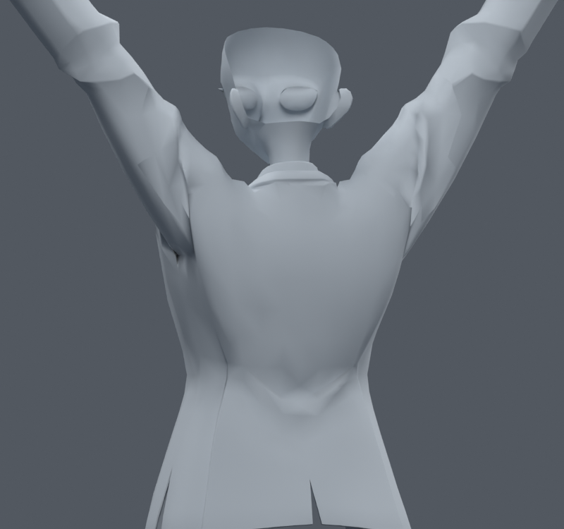

> **기록 시점 안내:** 아래는 해당 단계 당시의 보고서입니다. 후속 결정은 [최신 상태](../../STATUS.md)를 기준으로 읽어주세요. 모델·원본 텍스처·검증 원시 데이터는 이 문서 공유본에 포함하지 않습니다.

# v045 — 기존 코트의 겹친 정점을 연결

위치와 웨이트가 같은 코트 정점만 연결했다. 1824개의 중복 raw 정점을 줄였고, 원래 면·UV 코너·웨이트·표면 위치를 대응 검증했다. 새 메시나 리메시는 없다. 정점 수는 34597에서 32773으로 바뀌었지만 원래 면 수와 렌더 삼각형 수는 같다. 인덱스가 바뀌므로 원래 정점·면·루프와 부위 번호를 속성에 저장했다.

처음 이름이 `CONNECTED_SIDE/FRONT`였던 자세 파일은 로더 기본 인수 오류 때문에 연결 전 입력에서 만들어졌다. 해당 결과를 연결 후 보정이라고 읽으면 안 된다. [입력 정정 기록](SOURCE_CORRECTION.md)에 원인과 영향 범위를 적고, 입력을 명시한 `TRUE_SIDE/FRONT` 32773정점 파일을 다시 만들었다.

올바른 연결 후에는 큰 검은 면 경계가 줄었다. 하지만 형상의 깊은 주름까지 연결만으로 고쳐지지는 않는다. 이 단계는 연결 방식의 검수이며, 이전 손 사본을 입력으로 사용했으므로 후속 손 개선을 포함한 최종 통합 파일로 취급하지 않는다.
