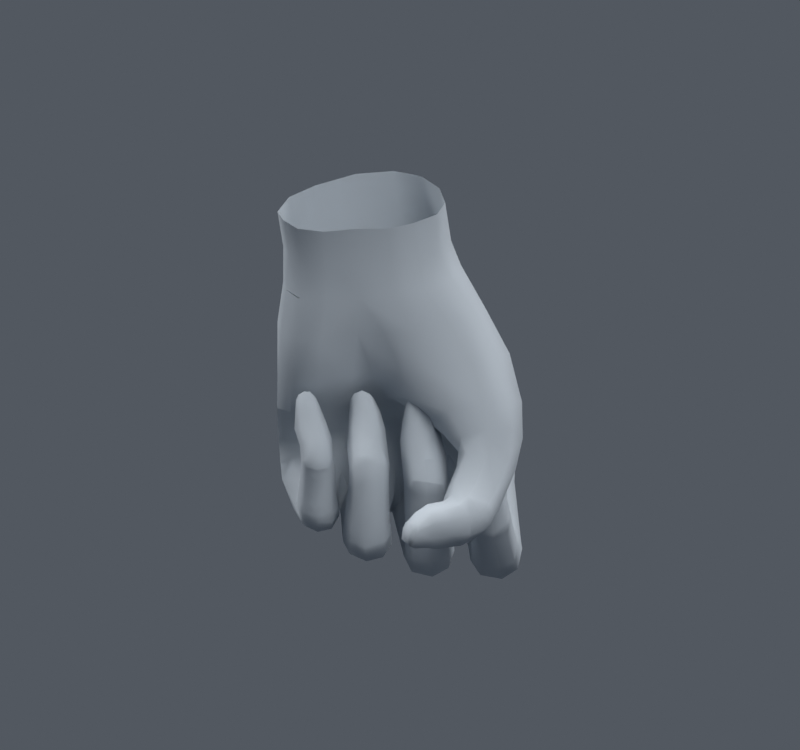
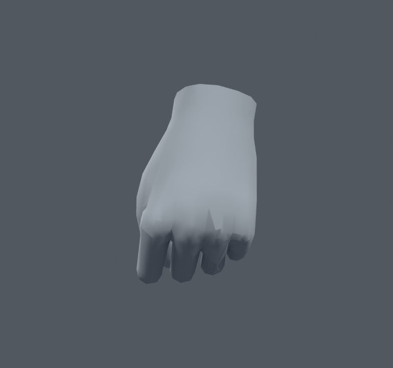
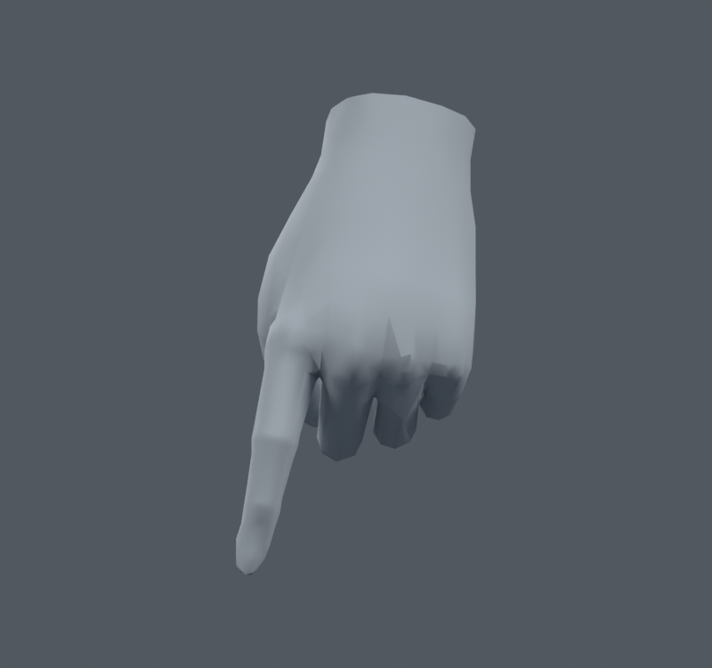
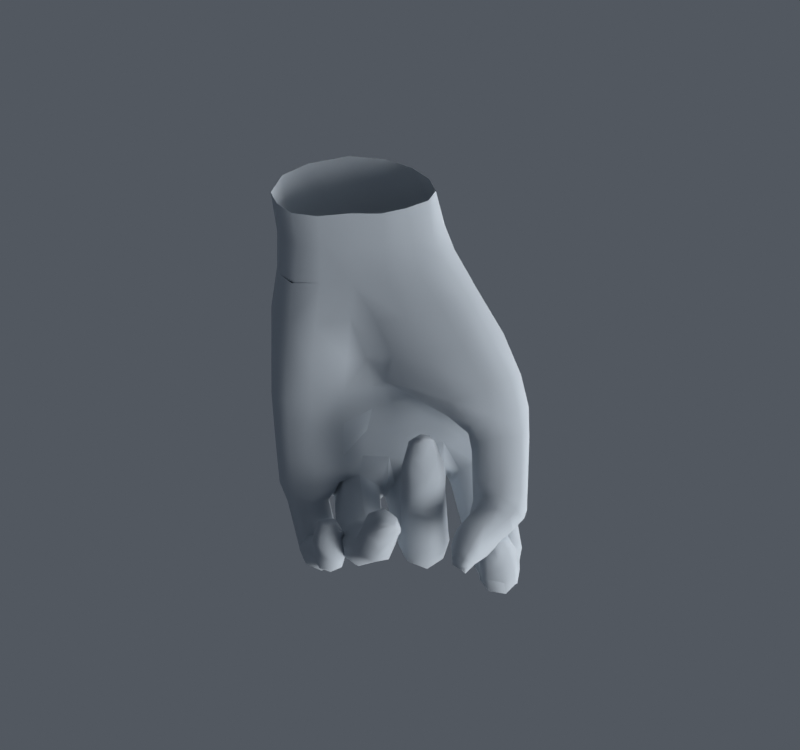
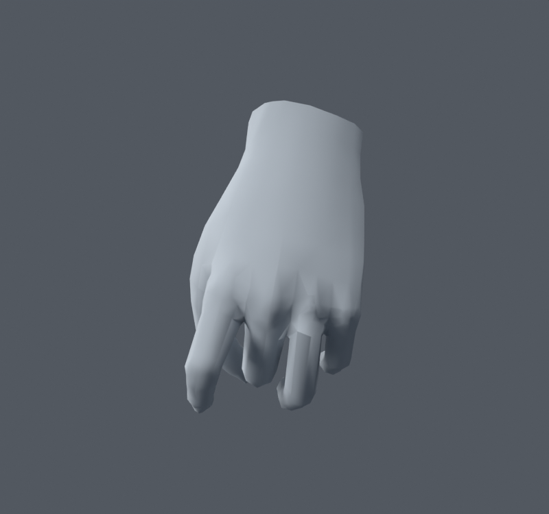
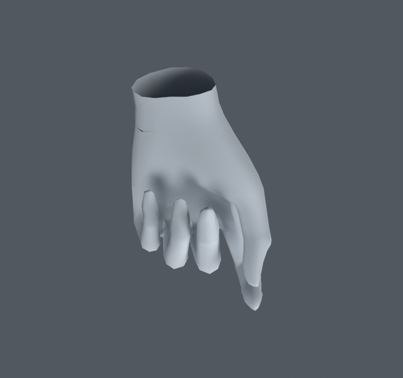

> **기록 시점 안내:** 아래는 해당 단계 당시의 보고서입니다. 후속 결정은 [최신 상태](../../STATUS.md)를 기준으로 읽어주세요. 모델·원본 텍스처·검증 원시 데이터는 이 문서 공유본에 포함하지 않습니다.

# v046 — 손가락 관절과 손바닥 연결 보정

손 후보는 `bianca_HAND_FINAL_REVIEW.blend`다. 원본 손의 정점 위치는 유지하면서 엄지 회전축, 손가락 사이 웨이트, PIP 관절의 회전 분담을 수정했다. 새 메시를 만들지 않았다. 옷까지 해결한 통합 최종본이나 사용자 채택본이라는 뜻은 아니다.

## 실제 수정

- 엄지 6개 본의 roll을 손의 실제 방향에 맞췄다. 원래 본의 머리·꼬리·부모는 유지했다.
- 손가락을 따로 굽힐 때 이웃 손가락으로 끌려가는 웨이트와 엄지–검지 사이 손바닥 지지를 조절했다.
- 검지·중지·약지·소지 PIP에 절반 회전 보조본을 좌우 8개 추가했다. 중지 보조 회전 중심은 1.5mm 바깥으로 옮겼다.
- 기존 사각형 9곳의 대각선을 고정했다. 정점 추가·이동은 없고 렌더 삼각형 수도 같다.
- 마지막 국소 웨이트 수정은 오른손 8위치 최대 5.843%p, 왼손 3위치 최대 1.708%p다. 이는 전체 변경량이 아니라 마지막 두 패치의 변화다.

34597정점, 17636면, 31363삼각형, 102본이다. v041 대비 웨이트가 바뀐 raw 정점은 970개이며 손 밖의 웨이트는 정확히 같다. 영향은 최대 4개, 합계 오차는 1.05e-7 미만이다. 좌표와 UV 코너는 정확히 유지했다. 대각선 작업 후 노멀 재기록 최대 벡터 오차는 0.000491이므로 노멀의 비트 동일성을 주장하지 않는다. 중립 평가 위치 차이는 9.07e-8m 이하다.

## 검증 결과와 한계

실제 Blender 평가 후 삼각형 연결을 매 자세마다 다시 읽었다. 손가락 마디를 독립적으로 굽히고, 손목·전완 회전을 함께 적용했다. 경고 기준은 정지 면적의 20% 미만 또는 300% 초과다.

| 세트 | 자세 수 | 후보 면적 경고 | 해석 |
|---|---:|---:|---|
| 431113 | 300 | 0 | 수정에 사용한 표본 |
| 460911 | 600 | 0 | 수정에 사용한 표본 |
| 461019 | 1100 | 0 | 왼손 마지막 수정에 사용한 표본 |
| 461129 | 1100 | 3 | 기존 기본 100개와 새 개별 마디 1000개 |
| 전신 | 1377 | 새 경고 0 | v041 기준과 비교, 무릎 및 코트–바지/소매 결과 동일 |

표본 수 합계를 서로 다른 고유 자세 수로 부르지 않는다. 교차 면쌍 누적은 각 손 세트에서 3026/5803/11788/11496으로 남아 있다. 손가락 접촉과 눈에 보이는 관통은 같은 의미가 아니다. 새 검증의 3개 경고는 왼손 151·221·419 자세다. 151의 최소 면적비는 0.197로 기준 근처이고 나머지는 늘어남 경고다. 실제 앞뒤 렌더를 확인했지만, 이것으로 모든 손가락 접촉 깊이를 전수 검사했다는 뜻은 아니다.

손바닥의 엄지 경로는 개선됐고 기본 제스처가 성립한다. 손등과 손가락 옆면의 각진 음영, 극단적으로 마디를 따로 접을 때의 접촉은 후속 표면 검수 대상으로 남긴다. 수치 0만으로 자연스러운 손이라고 판정하지 않는다.

기본 주먹 앞뒤:

검지 펴기와 새 표본의 경고 자세:

## 같은 새 표본의 원본 비교

461129의 1100개 자세를 원본 v041에도 적용했다. 원본은 면적 경고 571, 교차 면쌍 누적 24031이었고 후보는 3과 11496이었다. 두 모델에 같은 제스처·관절 각도 명령을 주되 엄지는 각각 원래 축과 수정된 축을 사용했다. 이 수치로 관통 깊이나 모든 자세의 시각 품질을 단정하지 않는다.

## 엔진 이전

Humanoid 기본 체인은 유지했다. 추가 8본의 Blender Copy Rotation 제약은 FBX를 내보내기만 해서 Unity에서 자동 실행되지 않는다. Unity/VRChat에서 같은 회전 분담을 재구성한 뒤 실제 제스처·트래킹으로 검증해야 한다. 이 문서는 Blender 사본의 검증 결과다. 엔진 완성 판정이 아니다.

SHA-256: `c272d493acc308be3727b9da4622d33ddee5c261ff3db22e648417a5e6dd2f31`. 재현 코드·보존 감사·원시 검증은 작업 저장소의 이 폴더에 있다. 연구와 구현 근거는 [v042 조사](../v042_upper_research/RESEARCH.md)를 참고한다.
