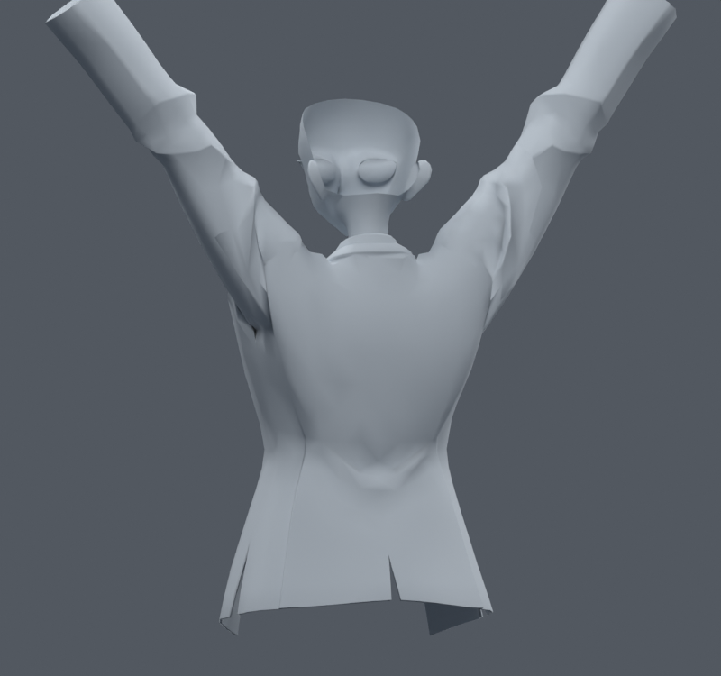

> **기록 시점 안내:** 아래는 해당 단계 당시의 보고서입니다. 후속 결정은 [최신 상태](../../STATUS.md)를 기준으로 읽어주세요. 모델·원본 텍스처·검증 원시 데이터는 이 문서 공유본에 포함하지 않습니다.

# v052 — 팔 방향에 따른 기존 코트 자세 보정

기존 코트 정점에 8개 보정키를 만들고 가슴에 대한 좌우 팔의 방향으로 구동했다. 옆으로 60/120도, 앞으로 45/90도 들기 목표를 좌우로 나눠 혼합한다. 중립에서는 보정이 0이며, 팔의 길이 방향 비틀림을 들기 각도로 오인하지 않도록 측정용 비변형 본 2개와 swing/twist 분해를 사용했다. 원래 Humanoid 체인은 유지했다.

**Blender 자세 보정 시제품이다. Unity/VRChat 자동 실행까지 검증한 결과가 아니다.** Shape Key 데이터는 엔진으로 옮길 수 있지만 Blender driver는 그대로 실행되지 않는다. 현재 안정적인 표면 정리 사본과 별도로 보존한다.

## 오류 수정과 제한

첫 통합에서 `shape_key_add`의 혼합 상태가 다음 키에 섞이는 오류가 있었다. 키별 기대 좌표와 비교했을 때 최대 62.3mm의 원치 않는 누적이 확인됐다. 각 키를 Basis와 해당 목표 변위로 직접 구성하도록 고쳤다. 초기 파일은 실패 기록으로 보존하고 통합 후보로 쓰지 않는다.

| 120개 팔·몸통 자세 비교 | 새 면적 경고 | 해소된 경고 | 새 자기 접촉 쌍 | 사라진 쌍 |
|---|---:|---:|---:|---:|
| 최초, 키 누적 오류 포함 | 4018 | 124 | 2941 | 1870 |
| 키 좌표 수정 | 1268 | 93 | 518 | 963 |
| 문제 면 주변 변위 제한 | 0 | 28 | 143 | 257 |

모든 행은 같은 연결된 메시에서 보정 on/off를 비교했고 원래 면 번호로 대응했다. 경고는 정지 면적의 20% 미만 또는 300% 초과다. 접촉 쌍 변화는 관통 깊이나 눈에 보이는 오류 수가 아니다.

문제 면과 바로 이웃한 정점의 보정량을 단계적으로 줄였다. 9회 평가 후 새 삼각형 면적 경고가 1502에서 0이 됐고, 영향 영역의 평균 보정 배율은 약 0.50이다. 이 120자세는 보정에 사용했으므로 독립 검증이라 부르지 않는다. 마지막 사본은 `bianca_POSE_CLOTHING_GUARDED.blend`다.

이 이미지에서도 겨드랑이의 깊은 접힘이 전부 사라진 것은 아니다. 넓은 보정으로 작은 면이 무너지는 것을 막은 단계다. 별도의 노멀·정점 연결 정리, 새로운 복합 자세와 전신 확인, 엔진 구동은 후속 검증이 필요하다. 이 시제품의 성공 수치를 옷 전체 해결로 확대하지 않는다.
