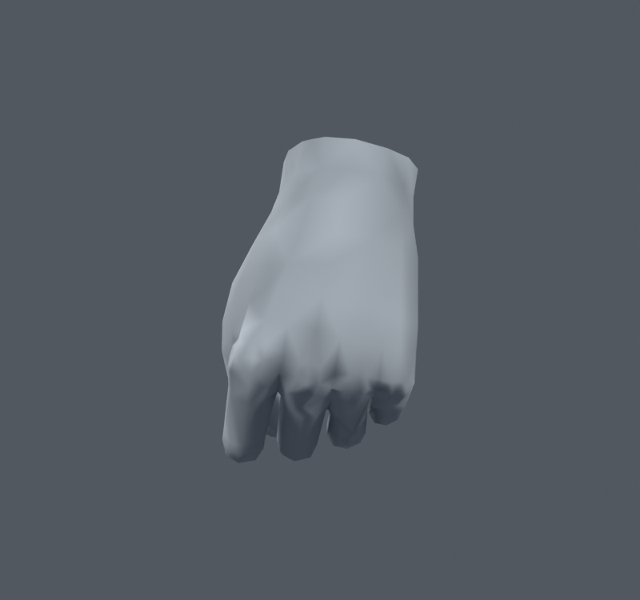
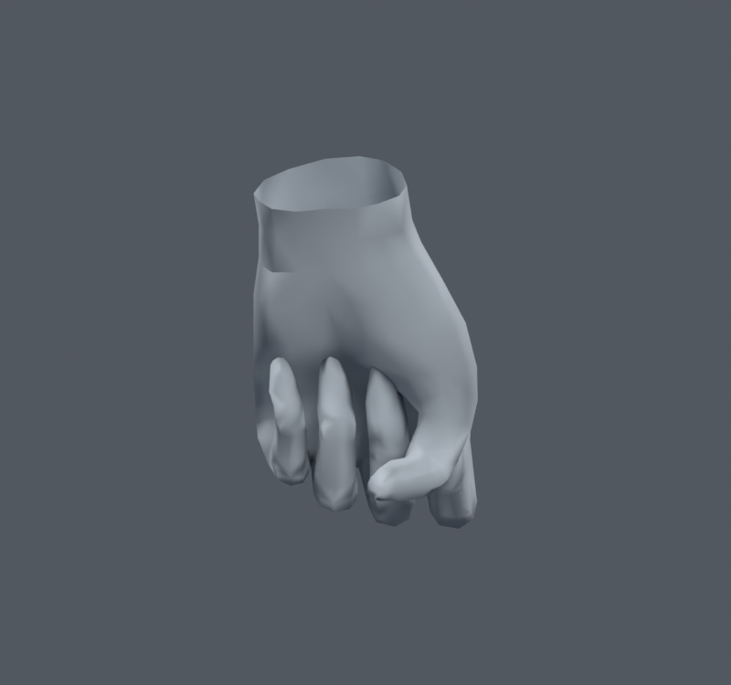
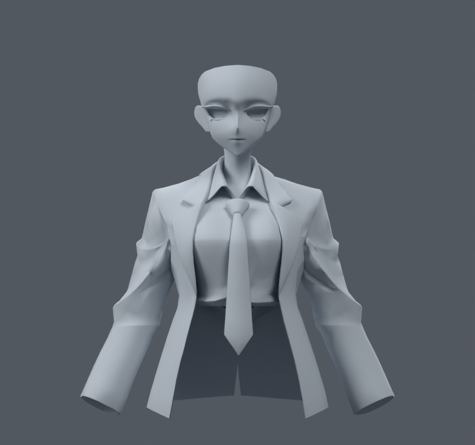
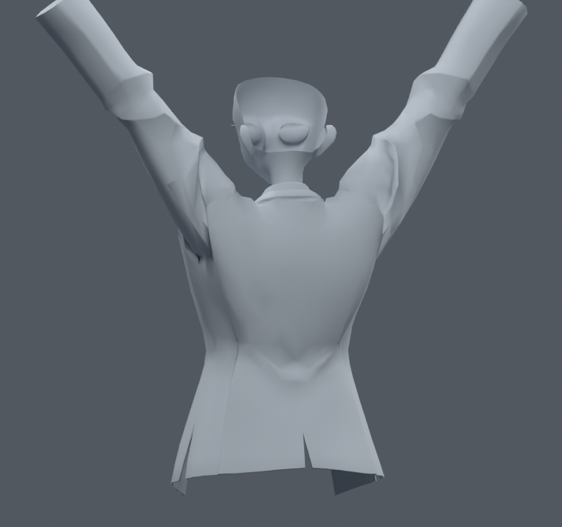

> **기록 시점 안내:** 아래는 해당 단계 당시의 보고서입니다. 후속 결정은 [최신 상태](../../STATUS.md)를 기준으로 읽어주세요. 모델·원본 텍스처·검증 원시 데이터는 이 문서 공유본에 포함하지 않습니다.

# v053 — 코트·손 연결과 자동 노멀 비교

v046 손 보정과 연결된 코트를 가진 사본에서 손의 같은 위치·같은 웨이트 정점도 연결했다. 손의 중복 1423정점을 합쳐 총 31350정점이 됐다. 기존 위치·원래 면·UV 코너·대응 웨이트는 유지했다. 삼각형 31363개, 본 102개다. 새 메시나 리메시는 없다.

손의 sharp 경계를 풀고 자동 노멀로 바꾸는 방법과, 코트 상부만 또는 코트 전체를 재계산하는 방법을 비교했다. 실제 1100개 손 자세 결과는 v046과 동일한 면적 경고 3, 교차 면쌍 11496이었다.

그러나 손등과 손가락에서 원래 표면의 잔요철이 더 드러났다. **수치가 같아도 외관이 나빠져 손 자동 노멀 사본은 채택하지 않는다.** 기존 손 노멀을 유지한다. 코트 전체를 부드럽게 하는 것도 옷자락과 옷깃의 각을 바꿀 수 있어 통합하지 않는다.

검수 결론은 연결 자체와 노멀 재계산을 같은 개선으로 묶지 않는 것이다. 손에는 기존 노멀을 보존하고, 코트는 이미 확인한 제한된 연결·노멀 정리와 자세 보정을 별도로 다룬다.
