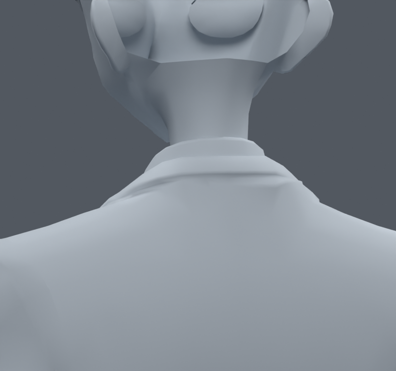
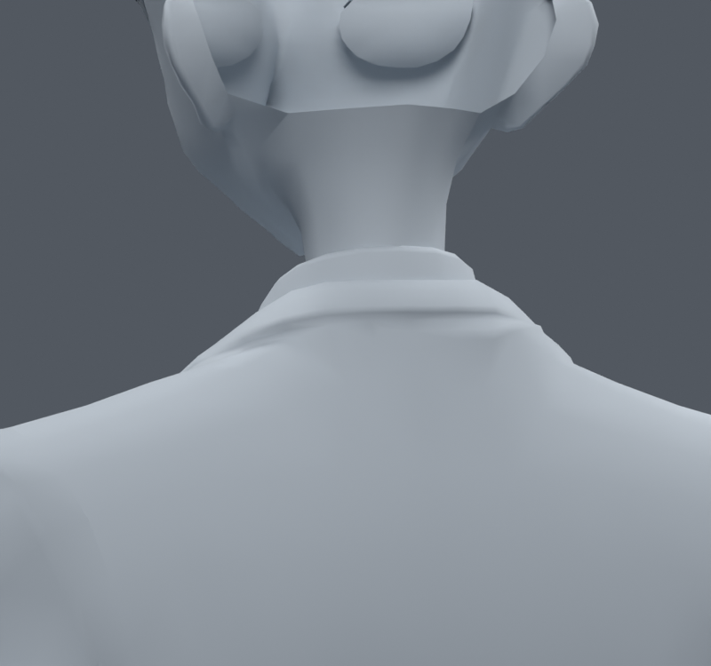

> **기록 시점 안내:** 아래는 해당 단계 당시의 보고서입니다. 후속 결정은 [최신 상태](../../STATUS.md)를 기준으로 읽어주세요. 모델·원본 텍스처·검증 원시 데이터는 이 문서 공유본에 포함하지 않습니다.

# v054 — 뒤 카라의 작은 표면 정리

뒤 카라를 중립·목 돌리기·아래 보기에서 확대해 확인했다. 코트와 흰 셔츠의 뒤쪽 기존 정점을 최대 0.5mm 또는 1mm 정리하는 사본을 만들었다. 앞 옷깃과 다른 부위는 제외했고, 기존 자세키의 상대 변위는 유지했다. 정점·면·새 메시 추가는 없다.

1mm 사본의 추가 시각적 이점은 작아 0.5mm 쪽을 선택했다. 목 회전 45개와 팔·목·몸통 복합 90개, 총 135표본의 첫 검사에서 새 면적 경고 1개가 생겼다. 원래면 9254 주변은 정리를 되돌리고 이웃으로 서서히 연결해 최종 135검사의 새 경고를 0으로 만들었다. 자기 접촉은 새 302쌍·사라진 1952쌍이며, 이를 관통 깊이의 감소라고 부르지는 않는다.

첫 0.5mm 사본의 전신 1377검사는 v046 손 후보 대비 새 면적 0, 무릎 결과 동일, 새 코트–바지 0, 새 코트–소매 면쌍 1이었다. 마지막 되돌림 이후의 통합 검증은 후속 버전에서 다시 수행한다. 목 자체의 각진 변형까지 이번 카라 정리로 해결한 것은 아니다.

`bianca_COLLAR_FINAL.blend`는 뒤 카라 수정과 앞 단계의 손·옷 보정을 포함한 작업 사본이다. 최종 사용자 채택이나 Unity 구동 완료를 뜻하지 않는다.
