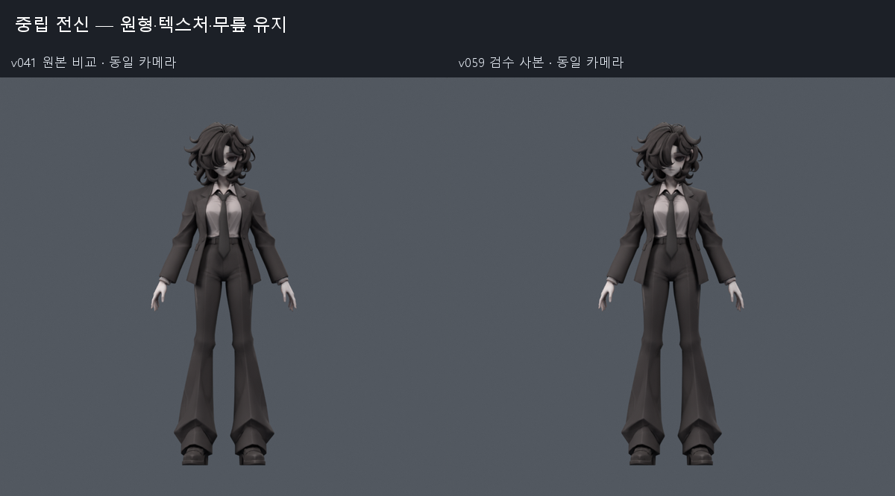
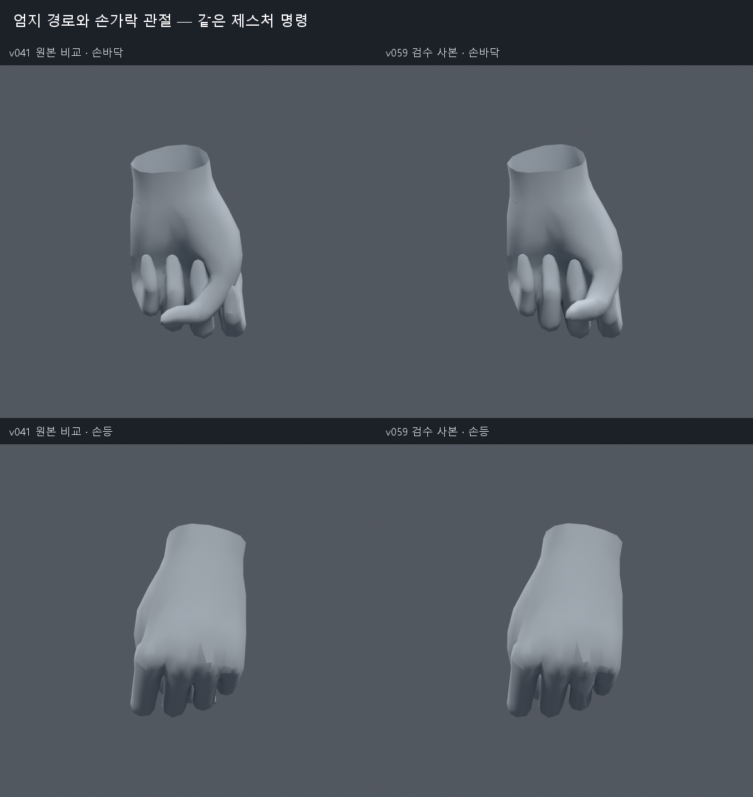
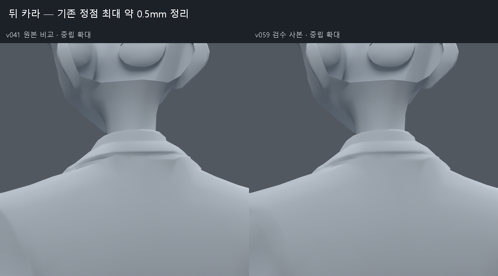
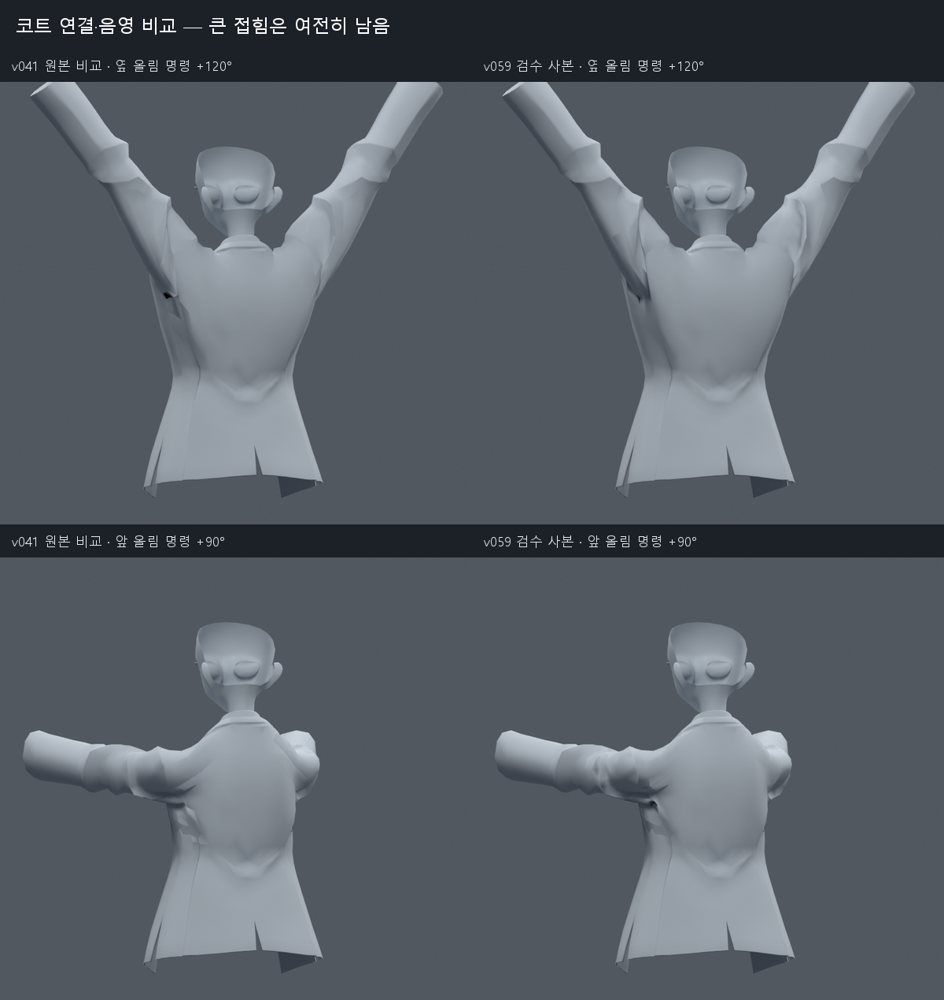

> **기록 시점 안내:** 아래는 해당 단계 당시의 보고서입니다. 후속 결정은 [최신 상태](../../STATUS.md)를 기준으로 읽어주세요. 모델·원본 텍스처·검증 원시 데이터는 이 문서 공유본에 포함하지 않습니다.

# v059 — 검증된 손·코트 연결·카라 수정의 선별 사본

검수 파일은 `bianca_UPPER_REVIEW.blend`, 동작 파일은 `bianca_UPPER_MOTION_REVIEW.blend`다. 손 관절 보정, 같은 위치·웨이트를 가진 기존 코트 정점의 연결, 뒤 카라 약0.5mm 정리만 포함했다. 실패한 어깨 보조본과 일반 회전에 실패한 자동 코트 자세키는 제외했다.

**큰 어깨·겨드랑이 주름까지 모두 해결한 결과는 아니다.** 기존 외형을 지키며 검증된 개선을 모은 사본이다. 원본 v038 SMALL 무릎의 채택 상태를 유지하며, 이 파일의 존재를 사용자 최종 채택으로 해석하지 않는다.

## 포함한 수정과 보존

- 손: 엄지 회전축, 손가락 사이 웨이트, 기존 사각형9곳 대각선, PIP 절반 회전 보조8본과 국소 웨이트 수정. 손의 원래 정점 위치는 같다.
- 코트: 위치·웨이트가 같은 중복1824 raw 정점을 연결하고 어깨·소매 일부 노멀을 재계산했다. UV 코너와 원래 면은 유지했다.
- 카라: 코트와 흰 셔츠의 뒤쪽332 raw 정점에 최대 약0.5mm 변화가 있다. 문제 면은 부분 원복했다.
- 총32773정점,17636면,31363삼각형,102본. 새 메시·리메시·대체 모델 생성은 없다. 원본 텍스처와 재질, 기존102본의 rest 행렬은 손 후보와 동일하다.
- 모든 웨이트는 v046 손 최종 후보와 원래 정점 대응으로 정확히 같다. 최대 영향4개, 합계 오차1.05e-7 미만. 카라 밖 중립 평가 차이는6.16e-8m 미만이다.

## 검증

전신1377개 자세를 v046 손 사본과 비교해 새 면적 경고0, 새 코트–바지0, 새 코트–소매0, 무릎 결과 정확히 동일함을 확인했다. 기존에 있던 교차·주름이 모두 없어졌다는 뜻은 아니다.

193프레임/24fps 동작에는 옆·앞 팔 올림, 비틀림, 손 펼침·주먹·검지·브이·엄지, 손목 회전, 목·몸통 회전을 넣었다. 정수·중간385표본에서 v041에 같은 제스처 명령을 준 기준 대비 새 면적 경고0이며, 주요 키프레임의 저장 후 위치 오차는0이다. 모든 연속 시간이나 임의 자세를 수학적으로 보증한 검사는 아니다.

손 후보의 별도 새1100검사는 원본571→후보3 면적 경고, 교차 면쌍 누적24031→11496이었다. 실제 주먹과 경고 자세를 열어 확인했다. 추가 엄지 벌림·맞섬 및 손목260검사는 [v060](../v060_hand_range/REVIEW.md)에서 손 경고9→0, 손 교차6721→2507을 확인했다. 같은 검사에 남은 코트82개 경고는 소매와 팔꿈치 후속 작업으로 이어간다.

## 실제 비교 이미지

아래 네 보드를 직접 열어 중립 외형, 뒤 카라와 손의 변화를 확인했다. 손등과 손바닥은 같은 제스처 명령의 전후이며, 큰 어깨 접힘은 비교 그림에서도 남아 있다.

[193프레임 동작의 65장 미리보기](MOTION_PREVIEW.gif). 24fps 원본 동작을 3프레임 간격으로 렌더했으며 GIF는 8fps다. 각 프레임은 별도로 디코드해 파일 손상을 검사했다.

## 유지한 한계

어깨의 넓은 지지 본, 원래 면 줄 추가, 웨이트 목표 맞춤, DQS/Corrective Smooth, 자동 자세키, 여러 자세를 고려한 기본 정점 이동 모두 비교했다. 일부 대표 자세가 좋아져도 다른 자세가 악화해 통합하지 않은 시도가 많다. [v042 조사](../v042_upper_research/RESEARCH.md)부터 각 버전 REVIEW에 방법과 미채택 이유를 기록했다.

옷의 큰 접힘과 손가락의 극단 접촉은 여전히 시각 검토가 필요하다. Blender의 손 보조 Copy Rotation 제약을 Unity/VRChat에서 같은 의미로 재구성하는 단계와 실제 Humanoid 손 입력·PhysBone 실행은 별도의 엔진 검증이다. Blender 결과를 이미 VRChat에서 실행된 것으로 표현하지 않는다.

검수 SHA-256: `812c5e6b57579568a759ffa542cfd9a0b26badceb2689c559d5b808b698f9c39`.

동작 SHA-256: `f6039804d5b3a8fea4fcda61a9e1d21c0608ba71f8cc7985814a313c91128f24`.
