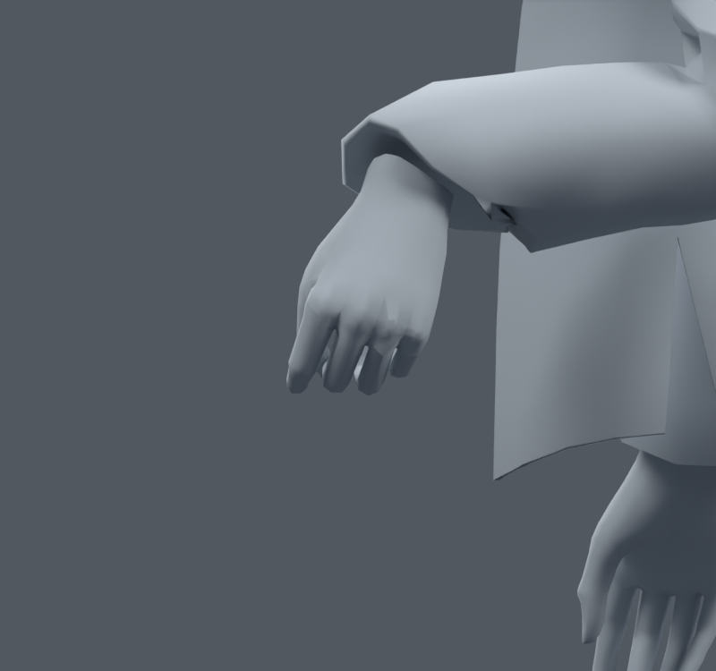
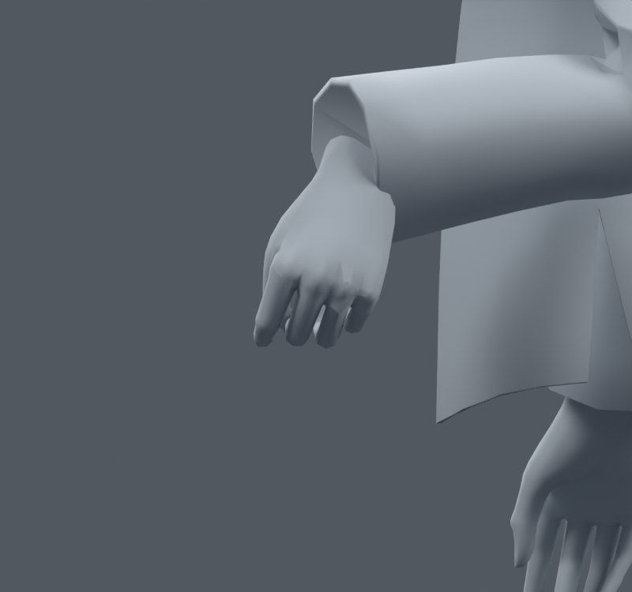
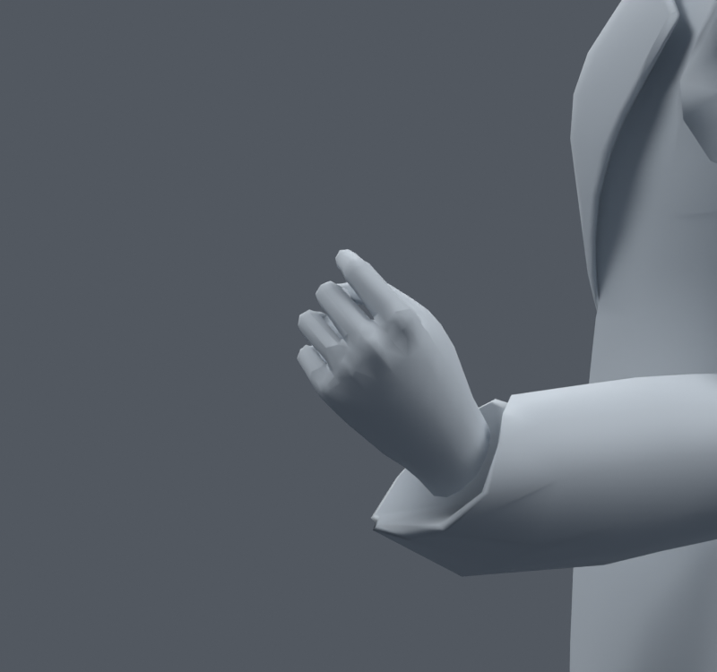
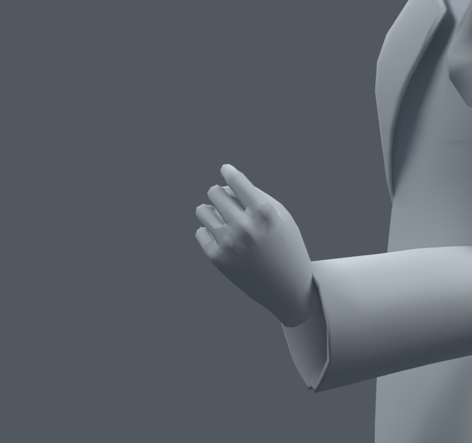

> **기록 시점 안내:** 아래는 해당 단계 당시의 보고서입니다. 후속 결정은 [최신 상태](../../STATUS.md)를 기준으로 읽어주세요. 모델·원본 텍스처·검증 원시 데이터는 이 문서 공유본에 포함하지 않습니다.

# v061 — 소매 끝의 손 본 영향과 접촉을 함께 비교

v060에서 남은 코트82개 면적 경고 가운데70개가 소매 끝,12개가 오른 팔꿈치 원래면5063에 있었다. 소매 끝에는 forearm/hand 혼합이 있으며 일부 정점은 hand 영향이100%였다. 기존 소매68정점의 hand 영향을 전완으로 조금씩 옮긴 별도 사본6개를 비교했다. 원래 좌표·면·UV·본은 바꾸지 않았고 손 자체와 코트 밖 웨이트는 정확히 유지했다. 새 메시나 리메시는 없다.

## 추가 조사와 우리 모델에 적용한 판단

실제 제작자가 소매 끝 변형을 추적해 상완 웨이트가 잘못 섞인 것을 발견한 [소매 웨이트 문제의 해결 기록](https://blender.stackexchange.com/questions/44226/deform-issue-with-rig)을 읽었다. 여기서 가져온 것은 영향을 주는 모든 본을 확인하는 진단 순서다. 우리 경우 같은 원인이라고 단정하지 않고 실제 정점별 영향과 손목/전완 회전을 따로 검사했다.

[느슨한 소매 끝의 회전 분리 사례](https://blenderartists.org/t/rigging-loose-wrist-cuffs-inherit-direction-but-not-rotation/1556803)에서는 작성자가 실제 Rigify 변형 본을 확인한 뒤 전완에 종속된 소매 본으로 해결했다고 보고했다. 축 하나를 제외한 회전 복사는 모든 자세에서 신뢰하기 어렵다는 논의와 게임 엔진 이전 문제가 함께 있다. 우리 리그는 그 Rigify 파일과 같지 않으므로 설정을 그대로 복사하지 않았다. 손목 굽힘±60도, 옆 기울임±25도, 전완 비틀림±85도 조합을 직접 적용했다. 새 제약을 추가하기 전에 기존 전완 영향만으로 시험했다.

## 260개 동일 자세 결과

| hand 영향 감소 비율 | 새 면적 경고 | 기존 경고 해소 | 손–코트 교차 면쌍 누적 |
|---|---:|---:|---:|
| 원본 v059 | 기준 | 기준 | 0 |
| 10% | 11 | 24 | 0 |
| 25% | 5 | 54 | 10 |
| 35% | 5 | 61 | 27 |
| 50% | 0 | 65 | 180 |
| 75% | 0 | 65 | 539 |
| 100% | 0 | 65 | 916 |

손 자체의 교차 면쌍은 모든 사본에서2507로 같았다. 손 웨이트가 같다고 해서 옷과의 접촉까지 같지는 않다. 두 부위 간 교차를 별도로 검사해야 했다. 교차 면쌍 수는 깊이나 외부 노출의 척도가 아니지만, 원본에 전혀 없던 교차가 증가했다.

## 시각 검수와 판정

손목 양방향60도 확대를 직접 열었다. 100% 사본은 소매 끝의 찌그러짐은 줄지만 손목 옆에서 손이 소매를 뚫거나 갑자기 잘린 것 같은 경계가 생긴다. 면적 숫자만 보면 좋아 보이는 사본을 채택하지 않는다. 원래 레퍼런스의 넉넉한 정장 소매를 피부처럼 붙이는 것도 목표가 아니다.

**6개 웨이트 사본은 그대로 최종 통합하지 않는다.** 후속 v062는 원래 v059 웨이트를 유지하면서 문제 사각형의 두 대각선을 손목260개와 전신1377개에서 비교한다. 국소 면 분할로 해결 가능한 경고와 실제 실루엣 변형을 구분한 뒤 필요한 범위만 더 조정한다.
