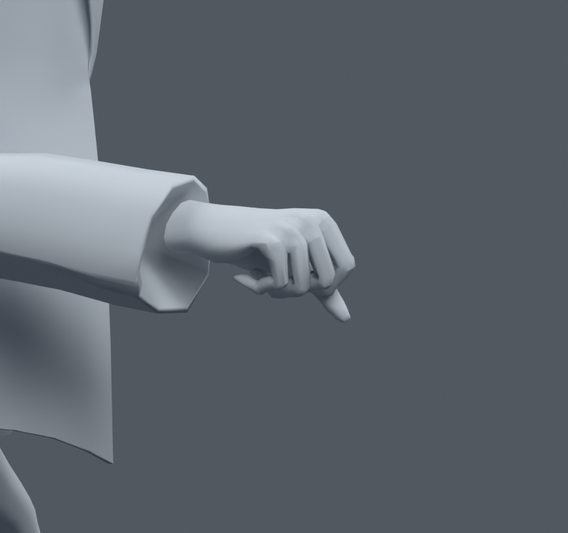
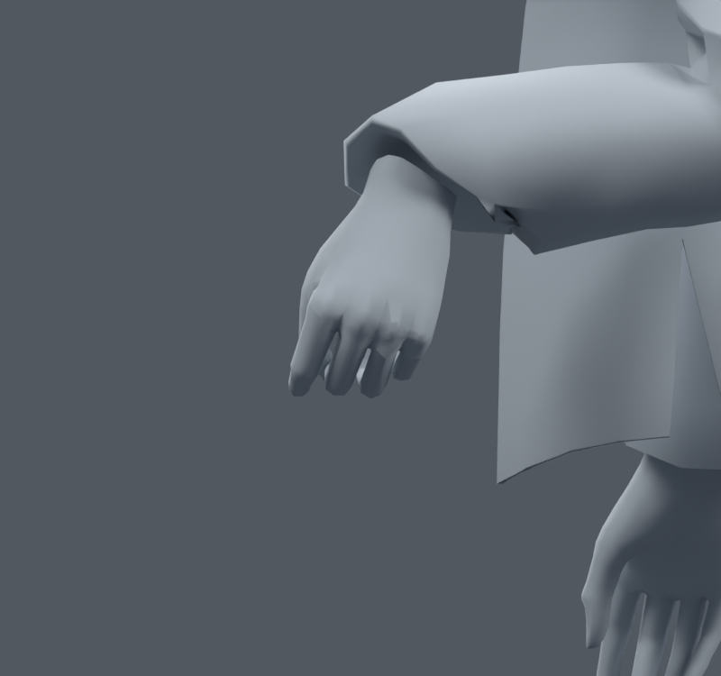

> **기록 시점 안내:** 아래는 해당 단계 당시의 보고서입니다. 후속 결정은 [최신 상태](../../STATUS.md)를 기준으로 읽어주세요. 모델·원본 텍스처·검증 원시 데이터는 이 문서 공유본에 포함하지 않습니다.

# v062 — 소매·팔꿈치 기존 사각형의 대각선 고정

v061의 소매 웨이트 사본은 새 손–코트 교차 때문에 통합하지 않았다. 원래 v059로 돌아가 손목260개와 전신1377개, 총1637개 명령에서 문제 사각형의 두 대각선을 비교했다. 기존11개 사각형을 선택한 방향의 삼각형으로 나눴다. 정점 추가·이동, 웨이트·본 수정은 없다. 비평면 사각형의 대각선을 바꾸면 내부 삼각 표면이 달라질 수 있으므로 단순히 “정점이 같으니 표면도 완전히 같다”고 표현하지 않는다.

검수 사본은 `bianca_SLEEVE_DIAGONALS.blend`, SHA-256 `edc0c502f912e1dc539f20285b3b37915a4cfeef64dc7bc386d5342c4f0c9581`이다.32773정점/17647면/31363삼각형/102본. 원래 UV 코너는 소스 루프 대응으로 정확히 보존했다. 기존 코너 노멀 재인코딩의 최대 벡터 차이는0.000340547, 중립 평가 정점 차이는0.00024mm 미만이다. 바뀐 면에서 삼각형 중심·변 중점을 양방향으로 비교한 표면 거리는 최대0.8245mm였다. 정확한 Hausdorff 거리나 전체 표면 상한은 아니다. 본·제약·키·드라이버·이미지·재질·모디파이어와 웨이트는 일치했다. 원래 면·루프 대응을 V062_source_polygon/loop 속성에 저장했다.

| 같은 자세 검사 | v059 대비 결과 |
|---|---|
| 손목·엄지260 | 면적 경고82→36, 새0·해소46 |
| 손–코트 교차260 | 양쪽 모두0 |
| 손 자체 교차260 | 양쪽 모두2507 |
| 전신1377 | 새 면적0·해소13 |
| 전신 코트–바지/코트–소매 | 새 교차0/0 |
| 전신 무릎 | 결과 정확히 동일 |

두 대각선의 선택에도 이 표본을 사용했으므로 독립 검사라고 부르지 않는다. 오른 팔꿈치 원래면5063은 두 검사군에 걸친18개 경고가0으로 줄었다. 삼각형 수를 늘린 것이 아니라 같은 네 정점을 나누는 방향을 안정시킨 결과다. 다른 소매 면의 극단 압축은 아직 남아 있다.

손목 양방향과 복합 회전 확대를 실제 열어 비교했다. 큰 실루엣 변화는 거의 없으며 v061처럼 손이 소매를 뚫는 새 변화는 관찰되지 않았다. 면적 경고 감소가 모든 시각 문제 해결을 뜻하지 않는다. 후속 v063에서는 남은 소매 주변의 기존 영향만 작은 범위로 조정하고 같은 접촉·전신·새 자세 검사를 반복한다.

