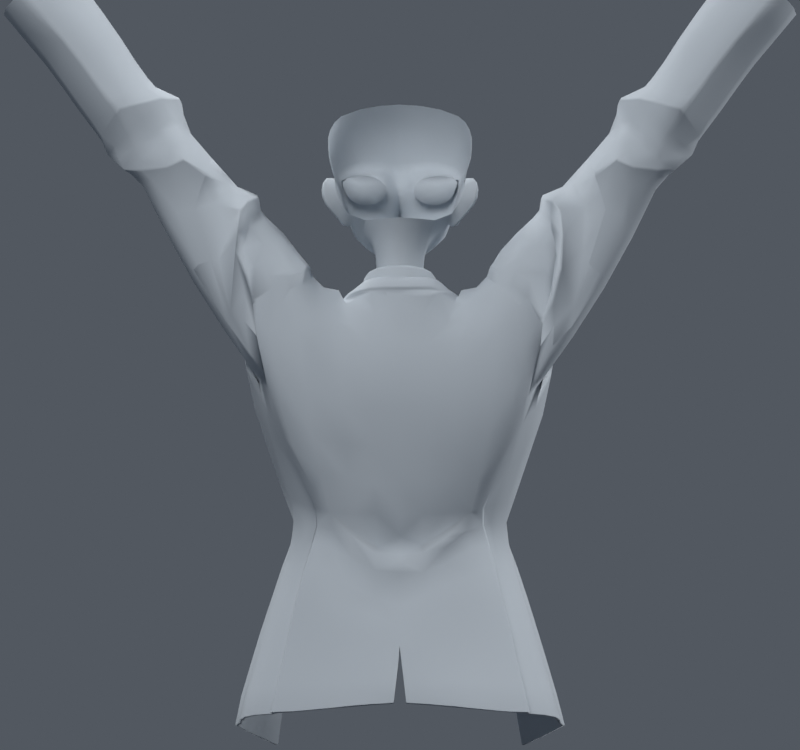
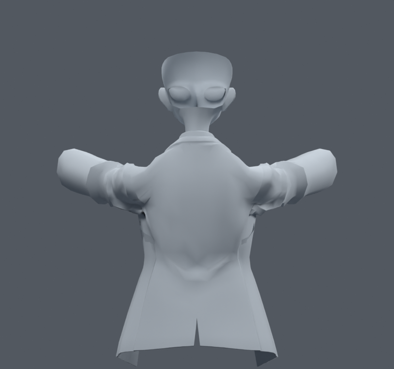

> **기록 시점 안내:** 아래는 해당 단계 당시의 보고서입니다. 후속 결정은 [최신 상태](../../STATUS.md)를 기준으로 읽어주세요. 모델·원본 텍스처·검증 원시 데이터는 이 문서 공유본에 포함하지 않습니다.

# v064 — 뒷겨드랑이의 오목한 부분만 바깥으로 보정

전체 어깨를 평균화하면 원래 정장 주름이 무너지거나 소매가 팽창한다. 이번에는 기존 코트 정점의 평가 법선과 주변 평균을 비교해 **오목한 부분만 바깥으로** 이동하는 목표를 시험했다. 뒤쪽 암홀 영역으로 제한하고 역스키닝해 같은 메시의 자세키에 기록했다. 원래 기본 좌표·웨이트·본·면은 그대로이며 새 메시 생성은 없다.

옆 올림 명령120도와 앞 올림90도, 최대4/8mm 제한으로4사본을 만들었다. SIDE8의 실제 목표 최대는4.5754mm,35정점이고 FRONT8은5.9640mm,44정점이었다. 8mm가 모든 정점의 실제 이동량은 아니다. 각 키는 해당 대표 자세에서 수동으로 켠 진단 사본이며 자동 구동·Unity 실행본이 아니다.

각 목표 자세에서 키0/1을 대조하면 SIDE4/8은 새 면적 경고3개, FRONT4/8은5개가 생겼고 해소는0이었다. 원본과 결과를 같은 카메라에서 직접 열어 비교했다. 깊은 부분의 음영은 조금 바뀌지만 주변이 덩어리처럼 부풀고, 원래 큰 접힘의 흐름은 남았다. **형상 개선이 충분하지 않아 이 자세키를 통합하지 않는다.** 이 결과를 임의 회전 전체의 합격으로 확대하지 않는다.

초기 구현은 Shape Key가 없는 입력에서 Basis를 먼저 만들지 않아 첫 키가 기본 형상이 된 오류가 있었다. 따라서 최초0/1 비교의 새0·해소0은 유효한 자세키 비교가 아니었다. 초기 파일·수치·그림은 initial_basis_error에 보존했다. Basis를 별도로 생성한 뒤4사본과 렌더/비교를 모두 다시 만들었다. KEY_AUDIT에서 기본 메시 fingerprint 일치, Basis와 보정키 분리, 예상/실제 최대 변위 차이0.000026mm 미만을 확인했다. 위 수치와 그림은 수정 후 결과이며 원본 v062는 변경하지 않았다.

앞선 조사에서 말한 자세별 보정은 필요할 수 있지만, 단순한 표면 평균/법선 이동만으로 원하는 봉제선과 자연스러운 주름이 자동으로 생기지는 않았다. 원래 디자인을 유지할 수 있는 목표 형상이 확인되지 않은 키를 완성본에 포함하지 않는다.
