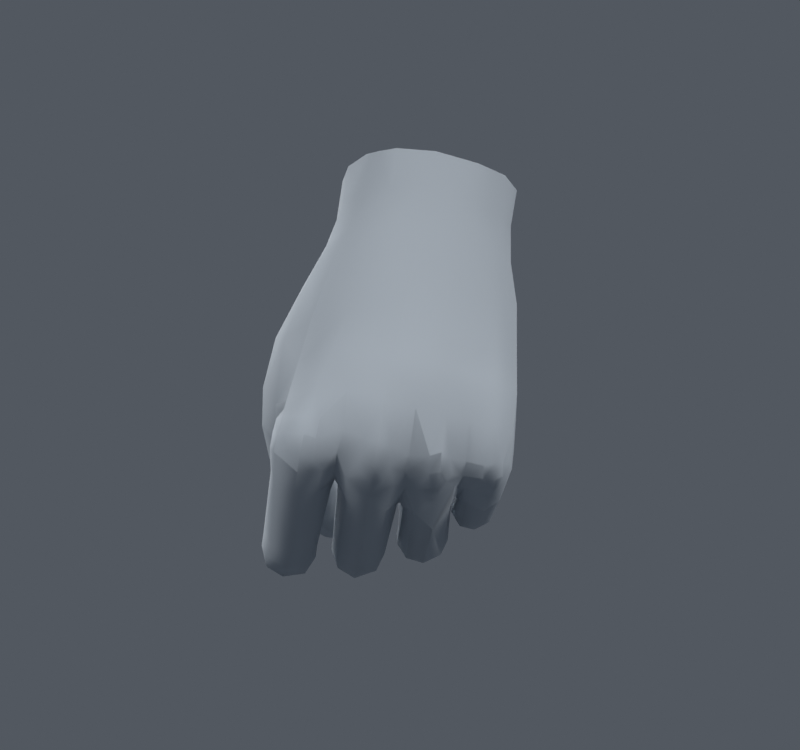

> **기록 시점 안내:** 아래는 해당 단계 당시의 보고서입니다. 후속 결정은 [최신 상태](../../STATUS.md)를 기준으로 읽어주세요. 모델·원본 텍스처·검증 원시 데이터는 이 문서 공유본에 포함하지 않습니다.

# v065 — 고정 삼각 분할과 실제 내보내기 조건의 차이

Blender에서 변형된 사각형을 평가한 삼각형과, 내보내기 전에 고정한 삼각형은 같은 정점 위치를 사용해도 면 내부가 다를 수 있다. 이 차이를 별도 사본에서 확인했다. 기존 중립 loop triangles의 정점 조합과 정확히 같도록13716개 사각형을 나눴으며 정점·웨이트·UV를 유지했다.32773정점/31363면/31363삼각형이다. 새 메시·리메시·정점 생성은 없다.

`bianca_FROZEN_TRIANGLES.blend` SHA-256 `13d4951f489bbaf76c20da54cc96cfd389ea5096026508a6d169a712cc4d6c81`. 모든 면은 삼각형이며 원래 면·루프 대응을 남겼다. 코너 노멀 재인코딩 최대 벡터 차이는0.006754미만이었다. 입력에 Shape Key는 없었고, 최초 진단 코드가 없음을 처리하지 못한 오류를 수정해 다시 실행했다. 실패 호출은 로그에 남아 있으며 그 호출에서 모델을 저장하지 않았다.

## 왜 따로 검사했나

Blender Triangulate에는 여러 사각형 분할 방법이 있다. 무작위 기본값으로 다시 나누지 않고 이미 확인한 중립 삼각형과 일치하는지를 검증했다. Unity의 삼각형 목록은 정점 인덱스로 면을 지정한다. 따라서 이 고정 인덱스를 가진 스키닝 조건도 검증해야 한다는 것이 이번 작업의 판단이다. Unity가 모든 종류의 메시에서 항상 같은 내보내기 설정을 쓴다고 주장하는 것은 아니다. [Blender Triangulate](https://docs.blender.org/manual/id/5.2/modeling/modifiers/generate/triangulate.html), [Unity Mesh.GetTriangles](https://docs.unity.cn/ja/2022.3/ScriptReference/Mesh.GetTriangles.html).

기존 프로젝트의 v013/v014 FBX 코드에는 use_mesh_modifiers=False가 있고, 명시적인 삼각 분할은 없었다. 이 코드만으로 Unity 임포터가 선택할 모든 대각선을 확정할 수 없다. Unity에는 Keep Quads 등 모델 임포트 선택지가 있으므로 실제 임포트된 면 인덱스까지 대조해야 한다. **이번은 Blender에서 고정 삼각형 조건을 재현한 검사이며 Unity 실행 검사로 부르지 않는다.** [Unity Model Import Settings](https://docs.unity3d.com/2022.3/Documentation/Manual/FBXImporter-Model.html).

## 고정된 조건의 손 비교

원본 v041도 같은 방법으로 중립 삼각형을 고정한 별도 baseline 사본을 만들어 비교했다. 같은1100개 제스처·독립 마디 회전에서 다음 결과였다. 엄지는 이전 원본축과 수정한 local축을 각각 사용했으므로 축 변경도 포함한 동일 제스처 명령 비교다.

| 고정 삼각형1100검사 | 원본 v041 | 수정 손 포함 사본 |
|---|---:|---:|
| 손 면적 경고 | 519 | 3 |
| 손 교차 면쌍 누적 | 40138 | 18823 |

기존의 변형 후 분할 검사571→3,24031→11496과 혼합하지 않는다. 고정 조건에서도 손 보정의 효과는 유지됐지만 접촉 면쌍 수는 달라진다. 접촉 수가 관통 깊이는 아니다. 손등과 상체 렌더를 직접 열어 확인했다.

## 원래 편집 사본과의 회귀

v062 대비 손목260검사에서 새 면적4·해소0, 손 교차2507동일이었다. 전신1377에서는 새 면적18·해소293, 새 코트–바지20·새 코트–소매1이었다. 새18개 중17개는 바지,1개는 코트다.68개 자세에서 무릎의 교차/삼각형 집계가 달라졌다. 원래 삼각형 표면이 바뀐 결과이므로 본이나 좌표가 움직였다고 해석하지 않는다.

**전체 삼각형 고정 사본을 현재 편집본으로 자동 채택하지 않는다.** v038 SMALL 무릎 원본과 v062 선별본은 보존했다. 향후 내보낼 면 분할을 확정할 때 바지·무릎과 옷자락 접촉을 같은 조건으로 비교하고, 해당 원래 면의 대각선·법선·접촉 위치를 확인해야 한다. 이 단계는 “사각형 대신 삼각형이면 모두 좋아진다”는 주장을 검증하는 근거가 아니라, 정확히 어떤 분할을 검수했는지 남기는 작업이다.
