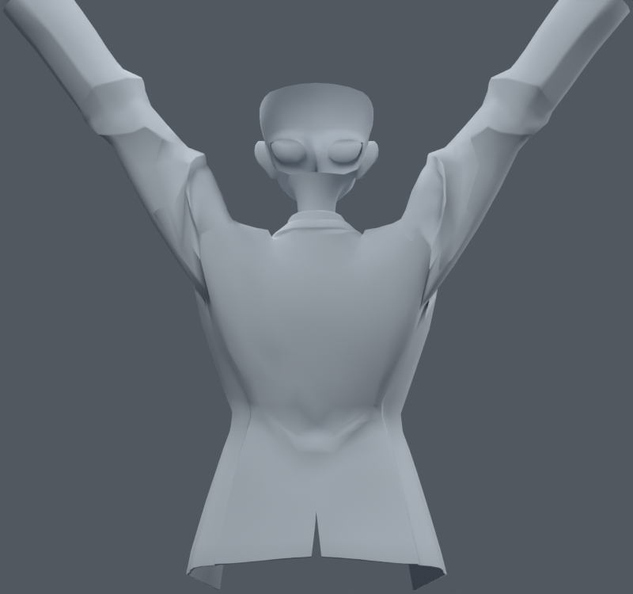
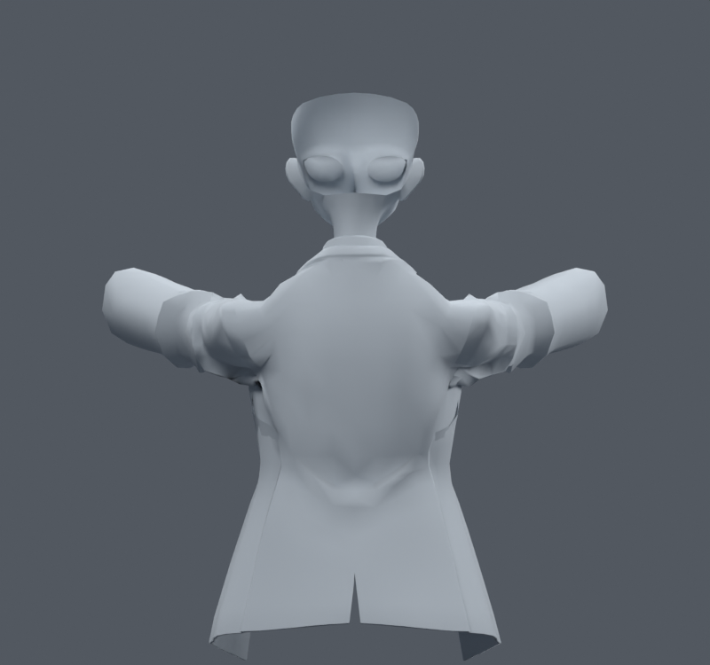

> **기록 시점 안내:** 아래는 해당 단계 당시의 보고서입니다. 후속 결정은 [최신 상태](../../STATUS.md)를 기준으로 읽어주세요. 모델·원본 텍스처·검증 원시 데이터는 이 문서 공유본에 포함하지 않습니다.

# v066 — 팔·몸통 사이 웨이트 분배를 넓게 다시 설정한 비교

기존 웨이트의 작은 수치 수정만 반복하지 않기 위해, 기존 코트의 어깨 영역에서 흉곽·쇄골·상완 분배를 함수로 다시 설정한6사본을 시험했다. 실제 상완의 시작점과 길이 방향으로 전환 띠를 만들고 띠 폭3종과 쇄골 분담35/70%를 비교했다. 기존 다른 영향이 많은 위치는 제외해 최대4영향을 유지했다. 앞옷깃·경계에는 완만한 마스크를 뒀다. 원래 좌표·면·본·손은 바꾸지 않았다.

| 전환 범위 / 쇄골 분담 | 30자세 새 경고 | 해소 |
|---|---:|---:|
| -20~40mm /35% |119|54|
| -20~40mm /70% |113|54|
| -45~60mm /35% |100|47|
| -45~60mm /70% |91|46|
| 0~25mm /35% |174|55|
| 0~25mm /70% |161|55|

가장 새 경고가 적은 PROFILE1_70을 중립·앞·옆 올림에서 직접 열어 비교했다. 상완을 따라가는 정도는 달라졌지만 넓은 겨드랑이의 접힘이 정리되지 않고 소매 뿌리의 불연속이 남았다. **6사본 모두 통합하지 않는다.** 평균적인 원통 전환 함수로 원래 정장 암홀과 몸판·주름의 면 흐름을 대신할 수 없었다. 대표30자세에서 이미 악화했으므로 전신 합격 검사를 했다고 주장하지 않는다.

이 버전은 새 메시나 대체 모델을 만든 것이 아니라 원래 코트 웨이트를 별도 사본에서 크게 수정한 실험이다. v062 선별본을 그대로 보존했다.
