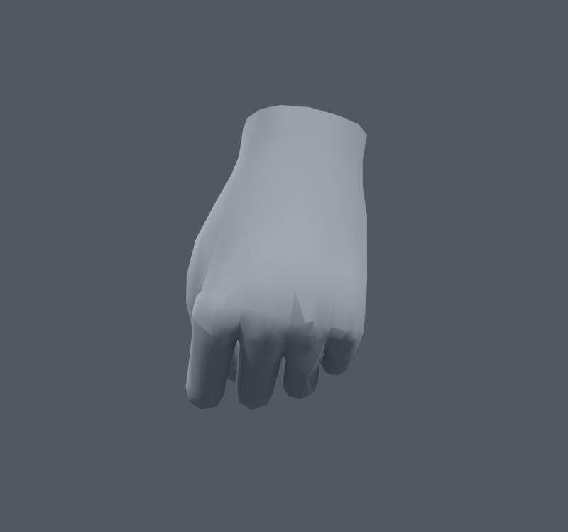
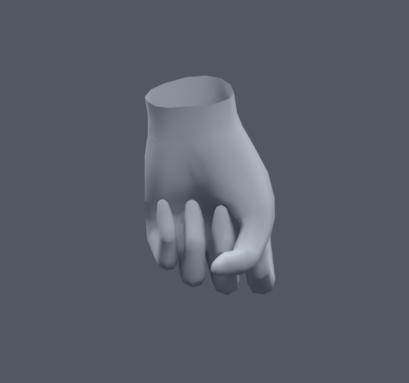

> **기록 시점 안내:** 아래는 해당 단계 당시의 보고서입니다. 후속 결정은 [최신 상태](../../STATUS.md)를 기준으로 읽어주세요. 모델·원본 텍스처·검증 원시 데이터는 이 문서 공유본에 포함하지 않습니다.

# v067 — 손 노멀만 완만하게 섞은 비교

v053의 손 정점 연결·자동 노멀은 잔요철이 더 보여 미채택됐다. 이번에는 손 정점을 연결하거나 면을 바꾸지 않고, 원래 같은 위치의 코너 노멀을 평균한 방향과 기존 방향만25/50/75% 섞었다.75%는 인접 방향을2회 완화했다. 손목 끝과 손끝에는 완만한 제한을 뒀다.

원래 좌표·면·웨이트·본·재질·이미지·모디파이어는 fingerprint로 동일함을 확인했다.75% 사본에서3846개 코너의 목표 노멀이 달라졌다. 손1413면은 원본부터 모두 smooth shading이며 flat face0이었다. 단순히 flat shading을 켜 둔 오류는 아니었다.

손등과 손바닥을 같은 카메라에서 직접 열어 비교했다. 색조가 약간 달라져도 손가락 뿌리의 뾰족한 음영이 충분히 정리되지 않았다. **명확한 품질 이득이 없어 이번 노멀 변경은 통합하지 않는다.** 노멀만으로 문제를 해결했다고 주장하지 않는다. 후속 v069에서 손가락 뿌리 MCP 관절의 부피 분담을 별도 본 사본으로 시험한다.

새 메시·리메시·정점 이동은 없다. 이전 손/소매의 기하학적 검사 결과를 새로 반복 수행했다고 주장하지 않는다. 이번 변경 대상은 음영이며, 렌더가 충분히 좋아지지 않아 기본값을 유지했다.
