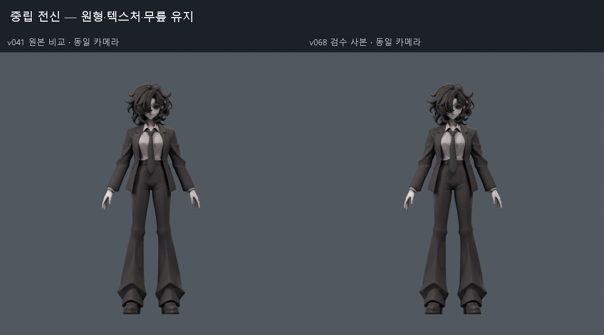
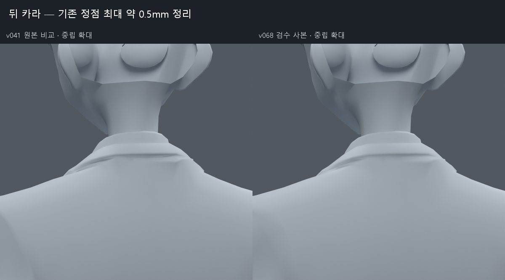
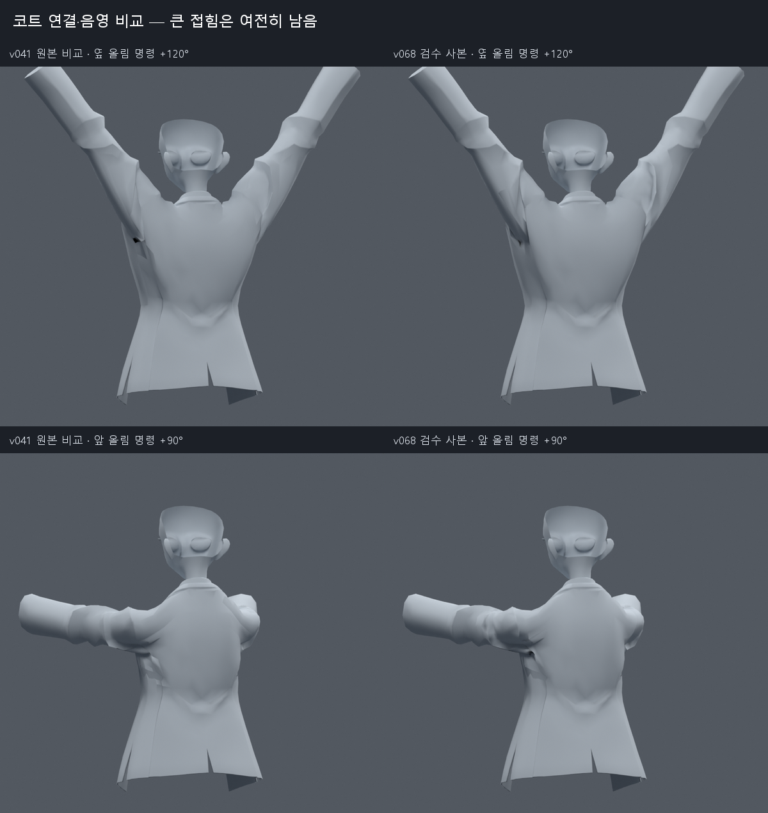
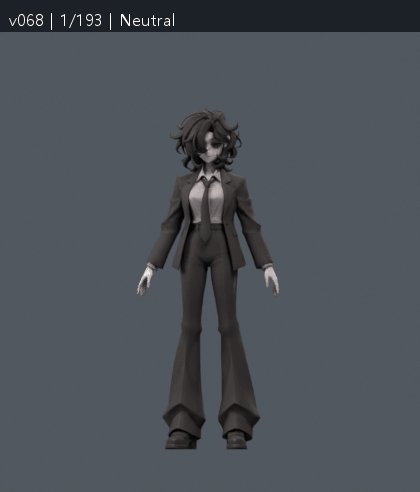

> **기록 시점 안내:** 아래는 해당 단계 당시의 보고서입니다. 후속 결정은 [최신 상태](../../STATUS.md)를 기준으로 읽어주세요. 모델·원본 텍스처·검증 원시 데이터는 이 문서 공유본에 포함하지 않습니다.

# 옷·팔·손 작업 종합 검수 — 이 문서부터 보기

2026-09-10 기준. v042 연구부터 v069 실험까지의 결과를 한곳에 모았다.

**현재 적용한 개선은 v068에서 확인할 수 있다. 다만 v068은 성공한 수정만 모은 검수 후보이며, 모든 문제가 해결된 파일은 아니다.** 제외한 실험은 별도 버전에 남아 있다. v069는 추가 손 보조본 실험이므로 번호가 더 높아도 v068을 대체하지 않는다.

이 문서에서 파일 선택 → 전후 그림 → 동작 확인 → 검증 결과 → 미해결 문제 → 실험 목록 순으로 확인할 수 있다. 세부 계산이나 실패 원인이 필요할 때만 연결한 버전 문서를 열면 된다.

## 1. 어떤 파일을 열면 되나

| 목적 | 파일 | 확인할 내용 |
|---|---|---|
| 현재 모델 살펴보기 | v068 검수 모델 (공유본 미포함: `bianca_UPPER_REVIEW.blend`) | 원형·재질·옷깃·손·본 구조. 기본 자세에서 확인하는 사본 |
| 관절 움직임 살펴보기 | v068 동작 모델 (공유본 미포함: `bianca_UPPER_MOTION_REVIEW.blend`) | 같은 선별 모델에 193프레임 동작을 저장한 사본. 아래 프레임 표 참고 |
| Blender 없이 빠르게 보기 | 아래 전후 그림과 동작 GIF | 원형, 손바닥/손등, 뒤 카라, 팔 올림 비교 |
| 수정 전 모델과 직접 비교 | 출발 기준 v041 (공유본 미포함: `bianca_LAPEL_LOCAL_REVIEW.blend`) | 이번 옷·손 연속 작업 직전 기준 |
| 채택한 무릎 확인 | v038 SMALL (공유본 미포함: `bianca_KNEE_FRONT_SMALL_REVIEW.blend`) | 사용자가 채택한 무릎 기준. 이번 상체 작업에서도 보존 |

공유 GitHub 문서에는 모델 파일을 넣지 않았다. 위 모델 링크는 작업 폴더에서 사용할 수 있으며, 공유본에서는 파일명 안내로 표시된다.

**검수 모델 하나에 모든 검사 자세가 저장된 것은 아니다.** 움직임을 보려면 동작 모델을 열어 타임라인을 재생하거나 아래 번호로 이동한다. 1100개 손 자세·1377개 전신 검사 전체가 이 193프레임에 들어 있는 것은 아니다.

## 2. v068에 들어간 수정과 남은 상태

| 부위 | 포함한 수정 | 지금 판정 |
|---|---|---|
| 엄지 | 기존6본의 roll, 즉 뼈 길이축 기준 회전 방향 조정 | 엄지를 접는 경로 개선. 원래 손 정점 위치 유지 |
| 손가락 | 손가락 사이 웨이트, 기존9면 대각선, 중간마디 PIP 보조8본 | 심한 압축 경고 크게 감소. 독립 마디 극단 회전 일부는 남음 |
| 손등 | 기존 표면 유지 | 뿌리의 각진 음영은 미해결. 노멀 혼합·추가 뿌리 보조본은 제외 |
| 코트 표면 | 위치·웨이트가 같은 중복1824정점 연결, 일부 노멀 정리 | 끊긴 표면과 음영 일부 개선. 큰 어깨 접힘은 남음 |
| 뒤 카라·셔츠 | 기존332 raw 정점을 최대 약0.5mm 조정 | 작은 요철 정리. 카라 전체 재설계나 모든 목 자세 해결은 아님 |
| 소매·오른팔꿈치 | 기존11사각형의 대각선 선택 | 검사에서 소매 압축 경고 감소. 해당 오른팔꿈치 면의 경고 해소 |
| 어깨·겨드랑이 | 위의 연결·면 정리만 포함 | 팔을 높이 들거나 앞으로 뻗을 때 깊은 접힘이 남음 |
| 옷자락·머리카락·넥타이 | 기존 본·웨이트 계층 유지 | 준비된 구조가 있으나 실제 바람·흔들림·충돌 물리는 이번에 실행 검증하지 않음 |
| 무릎·원형·텍스처 | 채택 무릎과 원형을 보존 | 이번 작업에서 새 모델 생성·리메시·대체 없음 |

현재 구성은 32773정점 / 17647면 / 31363삼각형 / 102본이다. 실패한 옷 자세키와 드라이버는 포함하지 않았다. PIP는 손가락 중간마디 관절, 후속 v069의 MCP는 손가락 뿌리 관절을 뜻한다. 이 MCP는 Blender 연결 도구 MCP와 다른 용어다.

## 3. 전후 그림으로 확인

모든 비교 보드의 왼쪽은 v041, 오른쪽은 v068이다. 손은 같은 제스처 명령을 주되 수정한 엄지축을 사용하는 비교다. 회색 확대 렌더는 형태와 음영 검사용이며, 최종 모델에서 텍스처를 제거한 결과가 아니다.

### 원형·전신

머리와 옷의 전체 실루엣, 좁은 허리, 재킷 옷깃, 바지·무릎을 본다. 원본 레퍼런스의 정장 디자인을 유지하는 방향이며, 전후 차이를 크게 만드는 것이 목표는 아니다.

### 손바닥·손등

위쪽은 엄지가 지나가는 경로와 손가락 사이 접촉, 아래쪽은 손가락 뿌리의 각진 음영을 본다. 주먹에서 손가락끼리 닿는 것 자체를 오류로 판정하지 않는다. 손등의 뾰족한 음영은 수정본에도 남아 있다.

### 뒤 카라

목 뒤와 코트 사이의 얇은 띠, 카라가 이어지는 부분의 작은 요철을 본다. 최대 약0.5mm 보정이라 차이는 작다.

### 어깨·겨드랑이 — 미해결 부위

옆으로 팔을 든 뒤쪽, 앞으로 팔을 뻗은 뒤쪽을 비교한다. 어두운 갈라짐 같은 음영 일부는 줄었지만 소매 뿌리의 깊은 접힘과 둔덕은 남아 있다. 이 그림을 어깨가 해결됐다는 근거로 해석하지 않는다.

## 4. 동작을 한 번에 확인

24fps로 저장한 193프레임 동작에서 3프레임마다 렌더한 65장 미리보기다. GIF는 8fps이며 마지막 장을 길게 유지한다. 확대하거나 뒤에서 확인하려면 동작 모델에서 같은 프레임으로 이동한다.

| 프레임 | 동작 | 집중해서 볼 곳 |
|---|---|---|
| 1 / 49 / 97 / 193 | 중립 또는 휴식 자세 | 기본 외형과 원래 자세로 돌아왔을 때의 모양 |
| 13 / 25 | 옆 팔 올림 +60° / +120° 명령 | 어깨 위·뒤, 겨드랑이 홈, 옷깃 끌림 |
| 37 | 옆으로 든 팔 비틀기 | 소매가 꼬이며 얇아지는 곳 |
| 61 / 73 | 앞 팔 올림 +45° / +90° 명령 | 뒤 암홀과 소매 뿌리 접힘 |
| 85 | 앞으로 든 팔 비틀기 | 옷깃과 소매의 연결, 부풀거나 꺾이는 곳 |
| 109 | 손 펼침 | 손가락 간격, 엄지 뿌리, 손목 연결 |
| 121 | 주먹 | 엄지 경로, 마디 두께, 손등·손바닥 접힘 |
| 133 | 검지 펴기 | 검지와 중지 사이가 함께 끌려가는지 |
| 145 | 브이 | 검지·중지 사이와 약지 뿌리 |
| 157 | 엄지 들기 | 엄지 뿌리와 검지 접촉 |
| 169 | 손목·전완 회전 | 소매 끝 압축, 손–소매 관통 |
| 181 | 목·몸통 회전 | 뒤 카라·셔츠·목 경계 |

표의 각도는 원래 A포즈에서 더한 본 회전 명령이다. 해부학적 외전 각도와 같지 않다. 예를 들어 옆 +120° 명령의 실제 상완 기울기는 아래 방향 기준 약140.48°였다. 키프레임뿐 아니라 그 사이를 천천히 재생해 순간적으로 얇아지거나 튀는 곳도 본다.

## 5. 무엇을 검증했나

면적 경고는 변형 후 삼각형 면적이 중립의 0.2배 미만 또는 3배 초과인 표본을 찾은 진단이다. **경고 0이 자연스러운 모양이나 전체 문제 해결을 뜻하지 않는다.** 교차 면쌍 수는 접촉량의 한 지표이고 관통 깊이는 아니다.

| 검사 | 비교와 결과 | 해석 범위 |
|---|---|---|
| 손 1100표본 | v041→손 후보: 면적 경고571→3, 교차 면쌍 누적24031→11496 | 개선은 크지만 극단 손 자세와 접촉은 남음 |
| 손 범위 추가260 | 손 경고9→0 | 엄지 벌림·맞섬·손목·전완 복합 범위를 추가한 검사 |
| 소매260 | v059→v062: 경고82→36, 새 경고0 | v068에 포함한11면 분할의 효과. 남은36도 존재 |
| 새 소매644 | 기본132+새 난수512, v059→v068: 새 경고0·기존169해소 | 새512표본은11면 선택에 사용하지 않음 |
| 같은644 손–소매 접촉 | 기준과 수정본 모두 교차0 | 손 내부 접촉 전체가0이라는 뜻은 아님 |
| 전신1377 | v059→v062: 새 면적0·기존13해소, 새 코트–바지/소매0, 무릎 결과 동일 | v068의 형상·웨이트가 v062와 정확히 같음을 확인해 결과를 적용. v068에서 재실행한 것으로 중복 집계하지 않음 |
| 저장 동작385표본 | v041 동일 명령 대비 새 면적0·기존99해소, 주요 키프레임 재로드 위치 오차0 | 정수·중간 프레임 검사. 모든 연속 시각의 수학적 보증은 아님 |
| 원본 보존 | UV 코너·원래 면별 재질·손 후보의102본 rest/제약 보존, 최대4웨이트 | 카라332 raw 정점은 의도적으로 이동. 노멀 재인코딩은 미세 차이가 있어 비트 동일로 주장하지 않음 |

여러 검사 집합이 겹치므로 행의 표본 수를 더해 고유 자세 총수로 표현하지 않는다. 독립 표본과 수정에 사용한 표본을 구분한 자세한 수치는 [v068 상세 검수](REVIEW.md)에 있다.

고정 삼각형 조건도 별도로 시험했다. 손 경고519→3으로 개선은 유지됐지만, 전체 면을 고정한 v065에서 하체 접촉과 경고가 달라졌다. 이 조건의 수치를 위의 변형 후 분할 검사와 섞지 않았고 v065 파일은 통합하지 않았다.

## 6. 어떤 실험은 왜 빠졌나

v068에 제외한 실험까지 모두 넣으면 다른 자세의 악화도 함께 들어간다. 아래는 연구·중간 결과·미채택 이유를 포함한 전체 작업 지도다. **‘선별 반영’도 사용자 최종 채택과는 구분한다.**

| 버전 | 작업과 현재 판정 | 기록 |
|---|---|---|
| v042 | 현재 모델, 글·영상 가이드, 공개 리그와 실제 VRM 구조 조사 | [연구](../v042_upper_research/RESEARCH.md) |
| v043 | 엄지축·손가락 혼합 영향 분리. 초기 검사 한계를 찾아 v046으로 이어감 | [결과](../v043_upper_work/REVIEW.md) |
| v044 | 원래 옷의 자세별 보정 목표. 중간 시험, 자동 완성본 아님 | [결과](../v044_pose_shapes/REVIEW.md) |
| v045 | 코트 중복 연결을 선별 반영. 초기 비교 입력 오류와 정정도 기록 | [결과](../v045_coat_connections/REVIEW.md) |
| v046 | 손가락·엄지·PIP 보조본과 국소 면/웨이트 수정, 선별 반영 | [결과](../v046_finger_topology/REVIEW.md) |
| v047 | 넓은 어깨 지지본: 옷깃·면적 악화로 제외 | [결과](../v047_coat_support/REVIEW.md) |
| v048 | Corrective Smooth·DQS: 솟음·팽창으로 제외 | [결과](../v048_clothing_correctives/REVIEW.md) |
| v049 | 기존 어깨 면 줄 추가: 새 압축 경고 증가로 제외 | [결과](../v049_arm_loops/REVIEW.md) |
| v050 | 여러 자세의 목표에 맞춘 어깨 웨이트: 평균 오차 감소에도 경고 증가 | [결과](../v050_shoulder_fit/REVIEW.md) |
| v051 | 실제 연결·sharp edge·노멀 원인 재검사 | [결과](../v051_pose_normals/REVIEW.md) |
| v052 | 자동 옷 자세키: 제한 표본에서는 개선, 후속 독립 검사에서 최종 판정 | [결과](../v052_pose_clothing/REVIEW.md) |
| v053 | 손 연결·자동 노멀: 잔요철이 더 보여 제외 | [결과](../v053_surface_finish/REVIEW.md) |
| v054 | 뒤 카라 최대 약0.5mm 정리, 문제 면 원복 후 선별 반영 | [결과](../v054_collar_local/REVIEW.md) |
| v055 | 통합·저장 동작 검사에서 추가 경고를 발견 | [결과](../v055_upper_delivery/REVIEW.md) |
| v056 | 옷 자세키를 더 제한했지만 새 복합 자세 경고가 남아 최종 제외 | [결과](../v056_upper_refined/REVIEW.md) |
| v057 | 여러 자세를 고려한 기본 정점 이동: 새 경고 증가로 제외 | [결과](../v057_coat_rest_fit/REVIEW.md) |
| v058 | 좁은 어깨 보조본·중심 변경: 새 경고로 제외 | [결과](../v058_shoulder_volume/REVIEW.md) |
| v059 | 손·코트 연결·카라를 모은 이전 검수본. 현재는 v068을 확인 | [결과](../v059_upper_review/REVIEW.md) |
| v060 | 엄지·손목·전완 추가 범위 검사, 남은 소매 문제 분리 | [결과](../v060_hand_range/REVIEW.md) |
| v061 | 소매의 손 영향을 전완으로 이동: 새 경고 또는 손–소매 관통으로 제외 | [결과](../v061_cuff_weights/REVIEW.md) |
| v062 | 소매11면 대각선 선택, 선별 반영 | [결과](../v062_sleeve_diagonals/REVIEW.md) |
| v063 | 소매 제한 웨이트 최적화: 새 경고 또는 이득 없음으로 제외 | [결과](../v063_sleeve_fit/REVIEW.md) |
| v064 | 어깨 오목부만 밖으로 보정: 부풀음·새 경고로 제외. 초기 Basis 오류는 수정해 재검사 | [결과](../v064_shoulder_concavity/REVIEW.md) |
| v065 | 전체 삼각 분할 고정: 하체 결과가 달라 별도 진단으로 유지 | [결과](../v065_frozen_triangles/REVIEW.md) |
| v066 | 어깨 웨이트 전환 분포6종: 새 경고·연결 불연속으로 제외 | [결과](../v066_shoulder_profile/REVIEW.md) |
| v067 | 손 노멀25/50/75% 혼합: 뾰족한 음영의 개선 부족으로 제외 | [결과](../v067_hand_normals/REVIEW.md) |
| v068 | 현재 선별 검수본·비교 그림·동작·보존 검사 | [결과](REVIEW.md) |
| v069 | 손 뿌리 MCP 보조8본 추가: 새 경고와 작은 외관 이득으로 제외 | [결과](../v069_hand_mcp_volume/REVIEW.md) |

## 7. 연구에서 얻은 결론과 우리 모델의 차이

공개 제작 사례에는 웨이트만 조정하는 방법 외에도 관절 주변의 면 흐름, 보조 회전본, 자세별 보정 형상, 의상용 별도 제어가 있었다. 우리 모델에서는 이미 고정된 원형과 불규칙한 면 구조를 보존해야 하므로, 보조본이나 평활화를 추가한다고 자동으로 같은 품질이 나오지는 않았다. 실제로 손 PIP 보조는 도움이 됐고 어깨 보조·손 뿌리 보조는 이번 조건에서 이득이 부족했다.

| 조사 대상 | 확인한 범위 | 우리 작업에 쓴 판단 |
|---|---|---|
| Blender Studio 의상 보정 | 공개 제작 설명 | 옷은 신체와 구분한 목표 형상이 필요하나 다른 회전까지 검증해야 함 |
| Rain·Snow·CloudRig | 공개 문서·기능 설명 | 제어 리그와 실시간 변형 본/제약을 구분해야 함. 모든 내부 리그를 직접 분석한 것은 아님 |
| Alicia Solid | 실제 VRM의 본·스킨·보조 구조를 읽기 전용 확인 | 실제 모델의 기본 관절과 보조 체인 구성 참고. 형상 복사·이식 없음 |
| 손 core loop·손가락·보정키 영상 | 제작자 설명·공개 챕터 확인 | 엄지 뿌리, 손가락 면 띠, 손목과 자세키 구동을 분리해 검사. 영상 전체 시청으로 주장하지 않음 |
| Unity·VRChat 문서 | 스키닝·제약·PhysBone 안내 | Blender 결과를 실제 런타임 완료로 간주하지 않음 |

출처 URL과 영상별 제작자·챕터는 [상세 연구의 출처 목록](../v042_upper_research/RESEARCH.md)에 모았다. 이 종합 문서는 기존 조사와 결과를 정리한 것이며 새로운 외부 재검증을 수행한 기록은 아니다.

## 8. 남은 문제와 다음 작업

| 우선순위 | 남은 문제 | 다음 수정·검증 |
|---|---|---|
| 1 | 큰 어깨·겨드랑이 홈과 둔덕 | 옆·앞·뒤에서 소매 곡면을 직접 맞춘 자세 목표를 만들고, 원래 면 흐름·웨이트와 함께 확인. 평균 평활화만 반복하지 않기 |
| 2 | 손 극단 회전의 잔여3경고와 손등 음영 | 원래12116/12174면 주변의 국소 마디 변형·접촉·면 방향을 확인. 전체 손 부풀리기나 접촉 전부 제거는 피하기 |
| 3 | 실제 내보낸 면 분할에서의 차이 | FBX/Unity의 삼각형 인덱스와 v068 소매·채택 무릎을 대응하고 같은 자세에서 비교 |
| 4 | 보조본 실행·2차 움직임 | 본 문제 정리 후 Unity에서 회전 제약, PhysBone, 콜라이더, 실제 손 입력과 재생을 검증 |

현재 102본 중 Copy Rotation 제약16개가 있고 그중14개 본에 실제 웨이트가 있다. 손 PIP8본뿐 아니라 기존 팔꿈치·무릎·고관절 보조도 엔진에서 재현해야 한다. 머리카락은6개 뿌리와12개 변형본, 코트는4개 뿌리와8개 변형본, 넥타이는1개 뿌리와3개 변형본이 있다. **본이 준비된 상태와 바람·충돌이 완성된 상태는 다르다.** 정확한 이름·부모·대상·제약 설정은 [실제 본과 엔진 전달 문서](RUNTIME_HANDOFF.md)에서 확인할 수 있다.

확인 의견은 “동작 파일 25프레임, 뒤쪽 왼 겨드랑이”처럼 파일·프레임·보는 방향·부위를 함께 남기면 해당 형태를 정확히 재현할 수 있다.
