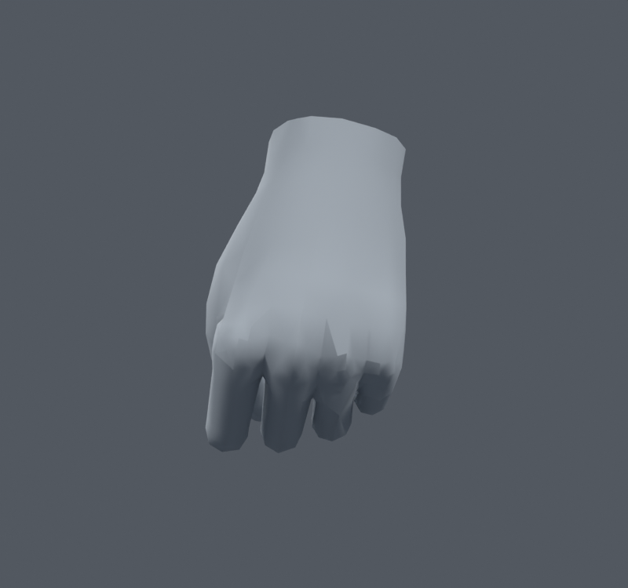
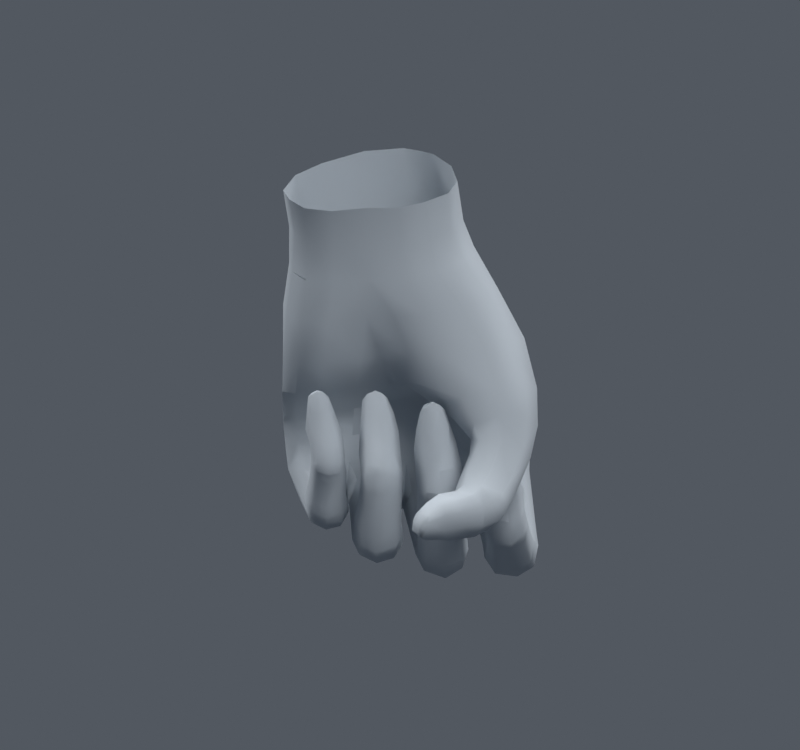

> **기록 시점 안내:** 아래는 해당 단계 당시의 보고서입니다. 후속 결정은 [최신 상태](../../STATUS.md)를 기준으로 읽어주세요. 모델·원본 텍스처·검증 원시 데이터는 이 문서 공유본에 포함하지 않습니다.

# v069 — 손가락 뿌리 MCP 부피 보조본 비교

손등의 뿌리 음영이 노멀 혼합만으로 충분히 좋아지지 않아, 기존 PIP 중간마디 보조8본을 유지하면서 MCP 뿌리에도 별도8본을 둔3사본을 시험했다. 검지·중지·약지·소지의 local 회전을 절반 따라가게 하고, 손/첫마디의 공통 웨이트만 옮겼다. 엄지와 원래 Humanoid 부모 경로는 바꾸지 않았다. 새 메시·정점·면은 만들지 않았다.

전체 공통 영향,공통 영향25% 초과,50% 초과를 비교했다. 총110본·최대4영향, 손 밖 웨이트는 정확히 같다. ROOT_ALL은905 raw 정점의 분배가 바뀌었다. 중립 평가와 저장 좌표 사이 최대 차이는0.00366mm 미만이었으며 이를 완전0으로 표현하지 않는다.

| 300개 같은 손 검사 | 면적 경고 | 교차 면쌍 누적 |
|---|---:|---:|
| 기존 손 후보 |0|3026|
| ROOT_ALL |1|3010|
| ROOT_CORE |1|3017|
| ROOT_STRONG |1|3023|

손등·손바닥 렌더를 직접 열어 확인했다. 뿌리 형태의 변화는 작고, 새 면적 경고를 감수하며 본8개와 런타임 제약8개를 더할 만큼의 개선은 확인되지 않았다. **MCP 추가 보조본3사본은 통합하지 않는다.** 기존 PIP 보조8본만 포함한102본 선별본을 유지한다. 같은 원리가 모든 마디에서 같은 품질 향상을 주지는 않았다.

이300표본은 예전 손 보정에도 사용한 집합이다. 새 독립1100이나 전신1377을 이 추가본 사본으로 다시 통과했다고 주장하지 않는다. 외관 이득이 부족해 이 단계에서 제외했다.
