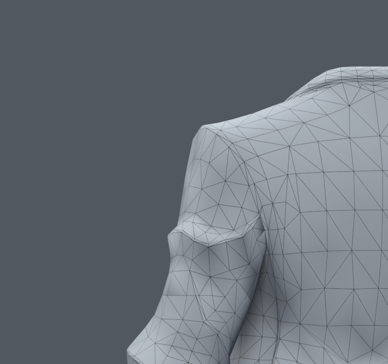
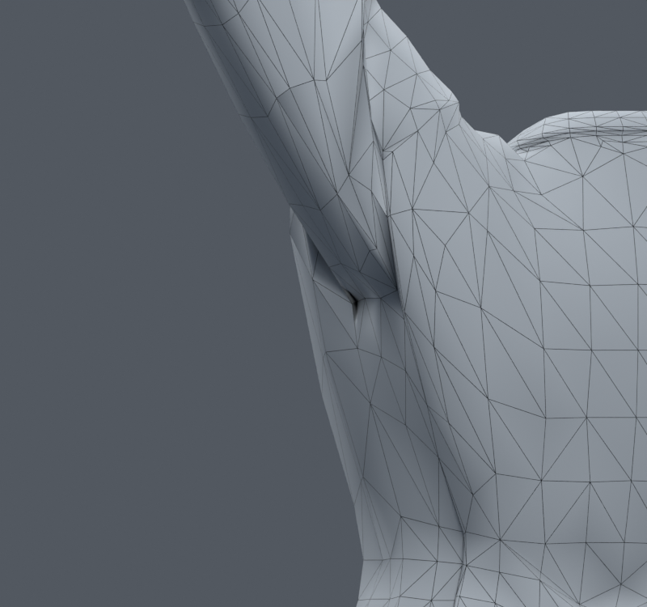
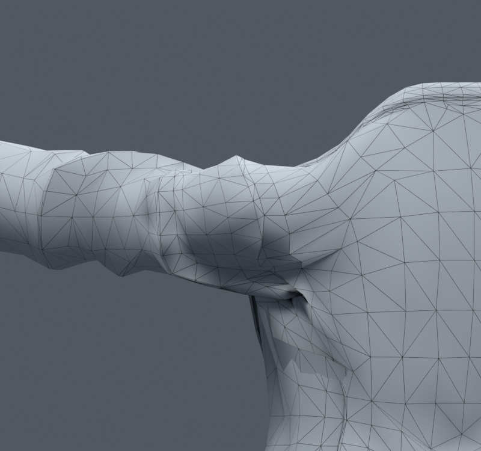

> **기록 시점 안내:** 아래는 해당 단계 당시의 보고서입니다. 후속 결정은 [최신 상태](../../STATUS.md)를 기준으로 읽어주세요. 모델·원본 텍스처·검증 원시 데이터는 이 문서 공유본에 포함하지 않습니다.

# v070 — 어깨 접힘의 면·웨이트·회전 원인 재검사

사용자가 1)어깨·겨드랑이, 2)손·손목, 3)카라·자락·전신을 중간 중단 없이 이어 처리하도록 요청했다. v068을 출발점으로 다시 읽고 원본 `ref_char.png`를 실제 열람했다. 새 메시·리메시·대체 생성은 하지 않는다. 범위 큰 기존 구조 수정은 별도 사본에서 허용된 상태다.

## 현재 모델에서 확인한 사실

v068 SHA `3f92910768d73e8688ea8f57219e4a75cb7ac9a14e569d08766163166351154b`. 좌측 상완 중심은 (0.083,0,0.790)m, 팔꿈치는 (0.137,0.007,0.646)m이며 쇄골 끝이 상완 중심과 연결된다. 기존 옆 팔 올림 검사는 쇄골25%·상완75%, 앞 올림은20%·80%를 분담한다. 쇄골이 전혀 움직이지 않아 생긴 문제라고 단정할 수 없다.

어깨 영역(중점 |x|0.06~0.145m,z0.70~0.835m)의 기존1025모서리를 검사했다. 단일 본 웨이트 차이25%p 초과65개,50%p 초과1개다. 일부 모서리는 옆 올림에서 중립 길이의2~3배 이상 늘어난다. 예를 들어10393–767은14.44mm에서3.07배,4882–4884는28.94mm에서2.51배다. 단순히 최대차이가 큰 모서리를 모두 평활화하는 것은 옷깃과 정상 주름도 바꿀 수 있으므로 원인 후보로 위치를 추적한다.

실제 와이어 렌더에서 중립부터 각진 의상 주름과 불규칙한 면 크기가 있고, 팔 올림에서 좁은 암홀로 긴 면들이 모인다. 와이어 셰이더는 평가 삼각형의 선도 표시하므로 보이는 모든 대각선이 편집 사각형의 실제 모서리인 것은 아니다. 원시좌표·웨이트·면·본은 INSPECT.npz, SOURCE.json, GRAPH_AUDIT.json에 보존했다.

## 추가 조사와 적용 판단

옷 웨이트 전송 문제의 실제 제작자 사례에서는 옆 면 띠가 팔, 다음 띠가 몸통의 영향을 받아 경계가 급격히 바뀌는 문제가 지적됐다. 우리 작업의 일부 큰 웨이트 차이와 비교할 가치가 있지만, 그 사용자의 Daz 전송 원인이 우리 모델에도 동일하다고 확정하지 않는다. [제작자 질문과 분석](https://blenderartists.org/t/clothes-weight-paint-strange-deformation-please-help/1358539).

CAVE Academy의 제작 가이드는 쇄골·견갑과 팔, 비틀림 분담을 나눠 제어한다. 우리 검사의 기존 쇄골 분담을 확인하고, 단순 보조본 추가보다 실제 회전 조합에서 비교하기로 했다. Maya 구현을 그대로 Unity 구현이라고 해석하지 않으며, 해당 페이지의 글을 읽었고 영상 전체 시청은 주장하지 않는다. [CAVE Academy](https://caveacademy.com/wiki/post-production-assets/rigging/rigging-training/introduction-to-rigging-course/04-rigging-the-shoulders-and-the-arms/).

Libigl의 ARAP 설명은 원래 표면 모서리와 국소 회전을 맞추는 비선형 변형을 다룬다. 평균 위치만 평활화했던 이전 시도와 구분해, 기존 의상의 길이·방향을 덜 잃는 목표를 v071에서 시험한다. 이 방법은 의상 접촉이나 자연스러운 재킷 주름을 보장하지 않으며 목표 형상 제작용이다. [Libigl ARAP](https://libigl.github.io/tutorial/#as-rigid-as-possible).

v070 자체는 진단 단계이며 모델 수정은 없다. 후속은 표면 변형의 목표 비교, 방향이 제한된 보정, 손 잔여 국소 수정, 마지막 카라·옷자락 및 전신 검사로 이어간다.
